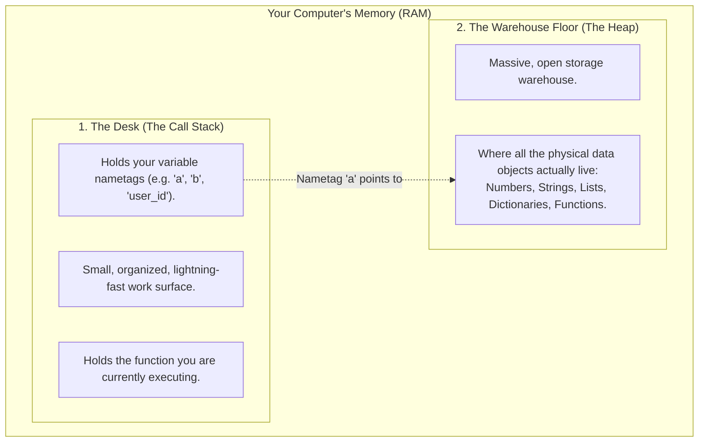
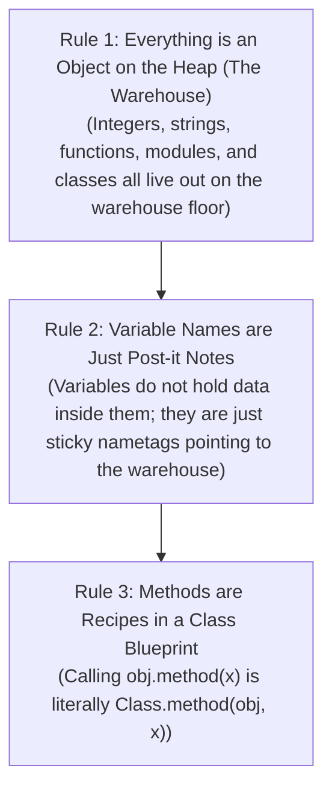
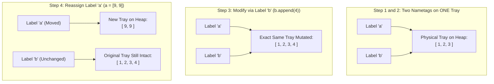
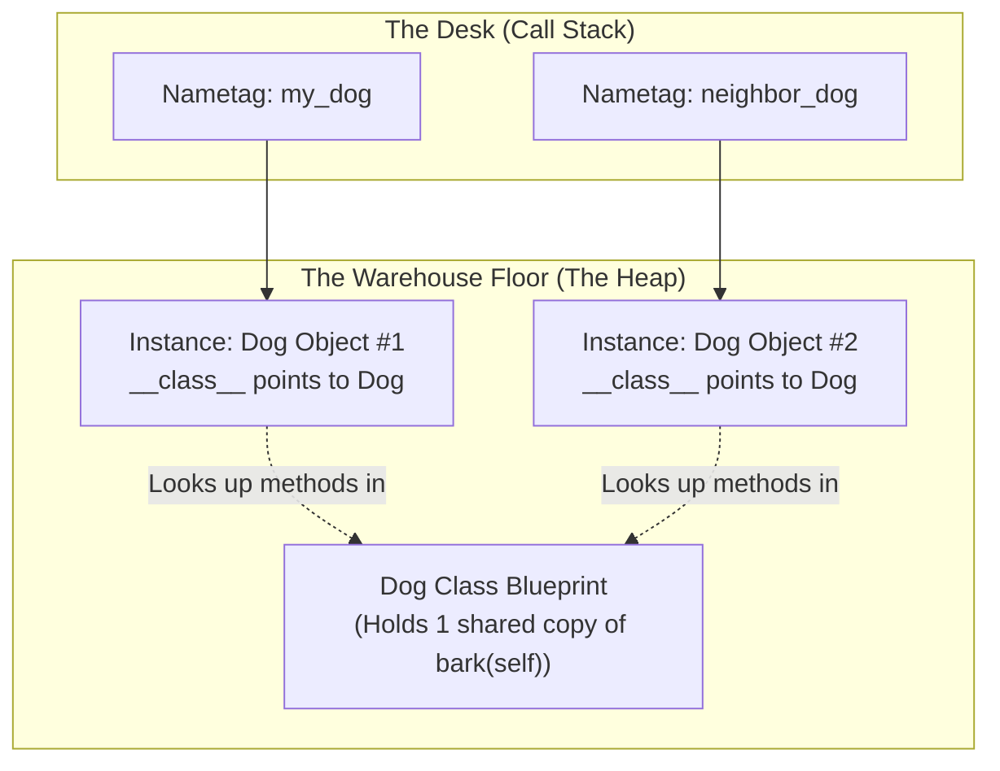
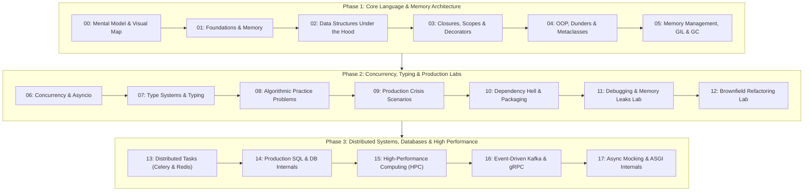

# Chapter 0: The Unified Python Mental Map & Intuitive Primer

> **Core Learning Objective:** Form an indestructible, intuitive mental model of how Python works before diving into the details. Eliminate all imposter syndrome with zero jargon, crystal-clear visual analogies, and a progressive self-diagnostic checklist.

---

## 0. Zero-Prerequisite Primer: What on Earth is "The Heap"?

Before we look at Python's rules, let's understand how your computer's memory (RAM) actually works. 

Whenever your computer runs a program, it carves its memory into two main areas: **The Desk** and **The Warehouse**.



1. **The Desk (The Call Stack):** 
   Imagine a small wooden desk where you sit. When you are calculating a math problem or running a function, you write small scratch notes right on your desk. It is organized, neat, and very fast, but it is small.
2. **The Warehouse Floor (The Heap):** 
   Behind your desk is a massive, cavernous warehouse with virtually unlimited open floor space. When you build a giant Lego castle, buy a refrigerator, or create a list of 10,000 customer names, you cannot fit it on your tiny desk! You place it out on the **Warehouse Floor**. In computer science, this open warehouse is called **The Heap**.

> [!NOTE]
> **Summary for Beginners:**
> * **The Heap** simply means: *"The big open storage area in your computer's RAM where objects live."*
> * When you type `x = [1, 2, 3]`, Python constructs the list `[1, 2, 3]` out on the **Warehouse Floor (The Heap)**, and hands you a small sticky note labeled `x` on your **Desk** that points to it!

### "If Both Are in RAM, Why Do We Need Two Separate Things?"

A brilliant question every great engineer asks: *“My computer only has RAM sticks plugged into the motherboard. If both the Stack and the Heap live inside that same RAM, why did computer scientists invent two different zones?”*

Here is the secret: **The Stack and the Heap have completely opposite strengths and weaknesses. Neither one can survive without the other.**

| Dimension | The Stack (The Desk) | The Heap (The Warehouse Floor) |
| :--- | :--- | :--- |
| **Speed** | **Blazingly Fast (1 CPU cycle / < 1 ns)**. Just moves a single pointer register (`SP`). | **Slower (Dozens to hundreds of CPU cycles)**. Must search free-lists and allocate blocks. |
| **Lifespan** | **Strict & Temporary**. Data dies the microsecond the function finishes and returns. | **Flexible & Persistent**. Data lives as long as you need it, across any function or thread. |
| **Size Flexibility** | **Rigid & Fixed**. Must know exact size upfront. Cannot easily grow or shrink. | **Completely Dynamic**. A list can start with 0 items and grow to 10,000,000 items on the fly. |
| **Cleanup Cost** | **Zero Cost**. Automatically wiped when function pops off. No GC needed. | **Requires Management**. Needs reference counting and cyclical garbage collection. |

#### Why You Cannot Use ONLY the Stack:
1. **Death upon Return:** The Stack works like a stack of cafeteria plates (Last In, First Out). When a function `load_user_profile()` finishes and exits, its stack frame is instantly vaporized. If your user data lived on the stack, it would be deleted before the caller could even read it! You could never pass data upward or share objects across functions.
2. **Dynamic Growth:** How much memory does a user's uploaded photo take? How many items will be in a shopping cart? You don't know until the program runs! If you tried to grow a list in the middle of a stack, it would overwrite the variables of other functions sitting right above it.

#### Why You Cannot Use ONLY the Heap:
1. **Extreme Slowness:** Searching for open memory slots on the heap takes real time. If every tiny temporary counter `i = 0` in a `for` loop required a heap search, your programs would run 50x slower.
2. **Memory Fragmentation & GC Meltdown:** Allocating and freeing millions of tiny variables on the heap creates scattered "Swiss cheese" holes in RAM. The Garbage Collector would spend 90% of its CPU time cleaning up scraps instead of executing your business logic.

#### The Perfect Division of Labor:
* The **Call Stack** manages **order of execution and temporary nametags** with lightspeed efficiency.
* The **Heap** stores the **actual data objects** that need to grow, shrink, and outlive the functions that created them.
* **The Bridge:** Your Desk (Stack) holds a tiny 8-byte claim ticket (pointer). The physical luggage sits in the Warehouse (Heap). When the function ends, the desk is wiped clean—but if you handed that claim ticket to the caller, the luggage stays safely in the warehouse!

### "Wait, What Software Engine is Running This?" (Python vs. CPython)

Before we look at the 3 Golden Rules, let's clear up a common beginner question: *“When I type `python script.py` into my terminal, what is actually executing my code?”*

* **Python** is the **Language Specification** (The Recipe): It defines the rules, grammar, and syntax (`def`, `class`, `for`, `print`). It is an abstract set of instructions written down on paper.
* **CPython** is the **Official Engine** (The Master Chef): It is the actual software program written in the **C programming language** that reads your Python code, manages the Stack and the Heap, and executes instructions on your physical CPU.

> [!TIP]
> Whenever you download Python from `python.org` or run `python` in your terminal, you are running **CPython**. Throughout this guide, when we peek under the hood of how Python works, we are looking at the CPython engine—the world's most popular Python implementation powering Google, Netflix, Instagram, and OpenAI!

---

## 1. The 3 Golden Rules of Python's Mental Model

If you understand these three simple rules, 90% of Python's "mysteries" and "gotchas" vanish instantly:



### Rule 2 Demystified: The Sticky Nametag & Storage Tray

In languages like C or Java, a variable is like a **wooden locker labeled `x`**. Inside the locker sits the number `5`. If you change the value, you open the locker, throw away the `5`, and put a new number inside.

**Python does not have lockers. Python uses Sticky Nametags on Storage Trays:**

* Data objects (like lists, numbers, and text) are physical **storage trays** placed out on the warehouse floor (the Heap).
* Variables are simply **Post-it nametags** stuck onto those trays.
* The `=` sign does **not** copy data; it just means: *"Peel this nametag and stick it onto that tray."*

Let's trace what happens line-by-line:

#### Step 1: `a = [1, 2, 3]`
* Python places a tray containing `[1, 2, 3]` on the warehouse floor.
* You slap a sticky label labeled `a` onto that tray.

#### Step 2: `b = a`
* You do **NOT** duplicate the tray! You do **NOT** copy the numbers!
* You simply grab a second sticky label labeled `b` and slap it onto the **exact same tray**.
* The tray now has two labels stuck to it: `a` and `b`. Both names refer to the exact same physical tray.

#### Step 3: `b.append(4)`
* You walk up to the tray labeled `b` and drop the number `4` inside.
* If you now ask Python for `a`, what do you see? You see `[1, 2, 3, 4]`! Why? Because `a` and `b` are stuck to the **exact same tray**!

#### Step 4: `a = [9, 9]`
* Python builds a brand new tray `[9, 9]` elsewhere on the floor.
* You **peel** the label `a` off the first tray and stick it onto the new tray.
* What happened to the first tray? Nothing! It is completely unharmed, and label `b` is still stuck to it holding `[1, 2, 3, 4]`.



### Rule 3 Demystified: Blueprints vs. Objects (Where Did 'my_dog' Come From?)

A very common source of confusion when learning object-oriented programming is mixing up the **blueprint** with an **actual thing built from it**.

* **A Blueprint is Not a House:** If an architect draws blueprints for a house on paper, you cannot open the paper door and sleep inside it. It is just instructions.
* **A Class is Not an Object:** Writing `class Dog:` does **not** create a dog in your computer. It simply registers a blueprint (a recipe) in Python's memory.

To actually get a dog, you must **construct one** from the blueprint! Let's trace this step-by-step:

#### Step 1: Define the Blueprint (`class Dog`)
```python
class Dog:
    def bark(self):
        print("Woof!")
```
Python places a single **Blueprint Object** for `Dog` on the Heap. Inside this blueprint sits the function `bark`.

#### Step 2: Construct an Object & Slap a Nametag on It (`my_dog = Dog()`)
```python
my_dog = Dog()
```
* `Dog()` acts as the factory. Python carves out a brand-new, physical object out on the warehouse floor (the Heap).
* The `=` sign takes the Post-it nametag `my_dog` and slaps it onto this new dog tray!
* **Now, and only now, `my_dog` exists.**

If you create another dog:
```python
neighbor_dog = Dog()
```
Python allocates a *second* separate dog tray on the Heap, and slaps the nametag `neighbor_dog` onto it.

#### Step 3: Tell Your Dog to Bark (`my_dog.bark()`)
```python
my_dog.bark()
```
Now ask yourself: *Did Python copy the `bark()` code and paste it inside `my_dog`'s personal tray?*

**No!** If you created 100,000 dogs, copying the same function 100,000 times would waste huge amounts of RAM.

Instead, the `bark` function lives in exactly **one** place: inside the `Dog` blueprint. 

When you write `my_dog.bark()`, Python executes a 3-step lookup:
1. Python checks `my_dog`: *"Do you personally have a function named `bark`?"* → No.
2. Python checks `my_dog`'s blueprint link: *"What class built you? `Dog`. Does `Dog` have a `bark` function?"* → Yes!
3. Python calls the blueprint function, passing your specific dog into the first parameter (`self`):

```python
# What you write:
my_dog.bark()

# What Python secretly translates and executes under the hood:
Dog.bark(my_dog)
```

> [!NOTE] The Mystery of `self` Solved!
> Ever wonder why every method in Python must start with `def bark(self):`? 
> Because when Python rewrites `my_dog.bark()` into `Dog.bark(my_dog)`, your specific dog instance (`my_dog`) is automatically passed into that first argument! Inside the method, `self` is literally just an alias for `my_dog`.
> 
> You can even test this yourself in a Python terminal: running `Dog.bark(my_dog)` produces the exact same output as `my_dog.bark()`!



---

## 2. The Master Architecture Map of Track 1

Here is your complete 18-stage roadmap to Staff-level Python engineering:



---

## 3. The 10-Question Intuition Self-Diagnostic

Answer these 10 intuitive questions to calibrate your progress through this track. Every question is answered in depth with code walkthroughs and memory diagrams at the linked chapters:

| # | Question | Intuitive Answer | Where to Master It |
| :---: | :--- | :--- | :---: |
| **1** | Why does `a = [1]; b = a; b.append(2)` change `a`? | Both nametags `a` and `b` are stuck to the exact same physical storage tray on the warehouse floor (the Heap). | [Ch 1: Mutability & Memory](01-Foundations-Syntax-Primitives.md#3-mutability-vs-immutability) |
| **2** | Why does `def func(x=[]):` share values across calls? | Default argument objects are constructed **once** when the file is read, not every time the function runs! | [Ch 1: Mutable Default Trap](01-Foundations-Syntax-Primitives.md#the-mutable-default-argument-trap-classic-interview-question) |
| **3** | Why is `list.pop(0)` slow ($O(N)$) but `deque.popleft()` fast ($O(1)$)? | Lists are contiguous memory blocks requiring every remaining item to slide left; deques are linked blocks. | [Ch 2: Deque vs List Memory](02-Data-Structures-Under-The-Hood.md#collections-deque-double-ended-queue) |
| **4** | Why did Python 3.6+ dictionaries become insertion-ordered? | Dictionaries split into an index array and a compact sequential entries array. | [Ch 2: Compact Hash Tables](02-Data-Structures-Under-The-Hood.md#why-dicts-preserve-insertion-order) |
| **5** | Where does a closure store outer variables after the outer function finishes? | In a heap-allocated `PyCellObject` stored inside `func.__closure__`. | [Ch 3: Closures & PyCellObject](03-Functions-Functional-Closures-Decorators.md#3-closures-cell-objects-under-the-hood) |
| **6** | What is the real difference between `__new__` and `__init__`? | `__new__` carves out the raw memory on the heap; `__init__` paints the colors on the newly created object. | [Ch 4: `__new__` vs `__init__`](04-OOP-Dunder-Metaprogramming.md#1-object-construction-new-vs-init) |
| **7** | How does `@property` actually intercept attribute access? | It implements the Descriptor Protocol (`__get__` and `__set__`). | [Ch 4: Descriptor Protocol](04-OOP-Dunder-Metaprogramming.md#4-the-descriptor-protocol-the-engine-of-python) |
| **8** | Why does Python need a cyclical garbage collector if it has reference counts? | Simple reference counters cannot detect two abandoned objects pointing at each other in a circle. | [Ch 5: Generational Cyclical GC](05-Memory-Management-GIL-Garbage-Collection.md#3-the-generational-cyclical-garbage-collector) |
| **9** | Why doesn't multithreading speed up pure CPU math in Python? | The Global Interpreter Lock (GIL) serializes Python bytecode execution to a single CPU core. | [Ch 5: The GIL](05-Memory-Management-GIL-Garbage-Collection.md#5-the-global-interpreter-lock-gil-demystified) & [Ch 6: Concurrency](06-Concurrency-Asyncio-Threading-Multiprocessing.md#1-the-concurrency-landscape-choosing-the-right-engine) |
| **10** | How does `asyncio` handle 10,000 requests on a single OS thread? | The event loop asks the OS kernel (`epoll`) to wake it up only when network packets arrive. | [Ch 6: Asyncio Epoll](06-Concurrency-Asyncio-Threading-Multiprocessing.md#2-asynchronous-i-o-with-asyncio-under-the-hood) & [Ch 16: Event-Driven](16-Event-Driven-Python-Kafka-gRPC-Networking.md) |

---

## 4. Your Learning Rhythm (How to Study Without Burnout)

1. **Read One Chapter per Day (30-45 minutes):** Do not rush. Every chapter is packed with deep, foundational insights.
2. **Type the Code Out:** Do not just passively read. Open your terminal, run `python`, and type the snippets to see the object IDs and memory footprints in real time.
3. **Trace the Storage Trays:** Whenever code surprises you, grab a piece of paper and draw the nametag on your desk stuck to the physical storage tray sitting on the warehouse floor (the Heap).


## Exercises

Three graded exercises for this chapter (two coding, one debugging) with hidden tests:

```bash
python exercises/run.py --init   # once: creates exercises/ch00.py stubs
python exercises/run.py 00       # run the hidden tests against your solution
```

Attempt first; the reference solutions are in `exercises/_answers/ch00.py`.


## Further Reading

- [Python data model: objects, values and types](https://docs.python.org/3/reference/datamodel.html#objects-values-and-types)
- [Python tutorial](https://docs.python.org/3/tutorial/index.html)
- [Ned Batchelder: Facts and myths about Python names and values](https://nedbatchelder.com/text/names.html)


---

## Check Yourself

Answer in your head or on paper first, then open each answer.

<details>
<summary><strong>1.</strong> In `a = [1, 2]; b = a; b.append(3)`, what is `a`, and why?</summary>

`[1, 2, 3]`. Names are labels attached to objects; `b = a` attaches a second label to the same list, so mutation through either name is visible through both.

</details>

<details>
<summary><strong>2.</strong> What is the difference between `is` and `==`?</summary>

`==` compares values (calls `__eq__`); `is` compares object identity (same object in memory). Use `is` only for singletons such as `None`.

</details>

<details>
<summary><strong>3.</strong> Where do local variables live versus the objects they refer to?</summary>

Names live in a frame's namespace on the call stack; the objects they refer to live on the heap. Returning a name from a function keeps the object alive via its reference count.

</details>

<details>
<summary><strong>4.</strong> Why does `sys.getrefcount(x)` print one more than you expect?</summary>

Passing `x` as an argument creates a temporary extra reference for the duration of the call.

</details>
