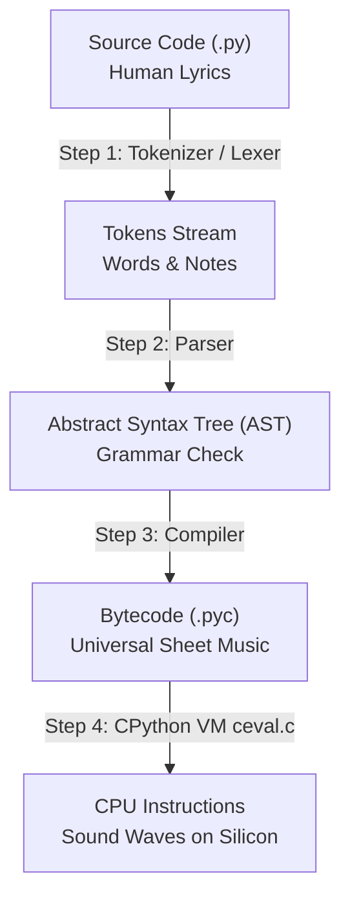
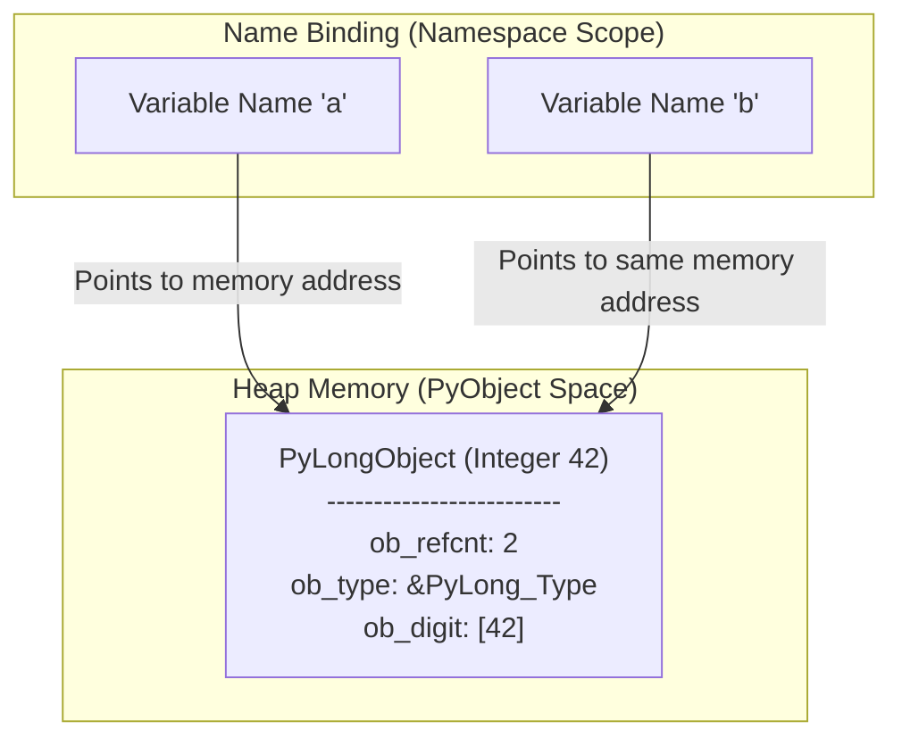
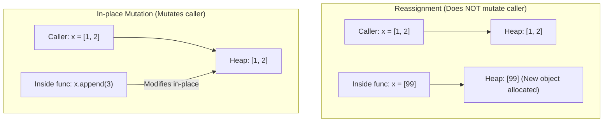
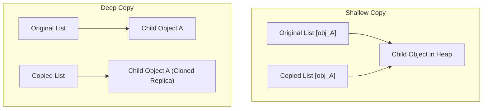

# Chapter 1: Foundations, Memory Model & Execution Pipeline

> **Core Learning Objective:** Understand Python from the silicon up. You will learn the exact sequence of events when **CPython** (the official C-based engine behind Python) executes a line of code, how objects live in memory, why variables are not "boxes", and how Python manages references.

---

> [!NOTE]
> ### 💡 Wait, What Exactly is "CPython"? (The Recipe vs. The Chef)
> If you are new to deep Python engineering, seeing the word **"CPython"** right away might make you wonder: *"Wait, what is CPython? Is that different from Python? Did I install the wrong software?"*
> 
> Don't worry at all! Here is the crystal-clear breakdown:
> 
> | Term | Real-World Metaphor | What It Actually Is |
> | :--- | :--- | :--- |
> | **Python** | **The Recipe** | The language specification: the official rules, grammar, and keywords (`def`, `class`, `for`, `print`). It is an abstract set of instructions written down on paper. |
> | **CPython** | **The Master Chef** | The actual software program written in the **C programming language** that reads your Python recipe and cooks it into real electrical signals on your physical CPU chip. |
> 
> * **Why is it called *C*Python?** Simply because it was written in the **C language** by Guido van Rossum (Python's original creator).
> * **Did you install CPython?** **Yes!** When you go to `python.org` and download Python, or when you type `python` or `python3` in your terminal on Windows, Mac, or Linux, you are running **CPython**. Over 99.9% of all Python programs in the world (Google, Netflix, Instagram, OpenAI) run on CPython.
> * **Are there other "chefs"?** Yes! There are alternative engines like *PyPy* (written with a Just-In-Time compiler for speed), *Jython* (runs on the Java JVM), and *MicroPython* (for tiny IoT microcontrollers). But **CPython is the official, gold-standard reference implementation**.
> 
> **Why do we teach you CPython in this course?** Because anyone can learn surface-level syntax, but true Staff Engineers know how the engine works under the hood: how CPython allocates memory, caches small numbers, handles the Global Interpreter Lock (GIL), and manages pointers. That knowledge gives you the superpower to write blazingly fast, bug-free production systems!

---

## 1. The Anatomy of Python Execution

> **Zero-Prerequisite Intuition: The "Composer, Sheet Music, & Orchestra" Metaphor**
> How does plain English text like `print("hello")` actually turn into electrical pulses on an Intel or AMD silicon chip?
> 
> Imagine a composer writing a song:
> 1. **Source Code (`.py`):** You humming a melody and writing lyrics down on a napkin in human words.
> 2. **Tokenization (Alphabet):** Identifying individual musical notes and words while discarding accidental coffee stains and spaces.
> 3. **The AST (Abstract Syntax Tree):** Diagramming the musical sentence to verify its grammar (ensuring every chorus has verses and no syntax rules are broken).
> 4. **Bytecode (`.pyc`):** Translating the melody into **Universal Sheet Music**. Sheet music doesn't make any sound by itself, but ANY trained musician in any country can read it!
> 5. **The CPython Virtual Machine (`ceval.c`):** The **Orchestra Musician**. They read the sheet music line-by-line and strike the piano keys!
> 6. **CPU Machine Code:** The actual physical sound waves vibrating the air (electrical voltages flipping transistors inside the CPU).
> 
> Many developers mistakenly believe Python reads source code line-by-line while running. In reality, **CPython** compiles your text into **Universal Sheet Music (Bytecode)** first, and then runs that bytecode inside a virtual machine!



> [!NOTE]
> **What is a "Stack-Based Virtual Machine"? (The Cafeteria Plate Dispenser)**
> Have you ever seen a spring-loaded plate dispenser at a cafeteria buffet?
> * You push a plate onto the top of the pile (**`PUSH`**).
> * When you need a plate, you take the top plate off (**`POP`**).
> 
> Python's execution engine (`ceval.c`) works exactly like that plate dispenser:
> To calculate `x = 2 + 3`:
> 1. It pushes a plate with `2` onto the dispenser.
> 2. It pushes a plate with `3` onto the dispenser.
> 3. The `+` operator pops both plates, calculates `5`, and pushes a plate with `5` back on top!
> 4. Finally, it pops `5` and ties the nametag `x` to it!

### Step 1: Tokenization (Lexical Analysis)
The tokenizer reads raw text characters and converts them into discrete lexical tokens (keywords, identifiers, literals, operators).
```python
import tokenize
import io

code = "total = price * 1.18"
tokens = tokenize.tokenize(io.BytesIO(code.encode('utf-8')).readline)
for tok in tokens:
    if tok.type in (tokenize.NAME, tokenize.OP, tokenize.NUMBER):
        print(f"Token: {tok.string:<10} Type: {tokenize.tok_name[tok.type]}")
```
*Output:*
```text
Token: total      Type: NAME
Token: =          Type: OP
Token: price      Type: NAME
Token: *          Type: OP
Token: 1.18       Type: NUMBER
```

### Step 2: AST (Abstract Syntax Tree) Generation
The tokens are parsed into a grammar tree representing the structural semantics of the program.
```python
import ast

tree = ast.parse("x = 42 + y")
print(ast.dump(tree, indent=2))
```
The AST validates grammatical rules and enforces syntax validity *before* any code runs.

### Step 3: Bytecode Compilation
The AST is compiled into platform-independent instruction sequences called **Bytecode**, packaged into a `PyCodeObject` (persisted on disk as `.pyc` files inside `__pycache__`).
You can inspect bytecode directly using the `dis` (disassembler) standard module:
```python
import dis

def compute(x, y):
    return x * 2 + y

dis.dis(compute)
```
*Disassembly output:*
```text
  2           0 LOAD_FAST                0 (x)
              2 LOAD_CONST               1 (2)
              4 BINARY_OP                5 (*)
              8 LOAD_FAST                1 (y)
             10 BINARY_OP                0 (+)
             14 RETURN_VALUE
```
Each instruction represents an operation in CPython's stack evaluation loop (`ceval.c`).

### Step 4: The Evaluation Loop (`ceval.c`)
The CPython virtual machine is a **stack-based virtual machine**. It does not use CPU registers directly; instead, it pushes values onto an internal evaluation stack, pops them off to perform operations, and pushes the result back.

---

## 2. The Python Memory Model: Variables Are Pointers, Not Boxes

In languages like C or C++, a variable is a named memory location that directly holds a value:
```c
// C Language: 'a' is a 4-byte box in memory holding the number 42
int a = 42; 
```

In Python, **variables never hold data directly**. Variables are lightweight **pointers (references)** bound to `PyObject` structures residing on the heap.



### The `PyObject` Anatomy
Every single entity in Python—integers, strings, functions, modules, classes—is a C struct on the heap derived from `PyObject`:

```c
// CPython definition (object.h)
struct _object {
    _PyObject_HEAD_EXTRA // Doubly-linked list pointers for tracking active objects
    Py_ssize_t ob_refcnt; // Reference count (how many variables point to this)
    struct _typeobject *ob_type; // Pointer to the type object (e.g., int, str)
};
```
When you create an integer `a = 42`, Python allocates:
1. `ob_refcnt`: starts at 1.
2. `ob_type`: points to `&PyLong_Type` (which provides methods like `__add__`).
3. Payload: the actual integer digits.

```python
import sys

x = [1, 2, 3]
# sys.getrefcount increments count by 1 temporarily during the call
print(f"Reference count of x: {sys.getrefcount(x) - 1}") 

y = x # y binds to the exact same PyObject on the heap
print(f"Reference count after y = x: {sys.getrefcount(x) - 1}")

print(f"Memory address of x: {id(x)}")
print(f"Memory address of y: {id(y)}")
print(f"Do x and y reference the identical object? {x is y}")
```

> [!IMPORTANT]
> The `is` operator checks **pointer identity** (memory address: `id(a) == id(b)`).  
> The `==` operator checks **value equivalence** (delegates to `a.__eq__(b)`).

---

## 3. Mutability vs Immutability

Understanding mutability is the single biggest divider between buggy code and reliable systems.

| Type Category | Built-in Types | Modifiable In-Place? | Thread-Safety Impact |
| :--- | :--- | :--- | :--- |
| **Immutable** | `int`, `float`, `bool`, `str`, `tuple`, `frozenset`, `bytes` | **No**. Any modification creates a new object | Inherently thread-safe for reads |
| **Mutable** | `list`, `dict`, `set`, `bytearray` | **Yes**. Internal state changes in-place | Requires locking under concurrent writes |

### Concrete Demonstration of Immutability
```python
# Strings are immutable
s = "hello"
original_id = id(s)

s += " world" # Does NOT alter 'hello' in-place. Allocates a new string!
new_id = id(s)

print(f"Original ID: {original_id} vs New ID: {new_id}")
print(f"Did the pointer change? {original_id != new_id}") # True
```

### The Mutable Default Argument Trap (Classic Interview Question)
```python
# ANTI-PATTERN: The list is instantiated ONCE when the function is defined, not when called!
def append_to_cache(item, cache=[]):
    cache.append(item)
    return cache

print(append_to_cache("A")) # ['A']
print(append_to_cache("B")) # ['A', 'B'] -> Surprise! Shared mutable state across all callers.

# PRODUCTION PATTERN: Use None as default sentinel
def append_to_cache_fixed(item, cache=None):
    if cache is None:
        cache = [] # Fresh allocation per invocation
    cache.append(item)
    return cache
```

---

## 4. Pass-By-Assignment (Call-by-Object-Reference)

Python is neither strictly "pass-by-value" nor "pass-by-reference". It is **pass-by-assignment**:
* Function arguments are passed as **object references** (pointers to existing heap objects).
* Assigning a parameter name inside the function (`arg = new_val`) binds that local name to a new object; it does **not** overwrite the caller's reference.
* Modifying the internal state of a mutable object through the reference **mutates the caller's object**.



```python
def modify_values(primitive, mutable_list):
    primitive = 100          # Rebinds local name 'primitive'; caller unchanged
    mutable_list.append(100) # Mutates underlying object; caller sees change

num = 10
items = [1, 2, 3]
modify_values(num, items)

print(f"num: {num}")       # Still 10
print(f"items: {items}")   # [1, 2, 3, 100]
```

---

## 5. Shallow Copy vs Deep Copy

When copying composite structures (objects containing other objects, like nested lists or dictionaries):
* **Shallow Copy (`copy.copy(x)` or `list(x)`):** Creates a new container, but populates it with references to the **same child objects**.
* **Deep Copy (`copy.deepcopy(x)`):** Recursively clones the container **and** all children, creating an independent object graph.



```python
import copy

nested = [[1, 2], [3, 4]]
shallow = copy.copy(nested)
deep = copy.deepcopy(nested)

# Mutate an inner element
nested[0][0] = 999

print(f"Original: {nested}")   # [[999, 2], [3, 4]]
print(f"Shallow:  {shallow}")  # [[999, 2], [3, 4]] -> Altered!
print(f"Deep:     {deep}")     # [[1, 2], [3, 4]]   -> Preserved!
```

---

## 6. Integer Caching & String Interning

To avoid excessive heap allocations for ubiquitous primitives, CPython employs aggressive memory optimization caches:

### Small Integer Cache (`[-5, 256]`)
During startup, CPython pre-allocates an array of `PyLongObject` for all integers from `-5` through `256`. Any integer created in this range returns a pointer to the pre-allocated singleton:

```python
a = 250
b = 250
print(a is b) # True: Both point to pre-allocated CPython singleton

x = 1000
y = 1000
print(x is y) # False: Exceeds small-int cache; separate heap allocations
```

### String Interning
CPython automatically interns identifiers (variable names, attribute names, short string literals matching `[a-zA-Z0-9_]*`):
```python
import sys

s1 = "production_ready_identifier"
s2 = "production_ready_identifier"
print(s1 is s2) # True (interned automatically)

# Strings with spaces or special characters are generally not auto-interned
str_a = "hello world!"
str_b = "hello world!"
print(str_a is str_b) # May be False depending on compilation context

# Force manual interning for high-performance dict lookups:
str_a = sys.intern(str_a)
str_b = sys.intern(str_b)
print(str_a is str_b) # Guaranteed True (Pointer comparison: O(1) speed)
```

---

## 7. Structural Pattern Matching (Python 3.10+)

Modern Python introduces `match-case`, which is not merely a `switch-case` statement—it is a full **destructuring pattern matcher** with type inspection and guard clauses:

```python
def process_event(event: dict):
    match event:
        case {"type": "click", "coords": (x, y)} if x >= 0 and y >= 0:
            return f"Valid click at ({x}, {y})"
        case {"type": "click", "coords": (x, y)}:
            return f"Out of bounds click at ({x}, {y})"
        case {"type": "keypress", "key": str(key), "modifiers": [*mods]}:
            return f"Key '{key}' pressed with modifiers: {', '.join(mods)}"
        case {"type": "shutdown", "force": True}:
            return "Immediate forced shutdown requested"
        case _:
            raise ValueError(f"Unknown event signature: {event}")

print(process_event({"type": "click", "coords": (120, 450)}))
print(process_event({"type": "keypress", "key": "S", "modifiers": ["Ctrl", "Shift"]}))
```

---

## Practice Drills & Interview Verification

### Problem 1: Pointer Mutation Trace
What is the exact output of the following script? Trace the pointers before looking at the solution.
```python
a = [10, 20]
b = a
b += [30]
c = a + [40]
print(f"a: {a}, b: {b}, c: {c}")
```
**Explanation & Solution:**
1. `b = a`: `b` points to `a`'s list object `[10, 20]`.
2. `b += [30]`: For lists, `+=` invokes `__iadd__`, which calls `list.extend()` in-place. `a` and `b` both now reference `[10, 20, 30]`.
3. `c = a + [40]`: The `+` operator invokes `__add__`, which **allocates a brand new list**. `c` points to `[10, 20, 30, 40]`. `a` remains `[10, 20, 30]`.
*Output:* `a: [10, 20, 30], b: [10, 20, 30], c: [10, 20, 30, 40]`

### Problem 2: Tuple with Mutable Elements
Is a tuple containing a list truly immutable? What happens here?
```python
t = (1, [2, 3])
try:
    t[1] += [4]
except TypeError as e:
    print(f"Exception raised: {e}")
print(f"Tuple state: {t}")
```
**Explanation & Solution:**
* `t[1] += [4]` translates to:
  1. Evaluate `t[1].__iadd__([4])` -> Mutates the list in-place to `[2, 3, 4]`.
  2. Attempt to assign the result back: `t[1] = [2, 3, 4]`.
  3. The tuple raises `TypeError: 'tuple' object does not support item assignment` because tuples forbid rebinding elements!
* **Result:** The exception is thrown, BUT the list mutation already succeeded!
* *Output:*
  ```text
  Exception raised: 'tuple' object does not support item assignment
  Tuple state: (1, [2, 3, 4])
  ```
> **Staff Engineer Takeaway:** Immutability in Python applies only to the **references** held directly by the container, not to the contents of referenced objects.
