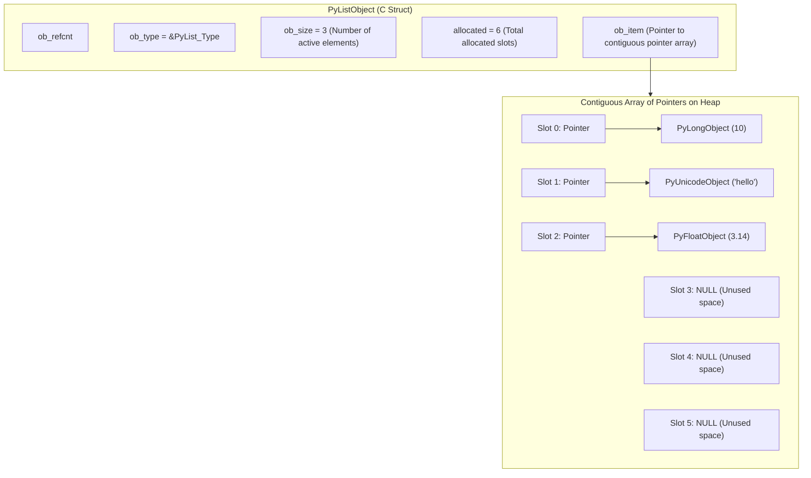
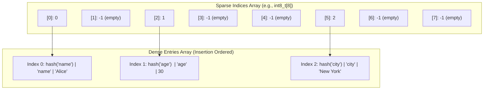

# Chapter 2: Built-in Data Structures Under the Hood

> **Core Learning Objective:** Peel back the syntax of Python lists, dictionaries, tuples, sets, and deques to understand their underlying C structures, memory layout, dynamic resizing algorithms, and amortized Big-O complexities.

---

## 1. Python Lists: Contiguous Pointer Arrays

> **Zero-Prerequisite Intuition: The "Coat-Check Ticket Rack" Metaphor**
> What is a Python `list` under the hood?
> 
> Imagine you run the coat-check room at a luxury theatre:
> * Guest 1 checks in a giant heavy winter fur coat.
> * Guest 2 checks in a tiny pair of sunglasses.
> * Guest 3 checks in an umbrella.
> 
> You cannot glue the fur coat, the sunglasses, and the umbrella together in a straight line—they are completely different sizes and shapes! 
> 
> What do you do instead? 
> You have a neat, orderly rack of **identical wooden hangers numbered 0, 1, 2, 3...**
> * On Hanger #0, you hang a claim ticket pointing to the winter fur coat in the back room.
> * On Hanger #1, you hang a claim ticket pointing to the sunglasses.
> * On Hanger #2, you hang a claim ticket pointing to the umbrella.
> 
> In Python, a `list` does **NOT** hold the actual data items! A Python `list` is simply an **orderly rack of identical claim tickets (memory pointers)**. Each hanger is exactly 8 bytes wide, and each hanger points to wherever that object is floating on the warehouse floor (the Heap)!

A Python `list` is **not a linked list**. It is a **dynamically sized, contiguous array of pointers** (`PyObject**`).



### The CPython Definition (`listobject.h`)
```c
typedef struct {
    PyObject_VAR_HEAD
    PyObject **ob_item;   // Vector of pointers to list elements
    Py_ssize_t allocated; // Currently allocated capacity
} PyListObject;
```

### Dynamic Resizing & Over-Allocation Formula
When you call `list.append()`, CPython checks if `ob_size == allocated`. If the buffer is full, it resizes the array using this exact formula:
$$\text{new\_allocated} = \text{new\_size} + (\text{new\_size} \gg 3) + (\text{new\_size} < 9 \ ? \ 3 : 6)$$

```python
import sys

items = []
print(f"{'Length':<8} {'Size in Bytes':<15} {'Over-allocated Slots'}")
prev_size = sys.getsizeof(items)
for i in range(25):
    items.append(i)
    current_size = sys.getsizeof(items)
    if current_size != prev_size or i == 0:
        # Approximate pointer capacity: (bytes - empty_list_overhead) // 8
        capacity = (current_size - 56) // 8
        print(f"{len(items):<8} {current_size:<15} {capacity}")
        prev_size = current_size
```
*Key Takeaways:*
* As the list grows, capacity increases in bursts: $0 \rightarrow 4 \rightarrow 8 \rightarrow 16 \rightarrow 24 \rightarrow 32 \dots$
* Because resizing occurs geometrically, appending has an **amortized time complexity of $O(1)$**, even though an individual resize operation costs $O(N)$ memory copies.

### Time Complexity Matrix: List Operations
| Operation | Average Case | Worst Case | Memory / Mechanism |
| :--- | :--- | :--- | :--- |
| `list.append(x)` | $O(1)$ | $O(N)$ (rare resize) | Appends to end of array |
| `list.pop()` | $O(1)$ | $O(1)$ | Decrements `ob_size` |
| `list.insert(0, x)` | $O(N)$ | $O(N)$ | Shifts all $N$ pointers right by 1 |
| `list.pop(0)` | $O(N)$ | $O(N)$ | Shifts all $N-1$ pointers left by 1 |
| `list[i]` (Lookup) | $O(1)$ | $O(1)$ | Direct pointer arithmetic: `ob_item + i * sizeof(void*)` |
| `x in list` (Search) | $O(N)$ | $O(N)$ | Linear iteration over pointers |

---

## 2. Python Tuples: Fixed Memory Footprint

A `tuple` is an **immutable contiguous pointer array**. Because its length is fixed at instantiation, CPython eliminates the `allocated` capacity field.

```python
import sys

lst = [1, 2, 3, 4, 5]
tup = (1, 2, 3, 4, 5)

print(f"List sizeof:  {sys.getsizeof(lst)} bytes")  # ~104 bytes (includes over-allocation)
print(f"Tuple sizeof: {sys.getsizeof(tup)} bytes")  # ~80 bytes (exact fit)
```

### The Tuple Free List Optimization
To accelerate code execution, CPython maintains an internal **free list** for small tuples (up to 20 elements). When a tuple is destroyed, its memory is not immediately freed back to the OS; instead, it is retained in a freelist to instantly satisfy future tuple allocations without calling `malloc()`.

---

## 3. The Modern Dictionary: Compact Hash Tables

Prior to Python 3.6, dictionaries used a sparse hash table where each entry took 24 bytes (hash, key pointer, value pointer), resulting in vast amounts of wasted unused memory:

```text
Old Sparse Dict (Prior to 3.6):
[
  [hash, key_ptr, val_ptr],
  [NULL, NULL, NULL],        <-- Unused empty slot wasting 24 bytes!
  [hash, key_ptr, val_ptr],
  [NULL, NULL, NULL]
]
```

### The Raymond Hettinger Compact Dict (Python 3.6+)
Modern Python separates the sparse table into **two distinct arrays**:
1. **Indices Array (Sparse):** An array of tiny integers (1 byte for small dicts: `int8_t`).
2. **Entries Array (Dense):** A compact array storing only active entries in order of insertion.



### Why Dicts Preserve Insertion Order
Because new keys are simply appended to the end of the **Dense Entries Array**, iterating over a dictionary merely walks the entries array sequentially. This is why Python dictionaries are guaranteed to be insertion-ordered!

### Hash Collision Resolution: Perturbation Probing
When two keys produce identical hash table indices, CPython resolves collisions via **open addressing** with a pseudo-random perturbation sequence:
$$\text{perturb} \gg= 5$$
$$j = (5 \times j + 1 + \text{perturb}) \pmod{\text{mask}}$$

This probe sequence ensures that all slots in the table are systematically visited without clustering.

### Hashability Requirements
For an object to be used as a dictionary key or set element, it must satisfy the **Hash Contract**:
1. Implement `__hash__()` returning an integer that never changes during the object's lifetime.
2. Implement `__eq__()` such that if `a == b`, then `hash(a) == hash(b)`.
3. If an object is mutable, modifying it would alter its hash and break table lookups. Hence, mutable types (`list`, `dict`, `set`) unhashable: `TypeError: unhashable type: 'list'`.

---

## 4. Sets and Frozensets

A `set` in CPython is essentially a dictionary where the entries contain only keys and no values.
* **Lookup / Insert / Delete:** $O(1)$ average.
* **Set Operations:**
  * Union (`A | B`): $O(\text{len}(A) + \text{len}(B))$
  * Intersection (`A & B`): $O(\min(\text{len}(A), \text{len}(B)))$
  * Difference (`A - B`): $O(\text{len}(A))$
  * Symmetric Difference (`A ^ B`): $O(\text{len}(A) + \text{len}(B))$

---

## 5. High-Performance Alternatives: `collections` & `heapq`

### `collections.deque` (Double-Ended Queue)
When you need to push and pop from both sides, never use `list.insert(0, x)` or `list.pop(0)`. Use `collections.deque`.
* In CPython, `deque` is implemented as a **doubly-linked list of fixed-size blocks** (each block holds 64 elements).
* Adding or removing from either head or tail is strictly **$O(1)$ without resizing copies**.

```python
from collections import deque
import time

# Benchmark list.pop(0) vs deque.popleft()
n = 100_000

lst = list(range(n))
t0 = time.perf_counter()
while lst:
    lst.pop(0) # O(N^2) total: copies remaining elements on every pop!
t_list = time.perf_counter() - t0

dq = deque(range(n))
t0 = time.perf_counter()
while dq:
    dq.popleft() # O(N) total: O(1) per pop
t_deque = time.perf_counter() - t0

print(f"List pop(0) took:     {t_list:.4f} seconds")
print(f"Deque popleft() took: {t_deque:.4f} seconds")
print(f"Deque is {t_list / t_deque:.1f}x faster!")
```

### `heapq`: Priority Queues
`heapq` implements a **min-heap** directly on top of standard Python lists using 0-based array indexing:
* For node at index $i$:
  * Left child: $2i + 1$
  * Right child: $2i + 2$
  * Parent: $\lfloor(i - 1) / 2\rfloor$
* Operations:
  * `heapify(lst)`: Transforms list into heap in-place in **$O(N)$** time (sift-down algorithm).
  * `heappush(heap, item)`: $O(\log N)$.
  * `heappop(heap)`: $O(\log N)$.

---

## 6. Comprehensive Big-O Reference Matrix

| Data Structure | Access by Index | Search by Value | Insert at Head | Insert at Tail | Delete at Head | Delete at Tail |
| :--- | :--- | :--- | :--- | :--- | :--- | :--- |
| **`list`** | $O(1)$ | $O(N)$ | $O(N)$ | $O(1)$ amortized | $O(N)$ | $O(1)$ |
| **`deque`** | $O(N)$ | $O(N)$ | $O(1)$ | $O(1)$ | $O(1)$ | $O(1)$ |
| **`dict`** | N/A | $O(1)$ key lookup | N/A | $O(1)$ amortized | N/A | $O(1)$ |
| **`set`** | N/A | $O(1)$ membership | N/A | $O(1)$ insert | N/A | $O(1)$ pop |
| **`heapq`** | $O(1)$ (min item) | $O(N)$ | N/A | $O(\log N)$ push | $O(\log N)$ pop | N/A |

---

## Practice Problems & Interview Drills

### Drill 1: The `[[]] * 5` Multiplication Trap
What bug does this code introduce, and how does pointer layout explain it?
```python
grid = [[0] * 3] * 3
grid[0][0] = 99
print(grid)
```
**Explanation & Solution:**
The outer `* 3` does not clone the inner list; it copies the **pointer** to that same single list three times!
```python
# Output: [[99, 0, 0], [99, 0, 0], [99, 0, 0]]
# Correct production idiom using list comprehension (allocates 3 distinct lists):
grid_fixed = [[0] * 3 for _ in range(3)]
grid_fixed[0][0] = 99
print(grid_fixed) # [[99, 0, 0], [0, 0, 0], [0, 0, 0]]
```

### Drill 2: Implement an LRU Cache from Scratch
*Requirement:* Implement a Least Recently Used (LRU) Cache with $O(1)$ `get()` and $O(1)$ `put()`. Do not use `collections.OrderedDict`.

**Architecture:** Combine a **hash map** (for $O(1)$ key-to-node lookup) with a **doubly linked list** (for $O(1)$ node removal and insertion to the front).

```python
class Node:
    __slots__ = ('key', 'val', 'prev', 'next')
    def __init__(self, key: int, val: int):
        self.key = key
        self.val = val
        self.prev = None
        self.next = None

class LRUCache:
    def __init__(self, capacity: int):
        self.capacity = capacity
        self.cache = {} # Map[key -> Node]
        
        # Sentinel dummy head and tail nodes eliminate null-check edge cases
        self.head = Node(0, 0)
        self.tail = Node(0, 0)
        self.head.next = self.tail
        self.tail.prev = self.head

    def _remove(self, node: Node) -> None:
        """Unlink node from doubly linked list in O(1)."""
        prev_node = node.prev
        next_node = node.next
        prev_node.next = next_node
        next_node.prev = prev_node

    def _add_to_front(self, node: Node) -> None:
        """Insert node immediately after dummy head in O(1)."""
        node.next = self.head.next
        node.prev = self.head
        self.head.next.prev = node
        self.head.next = node

    def get(self, key: int) -> int:
        if key not in self.cache:
            return -1
        node = self.cache[key]
        self._remove(node)
        self._add_to_front(node) # Mark as most recently used
        return node.val

    def put(self, key: int, value: int) -> None:
        if key in self.cache:
            self._remove(self.cache[key])
        
        node = Node(key, value)
        self._add_to_front(node)
        self.cache[key] = node

        if len(self.cache) > self.capacity:
            # Evict least recently used (node before tail)
            lru = self.tail.prev
            self._remove(lru)
            del self.cache[lru.key]

# Verification
lru = LRUCache(2)
lru.put(1, 100)
lru.put(2, 200)
assert lru.get(1) == 100 # Key 1 is accessed; key 2 is now LRU
lru.put(3, 300)          # Evicts key 2
assert lru.get(2) == -1  # Verified evicted!
assert lru.get(3) == 300
print("LRU Cache implementation passed all assertions successfully!")
```


## Further Reading

- [Data structures tutorial](https://docs.python.org/3/tutorial/datastructures.html)
- [collections module](https://docs.python.org/3/library/collections.html)
- [TimeComplexity wiki](https://wiki.python.org/moin/TimeComplexity)


---

## Check Yourself

Answer in your head or on paper first, then open each answer.

<details>
<summary><strong>1.</strong> What is the average time complexity of `x in some_set` versus `x in some_list`?</summary>

`O(1)` average for a set (hash lookup) versus `O(n)` for a list (linear scan).

</details>

<details>
<summary><strong>2.</strong> Why must dict keys be hashable, and what rule links `__hash__` and `__eq__`?</summary>

The key's hash picks a slot. Objects that compare equal must have equal hashes (`a == b` implies `hash(a) == hash(b)`), otherwise lookups fail.

</details>

<details>
<summary><strong>3.</strong> Why is `list.insert(0, x)` slow but `collections.deque.appendleft(x)` fast?</summary>

A list is a contiguous array, so inserting at the front shifts all elements (`O(n)`). A deque is a linked structure of blocks with `O(1)` operations at both ends.

</details>

<details>
<summary><strong>4.</strong> Since which version do dicts preserve insertion order as a language guarantee?</summary>

Python 3.7 (it was an implementation detail of CPython 3.6).

</details>
