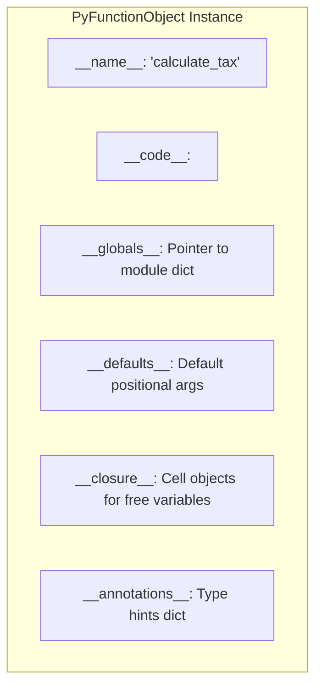
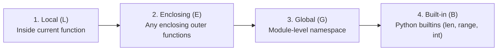
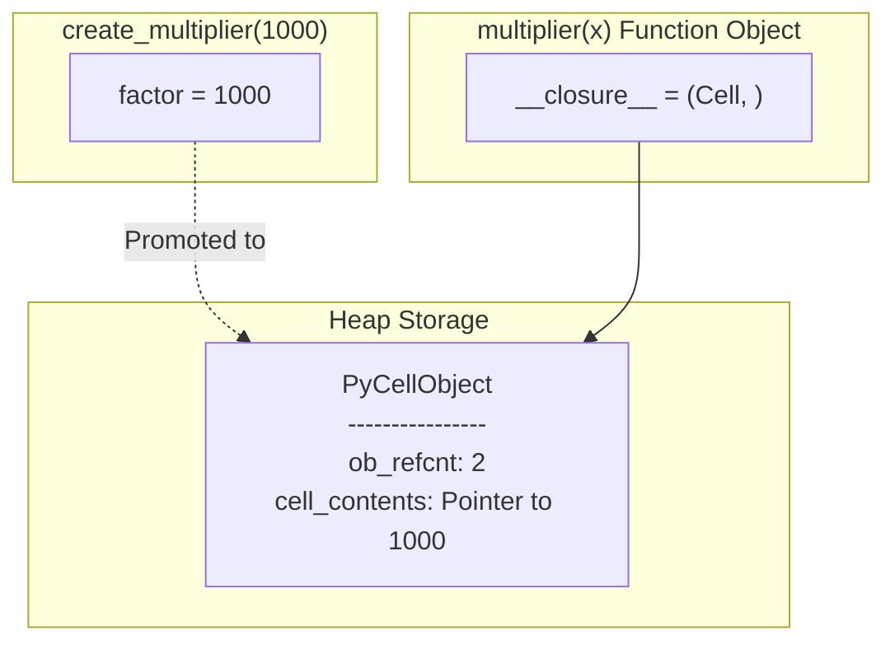
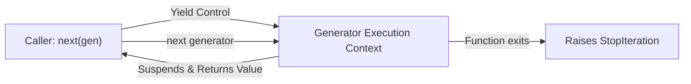

# Chapter 3: Functions, Scopes, Closures & Advanced Decorators

> **Core Learning Objective:** Master the execution mechanics of Python functions as first-class citizens. Understand LEGB scope resolution, cell objects, lexical closures, generator delegation (`yield from`), and craft production-grade decorators (retries with exponential backoff, rate limiters, and caching).

---

## 1. Functions as First-Class Objects

> **Zero-Prerequisite Intuition: The "Recipe Card in a Plastic Sleeve" Metaphor**
> In older programming languages, a function is like a heavy printing press bolted to a factory floor—it cannot move, you cannot pick it up, put it in an envelope, or mail it to another room.
> In Python, a function is a **recipe card slipped into a clear plastic sleeve (a heap object)**.
> * You can slap a new sticky nametag on it: `cook = bake_cake` (aliasing).
> * You can hand the recipe card to someone else as an instruction manual: `run_task(bake_cake)` (higher-order argument).
> * A master chef can even write a brand new recipe card on the fly and hand it back to you: `return secret_recipe` (returned function).
> * Because it is a physical object sitting on the warehouse floor, you can stick notes directly onto its plastic sleeve (`func.rate_limit = 100`).

In Python, functions are not mere blocks of executable instructions—they are **first-class heap objects** instances of `PyFunctionObject`.



Because functions are objects, you can:
1. Assign them to variables.
2. Pass them as arguments to higher-order functions.
3. Return them from other functions.
4. Attach arbitrary metadata attributes to them directly.

```python
def authenticate(token: str) -> bool:
    """Verifies bearer token."""
    return token.startswith("secret_")

# Functions possess inspectable runtime attributes:
print(authenticate.__name__)        # 'authenticate'
print(authenticate.__doc__)         # 'Verifies bearer token.'
print(authenticate.__annotations__) # {'token': <class 'str'>, 'return': <class 'bool'>}

# You can dynamically attach custom attributes (useful for frameworks):
authenticate.rate_limit = 100
authenticate.roles_allowed = ["admin", "service"]
print(authenticate.roles_allowed)   # ['admin', 'service']
```

---

## 2. The LEGB Scope Resolution Rule

Whenever Python encounters a variable name, it searches four nested namespaces in a strict deterministic order: **LEGB**:



### The `global` vs `nonlocal` Keywords
* **`global x`**: Instructs Python that assignments to `x` inside the local scope target the top-level module namespace.
* **`nonlocal x`**: Instructs Python that assignments to `x` target the **nearest enclosing function scope**, skipping the local scope but *not* reaching the module-level global scope.

```python
count = 0 # Global

def outer():
    count = 10 # Enclosing
    
    def inner():
        nonlocal count # Rebinds outer's 'count'
        count += 1
        print(f"Inner count: {count}")
        
    inner()
    print(f"Outer count: {count}")

outer()
print(f"Global count: {count}")
```
*Output:*
```text
Inner count: 11
Outer count: 11
Global count: 0
```

---

## 3. Closures & Cell Objects Under the Hood

> **Zero-Prerequisite Intuition: The "Backpack" Metaphor for Closures**
> When a function runs, its workspace is like a temporary hotel room (the call stack). When the function finishes, housekeeping cleans out everything—all local variables are destroyed.
> So how can a child function remember a variable from a parent function that already checked out and closed hours ago?
> **CPython gives the child function a physical "Backpack" (`PyCellObject`).**
> Before the parent function packs up and checks out of the room, Python takes the shared variable, packs it securely into a durable storage pouch (the Cell), and straps it onto the child function's back (`__closure__`).
> Wherever that child function travels—even across the internet or into another module—it carries that backpack with it. When invoked, it unzips its backpack and reads or updates the variable!

A **closure** is a function that retains access to variables from its lexical enclosing scope even after that enclosing function has finished execution and popped off the call stack.



### How CPython Implements Closures: `PyCellObject`
When CPython compiles a nested function that references an outer variable, it recognizes that the outer variable cannot live on the transient call stack. It allocates a **`PyCellObject` on the heap** to store a pointer to the shared value.

```python
def make_counter(start: int = 0):
    current = start # Free variable captured by inner function
    
    def increment():
        nonlocal current
        current += 1
        return current
        
    return increment

counter_a = make_counter(10)
print(counter_a()) # 11
print(counter_a()) # 12

# Inspecting the internal closure cells:
closure_cells = counter_a.__closure__
print(f"Closure tuple: {closure_cells}")
print(f"Cell contents: {closure_cells[0].cell_contents}") # 12
```

---

## 4. Decorators: From First Principles to Production

> **Zero-Prerequisite Intuition: The "Security Guard at the Office Door" Metaphor**
> Imagine an executive working in an office (your core function). Anyone who knows the room number can open the door and interrupt them.
> A decorator is like stationing a **Security Guard** right outside that door:
> * The guard intercepts everyone before they touch the door handle (`*args, **kwargs`).
> * The guard checks badges (Authentication/RBAC), starts a stopwatch to measure the meeting duration (Profiling/Metrics), or tells them to wait if the executive is busy (Rate Limiting).
> * The guard then opens the door and lets them talk to the executive (`result = func(*args, **kwargs)`).
> * When the meeting ends, the guard inspects the outcome and hands it back to the visitor.
> The `@decorator` syntax is simply writing on the company directory: *"Do NOT walk into this room directly; all visitors must pass through this Security Guard first!"*

A decorator is a callable that takes a function as input, extends or modifies its behavior, and returns a callable.
The `@decorator` syntax is pure syntactic sugar:
```python
@my_decorator
def target():
    pass

# Is 100% equivalent to:
target = my_decorator(target)
```

### The Critical Role of `@functools.wraps`
When wrapping a function, the inner wrapper function replaces the original. Without preservation, the original name, docstring, and signature are lost, breaking debuggers, logging, and documentation generators:

```python
import functools

def broken_decorator(func):
    def wrapper(*args, **kwargs):
        return func(*args, **kwargs)
    return wrapper

def robust_decorator(func):
    @functools.wraps(func) # Copies __name__, __doc__, __annotations__, __module__
    def wrapper(*args, **kwargs):
        return func(*args, **kwargs)
    return wrapper

@broken_decorator
def calculate_salary():
    """Calculates yearly compensation."""
    pass

print(calculate_salary.__name__) # 'wrapper' (Lost!)
print(calculate_salary.__doc__)  # None (Lost!)

@robust_decorator
def calculate_tax():
    """Calculates tax rate."""
    pass

print(calculate_tax.__name__)    # 'calculate_tax' (Preserved!)
print(calculate_tax.__doc__)     # 'Calculates tax rate.' (Preserved!)
```

### Three-Tier Parameterized Decorators
When a decorator itself takes arguments (e.g. `@retry(max_retries=3)`), you need a 3-tier callable structure:
1. **Outer function:** Accepts decorator configuration arguments.
2. **Middle function:** Accepts the target function.
3. **Inner function (`wrapper`):** Intercepts runtime call arguments (`*args, **kwargs`).

---

## 5. Production-Grade Decorator Implementations

### Pattern 1: Exponential Backoff & Retry Decorator
Essential for distributed systems when communicating over flaky networks (HTTP, database connections, RPCs):

```python
import time
import functools
import logging
from typing import Tuple, Type

logging.basicConfig(level=logging.INFO, format="%(asctime)s [%(levelname)s] %(message)s")

def retry(
    max_attempts: int = 3,
    initial_delay: float = 0.5,
    backoff_factor: float = 2.0,
    exceptions: Tuple[Type[Exception], ...] = (Exception,)
):
    """
    Retries an operation with exponential jittered backoff upon specified exceptions.
    """
    def decorator(func):
        @functools.wraps(func)
        def wrapper(*args, **kwargs):
            delay = initial_delay
            attempt = 1
            while attempt <= max_attempts:
                try:
                    return func(*args, **kwargs)
                except exceptions as err:
                    if attempt == max_attempts:
                        logging.error(f"Function {func.__name__} permanently failed after {max_attempts} attempts.")
                        raise
                    
                    logging.warning(
                        f"Attempt {attempt}/{max_attempts} of {func.__name__} failed: {err}. "
                        f"Retrying in {delay:.2f}s..."
                    )
                    time.sleep(delay)
                    delay *= backoff_factor
                    attempt += 1
        return wrapper
    return decorator

# Test run
call_count = 0

@retry(max_attempts=4, initial_delay=0.1, backoff_factor=2.0, exceptions=(ConnectionError,))
def fetch_user_data(user_id: int):
    global call_count
    call_count += 1
    if call_count < 3:
        raise ConnectionError("Network unreachable")
    return {"user_id": user_id, "status": "active"}

result = fetch_user_data(42)
print("Success Result:", result)
```

### Pattern 2: Token-Bucket Rate Limiter Decorator
Guarantees a function cannot be executed more than $N$ times within a sliding window of $T$ seconds:

```python
import time
import functools
from collections import deque

def rate_limited(max_calls: int, period: float):
    """Limits function invocations to `max_calls` per `period` seconds."""
    def decorator(func):
        calls = deque()

        @functools.wraps(func)
        def wrapper(*args, **kwargs):
            now = time.monotonic()
            
            # Evict timestamps older than our sliding window
            while calls and calls[0] <= now - period:
                calls.popleft()
                
            if len(calls) >= max_calls:
                sleep_needed = calls[0] + period - now
                raise RuntimeError(
                    f"Rate limit exceeded for {func.__name__}! "
                    f"Available in {sleep_needed:.2f}s."
                )
                
            calls.append(now)
            return func(*args, **kwargs)
        return wrapper
    return decorator

@rate_limited(max_calls=2, period=1.0)
def send_otp(phone: str):
    return f"OTP sent to {phone}"

print(send_otp("1234567890"))
print(send_otp("1234567890"))
try:
    print(send_otp("1234567890"))
except RuntimeError as e:
    print(f"Intercepted: {e}")
```

---

## 6. Generators & the Iterator Protocol



### The Iterator Protocol
Any object can be iterated over in a `for` loop if it implements:
1. `__iter__()`: Returns the iterator object itself (`self`).
2. `__next__()`: Returns the next item or raises `StopIteration`.

```python
class FibonacciIterator:
    """Consumes O(1) memory to stream infinite Fibonacci sequence."""
    def __init__(self, limit: int = 10):
        self.limit = limit
        self.count = 0
        self.a, self.b = 0, 1

    def __iter__(self):
        return self

    def __next__(self):
        if self.count >= self.limit:
            raise StopIteration
        val = self.a
        self.a, self.b = self.b, self.a + self.b
        self.count += 1
        return val

for num in FibonacciIterator(6):
    print(num, end=" ") # 0 1 1 2 3 5
print()
```

### Subgenerator Delegation: `yield from`
Instead of manually looping over a nested iterable with `for item in subgen: yield item`, `yield from` establishes a **transparent two-way communication channel** between the caller and the subgenerator, seamlessly forwarding values, exceptions, and returns:

```python
def flatten_nested(nested_structure):
    for element in nested_structure:
        if isinstance(element, (list, tuple)):
            yield from flatten_nested(element) # Delegates to recursive subgenerator
        else:
            yield element

nested = [1, [2, [3, 4], 5], [[6]], 7]
print(list(flatten_nested(nested))) # [1, 2, 3, 4, 5, 6, 7]
```

---

## Practice Drills & Interview Verifications

### Drill 1: The Late Binding Closure Bug
What does the following snippet print, and why?
```python
multipliers = [lambda x: x * i for i in range(4)]
print([m(2) for m in multipliers])
```
**Explanation & Solution:**
Python's closures bind to **variables by reference, not by value**. When the lambdas execute, the loop has already completed, and `i` in the enclosing scope has the final value `3`.
All 4 lambdas point to the same `i` cell!
*Output:* `[6, 6, 6, 6]`

**The Fix: Default argument capture (evaluated at definition time):**
```python
multipliers_fixed = [lambda x, i=i: x * i for i in range(4)]
print([m(2) for m in multipliers_fixed]) # [0, 2, 4, 6]
```
> **Staff Engineer Rule:** When creating closures inside loops, always use default argument binding `i=i` to bind the current value to a local parameter at definition time.


## Version Notes

- `functools.cache` (3.9) is `lru_cache(maxsize=None)`; remember that unbounded caches are a memory leak risk (Chapter 10 exercise).
- Decorators accept arbitrary expressions since 3.9 (PEP 614). `typing.ParamSpec` (3.10) is how typed decorators preserve signatures.


## Exercises

Three graded exercises for this chapter (two coding, one debugging) with hidden tests:

```bash
python exercises/run.py --init   # once: creates exercises/ch03.py stubs
python exercises/run.py 03       # run the hidden tests against your solution
```

Attempt first; the reference solutions are in `exercises/_answers/ch03.py`.


## Further Reading

- [Real Python: primer on decorators](https://realpython.com/primer-on-python-decorators/)
- [Real Python: the LEGB rule](https://realpython.com/python-scope-legb-rule/)
- [functools module](https://docs.python.org/3/library/functools.html)


---

## Check Yourself

Answer in your head or on paper first, then open each answer.

<details>
<summary><strong>1.</strong> What does LEGB stand for?</summary>

Local, Enclosing, Global, Built-in: the order in which Python searches scopes to resolve a name.

</details>

<details>
<summary><strong>2.</strong> What does `[lambda: i for i in range(3)][0]()` return and why?</summary>

`2`. Closures capture the variable, not its value at creation time, and all lambdas share the final `i`. Fix with a default argument `lambda i=i: i`.

</details>

<details>
<summary><strong>3.</strong> What does a decorator return, and what does `functools.wraps` preserve?</summary>

A new callable that replaces the original (`f = deco(f)`). `wraps` copies `__name__`, `__doc__` and other metadata so introspection and debugging still work.

</details>

<details>
<summary><strong>4.</strong> When is `nonlocal` required?</summary>

When an inner function must rebind (assign to) a variable of an enclosing function. Reading needs no declaration.

</details>
