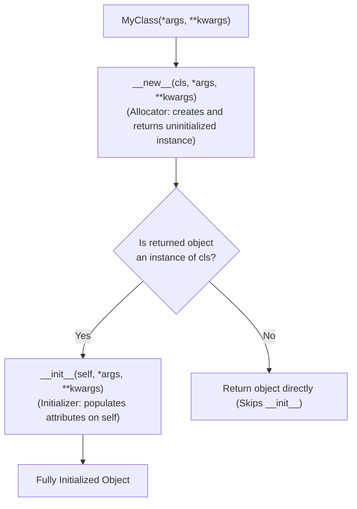
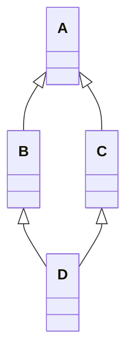
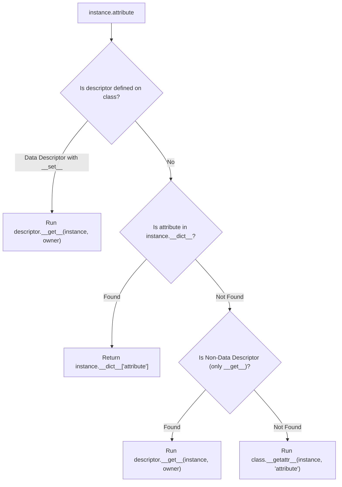

# Chapter 4: Object-Oriented Architecture, Dunders & Metaprogramming

> **Core Learning Objective:** Master Python's object model at the deepest level. Understand instance allocation via `__new__`, C3 Linearization (MRO), the Descriptor Protocol that powers `@property` and ORMs, and how to harness Metaclasses to intercept and transform class definitions.

---

## 1. Object Construction: `__new__` vs `__init__`

> **Zero-Prerequisite Intuition: The "Carpenter vs. Interior Decorator" Metaphor**
> Most developers believe `__init__` creates the object. It does not—it only decorates it!
> * **`__new__` is the Carpenter:** Its job is to go into the empty warehouse (heap memory), saw the raw wood, assemble the frame, and physically construct the table (`PyObject`). Without the carpenter, there is literally no physical object in existence.
> * **`__init__` is the Interior Decorator:** Once the carpenter finishes and hands over the bare wooden table (`self`), the decorator arrives with paint, tablecloths, and silverware (`self.name = "DiningTable"`). If the decorator never shows up, the table still physically exists—it is just bare and unpainted!

Most developers believe `__init__` is Python's constructor. It is **not**—it is only an initializer.



### The CPython Mechanics
1. **`__new__(cls, ...)`**: A static method responsible for allocating memory and returning the raw instance. It must return an instance of `cls` for `__init__` to be invoked.
2. **`__init__(self, ...)`**: Receives the newly created `self` instance to attach fields.

### Pattern: Implementing a True Singleton via `__new__`
```python
class DatabaseConnection:
    _instance = None # Class-level singleton storage

    def __new__(cls, *args, **kwargs):
        if cls._instance is None:
            # Delegate to super().__new__ to allocate the raw PyObject
            cls._instance = super().__new__(cls)
            cls._instance._initialized = False
        return cls._instance

    def __init__(self, connection_string: str = "postgresql://localhost:5432"):
        # Prevent re-initialization on subsequent calls
        if not self._initialized:
            self.connection_string = connection_string
            self._initialized = True

db1 = DatabaseConnection("db1.prod")
db2 = DatabaseConnection("db2.prod")

print(f"Is identical instance? {db1 is db2}") # True
print(f"Connection string: {db2.connection_string}") # postgresql://localhost:5432
```

---

## 2. Multiple Inheritance & the C3 Linearization Algorithm (MRO)

Python supports multiple inheritance, resolving the classic **Diamond Problem** using the **C3 Linearization Algorithm** to produce a deterministic **Method Resolution Order (MRO)**.



### How `super()` Actually Operates
`super()` does **not** simply call the parent class in the source code; it calls the **next class in the runtime caller's MRO chain**.

```python
class Root:
    def execute(self):
        print("Root executed")

class ServiceA(Root):
    def execute(self):
        print("ServiceA starting")
        super().execute()
        print("ServiceA finished")

class ServiceB(Root):
    def execute(self):
        print("ServiceB starting")
        super().execute()
        print("ServiceB finished")

class CompositeService(ServiceA, ServiceB):
    def execute(self):
        print("CompositeService starting")
        super().execute()
        print("CompositeService finished")

service = CompositeService()
service.execute()

print("\nMethod Resolution Order (MRO):")
for idx, cls in enumerate(CompositeService.__mro__):
    print(f"{idx}: {cls.__name__}")
```
*Output:*
```text
CompositeService starting
ServiceA starting
ServiceB starting
Root executed
ServiceB finished
ServiceA finished
CompositeService finished

Method Resolution Order (MRO):
0: CompositeService
1: ServiceA
2: ServiceB
3: Root
4: object
```
> [!IMPORTANT]
> Notice that `ServiceA.execute()` calls `super().execute()`, which transfers control to `ServiceB`! In isolation, `ServiceA` does not inherit from `ServiceB`. This cooperative call chain works solely because `CompositeService` linearized both into its MRO.

---

## 3. Magic (Dunder) Methods: Emulating Core Language Protocols

Dunder ("double underscore") methods allow user-defined classes to hook into Python's native operators and protocols.

### 1. Attribute Access Hooks: `__getattr__` vs `__getattribute__`
* **`__getattribute__(self, name)`**: Intercepts **every single attribute lookup**, even if the attribute exists in `self.__dict__`. (Danger: Calling `self.x` inside it causes infinite recursion!).
* **`__getattr__(self, name)`**: Fallback hook invoked **only when the attribute cannot be found** via normal lookup.

```python
class DynamicConfig:
    def __init__(self, data: dict):
        # Store in internal dictionary
        object.__setattr__(self, "_data", data)

    def __getattr__(self, name: str):
        # Only triggered if 'name' is not an existing attribute
        if name in self._data:
            return self._data[name]
        raise AttributeError(f"Configuration key '{name}' does not exist.")

    def __setattr__(self, name: str, value):
        # Intercept setting values
        if name == "_data":
            super().__setattr__(name, value)
        else:
            self._data[name] = value

config = DynamicConfig({"db_host": "10.0.0.1", "db_port": 5432})
print(config.db_host) # 10.0.0.1 (Served via __getattr__)
config.db_timeout = 30 # Stored in _data via __setattr__
print(config.db_timeout) # 30
```

### 2. Context Manager Protocol: `__enter__` and `__exit__`
```python
class ManagedTransaction:
    def __init__(self, name: str):
        self.name = name

    def __enter__(self):
        print(f"[{self.name}] Beginning database transaction...")
        return self

    def __exit__(self, exc_type, exc_val, exc_tb):
        if exc_type is not None:
            print(f"[{self.name}] Transaction failed with {exc_type.__name__}: {exc_val}. Rolling back!")
            return False # Re-raise exception
        print(f"[{self.name}] Transaction committed successfully.")
        return True

with ManagedTransaction("UserCheckout"):
    print("Executing ledger payment update...")
```

---

## 4. The Descriptor Protocol: The Engine of Python

Descriptors are the underlying mechanism powering `@property`, `@classmethod`, `@staticmethod`, and every major ORM (SQLAlchemy, Django ORM, Pydantic).

A descriptor is any class that implements at least one of:
* `__get__(self, instance, owner)`
* `__set__(self, instance, value)`
* `__delete__(self, instance)`



### Real-World Production Descriptor: Type-Checked ORM Fields
```python
class IntegerField:
    """Descriptor that enforces integer types and boundary validations."""
    def __init__(self, min_value: int = None, max_value: int = None):
        self.min_value = min_value
        self.max_value = max_value

    def __set_name__(self, owner, name):
        # Automatically captures the variable name on the owner class (Python 3.6+)
        self.private_name = f"_{name}"

    def __get__(self, instance, owner):
        if instance is None:
            return self # Accessed from class (e.g., User.age)
        return getattr(instance, self.private_name, None)

    def __set__(self, instance, value):
        if not isinstance(value, int):
            raise TypeError(f"Attribute '{self.private_name[1:]}' must be an int, got {type(value).__name__}")
        if self.min_value is not None and value < self.min_value:
            raise ValueError(f"Attribute '{self.private_name[1:]}' cannot be less than {self.min_value}")
        if self.max_value is not None and value > self.max_value:
            raise ValueError(f"Attribute '{self.private_name[1:]}' cannot be greater than {self.max_value}")
        setattr(instance, self.private_name, value)

class Employee:
    age = IntegerField(min_value=18, max_value=70)
    salary = IntegerField(min_value=0)

    def __init__(self, name: str, age: int, salary: int):
        self.name = name
        self.age = age
        self.salary = salary

emp = Employee("Alice", 28, 95_000)
print(f"{emp.name} is {emp.age} years old.")

try:
    emp.age = 15 # Triggers descriptor validation
except ValueError as err:
    print(f"Validation intercepted: {err}")
```

---

## 5. Metaclasses: The Classes of Classes

> **Zero-Prerequisite Intuition: The "Cookie Cutter Factory" Metaphor**
> What is a Metaclass?
> Think of an individual object (like `emp = Employee("Alice")`) as a **cookie**.
> The class `Employee` is the **cookie cutter** that shapes the cookie.
> But where did the cookie cutter come from? Someone had to manufacture that metal cookie cutter in a machine tool shop!
> A **Metaclass** is the **factory that manufactures cookie cutters**.
> * Metaclass = Factory forging the class blueprints (`type`).
> * Class = The blueprint / cookie cutter stamping out instances (`Employee`).
> * Instance = The cookie (`emp`).
> By writing a custom Metaclass, you can inspect, modify, or enforce strict rules on the cookie cutter *before* anyone bakes a single cookie (e.g. automatically verifying that every database model has a primary key, or registering API routes dynamically!).

In Python:
* An object is an instance of a **Class**.
* A Class is an instance of a **Metaclass** (`type`).

```python
class MyClass:
    pass

print(type(MyClass))             # <class 'type'>
print(isinstance(MyClass, type)) # True
```

### Dynamic Class Creation with `type()`
The 3-argument form of `type(name, bases, dict)` creates classes at runtime:
```python
def speak_func(self):
    return f"Hello, I am {self.name}"

# Equivalent to 'class Robot:'
Robot = type(
    "Robot",                     # Class Name
    (object,),                   # Base Classes (tuple)
    {"name": "Optimus", "speak": speak_func} # Class Attributes / Methods
)

bot = Robot()
print(bot.speak()) # 'Hello, I am Optimus'
```

### Production Metaclass: Auto-Registering API Handlers
Metaclasses allow you to intercept the creation of classes, enforce invariants, or register them in central plugin registries before the class is ever instantiated:

```python
HANDLERS_REGISTRY = {}

class HandlerMeta(type):
    def __new__(mcs, name, bases, namespace):
        # Create the class object
        cls = super().__new__(mcs, name, bases, namespace)
        
        # Skip registration for the abstract base class
        if name != "BaseHandler":
            route = namespace.get("route")
            if not route:
                raise TypeError(f"Class '{name}' must define a non-empty 'route' attribute.")
            
            if route in HANDLERS_REGISTRY:
                raise ValueError(f"Route conflict: '{route}' is already registered by {HANDLERS_REGISTRY[route].__name__}")
                
            HANDLERS_REGISTRY[route] = cls
            print(f"[Registry] Successfully registered route '{route}' -> {name}")
            
        return cls

class BaseHandler(metaclass=HandlerMeta):
    route: str = None
    def handle(self, request):
        raise NotImplementedError

class UserHandler(BaseHandler):
    route = "/api/v1/users"
    def handle(self, request):
        return {"users": ["Alice", "Bob"]}

class PaymentHandler(BaseHandler):
    route = "/api/v1/payments"
    def handle(self, request):
        return {"status": "ok"}

print("\nFinal Handler Registry:")
for path, handler_class in HANDLERS_REGISTRY.items():
    print(f"Route: {path:<20} Class: {handler_class.__name__}")
```

---

## Practice Drills & Interview Verifications

### Drill 1: Thread-Safe Singleton Metaclass
*Question:* Implement a generic `SingletonMeta` metaclass that ensures any class declaring `metaclass=SingletonMeta` can only ever be instantiated once, even across concurrent threads.

```python
import threading

class SingletonMeta(type):
    _instances = {}
    _lock = threading.Lock()

    def __call__(cls, *args, **kwargs):
        # Double-checked locking pattern for high-performance thread safety
        if cls not in cls._instances:
            with cls._lock:
                if cls not in cls._instances:
                    # super().__call__ invokes cls.__new__ followed by cls.__init__
                    instance = super().__call__(*args, **kwargs)
                    cls._instances[cls] = instance
        return cls._instances[cls]

class AppConfiguration(metaclass=SingletonMeta):
    def __init__(self):
        self.env = "production"

cfg1 = AppConfiguration()
cfg2 = AppConfiguration()
assert cfg1 is cfg2
print("Thread-Safe Singleton Metaclass verified!")
```


## Exercises

Three graded exercises for this chapter (two coding, one debugging) with hidden tests:

```bash
python exercises/run.py --init   # once: creates exercises/ch04.py stubs
python exercises/run.py 04       # run the hidden tests against your solution
```

Attempt first; the reference solutions are in `exercises/_answers/ch04.py`.


## Further Reading

- [The Python 2.3 Method Resolution Order (C3)](https://docs.python.org/3/howto/mro.html)
- [Descriptor how-to guide](https://docs.python.org/3/howto/descriptor.html)
- [Data model: special method names](https://docs.python.org/3/reference/datamodel.html#special-method-names)


---

## Check Yourself

Answer in your head or on paper first, then open each answer.

<details>
<summary><strong>1.</strong> What is the MRO and which algorithm computes it?</summary>

Method Resolution Order: the linearised class lookup order, computed by C3 linearisation. Inspect it with `Class.__mro__`.

</details>

<details>
<summary><strong>2.</strong> How do `__new__` and `__init__` differ?</summary>

`__new__` creates and returns the instance (it is a static method on the class); `__init__` initialises the already-created instance. Override `__new__` for immutable types or singletons.

</details>

<details>
<summary><strong>3.</strong> What does `super()` do in multiple inheritance?</summary>

It returns a proxy that delegates to the next class in the instance's MRO (not necessarily the parent), which is what makes cooperative multiple inheritance work.

</details>

<details>
<summary><strong>4.</strong> What is a descriptor?</summary>

An object with `__get__` (and optionally `__set__`/`__delete__`) stored on a class; attribute access on instances calls these methods. Properties, methods and `__slots__` members are descriptors.

</details>
