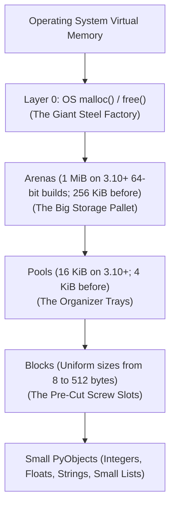
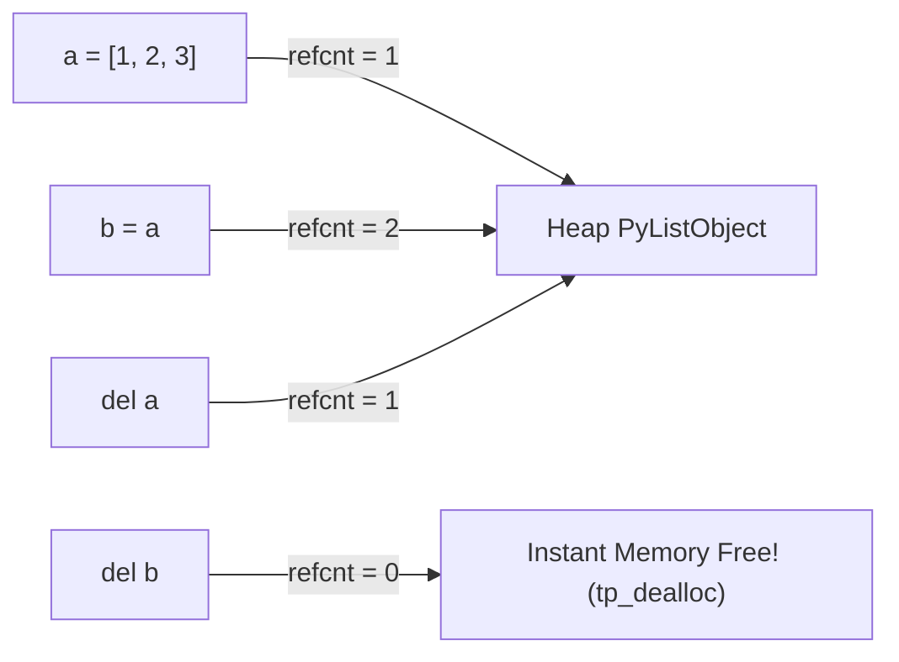
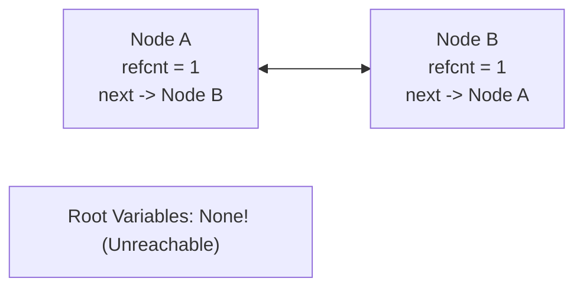
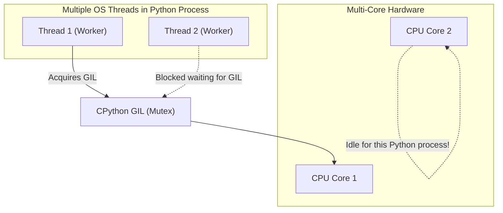

# Chapter 5: Memory Management, CPython Internals, GIL & Garbage Collection

> **Core Learning Objective:** Uncover the deepest runtime systems of CPython. Understand PyMalloc pools and arenas, the mechanics of reference counting, the cyclical generational garbage collector, the Global Interpreter Lock (GIL), and how to optimize memory using `__slots__` and `weakref`.

---

## 1. The CPython Memory Architecture: PyMalloc

> **Zero-Prerequisite Intuition: The "Hardware Store Organizer Tray" Metaphor**
> What is memory allocation, and why does Python need "PyMalloc"?
> 
> Imagine you are building a small wooden birdhouse, and you need a single 1-inch metal screw.
> If you had to call a steel factory, rent a 16-wheeler semi-truck, drive 50 miles, and haul one screw back, your birdhouse would take 3 weeks to build! 
> (In computer terms, calling the Operating System kernel via `malloc()` to request 16 bytes is like driving that semi-truck: it is slow, heavy, and wasteful).
> 
> What do you do instead? 
> You go to your local hardware store once, buy a plastic **Compartment Tray (A Pool)** with 100 tiny pre-divided slots (the **Blocks**), and put it right on your workbench.
> When you need a screw, you reach into the tray and grab one in **0.001 seconds**!
> 
> That is **PyMalloc**: Python asks the operating system for a large chunk of memory once (**An Arena**), carves it into neat little organizer trays (**Pools**), and hands you pre-cut slots (**Blocks**) for your numbers and strings without bothering the OS kernel!

Python does not call the operating system's `malloc()` directly for every object creation. Doing so would cause catastrophic OS context switching and heap fragmentation. Instead, CPython implements a hierarchical allocator called **PyMalloc** for small objects ($\le 512$ bytes).



### Hierarchy Breakdown:
1. **Arenas (256 KB):** Continuous blocks of virtual memory requested directly from the OS via `malloc()`.
2. **Pools (4 KB):** Each Arena is carved into 64 Pools of 4 KB each. Each pool is dedicated to objects of a *single specific size class* (e.g. 16-byte blocks, 32-byte blocks).
3. **Blocks (8 to 512 bytes):** Slices inside a pool. For example, a 32-byte pool only allocates 32-byte blocks.

> [!NOTE]
> For objects larger than 512 bytes, PyMalloc steps aside and delegates directly to the standard system `malloc()`.

---

## 2. Reference Counting: The Primary Reclaimer

CPython's first and immediate line of defense for memory reclamation is **Deterministic Reference Counting**.



### Reference Increments & Decrements
* **Incremented when:** An object is assigned to a name, passed to a function, stored in a container (list, dict), or referenced by another object.
* **Decremented when:** A variable name falls out of scope, a container is cleared, an object is reassigned, or `del variable` is executed.
* **Instant Deallocation:** The exact microsecond an object's `ob_refcnt` hits `0`, its type-specific deallocator (`tp_dealloc`) is invoked and its memory is immediately recycled.

### The Achilles' Heel: Cyclical References
Reference counting cannot detect **isolated cycles**—where objects reference each other, maintaining a non-zero reference count even though they are completely unreachable from any program root:



---

## 3. The Generational Cyclical Garbage Collector

To prevent memory leaks from reference cycles, CPython layers a secondary background system: the **Cyclical Garbage Collector** (`gc` module).

### The Three Generations Heuristic
The collector relies on the empirical observation known as the **Weak Generational Hypothesis**: *Most objects are short-lived and die shortly after creation.*

CPython groups all container objects (`list`, `dict`, `set`, `tuple`, custom class instances) into 3 generations:
* **Generation 0 (Youngest):** Newly allocated containers. Collected frequently (default: every 700 net allocations).
* **Generation 1 (Intermediate):** Surviving objects promoted from Generation 0.
* **Generation 2 (Oldest / Long-lived):** Surviving objects promoted from Generation 1. Collected rarely.

```python
import gc

# Inspect GC thresholds: (threshold0, threshold1, threshold2)
print("GC Thresholds:", gc.get_threshold()) # (700, 10, 10)
print("GC Counts before run:", gc.get_count())
```

### The Cycle Detection Algorithm
How does the GC identify unreachable cycles without walking the entire heap?
1. **Track containers:** All mutable containers maintain doubly-linked list pointers inside their GC header (`PyGC_Head`).
2. **Copy reference counts:** For every container in the generation, the GC makes a copy of its reference count (`gc_refs`).
3. **Simulate dereferencing:** The GC iterates through each container and decrements `gc_refs` for all child objects it references.
4. **Isolate unreachable groups:** Any container whose `gc_refs` drops to `0` was only referenced from within the cyclical group itself! If no reference remains from an external root, the entire cluster is declared garbage and destroyed.

---

## 4. Preventing Leaks with Weak References

A **weak reference** (`weakref` module) allows you to reference an object without incrementing its `ob_refcnt`. If only weak references remain, the object is reclaimed immediately.

```python
import weakref

class CacheNode:
    def __init__(self, key: str):
        self.key = key
    def __repr__(self):
        return f"CacheNode({self.key})"

obj = CacheNode("Session_9921")
# Create weak reference
ref = weakref.ref(obj)

print("Referenced object:", ref()) # CacheNode(Session_9921)
del obj # Delete strong reference

print("After deleting strong ref:", ref()) # None (Automatically cleared!)
```

### `weakref.WeakValueDictionary`
Ideal for building high-performance caches where entries should automatically vanish when no other part of the system is using them:
```python
import weakref

class ImageResource:
    def __init__(self, name: str):
        self.name = name

image_cache = weakref.WeakValueDictionary()

img1 = ImageResource("hero_banner.png")
image_cache["hero"] = img1
print("Cache keys:", list(image_cache.keys())) # ['hero']

del img1 # Strong reference discarded
print("Cache keys after dereference:", list(image_cache.keys())) # [] (Evicted automatically!)
```

---

## 5. The Global Interpreter Lock (GIL) Demystified

> **Zero-Prerequisite Intuition: The "Single Microphone in an 8-Person Meeting" Metaphor**
> What is the GIL, and why doesn't adding 8 CPU cores make Python's mathematical calculations 8x faster?
> 
> Imagine a conference meeting room with **8 brilliant engineers** sitting around the table (your computer's 8 CPU cores).
> Each engineer has their own notebook and is ready to do math at lightning speed.
> 
> But the room has one strict rule: **There is only ONE physical microphone in the room (The GIL)**.
> * Whoever holds the microphone is allowed to speak (execute Python code).
> * The other 7 engineers must sit silently with their hands folded, waiting for the microphone to be passed to them!
> 
> Why does this microphone exist?
> Because if three engineers try to update the reference counter on the exact same storage tray object at the exact same microsecond without asking, they will corrupt the counter and crash the entire system.
> CPython's simple, historical solution was to introduce **one big global lock (the GIL)** that ensures only one thread executes Python bytecode at any given moment.

The **Global Interpreter Lock (GIL)** is a mutual-exclusion lock (mutex) used by CPython to synchronize thread access to internal interpreter state and prevent race conditions on `ob_refcnt`.



### Why the GIL Exists
In CPython, if two threads concurrently modified `ob_refcnt` of a shared object without synchronization:
* Memory leaks would occur if counts failed to decrement.
* Catastrophic crashes (segmentation faults / use-after-free) would occur if an object was deallocated prematurely.
* Using atomic CPU instructions or fine-grained locks on every single pointer operation causes a severe 30-50% slowdown for single-threaded applications. The GIL was the pragmatic design choice for raw single-threaded performance.

### When Does Multithreading Actually Help?
* **CPU-Bound Tasks (Math, Image processing, Compression):** Threads do **not** run in parallel across CPU cores. They contend for the GIL and execute *slower* than single-threaded code due to lock context-switching overhead.
* **I/O-Bound Tasks (Network HTTP requests, Database queries, Disk I/O):** Threads are **highly effective**! Whenever a thread executes an I/O system call or `time.sleep()`, CPython **explicitly releases the GIL**, allowing other threads to run concurrently on the CPU while the first thread waits for the network.

---

## 6. Massive Memory Optimization: `__slots__`

By default, every Python instance stores its attributes in an internal dictionary (`self.__dict__`). A dictionary has substantial overhead (indices array, entries array, hash keys).

By declaring `__slots__`, you instruct CPython to discard `__dict__` and instead reserve a **fixed, static C array of pointers** directly inside the instance struct:

```python
import sys

class StandardPoint:
    def __init__(self, x: float, y: float):
        self.x = x
        self.y = y

class SlottedPoint:
    __slots__ = ('x', 'y') # Allocates direct C struct offset pointers
    def __init__(self, x: float, y: float):
        self.x = x
        self.y = y

p_std = StandardPoint(1.0, 2.0)
p_slot = SlottedPoint(1.0, 2.0)

print(f"Standard instance size: {sys.getsizeof(p_std)} bytes + dict size: {sys.getsizeof(p_std.__dict__)} bytes")
print(f"Slotted instance size:  {sys.getsizeof(p_slot)} bytes (Has no __dict__!)")
```
*Memory Impact in Scale Systems:*
**Measured, not remembered.** Run [`labs/04_measure_memory_claims.py`](labs/04_measure_memory_claims.py) on your interpreter. On CPython 3.11.9 (64-bit Windows), two `float` attributes per object, including the two float objects themselves:

| Class | Bytes per instance (measured) |
|---|---|
| `StandardPoint` (with `__dict__`) | about 144 |
| `SlottedPoint` (`__slots__`) | about 104 (**about 28% smaller**) |

Scaled to 10 million instances that is roughly 1.4 GB versus 1.0 GB. The saving is real but **version-dependent** and smaller than the old "70%" folklore: CPython 3.11+ stores instance attributes inline and shares key tables between instances of the same class, which shrank the cost of `__dict__`. The saving grows with the number of attributes and is largest when the values themselves are small or shared (ints, interned strings). Always measure on your version before promising a number.

---

## Version Notes (what changed in CPython, and what to check on your version)

| Topic | What to know |
|---|---|
| `pymalloc` sizes | 64-bit builds since 3.10 use **1 MiB arenas and 16 KiB pools** (earlier: 256 KiB and 4 KiB). Check `sys._debugmallocstats()`. |
| GC thresholds | Default `gc.get_threshold()` is `(700, 10, 10)` on 3.11. The collector has been reworked in newer releases (3.14 introduces an incremental collector), so treat numbers as version-specific and print them on your interpreter. |
| The GIL | Python 3.13 added an **experimental free-threaded build** (PEP 703, no GIL, `python3.13t`); it is officially supported (but optional) from 3.14 (PEP 779). Single-thread speed and C-extension compatibility are the trade-offs. Detect it with `sys._is_gil_enabled()`. |
| Subinterpreters | 3.12 gave each subinterpreter its **own GIL** (PEP 684); 3.14 exposes a high-level API (PEP 734, `concurrent.interpreters`), a third way to use multiple cores besides threads (free-threaded) and processes. |
| JIT | 3.13 ships an **experimental copy-and-patch JIT** (PEP 744), off by default. |

---

## Practice Drills & Interview Verifications

### Drill 1: Tracing Memory Leaks with `tracemalloc`
How do you programmatically detect memory leaks in a running Python application?

```python
import tracemalloc

def simulate_leak():
    leaky_accumulator = []
    for i in range(10_000):
        leaky_accumulator.append(f"Payload_{i}_" * 10)
    return "Done"

# Start memory tracer
tracemalloc.start()

snapshot1 = tracemalloc.take_snapshot()
simulate_leak()
snapshot2 = tracemalloc.take_snapshot()

top_stats = snapshot2.compare_to(snapshot1, 'lineno')

print("[Top Memory Consuming Lines]")
for stat in top_stats[:3]:
    print(stat)

tracemalloc.stop()
```
*Output clearly pinpoints the exact file and line number generating net memory increases!*


## Further Reading

- [gc module](https://docs.python.org/3/library/gc.html)
- [PEP 703: making the GIL optional](https://peps.python.org/pep-0703/)
- [PEP 779: free-threaded Python support criteria](https://peps.python.org/pep-0779/)


---

## Check Yourself

Answer in your head or on paper first, then open each answer.

<details>
<summary><strong>1.</strong> What are the two mechanisms CPython uses to reclaim memory?</summary>

Reference counting (immediate, handles most objects) plus a cyclic garbage collector for reference cycles.

</details>

<details>
<summary><strong>2.</strong> Why can a free-threaded (no-GIL) build be slower for single-threaded code?</summary>

It needs atomic or biased reference counting and finer-grained locking, which add overhead per operation; the benefit appears when threads run CPU-bound Python code in parallel.

</details>

<details>
<summary><strong>3.</strong> What does `weakref` solve?</summary>

It references an object without increasing its reference count, so caches and observer lists do not keep objects alive or create cycles.

</details>

<details>
<summary><strong>4.</strong> Run `labs/04_measure_memory_claims.py`: why is the `__slots__` saving smaller than older articles claim?</summary>

CPython 3.11+ stores instance attributes inline and shares key tables, shrinking `__dict__` overhead; the measured saving on small objects is tens of percent, not 70%.

</details>
