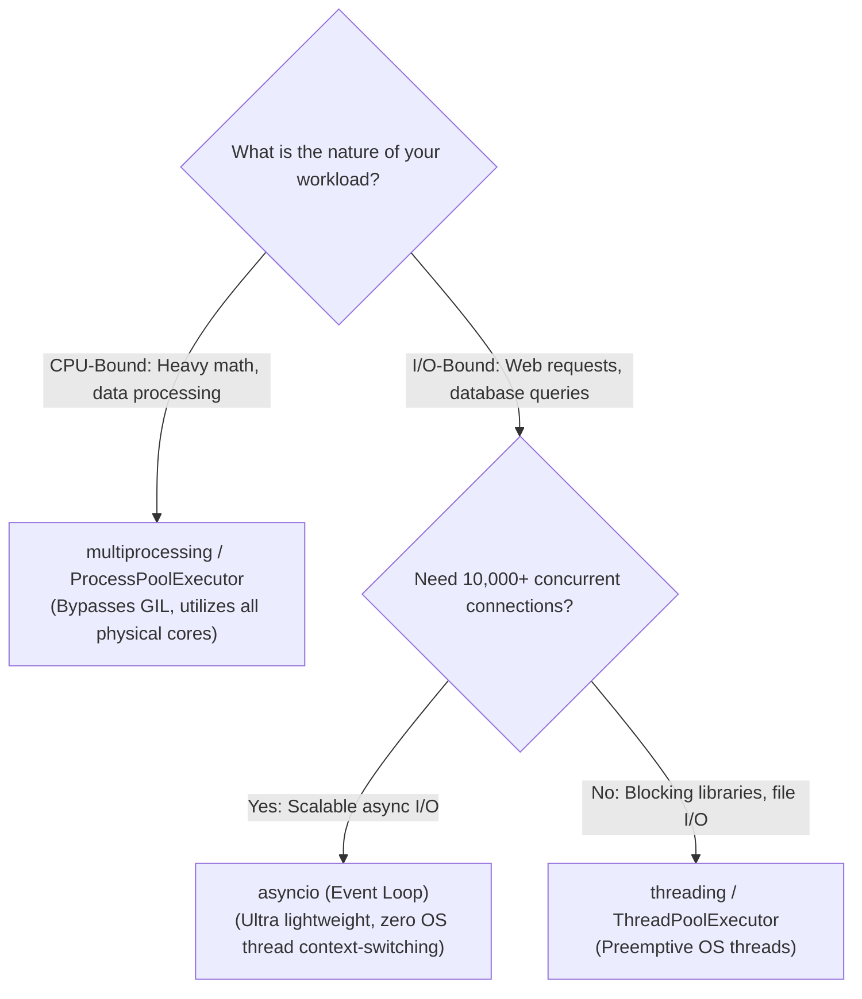
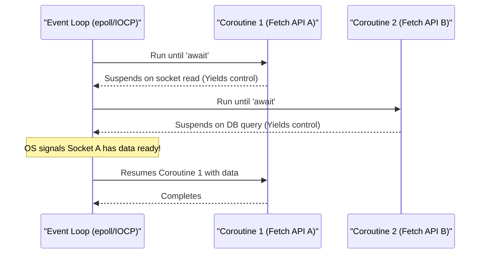
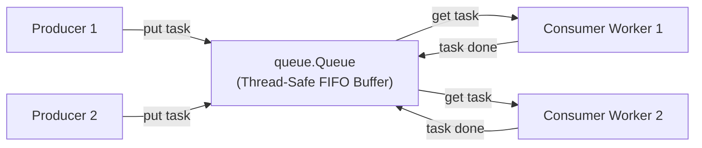

# Chapter 6: Concurrency Mastery: Asyncio, Threading & Multiprocessing

> **Core Learning Objective:** Master the three fundamental paradigms of concurrency in Python. Understand OS threads and lock contention, cooperative single-threaded asynchronous I/O via the event loop, and true multi-core parallel processing with Inter-Process Communication (IPC).

---

## 1. The Concurrency Landscape: Choosing the Right Engine

> **Zero-Prerequisite Intuition: The "Single Master Chef vs. Multiple Kitchens" Metaphor**
> What is the intuitive difference between `asyncio`, `threading`, and `multiprocessing`?
> * **`asyncio` is One Master Chef in One Kitchen:** The chef puts pasta in a pot to boil. Instead of standing there staring at the boiling water for 10 minutes (blocking), the chef immediately turns around to dice carrots and chop onions. When the kitchen timer rings (`await`), the chef pivots back to drain the pasta. One person handles enormous volumes of orders because they never waste time standing idle! *(Best for 10,000+ network requests and database queries).*
> * **`threading` is Three Cooks in One Kitchen with ONE Spoon (The GIL):** You hire three cooks in a single kitchen, but company policy says only ONE cook may hold the wooden spoon at any instant. Cook 1 stirs for a second, the manager shouts "Time's up!", and Cook 2 grabs the spoon. They waste substantial energy bumping into each other and negotiating who gets the spoon next. *(Best for blocking legacy I/O libraries).*
> * **`multiprocessing` is Building Three Completely Separate Kitchens:** Each kitchen has its own chef, its own pantry, its own stove, and its own spoons. They can roast three whole turkeys completely in parallel at maximum physical speed without ever blocking each other. *(Best for heavy math, image crunching, and ML workloads).*

| Concurrency Model | Module | Best Suited For | Concurrency Mechanism | CPU Cores Utilized | Communication Cost |
| :--- | :--- | :--- | :--- | :--- | :--- |
| **Cooperative Coroutines** | `asyncio` | High-volume network I/O (10,000+ concurrent sockets, WebSockets, microservices) | Single-threaded event loop multiplexing non-blocking I/O (`epoll` / `IOCP`) | 1 Core | Near zero (Shared heap) |
| **Preemptive Threads** | `threading` | I/O-bound tasks with blocking legacy libraries, file operations, small thread counts | OS-level threads scheduled by OS kernel (GIL held during execution) | 1 Core (at a time) | Low (Shared heap with lock synchronization) |
| **Parallel Processes** | `multiprocessing` | CPU-intensive computing (machine learning, data processing, crypto hashing) | Separate OS processes, each with its own independent Python interpreter and GIL | All Available Cores | High (Requires IPC / pickling serialization) |



---

## 2. Asynchronous I/O with `asyncio` Under the Hood

`asyncio` does not create operating system threads. It executes on a **single OS thread** powered by an **Event Loop**.



### The Three Pillars of `asyncio`:
1. **Coroutine Function (`async def`):** Calling it does *not* execute code immediately; it instantiates a coroutine object.
2. **`await` keyword:** Yields execution back to the event loop until the awaited `Future` resolves.
3. **`asyncio.Task`:** Wraps a coroutine into a background schedule on the event loop via `asyncio.create_task()`.

### Modern Structured Concurrency with `asyncio.TaskGroup` (Python 3.11+)
Prior to Python 3.11, developers used `asyncio.gather()`, which lacked robust error isolation. If one task crashed, sibling tasks were orphaned. Modern Python provides `TaskGroup`:

```python
import asyncio
import time

async def fetch_service(name: str, delay: float):
    print(f"[{time.strftime('%X')}] Starting fetch: {name}")
    await asyncio.sleep(delay) # Non-blocking sleep: yields control
    print(f"[{time.strftime('%X')}] Finished fetch: {name}")
    return f"{name}_data"

async def main():
    start_time = time.perf_counter()
    
    # Structured concurrency block: guarantees all child tasks finish or abort cleanly
    async with asyncio.TaskGroup() as tg:
        task1 = tg.create_task(fetch_service("AuthenticationService", 1.0))
        task2 = tg.create_task(fetch_service("ProductCatalogService", 1.5))
        task3 = tg.create_task(fetch_service("InventoryService", 0.5))

    # All tasks guaranteed completed here
    print(f"Results: {[task1.result(), task2.result(), task3.result()]}")
    print(f"Total elapsed: {time.perf_counter() - start_time:.2f}s (Concurrent speed!)")

# Run event loop
asyncio.run(main())
```

### Controlling Rate & Concurrency: `asyncio.Semaphore`
When querying external APIs, unbounded concurrency will trigger rate limits or exhaust socket file descriptors:

```python
import asyncio

async def bounded_worker(semaphore: asyncio.Semaphore, item_id: int):
    async with semaphore: # Limits active concurrent slots
        print(f"Processing item {item_id}...")
        await asyncio.sleep(0.5)
        return item_id * 10

async def batch_process():
    sem = asyncio.Semaphore(3) # Max 3 concurrent operations
    async with asyncio.TaskGroup() as tg:
        tasks = [tg.create_task(bounded_worker(sem, i)) for i in range(9)]
    return [t.result() for t in tasks]

results = asyncio.run(batch_process())
print("Batch results:", results)
```

---

## 3. Preemptive Threading: Synchronization & Race Conditions

When multiple OS threads access shared mutable objects, non-atomic operations lead to catastrophic **Race Conditions**.

```python
import threading
import time

counter = 0

def unsafe_worker():
    global counter
    for _ in range(100_000):
        # NOT ATOMIC! Translates to 4 distinct bytecode instructions:
        # LOAD_GLOBAL, LOAD_CONST, BINARY_OP (+), STORE_GLOBAL
        # An OS thread switch between LOAD and STORE causes lost updates!
        counter += 1

threads = [threading.Thread(target=unsafe_worker) for _ in range(5)]
for t in threads: t.start()
for t in threads: t.join()

print(f"Expected 500,000, but got: {counter} (Race Condition Bug!)")
```

### Essential Thread Synchronization Primitives

#### 1. Mutual Exclusion: `threading.Lock`
```python
lock = threading.Lock()
safe_counter = 0

def safe_worker():
    global safe_counter
    for _ in range(100_000):
        with lock: # Guarantees atomic update block
            safe_counter += 1
```

#### 2. Reentrant Lock: `threading.RLock`
A standard `Lock` cannot be acquired twice by the same thread—attempting to do so causes an immediate **deadlock**. An `RLock` tracks ownership and allows the owning thread to acquire it multiple times recursively:
```python
import threading

class Account:
    def __init__(self, balance: int):
        self.balance = balance
        self.lock = threading.RLock()

    def withdraw(self, amount: int):
        with self.lock:
            self.balance -= amount

    def transfer(self, target_account, amount: int):
        with self.lock: # First acquisition
            self.withdraw(amount) # Second acquisition inside same thread (Safe with RLock!)
            target_account.balance += amount
```

---

## 4. Multi-Process Parallelism: Bypassing the GIL

To execute compute-intensive code across physical CPU cores, instantiate separate processes using `concurrent.futures.ProcessPoolExecutor`:

```python
from concurrent.futures import ProcessPoolExecutor
import time
import math

def cpu_heavy_hash(n: int) -> int:
    """CPU-bound task calculating prime factor complexity."""
    count = 0
    for i in range(2, n):
        if math.isqrt(i) ** 2 == i:
            count += 1
    return count

if __name__ == "__main__":
    workloads = [5_000_000 + i for i in range(8)]

    # Serial Execution
    t0 = time.perf_counter()
    serial_results = [cpu_heavy_hash(w) for w in workloads]
    t_serial = time.perf_counter() - t0

    # Multi-Core Parallel Execution
    t0 = time.perf_counter()
    with ProcessPoolExecutor() as executor:
        parallel_results = list(executor.map(cpu_heavy_hash, workloads))
    t_parallel = time.perf_counter() - t0

    print(f"Serial Execution Time:   {t_serial:.2f}s")
    print(f"Parallel Execution Time: {t_parallel:.2f}s ({t_serial / t_parallel:.1f}x speedup!)")
```

---

## 5. Enterprise Pattern: Thread-Safe Producer-Consumer Pipeline



```python
import threading
import queue
import time
import random

WORK_QUEUE = queue.Queue(maxsize=10) # Bounded queue prevents memory exhaustion
SHUTDOWN_SIGNAL = object() # Poison Pill sentinel

def producer(producer_id: int):
    for i in range(5):
        item = f"Job_{producer_id}_{i}"
        WORK_QUEUE.put(item) # Blocks if queue is full (Backpressure)
        print(f"[Producer {producer_id}] Emitted: {item}")
        time.sleep(random.uniform(0.1, 0.3))

def consumer(consumer_id: int):
    while True:
        item = WORK_QUEUE.get() # Blocks until item available
        if item is SHUTDOWN_SIGNAL:
            WORK_QUEUE.task_done()
            print(f"[Consumer {consumer_id}] Received shutdown signal. Exiting.")
            break
        
        print(f"  --> [Consumer {consumer_id}] Processing: {item}")
        time.sleep(random.uniform(0.2, 0.4))
        WORK_QUEUE.task_done()

# Launch pipeline
producers = [threading.Thread(target=producer, args=(p,)) for p in range(2)]
consumers = [threading.Thread(target=consumer, args=(c,)) for c in range(3)]

for c in consumers: c.start()
for p in producers: p.start()

# Wait for producers to finish generating work
for p in producers: p.join()

# Wait for all queue items to be marked task_done()
WORK_QUEUE.join()

# Send poison pill to gracefully shut down consumers
for _ in consumers:
    WORK_QUEUE.put(SHUTDOWN_SIGNAL)

for c in consumers: c.join()
print("Pipeline completed all jobs cleanly!")
```


## Further Reading

- [asyncio documentation](https://docs.python.org/3/library/asyncio.html)
- [threading module](https://docs.python.org/3/library/threading.html)
- [concurrent.futures](https://docs.python.org/3/library/concurrent.futures.html)


---

## Check Yourself

Answer in your head or on paper first, then open each answer.

<details>
<summary><strong>1.</strong> For a CPU-bound task on a standard CPython build, threads or processes?</summary>

Processes (`multiprocessing`/`ProcessPoolExecutor`), because the GIL lets only one thread run Python bytecode at a time. Threads suit I/O-bound work.

</details>

<details>
<summary><strong>2.</strong> What does `await` do that a blocking call does not?</summary>

It suspends the current coroutine and returns control to the event loop so other tasks run, then resumes when the awaited operation completes.

</details>

<details>
<summary><strong>3.</strong> Why does a `time.sleep(5)` inside `async def` freeze every other task?</summary>

It blocks the single event-loop thread. Use `await asyncio.sleep(5)` or move blocking work to an executor (`asyncio.to_thread`).

</details>

<details>
<summary><strong>4.</strong> What does `asyncio.TaskGroup` give you over `gather`?</summary>

Structured concurrency: if one task fails the others are cancelled and the errors are raised together as an `ExceptionGroup`, so no task is left running unobserved.

</details>
