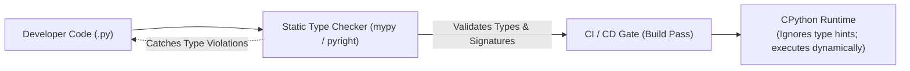
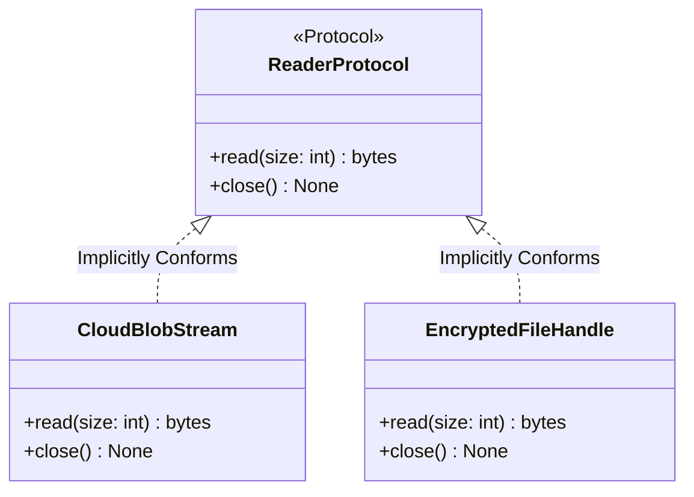

# Chapter 7: Type Systems, Protocols & Modern Python Architecture

> **Core Learning Objective:** Write robust, self-documenting, production-grade Python. Master gradual typing, covariant/contravariant generics, structural subtyping via `typing.Protocol`, Pydantic v2 data validation, and clean architectural separation.

---

## 1. The Modern Python Type System

Python remains a dynamically typed runtime, but large-scale enterprise codebases rely on **Static Type Analysis** (`mypy`, `pyright`) to eliminate entire categories of production bugs before deployment.



### Essential Typing Primitives (Python 3.10+)
```python
from typing import Literal, Annotated
from dataclasses import dataclass

# Modern Union syntax uses the pipe '|' operator instead of Union[X, Y]
def parse_status(code: int | str) -> bool:
    return str(code) == "200"

# Literal restricts values to specific exact constants
Environment = Literal["development", "staging", "production"]

def deploy(env: Environment) -> None:
    print(f"Deploying application to {env} cluster...")

# Annotated allows attaching rich metadata for validation frameworks
PositiveInt = Annotated[int, "Value must be strictly greater than 0"]
```

---

## 2. Generics & Variance: Covariance vs Contravariance

Generics enable you to write reusable algorithms while preserving type safety across diverse data types.

```python
from typing import TypeVar, Generic, Sequence

T = TypeVar("T") # Unconstrained Generic Type

class BoundedStack(Generic[T]):
    def __init__(self, max_capacity: int = 100):
        self._items: list[T] = []
        self._max = max_capacity

    def push(self, item: T) -> None:
        if len(self._items) >= self._max:
            raise OverflowError("Stack is at maximum capacity.")
        self._items.append(item)

    def pop(self) -> T:
        if not self._items:
            raise IndexError("Stack is empty.")
        return self._items.pop()

# Type checker enforces that only integers can be pushed
int_stack: BoundedStack[int] = BoundedStack()
int_stack.push(42)
val: int = int_stack.pop()
```

### Variance Explained: Covariant vs Contravariant
* **Invariant (`TypeVar('T')`):** A `Container[Dog]` is **not** a `Container[Animal]`, even if `Dog` inherits from `Animal`. Prevents adding an `Animal` (like a `Cat`) into a dog container.
* **Covariant (`TypeVar('T_co', covariant=True)`):** Read-only producers. If `Dog` is an `Animal`, then `Sequence[Dog]` can be safely substituted where `Sequence[Animal]` is expected.
* **Contravariant (`TypeVar('T_contra', contravariant=True)`):** Write-only consumers. If `Dog` is an `Animal`, a handler that accepts any `Animal` can safely process a `Dog`.

---

## 3. Structural Subtyping: `typing.Protocol` (Formalized Duck Typing)

In classic OOP, a class must explicitly inherit from an Abstract Base Class (`class SqlDb(DatabaseABC): ...`) to be recognized as satisfying an interface (**Nominal Subtyping**).

**Structural Subtyping (`Protocol`)** decouples implementations: any class that possesses the required methods and attributes automatically satisfies the Protocol, **with zero inheritance needed**:



```python
from typing import Protocol, runtime_checkable

@runtime_checkable
class DocumentStorage(Protocol):
    """Any object with these methods satisfies this protocol."""
    def save(self, doc_id: str, payload: bytes) -> bool: ...
    def retrieve(self, doc_id: str) -> bytes | None: ...

# Independent implementation 1: S3 Storage (No inheritance from DocumentStorage!)
class S3Storage:
    def save(self, doc_id: str, payload: bytes) -> bool:
        print(f"[AWS S3] Uploading {doc_id} ({len(payload)} bytes)")
        return True
        
    def retrieve(self, doc_id: str) -> bytes | None:
        return b"file_contents"

# Independent implementation 2: Redis Storage (No inheritance!)
class RedisStorage:
    def save(self, doc_id: str, payload: bytes) -> bool:
        print(f"[Redis] Setting key {doc_id}")
        return True
        
    def retrieve(self, doc_id: str) -> bytes | None:
        return b"file_contents"

def persist_audit_log(storage: DocumentStorage, log_data: bytes) -> None:
    storage.save("audit_001", log_data)

# Both work seamlessly and pass static type checks!
persist_audit_log(S3Storage(), b"Login event")
persist_audit_log(RedisStorage(), b"Login event")
```

---

## 4. Modern Data Models: Dataclasses vs Pydantic v2

### Python Standard `dataclass` (Best for internal domain models)
```python
from dataclasses import dataclass, field
import uuid
from datetime import datetime, timezone

@dataclass(frozen=True, slots=True) # Immutable + memory-optimized C struct layout
class UserProfile:
    username: str
    email: str
    user_id: str = field(default_factory=lambda: str(uuid.uuid4()))
    created_at: datetime = field(default_factory=lambda: datetime.now(timezone.utc))

profile = UserProfile("alice", "alice@example.com")
print(profile)
```

### Pydantic v2 (Best for network boundaries, JSON APIs, and Agentic AI)
Pydantic v2 is written in Rust (`pydantic-core`). It performs **high-speed runtime data validation, coercion, and serialization**:

```python
from pydantic import BaseModel, Field, EmailStr, field_validator

class UserCreateRequest(BaseModel):
    username: str = Field(min_length=3, max_length=20)
    email: str
    age: int = Field(ge=18, le=100)
    roles: list[str] = Field(default_factory=lambda: ["user"])

    @field_validator("username")
    @classmethod
    def no_whitespace(cls, v: str) -> str:
        if " " in v:
            raise ValueError("Username cannot contain spaces.")
        return v.lower()

# Automatic JSON parsing & validation:
json_payload = '{"username": "DevQueen", "email": "dev@corp.com", "age": 29}'
user = UserCreateRequest.model_validate_json(json_payload)
print(f"Validated Model: {user.username}, Age: {user.age}")
```

---

## 5. Enterprise Exception Hierarchies & Exception Groups

### 1. Unified Exception Trees
Never raise generic `Exception` or `RuntimeError` in production libraries. Define a domain-specific hierarchy:

```python
class AppBaseException(Exception):
    """Root exception for all application errors."""
    def __init__(self, message: str, error_code: str = "INTERNAL_ERROR"):
        super().__init__(message)
        self.error_code = error_code

class DatabaseError(AppBaseException):
    """Database query or connection failure."""

class RecordNotFoundError(DatabaseError):
    """Requested database entity does not exist."""

# Exception Chaining: Preserves root cause debug trace
try:
    raise ConnectionResetError("TCP socket closed by peer")
except ConnectionResetError as root_err:
    raise DatabaseError("Unable to execute query", error_code="DB_UNAVAILABLE") from root_err
```

### 2. Exception Groups & `except*` (Python 3.11+)
When multiple concurrent tasks crash inside `asyncio.TaskGroup`, multiple independent exceptions occur simultaneously. Python handles this with **Exception Groups**:

```python
try:
    raise ExceptionGroup(
        "Multiple background job failures",
        [
            ValueError("Invalid payload format"),
            ConnectionError("DB connection dropped"),
            ValueError("Negative value rejected")
        ]
    )
except* ValueError as eg:
    # Catches all ValueErrors in the group
    print(f"Handled {len(eg.exceptions)} ValueErrors: {eg.exceptions}")
except* ConnectionError as eg:
    # Catches all ConnectionErrors in the group
    print(f"Handled {len(eg.exceptions)} ConnectionErrors: {eg.exceptions}")
```

---

## 6. Production Repository Structure (12-Factor Ready)

```text
my_enterprise_service/
├── pyproject.toml              # Build system, dependencies, tool configs (ruff, mypy, pytest)
├── README.md                   # System documentation & setup guide
├── src/
│   └── my_service/
│       ├── __init__.py
│       ├── domain/             # Pure business logic (Dataclasses, Entities, Protocols)
│       │   ├── models.py
│       │   └── interfaces.py
│       ├── infrastructure/     # Database, Redis, HTTP clients, AWS integrations
│       │   ├── db_repository.py
│       │   └── cache.py
│       └── api/                # Web endpoints (FastAPI / gRPC handlers)
│           └── routes.py
└── tests/
    ├── unit/
    └── integration/
```
