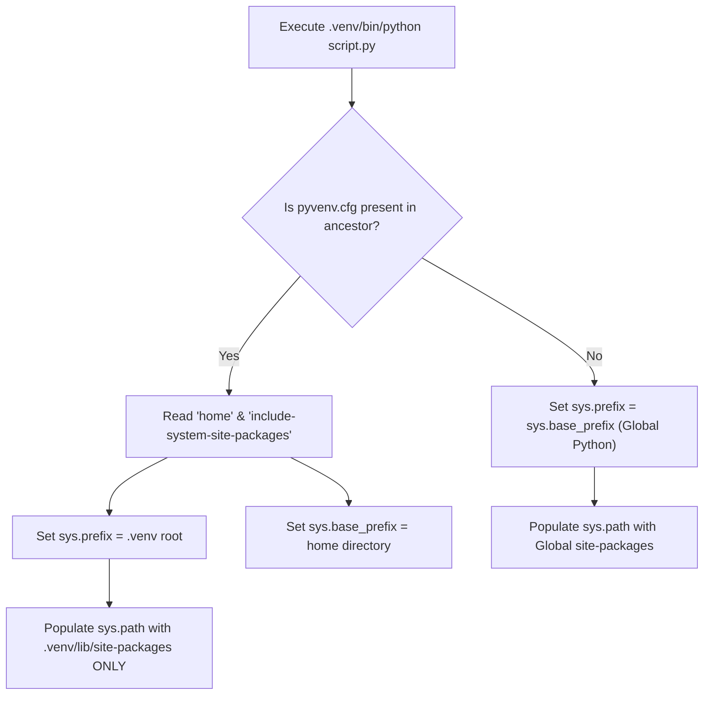
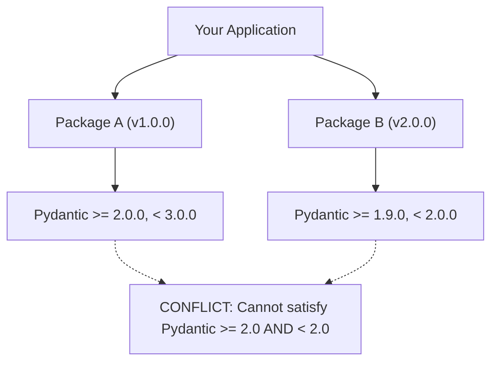
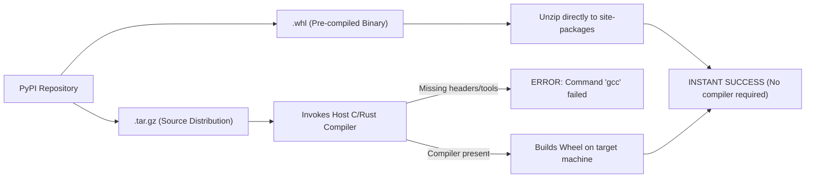

# Chapter 08: Modern Environments, Dependency Hell & Packaging Mastery

> **The Reality of Production Python**
> Most Python tutorials assume an idyllic world where `pip install package` runs smoothly and your script executes cleanly. In real-world enterprise engineering, at least 30% of critical incidents and onboarding friction stem from environment corruption, diamond dependency collisions, C-extension ABI incompatibilities, and operating system discrepancies. 
> 
> This chapter lifts the curtain on Python's runtime environment, package resolution algorithms, and modern packaging standards.

---

## 1. Virtual Environments: What Happens Under the Hood

A virtual environment is not a virtual machine or a Docker container. It is a lightweight, isolated directory tree containing its own Python binary links, standard library pointers, and dedicated `site-packages` directory.

### The Anatomy of a `venv`

When you execute:
```bash
python -m venv .venv
```
Python generates the following file structure:

```
.venv/
├── pyvenv.cfg                  <-- The Master Switch
├── Scripts/ (or bin/ on Unix)
│   ├── python.exe              <-- Trampoline launcher or symlink
│   ├── activate                <-- Shell script updating $PATH
│   └── pip.exe
└── Lib/ (or lib/python3.x/ on Unix)
    └── site-packages/          <-- Isolated third-party library depot
```

### The `pyvenv.cfg` Master Switch

The heart of environment isolation is `pyvenv.cfg`. When the Python executable in `.venv/Scripts/python.exe` is invoked, it checks for a `pyvenv.cfg` in its directory or parent directory:

```ini
home = C:\Users\reddy\AppData\Local\Programs\Python\Python311
include-system-site-packages = false
version = 3.11.9
executable = C:\Users\reddy\AppData\Local\Programs\Python\Python311\python.exe
command = C:\Users\reddy\AppData\Local\Programs\Python\Python311\python.exe -m venv .venv
```



### `sys.path` Resolution Mechanics

When you run `import numpy`, Python evaluates `sys.path` sequentially until the module is resolved. You can inspect this live:

```python
import sys
import pprint

print(f"Current Environment Prefix: {sys.prefix}")
print(f"Base Python Installation:  {sys.base_prefix}")
print("\nModule Search Path Resolution Order:")
pprint.pprint(sys.path)
```

The search sequence is:
1. **The directory containing the script** (or current working directory if interactive).
2. **`PYTHONPATH`** environment variable directories (if set).
3. **Standard library directory** (`<home>/Lib`).
4. **Platform-dependent C-extensions** (`<home>/DLLs` or `<home>/lib-dynload`).
5. **Virtual environment third-party packages** (`<sys.prefix>/Lib/site-packages`).
6. **`.pth` files** located inside `site-packages` (which append additional paths dynamically).

> [!WARNING]
> If a file named `math.py`, `random.py`, or `json.py` exists in your working directory, it will shadow the standard library module because directory `0` in `sys.path` is the current working directory!

---

## 2. Dependency Hell: The Diamond Dependency Trap

Dependency hell occurs when two direct dependencies require incompatible versions of the same transitive dependency.



Python’s import system **does not allow side-by-side versions of the same library in memory**. `sys.modules["pydantic"]` can only point to a single loaded module object.

### Modern Resolvers: Pip vs. Pip-tools vs. Poetry vs. UV

Historical `pip` (pre-2020) used a greedy resolver: it installed whatever version Package A requested first, and when Package B requested a different version, it simply overwrote files in `site-packages`, resulting in silent runtime crashes (`ImportError: cannot import name ...`).

Modern packaging uses **SAT solvers (Boolean Satisfiability)** to find a globally consistent dependency graph:

| Tool | Engine / Model | Lockfile Guarantee | Speed / Performance |
| :--- | :--- | :--- | :--- |
| **`pip` (>= 20.3)** | Backtracking Resolver | None (requires `requirements.txt`) | Moderate (Python-based) |
| **`pip-tools`** | `pip-compile` lock generator | Generates pinned hashes | Fast |
| **`poetry`** | Custom SAT/PubGrub Resolver | Deterministic `poetry.lock` | Slow on huge trees |
| **`uv` (Astral)** | PubGrub in Rust | Deterministic `uv.lock` | 10x-100x faster than pip |

### Reproducing and Resolving a Conflict with `pip-tools`

To guarantee 100% reproducible environments across team machines and production servers, avoid unpinned `requirements.txt`. Instead, use **source inputs** and **compiled lockfiles**.

#### Step 1: Create `requirements.in` (High-level abstract requirements)
```text
fastapi>=0.100.0
sqlalchemy>=2.0.0
pydantic-settings
```

#### Step 2: Compile into `requirements.txt` with SHA256 Hashes
```bash
# Generates pinned tree with exact transitive versions and security hashes
pip-compile --generate-hashes --output-file=requirements.txt requirements.in
```

Output in `requirements.txt`:
```text
fastapi==0.110.0 \
    --hash=sha256:4a38e1... \
    --hash=sha256:7b12c8...
    # via -r requirements.in
pydantic==2.6.4 \
    --hash=sha256:9f33b1...
    # via
    #   fastapi
    #   pydantic-settings
pydantic-core==2.16.3 \
    --hash=sha256:6e18a9...
    # via pydantic
```

#### Step 3: Atomic Sync
```bash
# Removes all packages in site-packages NOT present in requirements.txt!
pip-sync requirements.txt
```

---

## 3. Wheels vs. Source Distributions (Sdists)

Have you ever run `pip install some-package` and watched your terminal spew thousands of lines of C++ compiler errors, complaining about missing `cl.exe` (Windows) or `gcc` / `python.h` (Linux)?

Here is why:



### Wheel Tag Mechanics: What does `cp311-cp311-win_amd64` mean?

A wheel filename encodes its strict runtime requirements:
`numpy-1.26.4-cp311-cp311-win_amd64.whl`

*   **`cp311`**: CPython version 3.11 ABI (Application Binary Interface). Will fail to install on Python 3.10 or 3.12.
*   **`cp311`**: Python C-API ABI flags (e.g., free-threaded `cp313t` in Python 3.13).
*   **`win_amd64`**: OS and architecture (Windows 64-bit). On Linux, you will see `manylinux2014_x86_64` or `musllinux` (for Alpine containers).

> [!IMPORTANT]
> **Docker Best Practice**: If your base Docker image is `python:3.11-alpine`, you are using `musl libc`. Most pre-built wheels on PyPI are built for `glibc` (`manylinux`). Installing packages like `scipy`, `grpcio`, or `cryptography` on Alpine will force a compilation from source, extending Docker build times from 30 seconds to 25 minutes! Always use `python:3.11-slim` (Debian-based) unless you have a strict requirement.

---

## 4. Modern Packaging: `pyproject.toml` (PEP 517 & 621)

Legacy `setup.py` executed arbitrary Python code during installation, creating massive security risks and chicken-and-egg dependency bootstrapping issues. Today, PEP 621 standardizes metadata in `pyproject.toml`.

### Production-Ready `pyproject.toml` Template

```toml
[build-system]
requires = ["hatchling>=1.18.0"]
build-backend = "hatchling.build"

[project]
name = "enterprise-core-service"
version = "1.0.0"
description = "Core payment processing pipeline"
readme = "README.md"
requires-python = ">=3.11"
authors = [
    { name = "Lead Architect", email = "architect@enterprise.com" }
]
license = { text = "Proprietary" }
dependencies = [
    "fastapi>=0.110.0",
    "pydantic>=2.6.0",
    "sqlalchemy[asyncio]>=2.0.28",
    "asyncpg>=0.29.0",
    "structlog>=24.1.0",
]

[project.optional-dependencies]
dev = [
    "pytest>=8.0.0",
    "pytest-asyncio>=0.23.0",
    "ruff>=0.3.0",
    "mypy>=1.9.0",
]

[project.scripts]
enterprise-cli = "enterprise_core.cli:main"

[tool.ruff]
line-length = 100
target-version = "py311"

[tool.mypy]
python_version = "3.11"
strict = true
warn_return_any = true
```

---

## 5. Cross-Platform Gotchas: Windows vs. Linux

When developing on Windows and deploying on Linux (Kubernetes, AWS Lambda, ECS):

1. **Path Separators**: Never hardcode `\` or `/`.
   ```python
   # INCORRECT: Will break on Linux
   config_path = "config\\production.json"

   # CORRECT: Platform agnostic
   from pathlib import Path
   config_path = Path("config") / "production.json"
   ```
2. **Line Endings (`CRLF` vs `LF`)**: Shell entrypoint scripts (`entrypoint.sh`) authored on Windows will contain `\r\n`. When mounted in a Linux Docker container, the kernel will fail with: `/bin/sh: ./entrypoint.sh: /bin/sh^M: bad interpreter`. Use `.gitattributes` to force `eol=lf`.
3. **Signal Handling**: Windows does not implement POSIX signals (`SIGTERM`, `SIGHUP`). Graceful shutdown handlers in `asyncio` or `signal` must guard against missing signals on Windows platforms:
   ```python
   import signal
   import sys

   def register_shutdown(loop, handler):
       if sys.platform != "win32":
           for sig in (signal.SIGTERM, signal.SIGHUP):
               loop.add_signal_handler(sig, handler)
       else:
           # Windows fallback
           signal.signal(signal.SIGINT, lambda s, f: handler())
   ```

---

## 6. Hands-On Break-Fix Exercise: Resolving a Live Conflict

### The Challenge
A legacy project contains the following `requirements.txt`:
```text
aiohttp==3.8.1
awscli==1.27.0
botocore==1.29.0
```
Running `pip install -r requirements.txt` on modern Python 3.11 fails because:
1. `aiohttp==3.8.1` requires building C extensions that fail on newer C compilers without updated wheel builds.
2. `awscli 1.27.0` pins `botocore==1.28.0`, conflicting directly with `botocore==1.29.0`.

### The Resolution Strategy
1. Convert requirements to an abstract `requirements.in`:
   ```text
   aiohttp>=3.9.0
   awscli>=1.32.0
   ```
2. Let the backtracking solver compute the optimal lock:
   ```bash
   pip-compile requirements.in
   ```
3. Verify that `botocore` is synchronized automatically as a transitive requirement without direct manual pinning.
