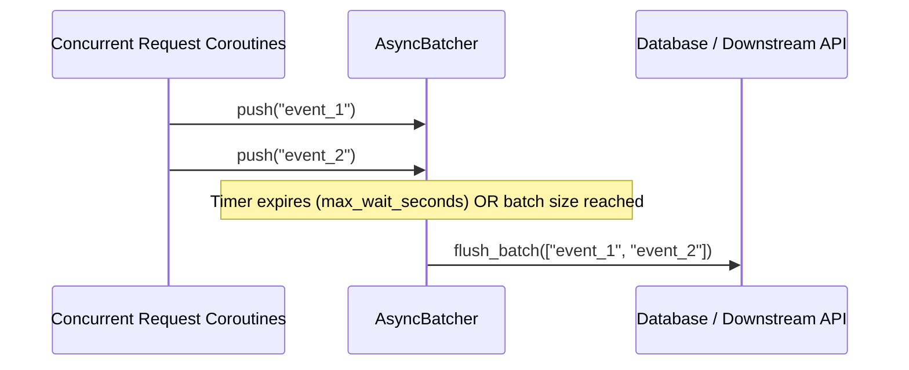

# Chapter 8: Curated Python Engineering Interview Challenges & Solutions

> **Core Learning Objective:** Test, solidify, and demonstrate mastery through real-world Product-Based Company (Google, Meta, Uber, Stripe) advanced Python interview problems. Every solution includes architectural commentary, common pitfalls, and complete runnable code.

---

## Challenge 1 (Concurrency): Build a Thread-Safe Bounded Blocking Queue from Scratch

### Problem Statement
Implement a bounded FIFO queue supporting `put(item, timeout)` and `get(timeout)`.
* If the queue is full, `put()` must block until a slot becomes free or timeout expires.
* If the queue is empty, `get()` must block until an item is available or timeout expires.
* **Constraint:** You **cannot** use `queue.Queue`. You must build it using only `threading.Lock` and `threading.Condition`.

### Common Pitfalls
* Using `if` instead of `while` when checking conditions (susceptible to spurious wakeups!).
* Not releasing locks during wait timeouts.

### Optimal Implementation
```python
import threading
import time
from typing import Generic, TypeVar, Optional

T = TypeVar("T")

class BoundedBlockingQueue(Generic[T]):
    def __init__(self, capacity: int):
        if capacity <= 0:
            raise ValueError("Capacity must be greater than 0")
        self.capacity = capacity
        self.queue: list[T] = []
        self.lock = threading.Lock()
        
        # Conditions tied to the single mutex
        self.not_full = threading.Condition(self.lock)
        self.not_empty = threading.Condition(self.lock)

    def put(self, item: T, timeout: Optional[float] = None) -> bool:
        """
        Pushes an item into the queue. Blocks if full.
        Returns True on success, False if timed out.
        """
        deadline = time.monotonic() + timeout if timeout is not None else None

        with self.lock:
            # MUST use 'while' to guard against spurious wakeups
            while len(self.queue) >= self.capacity:
                if deadline is not None:
                    remaining = deadline - time.monotonic()
                    if remaining <= 0:
                        return False # Timed out
                    self.not_full.wait(timeout=remaining)
                else:
                    self.not_full.wait()

            self.queue.append(item)
            # Notify waiting consumers that an item is now ready
            self.not_empty.notify()
            return True

    def get(self, timeout: Optional[float] = None) -> Optional[T]:
        """
        Pops the oldest item from the queue. Blocks if empty.
        Returns the item, or None if timed out.
        """
        deadline = time.monotonic() + timeout if timeout is not None else None

        with self.lock:
            while len(self.queue) == 0:
                if deadline is not None:
                    remaining = deadline - time.monotonic()
                    if remaining <= 0:
                        return None # Timed out
                    self.not_empty.wait(timeout=remaining)
                else:
                    self.not_empty.wait()

            item = self.queue.pop(0)
            # Notify waiting producers that a slot has freed up
            self.not_full.notify()
            return item

    def size(self) -> int:
        with self.lock:
            return len(self.queue)

# Verification Test
bq = BoundedBlockingQueue[str](capacity=2)
bq.put("Message 1")
bq.put("Message 2")
assert bq.put("Message 3", timeout=0.2) is False # Blocked & timed out
assert bq.get() == "Message 1"                   # Freed slot
assert bq.put("Message 3", timeout=0.1) is True  # Succeeded!
print("BoundedBlockingQueue passed all concurrency verifications!")
```

---

## Challenge 2 (Asyncio): Asynchronous Batching Buffer (Microservice Accelerator)

### Problem Statement
In high-throughput microservices, writing single events to a database or Kafka causes network bottlenecking.
Implement an `AsyncBatcher` that collects incoming items and automatically flushes them in batches whenever:
1. `max_batch_size` items have accumulated, **OR**
2. `max_wait_seconds` have elapsed since the earliest buffered item.



### Optimal Implementation
```python
import asyncio
from typing import Generic, TypeVar, Callable, Awaitable, List

T = TypeVar("T")

class AsyncBatcher(Generic[T]):
    def __init__(
        self,
        batch_size: int,
        wait_seconds: float,
        flush_handler: Callable[[List[T]], Awaitable[None]]
    ):
        self.batch_size = batch_size
        self.wait_seconds = wait_seconds
        self.flush_handler = flush_handler
        
        self._buffer: List[T] = []
        self._lock = asyncio.Lock()
        self._flush_event = asyncio.Event()
        self._timer_task: asyncio.Task | None = None
        self._running = True

    async def start(self):
        """Starts the background timer loop."""
        self._timer_task = asyncio.create_task(self._timer_loop())

    async def _timer_loop(self):
        while self._running:
            await asyncio.sleep(self.wait_seconds)
            async with self._lock:
                if self._buffer:
                    await self._flush_internal()

    async def push(self, item: T) -> None:
        async with self._lock:
            self._buffer.append(item)
            if len(self._buffer) >= self.batch_size:
                await self._flush_internal()

    async def _flush_internal(self):
        if not self._buffer:
            return
        to_flush = self._buffer[:]
        self._buffer.clear()
        # Execute handler without holding lock on subsequent pushes
        asyncio.create_task(self.flush_handler(to_flush))

    async def shutdown(self):
        self._running = False
        if self._timer_task:
            self._timer_task.cancel()
        async with self._lock:
            await self._flush_internal()

# Verification Test
async def db_writer(batch: List[str]):
    print(f"[DB Flush] Flushed {len(batch)} items: {batch}")

async def run_batcher_test():
    batcher = AsyncBatcher[str](batch_size=3, wait_seconds=0.5, flush_handler=db_writer)
    await batcher.start()

    # Rapid push: should trigger size-based flush
    await batcher.push("e1")
    await batcher.push("e2")
    await batcher.push("e3") # 3 items -> Flushes immediately

    # Slow push: should trigger timer-based flush
    await batcher.push("e4")
    await asyncio.sleep(0.7) # Exceeds 0.5s -> Flushes e4

    await batcher.shutdown()

asyncio.run(run_batcher_test())
```

---

## Challenge 3 (Metaprogramming): Fluent Dynamic HTTP API Client

### Problem Statement
Construct an SDK client such that dynamic chained method calls automatically format and route REST requests without defining hardcoded methods:
```python
# Desired interface:
client.users(123).orders.get(status="active")
# Translates to: GET /users/123/orders?status=active
```

### Optimal Implementation
```python
from urllib.parse import urlencode

class APIEndpoint:
    def __init__(self, base_url: str, segments: list[str]):
        self._base_url = base_url.rstrip("/")
        self._segments = segments

    def __getattr__(self, name: str) -> "APIEndpoint":
        # Chain URL path segments
        return APIEndpoint(self._base_url, self._segments + [name])

    def __call__(self, *args) -> "APIEndpoint":
        # Supports path parameters like .users(123)
        str_args = [str(arg) for arg in args]
        return APIEndpoint(self._base_url, self._segments + str_args)

    def get(self, **params) -> dict:
        path = "/".join(self._segments)
        query = f"?{urlencode(params)}" if params else ""
        full_url = f"{self._base_url}/{path}{query}"
        
        # Simulate execution
        return {
            "method": "GET",
            "url": full_url,
            "status": 200,
            "simulated_response": f"Payload from {full_url}"
        }

class DynamicAPIClient:
    def __init__(self, base_url: str):
        self.base_url = base_url

    def __getattr__(self, name: str) -> APIEndpoint:
        return APIEndpoint(self.base_url, [name])

client = DynamicAPIClient("https://api.cloudplatform.com/v1")
res1 = client.users(42).profiles.get(fields="email,name")
print(res1)
# Output: {'method': 'GET', 'url': 'https://api.cloudplatform.com/v1/users/42/profiles?fields=email%2Cname', ...}

res2 = client.billing.invoices("2026-Q1").download.get()
print(res2)
# Output: {'method': 'GET', 'url': 'https://api.cloudplatform.com/v1/billing/invoices/2026-Q1/download', ...}
```

---

## Challenge 4 (CPython Deep Dive): Re-entrant Profiling Context Manager

### Problem Statement
Create a context manager `@profile_scope` that measures:
1. Exact wall-clock elapsed time (using `time.perf_counter_ns`).
2. Net RAM allocated during the block (using `tracemalloc`).
3. Supports both `with` block syntax AND `@decorator` syntax seamlessly.

### Optimal Implementation
```python
import time
import tracemalloc
import functools
from contextlib import ContextDecorator

class profile_scope(ContextDecorator):
    def __init__(self, name: str = "Block"):
        self.name = name

    def __enter__(self):
        tracemalloc.start()
        self.start_snapshot = tracemalloc.take_snapshot()
        self.start_time = time.perf_counter_ns()
        return self

    def __exit__(self, exc_type, exc_val, exc_tb):
        elapsed_ns = time.perf_counter_ns() - self.start_time
        elapsed_ms = elapsed_ns / 1_000_000

        end_snapshot = tracemalloc.take_snapshot()
        stats = end_snapshot.compare_to(self.start_snapshot, 'lineno')
        total_memory_diff_kb = sum(stat.size_diff for stat in stats) / 1024
        tracemalloc.stop()

        print(f"[{self.name}] Wall-clock: {elapsed_ms:.3f} ms | Net Memory: {total_memory_diff_kb:+.2f} KB")
        return False # Do not suppress exceptions

# Usage as Context Manager:
with profile_scope("Heavy Allocation Block"):
    data = [x ** 2 for x in range(200_000)]

# Usage as Function Decorator:
@profile_scope("Compute Function")
def compute_cube_sum(n: int):
    return sum(x ** 3 for x in range(n))

compute_cube_sum(100_000)
```
