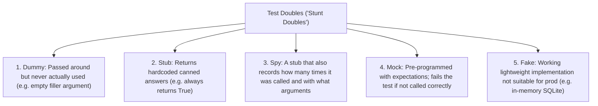
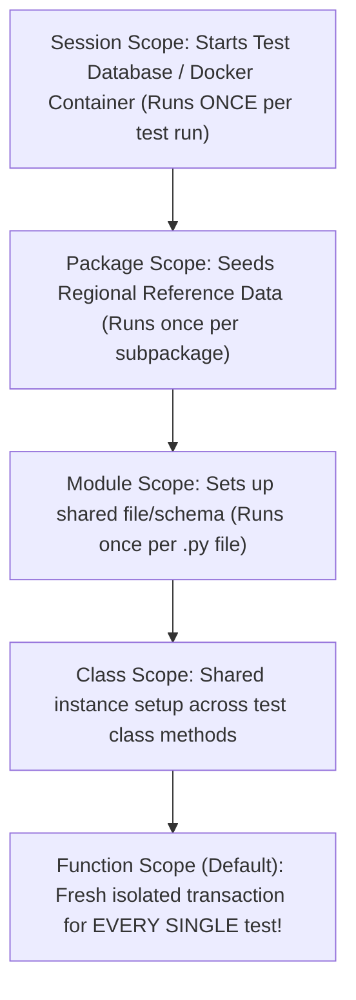

# Chapter 09: Enterprise Testing, Async Mocking Traps & Quality Assurance

> **Zero-Prerequisite Intuition: The "Movie Stunt Double" Metaphor**
> What is automated testing, and why do we "mock"?
> 
> Imagine you are filming a \$200-million action movie where the main actor jumps out of an exploding helicopter into the ocean. You wouldn't throw your real \$20-million actor into a live fireball on every single rehearsal take! If the helicopter engine fails, your lead actor is injured and the entire movie studio goes bankrupt.
> 
> Instead, you hire a **Stunt Double**—someone who looks and moves like the actor, but follows safe, scripted choreography.
> 
> In software engineering, your third-party payment gateway (Stripe), email service (SendGrid), and live production databases are the "exploding helicopter." If you execute your test suite 500 times a day and each test actually charges a live credit card or sends 500 emails to real customers, you cause catastrophic financial and reputational disaster.
> 
> **Mocking** is creating an identical "stunt double" object in Python that mimics the external system, returns predetermined responses, and allows you to test catastrophic failure conditions safely in memory without touching real external services!

---

## 1. Test Doubles Demystified: Dummy vs Stub vs Spy vs Mock vs Fake

In software engineering interviews, candidates often casually use the word "mock" for everything. A Staff Engineer knows the exact difference:



### The 5 Types in Concrete Python Code:
```python
# 1. Dummy: Just satisfies a required function parameter
dummy_logger = None

# 2. Stub: Hardcoded answer
class PaymentStub:
    def charge(self, amount: int) -> bool:
        return True # Always succeeds

# 3. Spy: Keeps an audit trail of calls
class AuditSpy:
    def __init__(self):
        self.call_count = 0
        self.recorded_args = []
    
    def log(self, message: str):
        self.call_count += 1
        self.recorded_args.append(message)

# 4. Mock: Configured with strict assertions via unittest.mock
from unittest.mock import MagicMock
mock_payment = MagicMock()
mock_payment.charge.return_value = "ch_123"

# 5. Fake: A real working implementation, but simplified in-memory
class FakeUserRepository:
    def __init__(self):
        self._storage = {} # Fast in-memory dict instead of slow PostgreSQL!
    
    def save(self, user_id: int, name: str):
        self._storage[user_id] = name
    
    def get(self, user_id: int) -> str | None:
        return self._storage.get(user_id)
```

---

## 2. The Pytest Framework & Fixture Scopes

Standard `unittest` (inherited from Java's JUnit in 1999) forces verbose class-based boilerplate (`self.assertEqual`). Modern enterprise Python exclusively uses **`pytest`**.



### Pytest Fixture Lifecycle & Dependency Injection
A fixture is an explicit dependency provider using Python generators (`yield`):

```python
# test_enterprise_fixtures.py
import pytest
import sqlite3

# Session scope: runs once for the entire 20-minute CI/CD test run
@pytest.fixture(scope="session")
def global_database_engine():
    print("\n[SETUP] Spinning up in-memory test database...")
    conn = sqlite3.connect(":memory:")
    yield conn
    print("\n[TEARDOWN] Tearing down in-memory test database...")
    conn.close()

# Function scope (default): runs before and after EVERY single test function
@pytest.fixture(scope="function")
def db_transaction(global_database_engine):
    cursor = global_database_engine.cursor()
    cursor.execute("CREATE TABLE accounts (id INT PRIMARY KEY, balance INT)")
    cursor.execute("INSERT INTO accounts VALUES (1, 1000)")
    global_database_engine.commit()
    
    # The test function executes during this yield!
    yield cursor 
    
    # Teardown: Clean up state so Test B never sees Test A's mutations!
    cursor.execute("DROP TABLE accounts")
    global_database_engine.commit()

def test_debit_account(db_transaction):
    db_transaction.execute("UPDATE accounts SET balance = balance - 200 WHERE id = 1")
    db_transaction.execute("SELECT balance FROM accounts WHERE id = 1")
    assert db_transaction.fetchone()[0] == 800

def test_fresh_balance_guaranteed(db_transaction):
    # Proves absolute test isolation: balance is 1000 again, NOT 800!
    db_transaction.execute("SELECT balance FROM accounts WHERE id = 1")
    assert db_transaction.fetchone()[0] == 1000
```

### Parametrized Tests: Testing 100 Edge Cases in 5 Lines
Instead of writing 10 separate test functions with copy-pasted logic, use `@pytest.mark.parametrize`:

```python
# test_validation.py
import pytest

def is_valid_discount(code: str, percentage: int) -> bool:
    if not code.isalnum() or len(code) < 3:
        return False
    if not (0 < percentage <= 100):
        return False
    return True

@pytest.mark.parametrize(
    "code, percentage, expected",
    [
        ("SUMMER20", 20, True),     # Standard valid discount
        ("VIP100", 100, True),      # Maximum boundary
        ("SAVE", 0, False),         # Invalid zero percentage
        ("SAVE", 105, False),       # Invalid percentage > 100
        ("AB", 15, False),          # Code too short (< 3 chars)
        ("CODE-20", 20, False),     # Special characters rejected
        ("", 50, False),            # Empty code rejected
    ]
)
def test_discount_validation_matrix(code, percentage, expected):
    assert is_valid_discount(code, percentage) == expected
```

---

## 3. The #1 Senior Python Interview Trap: Where to Patch?

In interviews, senior candidates frequently fail at mocking because of Python's import namespace mechanics.

### The Golden Rule of `unittest.mock.patch`
> **"Patch where the object is LOOKED UP, not where it is DEFINED."**

Suppose you have two files:

```python
# payment_gateway.py
class StripeClient:
    def charge(self, amount: int) -> str:
        # In real life, hits https://api.stripe.com
        return "real_stripe_charge_id"
```

```python
# checkout_service.py
from payment_gateway import StripeClient  # <-- LOOKUP HAPPENS HERE!

def process_order(amount: int) -> str:
    client = StripeClient()
    return client.charge(amount)
```



```mermaid
flowchart TD
    subgraph WrongWay["❌ The Common Trap: Patching Definition"]
        W1["@patch('payment_gateway.StripeClient')"]
        W2["Modifies payment_gateway module namespace"]
        W3["checkout_service ALREADY bound its own local pointer to the real StripeClient!"]
        W4["Result: Real Stripe API is still called in production!"]
        W1 --> W2 --> W3 --> W4
    end

    subgraph RightWay["✅ The Senior Rule: Patching Lookup"]
        R1["@patch('checkout_service.StripeClient')"]
        R2["Replaces the pointer inside checkout_service's namespace!"]
        R3["process_order() resolves the Mock directly!"]
        R4["Result: Safe, zero network calls, 100% reliable!"]
        R1 --> R2 --> R3 --> R4
    end
```

#### The Fatal Mistake:
```python
from unittest.mock import patch

# ❌ FATAL ERROR: Patches where defined, but checkout_service already imported its own pointer!
@patch("payment_gateway.StripeClient") 
def test_checkout_fails(mock_stripe):
    process_order(100) # FAILS! Still hits real Stripe!
```

#### The Senior Solution:
```python
# ✅ CORRECT: Patch where checkout_service LOOKS IT UP!
@patch("checkout_service.StripeClient")
def test_checkout_properly_mocked(mock_stripe_cls):
    mock_instance = mock_stripe_cls.return_value
    mock_instance.charge.return_value = "mock_tx_999"
    
    result = process_order(100)
    assert result == "mock_tx_999"
    mock_instance.charge.assert_called_once_with(100)
```

---

## 4. Async Mocking (`AsyncMock`) & Coroutine Testing

When testing modern `asyncio` code, a standard `MagicMock` will crash with:
`TypeError: object MagicMock can't be used in 'await' expression`. 

Python 3.8+ introduced **`unittest.mock.AsyncMock`**:

```python
# test_async_service.py
import pytest
import asyncio
from unittest.mock import AsyncMock

class ThirdPartyRatesClient:
    async def fetch_exchange_rate(self, currency: str) -> float:
        await asyncio.sleep(2.0) # Real 2-second network call
        return 1.35

async def convert_currency(client: ThirdPartyRatesClient, amount: float) -> float:
    rate = await client.fetch_exchange_rate("EUR")
    return amount * rate

@pytest.mark.asyncio
async def test_convert_currency_instant():
    # Stunt double for an async network client
    mock_client = AsyncMock(spec=ThirdPartyRatesClient)
    mock_client.fetch_exchange_rate.return_value = 1.50 # Instantaneous response in memory!

    result = await convert_currency(mock_client, 100.0)
    
    assert result == 150.0
    # Verify that the coroutine was awaited with exact parameters
    mock_client.fetch_exchange_rate.assert_awaited_once_with("EUR")

@pytest.mark.asyncio
async def test_currency_network_timeout():
    mock_client = AsyncMock(spec=ThirdPartyRatesClient)
    # Simulate a network timeout exception
    mock_client.fetch_exchange_rate.side_effect = asyncio.TimeoutError("Gateway timeout")

    with pytest.raises(asyncio.TimeoutError):
        await convert_currency(mock_client, 100.0)
```

---

## 5. Property-Based Testing with Hypothesis

Traditional unit testing tests only the 3 or 4 examples the developer thought of.
**Property-Based Testing** with **`Hypothesis`** generates **thousands of adversarial, randomized inputs** (empty strings, huge unicode emojis, negative zeros, maximum integer boundaries) to break your assumptions!

```python
# test_property_based.py
from hypothesis import given, strategies as st

def encode_decode_pipeline(data: list[int]) -> list[int]:
    """Simulated compression/decompression pipeline."""
    # Property: Decompressing compressed data must ALWAYS equal the original data!
    return list(data)

@given(st.lists(st.integers(min_value=-1_000_000, max_value=1_000_000)))
def test_lossless_roundtrip_invariant(input_data):
    # Hypothesis generates hundreds of weird edge cases automatically:
    # [], [0], [-1000000], [1, 1, 1], alternating negative/positive arrays...
    processed = encode_decode_pipeline(input_data)
    assert processed == input_data
```

---

## 6. Staff Interview Traps & Testing Pitfalls

### Trap 1: The Shared State Leak Across Tests
* **Scenario:** A test modifies a module-level variable or writes a row to a database without wrapping it in a function-scoped transaction rollback fixture.
* **The Disaster:** Test A passes when run in isolation. But when run in parallel with 100 other tests (`pytest -n 8`), Test A intermittently fails with mysterious "User already exists" errors.
* **The Staff Rule:** Every test must be completely isolated and idempotent. If a test creates state, it must clean it up in a `finally` block or through a `yield` fixture teardown.

### Trap 2: Mocking What You Don't Own
* **Scenario:** A developer mocks a complex external SDK (e.g., AWS Boto3 S3 client) by attaching 15 nested `MagicMock` return values.
* **The Disaster:** AWS updates their API and changes the return schema. All unit tests continue to pass 100% green because the mocks are hardcoded, but the application crashes immediately upon deployment to production!
* **The Staff Rule:** Wrap third-party SDKs behind a thin, domain-specific Protocol or Adapter class that you own. Mock *your adapter*, not the third-party SDK. Verify your adapter against the real service using integration contract tests.

---

## Master Checklist for Chapter 09

| Concept | Entry-Level Mental Model | Senior / Staff Production Rule |
| :--- | :--- | :--- |
| **Test Doubles** | Stunt doubles for dangerous movie scenes | Distinguish Stubs (canned answers) vs Mocks (behavioral assertions) vs Fakes (in-memory) |
| **Fixture Scopes** | Session (once per run) vs Function (fresh per test) | Always clean up mutations in a `yield` teardown block |
| **Where to Patch** | Patch where looked up, not where defined | Target the importing module's namespace (`checkout_service.Client`) |
| **AsyncMock** | Stunt double for `async def` functions | Standard `MagicMock` crashes when awaited; use `AsyncMock` |
| **Hypothesis** | Robot throwing 1,000 edge cases at your function | Tests mathematical invariants across generated edge-case input domains |