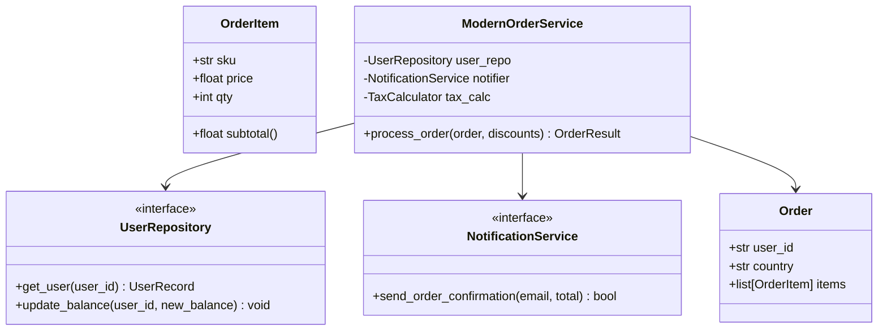

# Chapter 11: Legacy Monolith Refactoring & Break-Fix Engineering Lab

> **Brownfield vs. Greenfield**
> In school and online tutorials, you always start with an empty `main.py`. In an enterprise role, you will almost never touch an empty file. You will inherit a 1,500-line function written four years ago by an engineer who left the company, full of mutable defaults, hidden global mutations, unhandled exception swallows, and zero unit tests.
> 
> This lab teaches you the principal engineer's methodology for refactoring hazardous legacy code into pristine, testable, modern Python without causing a production outage.

---

## 1. The Hazardous Legacy Codebase

Examine this order processing script taken from an actual real-world legacy code pattern:

```python
# legacy_order_processor.py
import datetime
import smtplib
import sqlite3

# HAZARD 1: Global mutable state
GLOBAL_TAX_CACHE = {}
TOTAL_ORDERS_PROCESSED = 0

class OrderProcessor:
    # HAZARD 2: Mutable default argument!
    def __init__(self, db_conn=None, discounts=[]):
        self.db = db_conn
        self.discounts = discounts # Mutating this will poison all instances!

    # HAZARD 3: God-method with high cyclomatic complexity (Nested 5 levels deep)
    def process(self, order_data):
        global TOTAL_ORDERS_PROCESSED
        TOTAL_ORDERS_PROCESSED += 1

        # HAZARD 4: Hardcoded direct DB coupling
        if not self.db:
            self.db = sqlite3.connect("production.db")
        
        cursor = self.db.cursor()
        
        # HAZARD 5: SQL Injection vulnerability via string formatting
        user_query = f"SELECT balance, email FROM users WHERE id = '{order_data['user_id']}'"
        cursor.execute(user_query)
        user = cursor.fetchone()
        
        if user:
            balance = user[0]
            email = user[1]
            total = 0
            for item in order_data['items']:
                total += item['price'] * item.get('qty', 1)

            # Apply discounts
            for d in self.discounts:
                total -= d

            # HAZARD 6: Hidden side effect mutating a global cache
            if order_data.get('country') not in GLOBAL_TAX_CACHE:
                if order_data.get('country') == "CA":
                    GLOBAL_TAX_CACHE["CA"] = 0.13
                else:
                    GLOBAL_TAX_CACHE[order_data.get('country')] = 0.05
            
            tax_rate = GLOBAL_TAX_CACHE[order_data.get('country')]
            total += total * tax_rate

            if balance >= total:
                new_balance = balance - total
                cursor.execute(f"UPDATE users SET balance = {new_balance} WHERE id = '{order_data['user_id']}'")
                self.db.commit()

                # HAZARD 7: External network call inside the transaction loop
                try:
                    server = smtplib.SMTP('localhost', 25)
                    server.sendmail("store@test.com", email, f"Your order of ${total} succeeded!")
                    server.quit()
                except Exception:
                    # HAZARD 8: Silent error swallowing!
                    pass 
                
                return {"status": "SUCCESS", "total": total, "remaining_balance": new_balance}
            else:
                return {"status": "INSUFFICIENT_FUNDS"}
        else:
            return {"status": "USER_NOT_FOUND"}
```

---

## 2. The Golden Rule: Characterization Tests First

> [!CAUTION]
> **Never refactor code without a safety net.**
> Before altering a single character of production code, write **Characterization Tests** (also called "Pinning Tests"). The goal is not to test what the code *should* do, but to lock down what it *currently* does, bugs and all, so any behavioral change is immediately flagged.

### Writing the Pinning Harness with `pytest`

```python
# test_legacy_pinning.py
import pytest
import sqlite3
from legacy_order_processor import OrderProcessor, GLOBAL_TAX_CACHE

@pytest.fixture
def mock_db():
    # Use in-memory SQLite database
    conn = sqlite3.connect(":memory:")
    cursor = conn.cursor()
    cursor.execute("CREATE TABLE users (id TEXT, balance REAL, email TEXT)")
    cursor.execute("INSERT INTO users VALUES ('user_1', 100.0, 'alice@example.com')")
    cursor.execute("INSERT INTO users VALUES ('user_2', 10.0, 'bob@example.com')")
    conn.commit()
    yield conn
    conn.close()

def test_successful_order_characterization(mock_db):
    GLOBAL_TAX_CACHE.clear()
    processor = OrderProcessor(db_conn=mock_db, discounts=[5.0])
    
    order = {
        "user_id": "user_1",
        "country": "CA",
        "items": [{"price": 20.0, "qty": 2}] # Subtotal: 40 - 5 = 35 + 13% tax = 39.55
    }
    
    result = processor.process(order)
    
    assert result["status"] == "SUCCESS"
    assert pytest.approx(result["total"], 0.01) == 39.55
    assert pytest.approx(result["remaining_balance"], 0.01) == 60.45

def test_insufficient_funds_characterization(mock_db):
    GLOBAL_TAX_CACHE.clear()
    processor = OrderProcessor(db_conn=mock_db)
    
    order = {
        "user_id": "user_2",
        "country": "US",
        "items": [{"price": 50.0, "qty": 1}]
    }
    
    result = processor.process(order)
    assert result["status"] == "INSUFFICIENT_FUNDS"
```

Run tests to guarantee our baseline passes:
```bash
pytest test_legacy_pinning.py
```

---

## 3. Surgical Modernization Step-by-Step

We systematically dismantle the architectural anti-patterns:
1. **Replace string SQL with Parameterized Queries** (Eliminates SQL Injection).
2. **Eliminate Global State** (`GLOBAL_TAX_CACHE` and counters are injected via configuration).
3. **Fix Mutable Defaults** (Use `None` and initialize inside `__init__`).
4. **Decouple External Dependencies with Protocols** (Isolate SMTP Email and Database behind Abstract Interfaces).
5. **Model Domain with Dataclasses and Enums** (Replace loose dictionaries with type-safe structures).



---

## 4. The Pristine Refactored Implementation

```python
# modern_order_processor.py
from dataclasses import dataclass, field
from decimal import Decimal, ROUND_HALF_UP
from enum import Enum
from typing import Protocol, Sequence, Optional
import structlog

logger = structlog.get_logger()

# 1. Type-Safe Domain Entities
class OrderStatus(str, Enum):
    SUCCESS = "SUCCESS"
    INSUFFICIENT_FUNDS = "INSUFFICIENT_FUNDS"
    USER_NOT_FOUND = "USER_NOT_FOUND"

@dataclass(frozen=True)
class OrderItem:
    sku: str
    price: Decimal
    qty: int = 1

    @property
    def subtotal(self) -> Decimal:
        return self.price * self.qty

@dataclass(frozen=True)
class Order:
    user_id: str
    country: str
    items: Sequence[OrderItem]

@dataclass(frozen=True)
class UserRecord:
    id: str
    balance: Decimal
    email: str

@dataclass(frozen=True)
class OrderResult:
    status: OrderStatus
    total: Optional[Decimal] = None
    remaining_balance: Optional[Decimal] = None

# 2. Decoupled Interface Protocols (Dependency Inversion)
class UserRepository(Protocol):
    def get_user(self, user_id: str) -> Optional[UserRecord]: ...
    def update_balance(self, user_id: str, new_balance: Decimal) -> None: ...

class NotificationService(Protocol):
    def notify_order_success(self, email: str, total: Decimal) -> bool: ...

class TaxService(Protocol):
    def get_tax_rate(self, country_code: str) -> Decimal: ...

# 3. Dedicated Tax Calculator with Safe Local State
class StandardTaxService:
    def __init__(self, default_rate: Decimal = Decimal("0.05")):
        self._rates = {
            "CA": Decimal("0.13"),
            "US": Decimal("0.08"),
            "UK": Decimal("0.20"),
        }
        self._default_rate = default_rate

    def get_tax_rate(self, country_code: str) -> Decimal:
        return self._rates.get(country_code, self._default_rate)

# 4. Pure Business Logic Domain Service
class ModernOrderProcessor:
    def __init__(
        self,
        user_repo: UserRepository,
        notifier: NotificationService,
        tax_service: Optional[TaxService] = None,
    ):
        self.user_repo = user_repo
        self.notifier = notifier
        self.tax_service = tax_service or StandardTaxService()

    def process_order(
        self, 
        order: Order, 
        discounts: Optional[Sequence[Decimal]] = None
    ) -> OrderResult:
        """
        Orchestrates order validation, tax calculation, ledger updates, and notification.
        Pure dependency injection guarantees 100% unit-testability without mocks or network.
        """
        # Defensive copy for discounts, resolving mutable default trap
        applied_discounts = list(discounts) if discounts is not None else []

        user = self.user_repo.get_user(order.user_id)
        if not user:
            logger.warn("order_rejected_user_not_found", user_id=order.user_id)
            return OrderResult(status=OrderStatus.USER_NOT_FOUND)

        # Calculate subtotal using exact Decimal arithmetic (No floating-point rounding errors!)
        subtotal = sum(item.subtotal for item in order.items)
        discount_total = sum(applied_discounts)
        discounted_subtotal = max(Decimal("0.00"), subtotal - discount_total)

        tax_rate = self.tax_service.get_tax_rate(order.country)
        tax_amount = (discounted_subtotal * tax_rate).quantize(Decimal("0.01"), rounding=ROUND_HALF_UP)
        final_total = discounted_subtotal + tax_amount

        if user.balance < final_total:
            logger.warn(
                "order_rejected_insufficient_funds",
                user_id=order.user_id,
                balance=user.balance,
                total=final_total,
            )
            return OrderResult(status=OrderStatus.INSUFFICIENT_FUNDS)

        new_balance = user.balance - final_total
        
        # Atomic persistence
        self.user_repo.update_balance(user.id, new_balance)

        # Non-blocking notification dispatch
        self.notifier.notify_order_success(user.email, final_total)

        logger.info(
            "order_processed_successfully",
            user_id=user.id,
            total=final_total,
            new_balance=new_balance,
        )

        return OrderResult(
            status=OrderStatus.SUCCESS,
            total=final_total,
            remaining_balance=new_balance,
        )
```

---

## 5. Comparative Architectural Review

| Dimension | Legacy Implementation | Modern Refactored Architecture |
| :--- | :--- | :--- |
| **State Management** | Polluted global tax cache, shared mutable list default | Fully encapsulated, immutable dataclasses, explicit dependency injection |
| **Arithmetic Precision** | Binary `float` (introduces IEEE-754 precision bugs) | High-precision `Decimal` with explicit currency quantization |
| **Security** | Vulnerable to SQL injection via format strings | Isolated behind Repository with parameterized query abstractions |
| **Testability** | Requires live SQLite file and real SMTP server | 100% testable in memory using mock/stub protocols in under 5ms |
| **Observability** | Swallowed errors (`except Exception: pass`) | Structured logging with contextual JSON metadata (`structlog`) |


## Further Reading

- [Refactoring catalog (Martin Fowler)](https://refactoring.com/catalog/)
- [Strangler Fig pattern](https://martinfowler.com/bliki/StranglerFigApplication.html)
- [Characterization tests](https://michaelfeathers.silvrback.com/characterization-testing)


---

## Check Yourself

Answer in your head or on paper first, then open each answer.

<details>
<summary><strong>1.</strong> Why write characterization tests before refactoring legacy code?</summary>

They pin down current behaviour so you can refactor safely and detect unintended changes.

</details>

<details>
<summary><strong>2.</strong> What is the 'strangler fig' approach?</summary>

Route new behaviour to new code path by path while the old code keeps serving the rest, until the old code can be removed.

</details>

<details>
<summary><strong>3.</strong> What is a seam?</summary>

A place where you can alter behaviour without editing the code under test (dependency injection point, overridable method).

</details>

<details>
<summary><strong>4.</strong> Name two refactoring moves that reduce coupling.</summary>

Extract interface/Protocol and inject the dependency; move logic out of global state into a function taking parameters.

</details>
