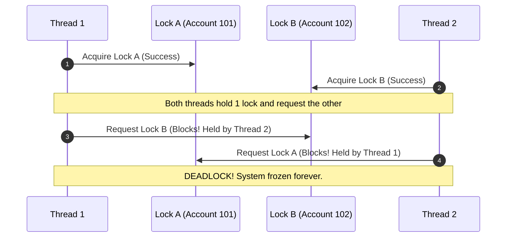

# Chapter 11: Production Debugging, Profiling, & Memory Leaks Lab

> **The Difference Between Junior and Principal Engineers**
> Anyone can write code that works under ideal conditions. A senior engineer shines when code is burning in production: CPU usage is pegged at 100%, memory consumption creeps steadily toward an Out-Of-Memory (OOM) kernel kill, or worker threads mysteriously freeze in an undetectable deadlock.
> 
> This chapter is a hands-on diagnostic laboratory covering production debugging, CPU profiling, and memory leak triage in CPython.

---

## 1. Surgical Debugging with `pdb` and `breakpoint()`

Modern Python (3.7+) introduced `breakpoint()`, which calls the sys-hook `sys.breakpointhook()`. By default, this drops into the `pdb` (Python Debugger) REPL.

### Production Post-Mortem Debugging: Catching Crashes After Death

In production, you often cannot pause execution interactively. Instead, your application crashes with an unhandled exception. **Post-mortem debugging** inspects the exact stack frame and local variables at the moment of death.

```python
# crash_lab.py
import sys

def calculate_discount(price: float, discount_code: str) -> float:
    codes = {"SUMMER": 0.20, "WINTER": 0.15}
    # Crash occurs if code is missing!
    rate = codes[discount_code]
    return price * (1.0 - rate)

def process_cart(order_id: int):
    items = [{"item": "Laptop", "price": 1200.0, "promo": "SPRING_SPECIAL"}]
    for item in items:
        calculate_discount(item["price"], item["promo"])

if __name__ == "__main__":
    try:
        process_cart(4092)
    except Exception:
        import pdb
        # Immediately enters the post-mortem debugger using the active traceback!
        pdb.post_mortem(sys.exc_info()[2])
```

### Essential `pdb` Command Cheat-Sheet

When dropped into the debugger:
*   `w` (where): Prints the complete call stack trace from top to bottom.
*   `u` (up) / `d` (down): Navigates up or down the call stack frames to inspect caller variables.
*   `p <expr>` / `pp <expr>`: Evaluates and pretty-prints any expression in the current scope.
*   `l .` (list): Displays the source code centered around the current execution line.
*   `c` (continue): Resumes execution until the next breakpoint.
*   `q` (quit): Immediately terminates the Python process.

> [!TIP]
> Run any failing script with `python -m pdb -c continue script.py`. Python will run at native speed without stopping until an unhandled exception is raised, at which point it automatically halts and enters post-mortem mode right at the offending line!

---

## 2. Profiling CPU Hotspots with `cProfile` and `pstats`

Never optimize without measurement. "Intuition" about where an algorithm spends its time is almost always wrong.

### Profiling a Slow Pipeline

Consider this data-processing function with an intentional bottleneck:

```python
# cpu_lab.py
import cProfile
import pstats
import time

def slow_string_concatenation(n: int = 50_000) -> str:
    # Anti-pattern: O(N^2) memory reallocation
    result = ""
    for i in range(n):
        result += str(i)
    return result

def fast_string_join(n: int = 50_000) -> str:
    # Idiomatic Python: O(N) pre-allocated buffer
    return "".join(str(i) for i in range(n))

def simulate_heavy_work():
    time.sleep(0.1)
    s1 = slow_string_concatenation()
    s2 = fast_string_join()
    return len(s1) + len(s2)

if __name__ == "__main__":
    profiler = cProfile.Profile()
    profiler.enable()

    simulate_heavy_work()

    profiler.disable()
    
    # Analyze results with pstats
    stats = pstats.Stats(profiler)
    stats.strip_dirs()
    # Sort by cumulative time spent in function and its children
    stats.sort_stats("cumulative")
    stats.print_stats(10)
```

### Deciphering `pstats` Output

```text
         100008 function calls in 0.384 seconds

   Ordered by: cumulative time
   List reduced from 15 to 10 due to restriction <10>

   ncalls  tottime  percall  cumtime  percall filename:lineno(function)
        1    0.000    0.000    0.384    0.384 cpu_lab.py:16(simulate_heavy_work)
        1    0.245    0.245    0.274    0.274 cpu_lab.py:5(slow_string_concatenation)
        1    0.100    0.100    0.100    0.100 {built-in method time.sleep}
    50000    0.029    0.000    0.029    0.000 {built-in method builtins.str}
        1    0.005    0.005    0.010    0.010 cpu_lab.py:12(fast_string_join)
```

*   **`ncalls`**: Number of invocations.
*   **`tottime`**: Total time spent strictly inside this function (excluding calls to other functions).
*   **`cumtime`**: Cumulative time spent in this function **including** all sub-functions it called.
*   Notice: `slow_string_concatenation` takes **0.274 seconds**, whereas `fast_string_join` takes only **0.010 seconds**—a 27x speedup!

---

## 3. Hunting Production Memory Leaks with `tracemalloc`

Because CPython uses Reference Counting supplemented by a Generational Cyclic Garbage Collector, many developers assume memory leaks are impossible. This is a dangerous myth.

### How Memory Leaks Happen in Python:
1. **Global Collections:** Appending records to module-level lists or dicts without an eviction policy (unbounded cache).
2. **Circular References with `__del__` (Pre-Python 3.4) or lingering closures.**
3. **C-Extension Memory Leaks:** C code (via Cython, ctypes, or C++ bindings) allocating memory with `malloc()` without freeing it.

### Step-by-Step Leak Detection Lab

```python
# memory_leak_lab.py
import tracemalloc
import time

class LeakyEventBroker:
    def __init__(self):
        # The leak: Unbounded list holding references to objects forever
        self._listeners = []

    def register(self, callback):
        self._listeners.append(callback)

broker = LeakyEventBroker()

class UserSession:
    def __init__(self, session_id: int):
        self.session_id = session_id
        # Allocate a 1MB payload per session
        self.payload = bytearray(1024 * 1024)
        broker.register(self.on_event)

    def on_event(self):
        pass

def simulate_leaky_traffic():
    # Start tracing memory allocations
    tracemalloc.start()
    
    snapshot1 = tracemalloc.take_snapshot()

    # Simulate 50 user sessions arriving and finishing
    for i in range(50):
        session = UserSession(i)
        # Even though 'session' leaves scope here, broker._listeners
        # still retains a bound method referencing 'self', keeping the
        # 1MB bytearray alive indefinitely!

    snapshot2 = tracemalloc.take_snapshot()

    # Compare memory difference between snapshot 1 and snapshot 2
    top_stats = snapshot2.compare_to(snapshot1, "lineno")

    print("\n[=== TOP 3 ALLOCATION INCREASES ===]")
    for stat in top_stats[:3]:
        print(stat)

if __name__ == "__main__":
    simulate_leaky_traffic()
```

### Output:
```text
[=== TOP 3 ALLOCATION INCREASES ===]
memory_leak_lab.py:19: size=50.0 MiB (+50.0 MiB), count=50 (+50), average=1024 KiB
memory_leak_lab.py:8: size=456 B (+456 B), count=1 (+1), average=456 B
```
Line 19 (`self.payload = bytearray(...)`) is instantly pinpointed as the source of the 50 MB leak!

### The Fix: Weak References (`weakref`)

When an event broker or cache must reference an object without preventing its garbage collection:

```python
import weakref

class SafeEventBroker:
    def __init__(self):
        # WeakMethod references do NOT increment the target's reference count!
        self._listeners = []

    def register(self, callback):
        # Automatically dies when UserSession goes out of scope!
        self._listeners.append(weakref.WeakMethod(callback))

    def notify(self):
        # Clean up dead references on notify
        alive = []
        for ref in self._listeners:
            cb = ref()
            if cb is not None:
                cb()
                alive.append(ref)
        self._listeners = alive
```

---

## 4. Diagnosing Deadlocks with `faulthandler`

When your multi-threaded application suddenly hangs at 0% CPU and stops accepting requests, you are almost certainly facing a **Deadlock**.

### What Causes a Deadlock? (AB-BA Lock Inversion)



### Reproducing and Inspecting with `faulthandler`

`faulthandler` is a standard library module that talks directly to the OS kernel signal handlers to dump the execution stack of **every active thread**, even when Python's GIL is frozen.

```python
# deadlock_lab.py
import faulthandler
import threading
import time

lock_a = threading.Lock()
lock_b = threading.Lock()

def thread_1_work():
    with lock_a:
        time.sleep(0.05)
        with lock_b:
            print("Thread 1 finished")

def thread_2_work():
    with lock_b:
        time.sleep(0.05)
        with lock_a:
            print("Thread 2 finished")

if __name__ == "__main__":
    # Dump thread stacks if SIGALRM or timeout occurs (or dump to stderr on demand)
    faulthandler.enable()

    t1 = threading.Thread(target=thread_1_work, name="Worker-1")
    t2 = threading.Thread(target=thread_2_work, name="Worker-2")

    t1.start()
    t2.start()

    time.sleep(0.5)
    print("\n--- INITIATING EMERGENCY THREAD DUMP ---")
    faulthandler.dump_traceback()

    t1.join()
    t2.join()
```

### Traceback Dump in Terminal:
```text
--- INITIATING EMERGENCY THREAD DUMP ---
Thread 0x00007f91 (Most recent call first):
  File "deadlock_lab.py", line 12 in thread_1_work
  File "/usr/lib/python3.11/threading.py", line 982 in run

Thread 0x00008f12 (Most recent call first):
  File "deadlock_lab.py", line 18 in thread_2_work
  File "/usr/lib/python3.11/threading.py", line 982 in run
```
You can immediately identify:
*   `Worker-1` is blocked waiting on `line 12` (`with lock_b:`).
*   `Worker-2` is blocked waiting on `line 18` (`with lock_a:`).

---

## 5. Senior Takeaways & Lab Exercise

1. **Always use context managers** (`with lock:`) for acquiring locks, but establish a strict **global lock acquisition order** (e.g., sort locks by ID before acquiring) to mathematically eliminate deadlocks.
2. **Never use unbound callbacks or caches** without `weakref` or TTL/LRU eviction policies.
3. Keep `faulthandler` registered in production servers (`faulthandler.register(signal.SIGUSR1)`) so you can trigger live thread stack dumps on running Kubernetes pods without restarting them!
