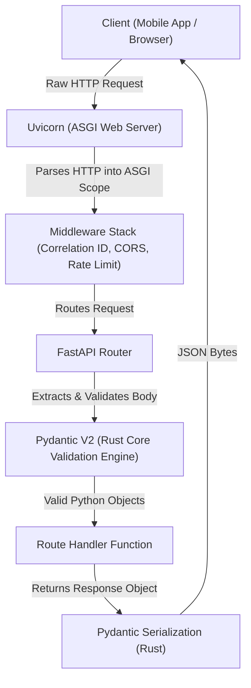
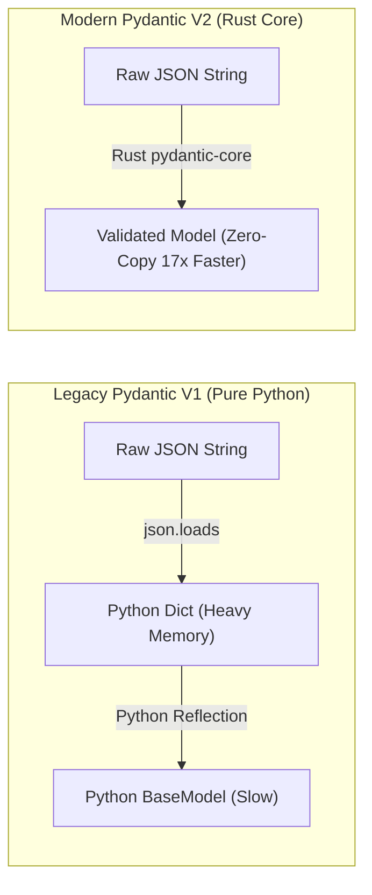
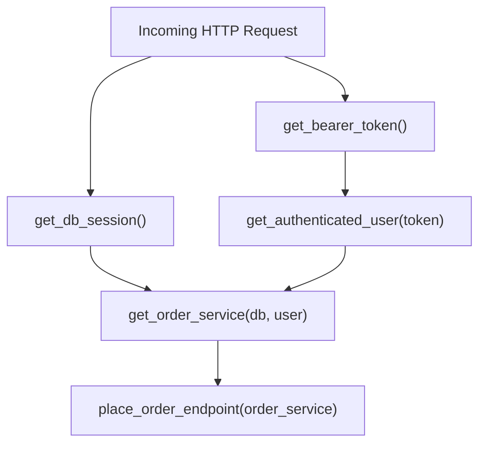
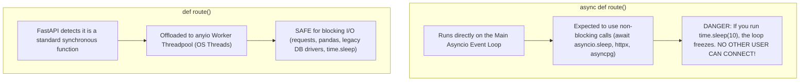

# Chapter 13: High-Performance Web Architecture (ASGI, FastAPI & Pydantic V2)

> **Zero-Prerequisite Intuition: The "Michelin-Star Kitchen Assembly Line"**
> What actually happens when you open an app on your phone and tap "Order Food"?
> 
> Your phone sends a small digital letter across the internet to a server in the cloud. That letter is an **HTTP Request**. The server must read it, check if your credit card and address are valid, save the order to a database, and send back a receipt.
> 
> If you have 50,000 people ordering lunch at 12:00 PM simultaneously, how does a Python server survive without crashing or freezing?
> 
> * **Uvicorn (The Front Door & Host):** Stands at the restaurant entrance. When hundreds of guests arrive every second, the host greets them immediately, takes their order slip, and seats them without making anyone wait outside in the rain (the non-blocking **ASGI event loop**).
> * **FastAPI (The Head Chef & Dispatcher):** Reads the ticket and instantly routes it to the exact cooking station prepared for it. It also automatically generates a visual menu manual (**OpenAPI / Swagger docs**) so everyone knows what dishes are possible.
> * **Pydantic V2 (The High-Speed Robotic Health Inspector):** Before any ingredient touches a pan, an ultra-fast automated scanner inspects every item in microseconds. If a diner requested a pizza but wrote their phone number in the "credit card" box, this inspector catches the mistake in $0.00001$ seconds and hands back a helpful error message before the kitchen wastes any time cooking it (powered by **Rust** under the hood).
> * **The Cooks (`async def` vs `def`):** 
>   - The quick cooks stay on the main line sautéing dishes that take 2 milliseconds (`async def` coroutines running directly on the event loop).
>   - The slow cooks who must do heavy 20-minute manual potato peeling are sent to a separate back room so they never block the main kitchen counter (`def` synchronous functions offloaded to background worker threads).

---

## 1. What is an API and What is ASGI? (Spoon-Fed Foundations)

Before diving into complex architectures, let's establish fundamental clarity:

### The Jargon Demystified
1. **API (Application Programming Interface):** A set of defined rules that allows two computer programs to talk to each other. For example, your React mobile app asking your Python server: *"Please give me user #42's profile."*
2. **JSON (JavaScript Object Notation):** A universal text format for sending data across the web. It looks like a standard Python dictionary: `{"name": "Alice", "age": 30}`.
3. **Serialization:** Converting an in-memory Python object into a string of bytes or JSON text so it can travel across a network cable.
4. **Deserialization (Parsing):** Taking raw JSON text from a network cable and reconstructing it into a validated Python object in memory.
5. **WSGI vs ASGI:**
   - **WSGI (Web Server Gateway Interface - Old standard, e.g., Flask/Django):** Handles one request per OS thread. If a request waits 3 seconds for a slow third-party payment gateway, that entire thread sits idle doing nothing, blocking other users.
   - **ASGI (Asynchronous Server Gateway Interface - Modern standard, e.g., FastAPI/Starlette):** Handles thousands of concurrent connections on a single thread by pausing idle requests (`await`) and switching instantly to serve someone else.



### The Raw ASGI Protocol Specification (Zero-Framework Foundations)

You do not need FastAPI to write an asynchronous web application! Underneath all frameworks, the entire ASGI protocol is just a **single asynchronous Python function accepting three arguments**:

1. **`scope`:** A dictionary containing connection metadata (HTTP method, headers, URL path, query parameters).
2. **`receive`:** An async callable to read incoming request body bytes.
3. **`send`:** An async callable to stream response headers and body bytes back to Uvicorn.

```python
# raw_asgi_app.py
import json

async def barebones_asgi_app(scope, receive, send):
    """
    This is what Uvicorn executes under the hood!
    """
    assert scope["type"] in ("http", "websocket")

    if scope["type"] == "http":
        method = scope["method"]
        path = scope["path"]

        # Basic Path Routing
        if path == "/api/v1/health" and method == "GET":
            payload = json.dumps({"status": "HEALTHY", "engine": "Raw ASGI"}).encode("utf-8")
            
            # Step 1: Send HTTP Response Headers
            await send({
                "type": "http.response.start",
                "status": 200,
                "headers": [
                    [b"content-type", b"application/json"],
                    [b"content-length", str(len(payload)).encode("utf-8")]
                ]
            })

            # Step 2: Stream Response Body Bytes
            await send({
                "type": "http.response.body",
                "body": payload,
                "more_body": False
            })
        else:
            # 404 Route Not Found
            await send({
                "type": "http.response.start",
                "status": 404,
                "headers": [[b"content-type", b"text/plain"]]
            })
            await send({
                "type": "http.response.body",
                "body": b"404 Route Not Found",
                "more_body": False
            })

# You can launch this raw server directly in terminal:
# uvicorn raw_asgi_app:barebones_asgi_app --port 8000
```

### The Onion Middleware Chain
When you add middleware, it wraps around the inner ASGI application like layers of an onion:

```python
class TimingMiddleware:
    """Wraps any ASGI application to measure exact processing latency."""
    def __init__(self, inner_app):
        self.inner_app = inner_app

    async def __call__(self, scope, receive, send):
        if scope["type"] != "http":
            await self.inner_app(scope, receive, send)
            return

        import time
        start_time = time.perf_counter()

        async def send_wrapper(message):
            if message["type"] == "http.response.start":
                duration_ms = (time.perf_counter() - start_time) * 1000
                headers = list(message.get("headers", []))
                headers.append([b"x-latency-ms", f"{duration_ms:.2f}".encode("utf-8")])
                message["headers"] = headers
            await send(message)

        await self.inner_app(scope, receive, send_wrapper)
```

Now that you understand raw ASGI, you can see why **FastAPI** exists: writing raw dictionary parsers and manual `send()` calls for 50 endpoints becomes unmaintainable. FastAPI provides declarative routing, dependency injection, and automatic OpenAPI generation on top of this exact ASGI foundation.

---

## 2. Pydantic V2 Internals: The Rust Revolution

In Python web servers, data validation used to be a major performance bottleneck. In Pydantic V1 (pure Python), validating complex nested objects took up to **60% of the entire request time**.

In **Pydantic V2**, the entire core engine was rewritten in **Rust** (`pydantic-core`). 

### Why Rust Makes Python 17x Faster
Python is dynamic: every time it accesses an attribute, it performs hash table lookups, reference count increments, and type checks. 
Rust compiles directly to native CPU machine instructions. When raw JSON arrives, `pydantic-core` scans the bytes directly in C/Rust memory without creating millions of intermediate temporary Python string and dictionary objects on the heap.



### Building Your First Bulletproof Schema

Let's see how an entry-level developer writes a schema, and how a staff engineer elevates it to production standards:

```python
# schema_mastery.py
from datetime import datetime
from typing import Annotated
from uuid import UUID, uuid4
from pydantic import (
    BaseModel, 
    Field, 
    EmailStr, 
    field_validator, 
    model_validator, 
    ConfigDict
)

# -------------------------------------------------------------
# STEP 1: The Production Base Model
# -------------------------------------------------------------
class ProductionSchema(BaseModel):
    """Base schema enforcing enterprise safety rules across all child models."""
    model_config = ConfigDict(
        # 1. frozen=True makes instances immutable. Once created, nobody can
        # accidentally overwrite fields later in the code. Thread-safe!
        frozen=True,
        
        # 2. Automatically trims accidental leading/trailing whitespace ("  alice@mail.com " -> "alice@mail.com")
        str_strip_whitespace=True,
        
        # 3. extra='forbid' rejects unexpected fields. If a malicious client sends
        # {"is_admin": True} when registering, Pydantic immediately rejects it!
        extra="forbid",
        
        # 4. Allows reading data directly from database ORM models (SQLAlchemy)
        from_attributes=True
    )

# -------------------------------------------------------------
# STEP 2: The Domain Model with Rich Constraints
# -------------------------------------------------------------
class UserCreateRequest(ProductionSchema):
    # UUID automatically generated if omitted
    correlation_id: UUID = Field(default_factory=uuid4)
    
    # EmailStr automatically verifies email formatting (RFC 5322 standard)
    email: EmailStr
    
    # Annotated with Field allows declaring constraints right alongside types
    username: Annotated[str, Field(
        min_length=3, 
        max_length=24, 
        pattern=r"^[a-zA-Z0-9_-]+$",
        description="Alphanumeric username with underscores or dashes"
    )]
    
    age: int = Field(ge=18, le=120, description="Users must be at least 18 years old")
    subscription_plan: str = Field(default="FREE")

    # -------------------------------------------------------------
    # STEP 3: Field-Level Custom Validation
    # -------------------------------------------------------------
    @field_validator("username")
    @classmethod
    def prevent_system_impersonation(cls, value: str) -> str:
        """Runs immediately after basic type checking. Rejects reserved names."""
        forbidden_names = {"admin", "root", "system", "moderator", "support"}
        if value.lower() in forbidden_names:
            raise ValueError(f"The username '{value}' is reserved for internal system use.")
        return value.lower()

    # -------------------------------------------------------------
    # STEP 4: Model-Level Cross-Field Validation
    # -------------------------------------------------------------
    @model_validator(mode="after")
    def validate_enterprise_domains(self) -> "UserCreateRequest":
        """Runs after all individual fields are verified to check cross-field rules."""
        if self.subscription_plan == "ENTERPRISE" and not self.email.endswith((".com", ".org", ".io")):
            raise ValueError("Enterprise accounts must register with a corporate top-level domain.")
        return self
```

### High-Throughput Batch Validation with `TypeAdapter`
What if you need to validate a list of 50,000 user IDs coming from an external microservice? Instantiating a `BaseModel` for each ID would waste CPU cycles. Pydantic V2 provides **`TypeAdapter`**:

```python
from pydantic import TypeAdapter
from uuid import UUID

# Direct compilation of a list validator straight into Rust memory
batch_uuid_validator = TypeAdapter(list[UUID])

raw_json = '["550e8400-e29b-41d4-a716-446655440000", "c9bf9e57-1685-4c89-bafb-ff5af830be8a"]'

# Validates in a fraction of a millisecond!
validated_ids: list[UUID] = batch_uuid_validator.validate_json(raw_json)
print(f"Validated {len(validated_ids)} UUIDs directly from raw JSON bytes.")
```

---

## 3. Dependency Injection: The Cleanest Architecture Pattern

### What is Dependency Injection (DI)? (Spoon-Fed)
Imagine you are a chef making a cake. 
* **Without Dependency Injection:** In the middle of baking, you stop, walk outside, buy a cow, milk the cow, refine sugar, and build an oven from bricks. Your cake recipe is tightly coupled to everything in the world!
* **With Dependency Injection:** You simply say: *"Whoever asks for a cake must hand me 2 eggs, 1 cup of milk, and a preheated oven."*

In FastAPI, **`Depends()`** is how your route functions ask for what they need (a database connection, the authenticated user, or a configuration object). FastAPI automatically finds those dependencies, prepares them, hands them to your function, and cleans them up when your function finishes!



### Context-Managed Yield Dependencies (Zero Resource Leaks)
How do we guarantee that a database connection is **always closed**, even if our code crashes halfway through processing? We use a Python generator with `yield`:

```python
# dependencies_deep_dive.py
from typing import AsyncGenerator, Annotated
from fastapi import FastAPI, Depends, HTTPException, status

app = FastAPI()

class DatabaseConnection:
    """Simulated production database connection."""
    def __init__(self):
        self.is_open = True
    
    async def query(self, sql: str) -> str:
        return f"Executed: {sql}"
    
    async def close(self):
        self.is_open = False
        print("[DATABASE] Connection cleanly returned to pool.")

# -------------------------------------------------------------
# Yield Dependency: Guarantees Setup & Automatic Teardown
# -------------------------------------------------------------
async def get_db_connection() -> AsyncGenerator[DatabaseConnection, None]:
    # 1. SETUP: Runs before the route handler starts
    conn = DatabaseConnection()
    print("[DATABASE] Connection acquired from pool.")
    try:
        # Hand the connection to the route function
        yield conn
    finally:
        # 2. TEARDOWN: This 'finally' block ALWAYS runs!
        # Even if the route raises an unhandled exception or crashes!
        await conn.close()

# -------------------------------------------------------------
# Secondary Dependency: Authenticating Current User
# -------------------------------------------------------------
async def get_current_user(token: str = "mock_secret_token") -> dict:
    if token != "mock_secret_token":
        raise HTTPException(
            status_code=status.HTTP_401_UNAUTHORIZED,
            detail="Invalid security credentials"
        )
    return {"user_id": 42, "role": "admin"}

# -------------------------------------------------------------
# The Route: Notice how clean and readable it is!
# -------------------------------------------------------------
@app.get("/profile")
async def view_profile(
    user: Annotated[dict, Depends(get_current_user)],
    db: Annotated[DatabaseConnection, Depends(get_db_connection)]
):
    data = await db.query(f"SELECT * FROM profiles WHERE user_id = {user['user_id']}")
    return {"user": user, "data": data}
```

---

## 4. The Concurrency Death Trap: `async def` vs `def`

This is the **#1 question asked in Staff Python Web Architecture interviews**, and the #1 source of catastrophic production outages.

> **The Question:** *"FastAPI supports both `def` and `async def` route functions. What happens under the hood when you use each one?"*



### The Plain-English Explanation:
1. **The Event Loop is a Single Waiter:**
   In an `async def` function, the waiter (event loop) takes your order. When you say `await cook_pizza()`, the waiter doesn't stand staring at the oven; he turns around and takes orders from 100 other customers. When the oven dings, he returns to you.
2. **The Disaster:**
   If you write `async def` and inside it you run `time.sleep(10)` or `requests.get("https://slow-api.com")`, you just grabbed the waiter by his shirt collar and forced him to stand still for 10 seconds. **Every single customer in the entire restaurant must now wait in total silence.** Your server appears completely dead!
3. **The Threadpool Solution:**
   When you write a normal synchronous `def route()`, FastAPI knows this function might block. It automatically takes that function and hands it to a separate background OS worker thread (`anyio.to_thread.run_sync`). The event loop stays free!

### Code Demonstration: Spotting the Bug Before It Takes Down Production

```python
import time
import asyncio
from fastapi import FastAPI
import requests # Synchronous blocking library!
import httpx    # Asynchronous non-blocking library!

app = FastAPI()

# ❌ FATAL DISASTER: Blocks all other concurrent users on the server!
@app.get("/bad-blocking-async")
async def catastrophic_endpoint():
    # Calling blocking synchronous I/O inside 'async def'
    time.sleep(5) # FREEZES the entire server!
    return {"message": "You just froze the event loop for everyone"}

# ✅ CORRECT: Let FastAPI push synchronous blocking work to a threadpool
@app.get("/safe-sync-endpoint")
def safe_sync_endpoint():
    # Because this is 'def', FastAPI runs it in an OS threadpool
    time.sleep(5) # Safe! Other async users are unaffected.
    return {"message": "Processed safely in background thread"}

# ✅ GOLD STANDARD: Pure asynchronous non-blocking I/O
@app.get("/safe-async-endpoint")
async def ultra_fast_async_endpoint():
    # Cooperative multitasking: yields control back to event loop
    await asyncio.sleep(5)
    return {"message": "Ultra-scalable non-blocking operation"}
```

---

## 5. Modern Lifespan Protocol: Post-Fork Safe State

In legacy applications, developers used `@app.on_event("startup")` to initialize databases. This is deprecated. Modern enterprise Python uses the **ASGI Lifespan Protocol** (PEP 553 / ASGI 3.0).

### Why Lifespan Matters: The Fork Safety Trap
When you run a web server in production with 4 workers:
```bash
uvicorn main:app --workers 4
```
The master Python process starts, and then creates child processes using `os.fork()`.
* If you opened database connections or Redis sockets at the module level (outside lifespan), **all 4 worker processes inherit the exact same socket file descriptor!**
* They will start reading and writing over each other's TCP packets. Customer A will see Customer B's bank account, or queries will crash with mysterious `SSL SYSCALL error: EOF detected`.

The Lifespan context manager runs **inside each individual child process after the fork**, ensuring 100% isolated, safe connection pools:

```python
# lifespan_manager.py
from contextlib import asynccontextmanager
from typing import AsyncGenerator
from fastapi import FastAPI, Request

class ProductionState:
    """Holds long-lived connections for the worker process."""
    def __init__(self):
        self.db_pool = None
        self.redis_client = None

# -------------------------------------------------------------
# The ASGI Lifespan Context Manager
# -------------------------------------------------------------
@asynccontextmanager
async def lifespan_handler(app: FastAPI) -> AsyncGenerator[dict, None]:
    # ==================== STARTUP PHASE ====================
    print("[LIFESPAN] Worker process starting up...")
    print("[LIFESPAN] Initializing isolated DB connection pool...")
    db_pool = {"connection_limit": 50, "status": "READY"}
    
    # We yield a dictionary of state objects.
    # FastAPI attaches this dictionary directly to request.state!
    yield {"db_pool": db_pool}
    
    # ==================== SHUTDOWN PHASE ====================
    # Runs when Uvicorn receives a termination signal (SIGTERM/SIGINT)
    print("[LIFESPAN] SIGTERM received. Draining active requests...")
    print("[LIFESPAN] Closing all open database connections...")
    db_pool["status"] = "CLOSED"
    print("[LIFESPAN] Clean shutdown complete.")

app = FastAPI(lifespan=lifespan_handler)

@app.get("/health")
async def health_check(request: Request):
    # Access state safely without global variables!
    pool = request.state.db_pool
    return {"server_status": "UP", "database": pool["status"]}
```

---

## 6. End-to-End Industrial Microservice Blueprint

Here is a complete, production-grade microservice incorporating:
1. Global distributed tracing (`X-Correlation-ID`)
2. Response timing headers (`X-Response-Time`)
3. Immutability and strict validation with Pydantic V2
4. Scoped dependency injection
5. Centralized unhandled error capture

```python
# microservice_app.py
import time
import uuid
import logging
from typing import Annotated
from fastapi import FastAPI, Request, Response, Depends, status
from fastapi.responses import JSONResponse
from pydantic import BaseModel, Field, ConfigDict, EmailStr

# Configure structured logging
logging.basicConfig(level=logging.INFO, format="%(asctime)s [%(levelname)s] %(message)s")
logger = logging.getLogger("service.orders")

app = FastAPI(
    title="High-Throughput Order Engine",
    version="1.0.0",
    docs_url="/docs"
)

# -------------------------------------------------------------
# 1. Tracing & Latency Middleware
# -------------------------------------------------------------
@app.middleware("http")
async def trace_and_timing_middleware(request: Request, call_next):
    # Extract existing correlation ID or generate a fresh UUID4
    correlation_id = request.headers.get("X-Correlation-ID", str(uuid.uuid4()))
    request.state.correlation_id = correlation_id
    
    start_time = time.perf_counter()
    try:
        response: Response = await call_next(request)
    except Exception as exc:
        latency_ms = (time.perf_counter() - start_time) * 1000
        logger.error(
            f"CRASH: CID={correlation_id} | path={request.url.path} | "
            f"latency={latency_ms:.2f}ms | error={str(exc)}", 
            exc_info=True
        )
        return JSONResponse(
            status_code=status.HTTP_500_INTERNAL_SERVER_ERROR,
            content={
                "error": "InternalServerError", 
                "message": "A critical system error occurred. Reference the correlation ID.",
                "correlation_id": correlation_id
            }
        )
    
    latency_ms = (time.perf_counter() - start_time) * 1000
    response.headers["X-Correlation-ID"] = correlation_id
    response.headers["X-Response-Time"] = f"{latency_ms:.2f}ms"
    return response

# -------------------------------------------------------------
# 2. Pydantic V2 Schemas
# -------------------------------------------------------------
class OrderItem(BaseModel):
    model_config = ConfigDict(frozen=True, extra="forbid")
    sku: str = Field(min_length=3, max_length=16, pattern=r"^[A-Z0-9-]+$")
    quantity: int = Field(gt=0, le=50)
    unit_price_cents: int = Field(gt=0, description="Price in smallest currency unit")

class CreateOrderRequest(BaseModel):
    model_config = ConfigDict(frozen=True, extra="forbid")
    customer_email: EmailStr
    items: list[OrderItem] = Field(min_length=1, max_length=100)

class CreateOrderResponse(BaseModel):
    model_config = ConfigDict(frozen=True)
    order_id: str
    total_amount_cents: int
    item_count: int
    status: str

# -------------------------------------------------------------
# 3. Domain Service & Dependency Injection
# -------------------------------------------------------------
class OrderRepository:
    """Decoupled database repository layer."""
    async def save_order(self, customer_email: str, total_cents: int) -> str:
        # Simulate async database write
        generated_id = f"ord_{uuid.uuid4().hex[:12]}"
        logger.info(f"Order {generated_id} saved for {customer_email}")
        return generated_id

def get_order_repository() -> OrderRepository:
    """Dependency provider."""
    return OrderRepository()

# -------------------------------------------------------------
# 4. Route Handler: Pure Business Logic
# -------------------------------------------------------------
@app.post(
    "/v1/orders",
    response_model=CreateOrderResponse,
    status_code=status.HTTP_201_CREATED,
    summary="Create a validated customer order"
)
async def create_order_endpoint(
    payload: CreateOrderRequest,
    repo: Annotated[OrderRepository, Depends(get_order_repository)]
):
    total_cents = sum(item.quantity * item.unit_price_cents for item in payload.items)
    total_items = sum(item.quantity for item in payload.items)
    
    order_id = await repo.save_order(
        customer_email=payload.customer_email, 
        total_cents=total_cents
    )
    
    return CreateOrderResponse(
        order_id=order_id,
        total_amount_cents=total_cents,
        item_count=total_items,
        status="CONFIRMED"
    )
```

---

## 7. Staff Interview Traps & Production Edge Cases

### Trap 1: Memory Bloat When Streaming Large Datasets
* **The Incident:** An analyst adds an export route:
  ```python
  @app.get("/export-users")
  async def export():
      data = await db.fetch_all_users() # 5 million rows loaded into Python RAM!
      return data # Serializes 5 million dicts into one massive 4 GB JSON string!
  ```
* **The Post-Mortem:** When 3 users click "Download", the server allocates 12 GB of RAM instantly. The Linux kernel's Out-Of-Memory Killer (`oom_killer`) immediately terminates the process (`SIGKILL 9`).
* **The Staff Solution:** Use **`StreamingResponse`** with an async chunk generator. Memory usage remains bounded to a tiny 64 KB buffer regardless of whether the dataset is 10 MB or 100 GB:
  ```python
  from fastapi.responses import StreamingResponse

  async def user_record_stream():
      yield b'{"users": ['
      first = True
      async for user in db.stream_cursor_rows():
          if not first:
              yield b','
          first = False
          yield user.to_json_bytes()
      yield b']}'

  @app.get("/export-users")
  async def export_stream():
      return StreamingResponse(user_record_stream(), media_type="application/json")
  ```

### Trap 2: The Hidden Blocking Call Inside an Async Route
* **The Incident:** A developer writes:
  ```python
  @app.get("/user/{id}")
  async def get_user(id: int):
      # BOGUS: This library doesn't support async, but was placed in async def!
      cached = redis_sync_client.get(f"user:{id}") 
      return {"user": cached}
  ```
* **The Post-Mortem:** Under normal traffic (10 req/sec), nobody notices. During Black Friday, Redis experiences slight network latency (200 ms). Because `async def` was used, each 200 ms stall freezes the single-threaded event loop. Latency spirals exponentially from 200 ms to 45 seconds, crashing the cluster.
* **The Staff Rule:** Audit all calls inside `async def`. If a library does not have an `await` before it, verify that it does zero disk I/O and zero network I/O. If it blocks, either rewrite it using an async client (`redis.asyncio`) or declare the endpoint as synchronous `def` so FastAPI handles it on worker threads.

---

## Master Checklist for Chapter 18

| Concept | Entry-Level Mental Model | Senior / Staff Production Rule |
| :--- | :--- | :--- |
| **ASGI Engine** | Host at a restaurant greeting guests | Non-blocking event loop; never run blocking synchronous code inside `async def` |
| **Pydantic V2** | Robotic health inspector checking ingredients | Rust-backed `pydantic-core`; use `ConfigDict(frozen=True, extra='forbid')` |
| **TypeAdapter** | Quick scanner for lists without creating full classes | Validates raw bulk JSON arrays directly without `BaseModel` overhead |
| **Dependency Injection** | Handing ingredients to the chef when needed | Declared via `Depends()`; use `yield` for bulletproof connection pool cleanup |
| **Lifespan Manager** | Turning lights on/off when kitchen opens/closes | Prevents cross-process file-descriptor corruption caused by `os.fork()` |
| **Streaming Responses** | Sipping water through a straw instead of swallowing a lake | Keeps RAM footprint flat at $O(1)$ constant size for multi-gigabyte exports |
