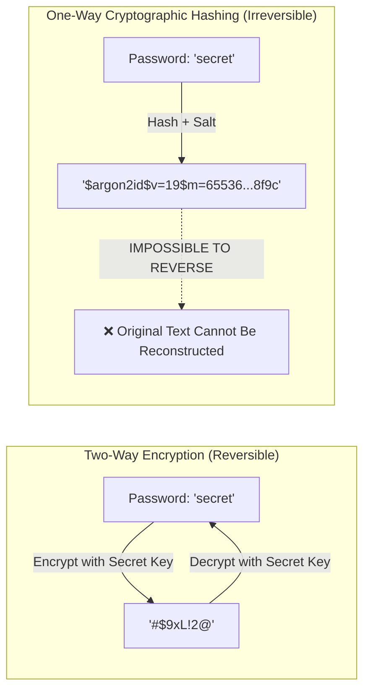
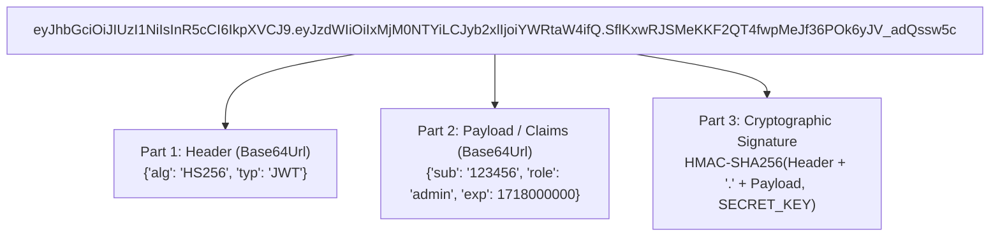
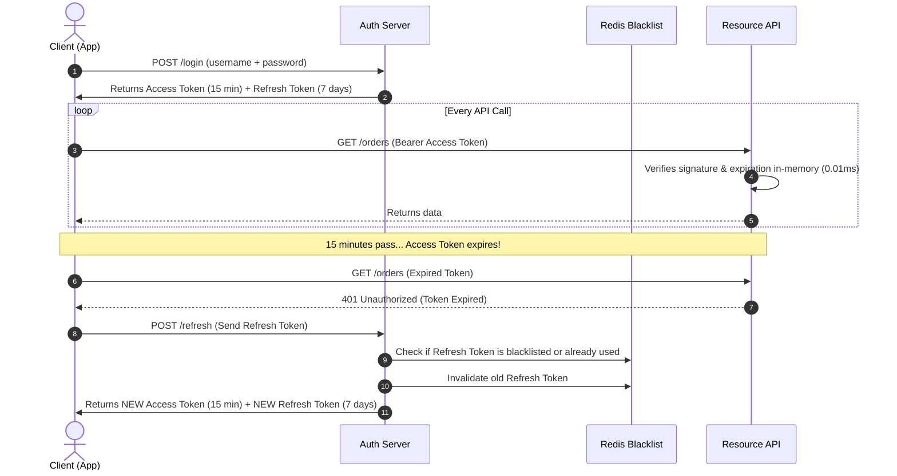
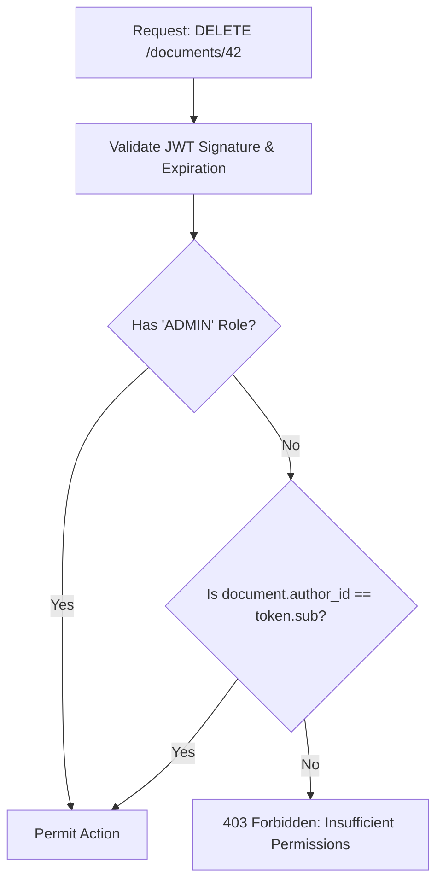

# Chapter 14: Enterprise Security, OAuth2, JWT & Cryptographic RBAC

> **Zero-Prerequisite Intuition: The "Airport Security & Boarding Pass Token System"**
> Why don't web applications ask you to type your password on every single click?
> 
> Imagine if you went to an airport, and every single time you wanted to buy a bottle of water, enter the restroom, or board the plane, the security guards forced you to pull out your birth certificate, passport, and call your local police station to verify your identity. The airport would grind to a halt within five minutes!
> 
> Instead, airports use a two-step token system:
> 
> 1. **Authentication (Passport Control):** You show your official government passport **once** at the check-in desk. The agent verifies your face, confirms your identity, and validates your booking.
> 2. **The Token (The Boarding Pass):** The agent hands you a piece of paper: the **Boarding Pass**. It states: *"Alice, Flight 404, Seat 12A, Zone 2. Expires at 3:15 PM."* Most importantly, it is stamped with a **cryptographic holographic seal** that only the airline can generate.
> 3. **Authorization (The Gate Agent):** When you board the plane, the flight attendant doesn't call government headquarters. They look at your boarding pass, check that the holographic seal hasn't been tampered with, verify that the time is before 3:15 PM, and let you board!
> 4. **Role-Based Access (First Class vs Economy):** If your boarding pass says "Economy", you cannot walk into the First-Class Lounge. If you attempt to enter the Cockpit, you are detained—your token does not carry the "Pilot" role.
> 
> In modern software, a **JSON Web Token (JWT)** is your digital boarding pass, **Argon2/Bcrypt** is how we protect passwords in the vault, and **RBAC (Role-Based Access Control)** is the security guard checking your permissions at every doorway.

---

## 1. Passwords Done Right: Cryptographic Hashing vs Encryption

### Why Plaintext Passwords Are a Crime
If an attacker breaches your database and you stored passwords as plain text (e.g., `hunter2`), the attacker steals every user's credentials immediately. Because humans reuse passwords across multiple sites, you compromise your users across the entire internet.

### Encryption vs Hashing (Spoon-Fed Clarity)
* **Encryption is Two-Way:** You take a message, scramble it with a key, and someone with the key can **unscramble** it back to the original text. (Example: sending private messages over WhatsApp).
* **Hashing is One-Way:** You take a message and put it through a mathematical meat grinder. You get a unique scrambled fingerprint. **It is mathematically impossible to reverse the grinder and turn hamburger back into a cow!**



### Why MD5 and SHA-256 Are Dead for Passwords
Standard hashing algorithms like MD5 or SHA-256 were designed to be **ultra-fast** (for checksumming files). Modern GPUs can compute **over 100 billion SHA-256 hashes per second**. An attacker with a cheap gaming PC can crack an 8-character password in less than 30 seconds using brute-force rainbow tables!

### The Modern Standard: Argon2id & Bcrypt (Memory-Hard Hashing)
To protect passwords, we use **slow, memory-hard algorithms**:
1. **Salt:** A random, unique string generated for every user (e.g., `x7K#9!`). Even if two users choose the password `password123`, their resulting hashes are completely different, defeating rainbow tables.
2. **Work Factor / Memory Hardness:** Algorithms like **Argon2id** force the computer to allocate 64 megabytes of RAM and iterate hundreds of times to compute a single hash. This makes GPU brute-forcing economically impossible.

```python
# password_security.py
import secrets
import hmac
import hashlib

# Python 3.12+ standard library implementation of salted PBKDF2 with SHA-256
def hash_password(password: str) -> str:
    """Generates a cryptographically secure salted password hash."""
    # 1. Generate 16 bytes of cryptographically secure random salt
    salt = secrets.token_bytes(16)
    
    # 2. Derive a 32-byte key using 600,000 iterations of HMAC-SHA256 (OWASP standard)
    derived_key = hashlib.pbkdf2_hmac(
        hash_name="sha256",
        password=password.encode("utf-8"),
        salt=salt,
        iterations=600_000
    )
    
    # 3. Store salt and derived hash together formatted in hex
    return f"{salt.hex()}:{derived_key.hex()}"

def verify_password(stored_record: str, provided_password: str) -> bool:
    """Verifies a password attempt in constant time to prevent timing attacks."""
    salt_hex, original_hash_hex = stored_record.split(":")
    salt = bytes.fromhex(salt_hex)
    original_hash = bytes.fromhex(original_hash_hex)
    
    # Re-compute hash using the exact same salt and iteration count
    candidate_hash = hashlib.pbkdf2_hmac(
        hash_name="sha256",
        password=provided_password.encode("utf-8"),
        salt=salt,
        iterations=600_000
    )
    
    # CRITICAL: hmac.compare_digest compares in CONSTANT TIME (prevents timing attacks)
    return hmac.compare_digest(candidate_hash, original_hash)
```

---

## 2. The Anatomy of a JSON Web Token (JWT)

A **JSON Web Token (JWT)** is a compact, URL-safe string divided into three sections separated by periods (`.`):

$$\text{JWT} = \underbrace{\text{Header}}_{\text{Algorithm \& Type}} \,.\, \underbrace{\text{Payload}}_{\text{Claims / Identity}} \,.\, \underbrace{\text{Signature}}_{\text{Cryptographic Seal}}$$



### The #1 Beginner Misconception: "JWTs Are Encrypted"
> **CRITICAL FACT:** Standard JWTs are **NOT** encrypted! They are merely **Base64URL encoded**.
> 
> Anyone who intercepts a JWT can paste it into `jwt.io` and read every field inside the payload in plain English.
> * **What a JWT guarantees:** It guarantees **Integrity** (nobody has tampered with or altered the data), NOT confidentiality.
> * **Rule of Law:** Never put secret API keys, passwords, credit card numbers, or sensitive PII inside a JWT payload!

### Standard JWT Claims (RFC 7519)
* **`sub` (Subject):** The unique identifier of the user (e.g., `user_9872`).
* **`exp` (Expiration Time):** Unix timestamp after which the token is strictly invalid.
* **`iat` (Issued At):** Unix timestamp when the token was created.
* **`iss` (Issuer):** Who created the token (e.g., `https://auth.company.com`).
* **`jti` (JWT ID):** A unique random UUID for this specific token (used for blacklisting and preventing replay attacks).

### Symmetric (HS256) vs Asymmetric (RS256) Signing
* **HS256 (Shared Secret):** Both the authorization server and the API server share the exact same password (`SECRET_KEY`). If a microservice needs to verify the token, it must know the secret key. If one service gets hacked, the attacker can forge tokens for the entire company!
* **RS256 (Public / Private Keypair):** The Auth Server holds a **Private Key** (kept in a secure vault) to sign tokens. Every microservice has the **Public Key** to verify signatures. Even if an attacker hacks 5 microservices, they cannot forge a single valid token because they don't have the private key!

---

## 3. The Enterprise Token Lifecycle: Access + Refresh Rotation

Stateless tokens have one glaring problem: **You cannot easily revoke a stateless JWT.**
If an employee is fired, but their JWT has an expiration time 8 hours from now, their token remains valid across all servers until 8 hours expire!

### The Two-Token Defense System
To solve this, modern production architectures use two separate tokens:



### The Refresh Token Rotation Trap (Replay Attack Defense)
What happens if a hacker steals the refresh token?
1. Every time a refresh token is used, the server **immediately revokes it** and issues a brand-new refresh token (Refresh Token Rotation).
2. If the auth server detects that an **already-used refresh token** is presented a second time, it triggers a security alarm: **it assumes a theft took place, and immediately revokes all refresh tokens belonging to that user's entire token family!**

---

## 4. Declarative RBAC & ABAC in FastAPI

### What is RBAC and ABAC?
* **RBAC (Role-Based Access Control):** Permissions are assigned to roles (e.g., `ADMIN`, `MODERATOR`, `USER`). You check: *"Does the user have the ADMIN role?"*
* **ABAC (Attribute-Based Access Control):** Permissions consider dynamic attributes: time of day, user location, or resource ownership. You check: *"Is the user an ADMIN, OR is this user the original author of the document?"*



---

## 5. Industrial Security Engine: Complete Implementation

Here is an end-to-end, runnable security architecture featuring password hashing, cryptographic JWT creation, token decoding, dependency injection, and declarative RBAC enforcement:

```python
# enterprise_auth_engine.py
import time
import uuid
import hmac
import hashlib
import json
import base64
from typing import Annotated
from enum import Enum
from fastapi import FastAPI, Depends, HTTPException, status, Security
from fastapi.security import HTTPBearer, HTTPAuthorizationCredentials
from pydantic import BaseModel, Field

# Secret configuration (in production, loaded from environment variables or AWS KMS)
JWT_SECRET_KEY = "SUPER_SECRET_PRODUCTION_SIGNING_KEY_CHANGE_ME"
ALGORITHM = "HS256"
ACCESS_TOKEN_EXPIRE_SECONDS = 900  # 15 minutes

app = FastAPI(title="Cryptographic Auth Service", version="1.0.0")
security_scheme = HTTPBearer()

# -------------------------------------------------------------
# 1. Role Definitions
# -------------------------------------------------------------
class UserRole(str, Enum):
    USER = "USER"
    EDITOR = "EDITOR"
    ADMIN = "ADMIN"

# Role hierarchy: higher roles inherit privileges of lower roles
ROLE_HIERARCHY = {
    UserRole.ADMIN: {UserRole.ADMIN, UserRole.EDITOR, UserRole.USER},
    UserRole.EDITOR: {UserRole.EDITOR, UserRole.USER},
    UserRole.USER: {UserRole.USER}
}

# -------------------------------------------------------------
# 2. Pure Python Standard Library JWT Engine (No External C-Libs)
# -------------------------------------------------------------
def base64url_encode(data: bytes) -> str:
    """Encodes bytes into a URL-safe Base64 string without trailing '=' padding."""
    return base64.urlsafe_b64encode(data).rstrip(b"=").decode("utf-8")

def base64url_decode(data: str) -> bytes:
    """Decodes a URL-safe Base64 string, restoring required '=' padding."""
    padding = b"=" * (4 - (len(data) % 4))
    return base64.urlsafe_b64decode(data.encode("utf-8") + padding)

class TokenPayload(BaseModel):
    sub: str                  # User ID
    email: str
    role: UserRole
    exp: int                  # Expiration timestamp
    iat: int                  # Issued-at timestamp
    jti: str                  # Unique Token ID

def create_access_token(user_id: str, email: str, role: UserRole) -> str:
    """Assembles and signs a cryptographic JWT token."""
    now = int(time.time())
    header = {"alg": ALGORITHM, "typ": "JWT"}
    payload = {
        "sub": user_id,
        "email": email,
        "role": role.value,
        "iat": now,
        "exp": now + ACCESS_TOKEN_EXPIRE_SECONDS,
        "jti": str(uuid.uuid4())
    }
    
    encoded_header = base64url_encode(json.dumps(header).encode("utf-8"))
    encoded_payload = base64url_encode(json.dumps(payload).encode("utf-8"))
    signing_input = f"{encoded_header}.{encoded_payload}".encode("utf-8")
    
    # Generate cryptographic HMAC-SHA256 signature
    signature = hmac.new(JWT_SECRET_KEY.encode("utf-8"), signing_input, hashlib.sha256).digest()
    encoded_signature = base64url_encode(signature)
    
    return f"{encoded_header}.{encoded_payload}.{encoded_signature}"

def decode_and_verify_token(token: str) -> TokenPayload:
    """Verifies signature, expiration, and format. Rejects tampered tokens."""
    try:
        parts = token.split(".")
        if len(parts) != 3:
            raise ValueError("Token must have exactly 3 parts")
        
        encoded_header, encoded_payload, encoded_signature = parts
        signing_input = f"{encoded_header}.{encoded_payload}".encode("utf-8")
        
        # 1. Verify Signature in constant time
        expected_sig = hmac.new(JWT_SECRET_KEY.encode("utf-8"), signing_input, hashlib.sha256).digest()
        provided_sig = base64url_decode(encoded_signature)
        
        if not hmac.compare_digest(expected_sig, provided_sig):
            raise HTTPException(
                status_code=status.HTTP_401_UNAUTHORIZED,
                detail="Invalid token signature (Tampering detected!)"
            )
            
        # 2. Check Expiration
        payload_data = json.loads(base64url_decode(encoded_payload).decode("utf-8"))
        if int(time.time()) > payload_data["exp"]:
            raise HTTPException(
                status_code=status.HTTP_401_UNAUTHORIZED,
                detail="Token has expired. Please refresh your session."
            )
            
        return TokenPayload(**payload_data)
        
    except HTTPException:
        raise
    except Exception as exc:
        raise HTTPException(
            status_code=status.HTTP_401_UNAUTHORIZED,
            detail=f"Malformed security credentials: {str(exc)}"
        )

# -------------------------------------------------------------
# 3. Authentication & RBAC Dependencies
# -------------------------------------------------------------
async def get_current_user(
    credentials: Annotated[HTTPAuthorizationCredentials, Depends(security_scheme)]
) -> TokenPayload:
    """Extracts bearer token and validates cryptographic integrity."""
    return decode_and_verify_token(credentials.credentials)

class RequireRole:
    """Declarative Role Requirement Dependency Factory."""
    def __init__(self, minimum_role: UserRole):
        self.minimum_role = minimum_role

    def __call__(self, user: Annotated[TokenPayload, Depends(get_current_user)]) -> TokenPayload:
        allowed_roles = ROLE_HIERARCHY.get(self.minimum_role, set())
        if user.role not in allowed_roles:
            raise HTTPException(
                status_code=status.HTTP_403_FORBIDDEN,
                detail=f"Access denied: Requires role '{self.minimum_role.value}'. You have '{user.role.value}'."
            )
        return user

# -------------------------------------------------------------
# 4. Protected Endpoints with Role Enforcement
# -------------------------------------------------------------
@app.post("/auth/demo-token")
def generate_demo_token(role: UserRole = UserRole.USER):
    """Utility endpoint to mint test tokens with different privilege levels."""
    token = create_access_token(user_id="user_8831", email="engineer@enterprise.com", role=role)
    return {"access_token": token, "token_type": "Bearer", "expires_in": ACCESS_TOKEN_EXPIRE_SECONDS}

@app.get("/api/dashboard")
def general_user_dashboard(user: Annotated[TokenPayload, Depends(RequireRole(UserRole.USER))]):
    return {"message": f"Welcome, {user.email}! You have basic USER privileges."}

@app.get("/api/admin/metrics")
def admin_only_metrics(admin_user: Annotated[TokenPayload, Depends(RequireRole(UserRole.ADMIN))]):
    return {
        "status": "HEALTHY",
        "financial_volume_usd": 12845000,
        "unlocked_by": admin_user.email
    }
```

---

## 6. Staff Interview Traps & Exploit Defense

### Trap 1: The Infamous "Algorithm: none" Exploit
* **The Vulnerability:** In the early days of JWT libraries, the JWT RFC permitted an algorithm named `"none"` for unsecured tokens.
* **The Attack:** An attacker took a valid token payload, changed `"sub": "regular_user"` to `"sub": "admin"`, changed `"alg": "HS256"` in the header to `"alg": "none"`, stripped off the signature, and sent the token. In poorly written libraries, the server saw `"alg": "none"`, skipped signature verification entirely, and granted full root admin rights!
* **The Staff Defense:** **Hardcode the accepted algorithms on the server.** Never trust the algorithm declared inside the incoming JWT header! If the server expects `HS256`, reject any token that declares anything else.

### Trap 2: Cryptographic Timing Attacks
* **The Vulnerability:** Suppose you verify an API key using standard Python equality:
  ```python
  if user_token == REAL_TOKEN: # ❌ VULNERABLE TO TIMING ATTACKS!
      allow_access()
  ```
* **The Attack:** Python's string equality operator `==` compares strings **character by character from left to right** and returns `False` the exact microsecond a character doesn't match. An attacker with a high-precision timer can send thousands of requests:
  - If the first character is wrong, it returns in $1.2\mu\text{s}$.
  - If the first character is correct, it returns in $1.4\mu\text{s}$.
  - By measuring response times, the attacker determines character #1, then character #2, cracking a 32-character secret key without ever knowing it!
* **The Staff Defense:** Always use **`secrets.compare_digest()`** or **`hmac.compare_digest()`**. These functions compare every single byte regardless of where differences occur, taking constant execution time.

### Trap 3: Refresh Token Storage: LocalStorage vs HttpOnly Cookies
* **The Senior Architectural Debate:** Where should frontend web applications store authentication tokens?
  - **`localStorage`:** Vulnerable to **XSS (Cross-Site Scripting)**. If any third-party npm package has a vulnerability, malicious JavaScript can run `localStorage.getItem("token")` and exfiltrate your credentials.
  - **`HttpOnly, Secure, SameSite=Strict` Cookie:** Inaccessible to JavaScript. Even if malicious script runs on the page, it cannot read the cookie. This is the gold standard for browser session tokens.

---

## Master Checklist for Chapter 19

| Concept | Entry-Level Mental Model | Senior / Staff Production Rule |
| :--- | :--- | :--- |
| **Password Storage** | Mathematical meat grinder | Never encrypt; hash with salted **Argon2id** or PBKDF2 ($>600,000$ iterations) |
| **JWT Anatomy** | Boarding pass with holographic seal | Base64URL encoded; guarantees integrity, NOT confidentiality |
| **Signature Verification** | Checking the airline's official stamp | Use `hmac.compare_digest` in constant time; hardcode allowed algorithms |
| **Token Expiration** | Boarding pass expires before departure | Short-lived Access Token (15 min) + Refresh Token Rotation with family invalidation |
| **RBAC Enforcement** | First Class vs Cockpit access | Enforced via declarative dependency injection factories (`RequireRole`) |
| **Storage Security** | Keeping your passport in an inside pocket | Store browser tokens in `HttpOnly`, `Secure`, `SameSite=Strict` cookies |


## Exercises

Three graded exercises for this chapter (two coding, one debugging) with hidden tests:

```bash
python exercises/run.py --init   # once: creates exercises/ch14.py stubs
python exercises/run.py 14       # run the hidden tests against your solution
```

Attempt first; the reference solutions are in `exercises/_answers/ch14.py`.


## Further Reading

- [JWT introduction](https://jwt.io/introduction)
- [OWASP Authentication cheat sheet](https://cheatsheetseries.owasp.org/cheatsheets/Authentication_Cheat_Sheet.html)
- [OWASP Password Storage cheat sheet](https://cheatsheetseries.owasp.org/cheatsheets/Password_Storage_Cheat_Sheet.html)


---

## Check Yourself

Answer in your head or on paper first, then open each answer.

<details>
<summary><strong>1.</strong> What are the three parts of a JWT?</summary>

Header, payload (claims), signature, base64url-encoded and joined by dots. The payload is encoded, not encrypted.

</details>

<details>
<summary><strong>2.</strong> Why never put secrets in a JWT payload?</summary>

Anyone holding the token can decode the payload; only the signature prevents tampering.

</details>

<details>
<summary><strong>3.</strong> Authentication versus authorisation?</summary>

Authentication proves who you are; authorisation decides what you may do (RBAC maps roles to permissions).

</details>

<details>
<summary><strong>4.</strong> Why hash passwords with bcrypt or argon2 rather than SHA-256?</summary>

They are deliberately slow and salted, making brute force expensive; a fast hash can be tried billions of times per second.

</details>
