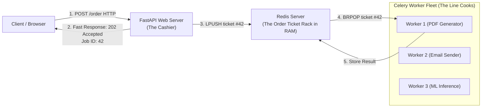
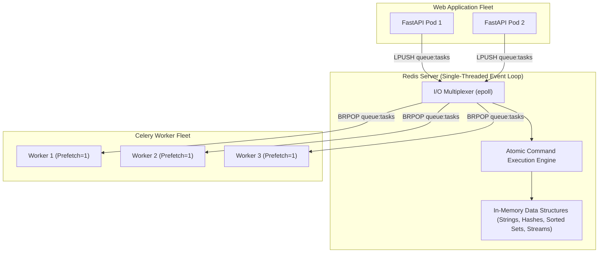
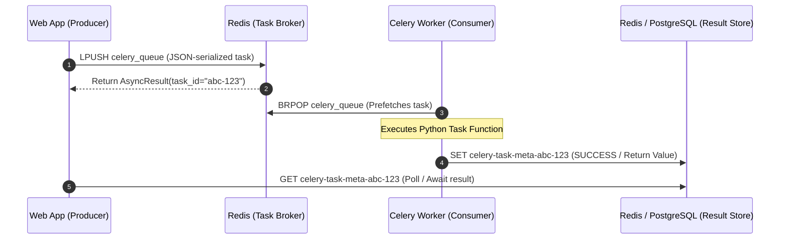
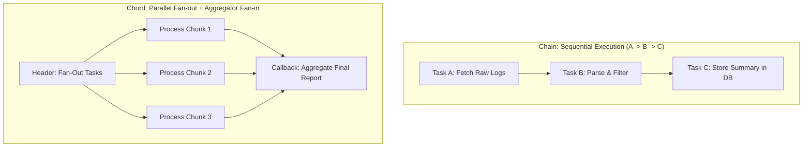

# Chapter 15: Distributed Task Queues (Celery & Redis Architecture)

> **The Enterprise Asynchronous Tier**
> In modern production systems, web servers (FastAPI, Django, Flask) must never perform heavy computation, external third-party API calls, PDF generation, email dispatch, or large database mutations synchronously within the HTTP request-response cycle. Blocking a web worker thread for 5 seconds destroys your server's concurrency and cascades into gateway timeouts.
> 
> Production Python architectures decouple synchronous web requests from asynchronous background execution using **Distributed Task Queues**. This chapter is an advanced deep dive into the internals of **Redis**, the architecture of **Celery**, failure recovery, task idempotency, distributed locking, and production worker tuning.

---

## 0. Zero-Prerequisite Foundations: Why Do We Need Redis and Celery?

> **The "Fast-Food Cashier & Line Cook" Metaphor**
> Imagine you walk into a fast-food restaurant at lunchtime to order a gourmet burger.
> 
> * **The Broken Synchronous World (No Task Queue):**
>   The cashier takes your cash, and then says: *"Please stand here at the register while I walk into the kitchen, knead the dough, bake the bun, grind the meat, and grill the patty for 15 minutes."* 
>   While the cashier is in the kitchen cooking your burger, **nobody else can order**! A line of 100 furious customers stretches out the door, and the restaurant crashes.
> 
> * **The Production Asynchronous World (With Redis & Celery):**
>   1. **The Cashier (FastAPI / Web Server):** Takes your order in **0.05 seconds**, prints a receipt ticket (`Order #42`), hands it to you, slides the ticket onto the kitchen counter rack, and immediately turns to say: *"Next customer please!"*
>   2. **The Order Ticket Rack (The Message Broker — Redis):** An ultra-fast, shared counter where order tickets are placed in a neat, first-in-first-out line.
>   3. **The Line Cooks in the Kitchen (The Background Workers — Celery):** Multiple independent cooks who pull tickets off the rack, cook the burgers, generate the invoices, send the emails, and mark the order as complete!



### Why Can't We Just Use a Python `dict` or a Database?

A newcomer to backend engineering often asks two brilliant questions:

#### 1. "Why can't I just store the tasks in a regular Python dictionary (`my_tasks = []`)?"
A Python dictionary lives inside the private physical RAM of **one single Python process on one machine**. 
In real production, you run 10 separate web server containers across 3 cloud servers behind a load balancer. If a user connects to Container #1 and it puts a task in its local dictionary, Container #2 and your Celery worker running on a completely different machine have **zero access** to Container #1's memory!
**Redis is an independent, standalone server running on the network.** All 10 web containers and all 50 worker servers connect to Redis over TCP sockets, sharing one single, synchronized state.

#### 2. "Why not just use PostgreSQL or MySQL as the task queue?"
Relational databases write data to physical disk drives (NVMe SSDs) with heavy transaction logging, page locking, and table metadata updates. 
* Writing to a disk database takes **5 to 20 milliseconds**.
* **Redis lives 100% inside physical RAM.** Reading or writing to Redis takes **0.2 milliseconds (200 microseconds)**—roughly **50x to 100x faster** than disk! Redis can easily handle **100,000+ operations per second** on a single CPU core without breaking a sweat.

---

## 1. Redis Internals for Python Engineers

Redis (**RE**mote **DI**ctionary **S**erver) is not merely a key-value store; it is an in-memory data structures server powered by an event-driven, single-threaded I/O multiplexer (`epoll` on Linux, `kqueue` on BSD/macOS).



### Redis Atomicity & Lua Scripting

Because Redis executes commands sequentially on a single thread, basic individual commands (`INCR`, `HSET`, `LPUSH`) are guaranteed to be atomic. However, compound business logic requiring a "Check-Then-Act" sequence is vulnerable to race conditions unless executed via **Redis Lua Scripts**.

When Redis executes a Lua script, the entire script runs atomically from start to finish without any other client command interleaving.

#### Production Distributed Mutex Lock with Atomic Lua Release

```python
# redis_lock.py
import uuid
import time
import redis

client = redis.Redis(host="localhost", port=6379, db=0)

class RedisDistributedLock:
    # Atomic Lua script: only delete the lock IF the token matches our owner ID!
    # Prevents deleting someone else's lock if our task took longer than TTL!
    RELEASE_LUA_SCRIPT = """
    if redis.call("get", KEYS[1]) == ARGV[1] then
        return redis.call("del", KEYS[1])
    else
        return 0
    end
    """

    def __init__(self, redis_client: redis.Redis, lock_key: str, ttl_seconds: int = 10):
        self.client = redis_client
        self.lock_key = lock_key
        self.ttl = ttl_seconds
        self.token = str(uuid.uuid4())
        self._release_script = self.client.register_script(self.RELEASE_LUA_SCRIPT)

    def acquire(self, blocking: bool = True, timeout: float = 5.0) -> bool:
        start_time = time.time()
        while True:
            # NX = Only set if Not eXists; EX = Set Expiration in seconds
            acquired = self.client.set(self.lock_key, self.token, nx=True, ex=self.ttl)
            if acquired:
                return True
            if not blocking or (time.time() - start_time) >= timeout:
                return False
            time.sleep(0.05) # Backoff before retrying

    def release(self) -> bool:
        result = self._release_script(keys=[self.lock_key], args=[self.token])
        return result == 1

    def __enter__(self):
        if not self.acquire():
            raise TimeoutError(f"Could not acquire distributed lock for key: {self.lock_key}")
        return self

    def __exit__(self, exc_type, exc_val, exc_tb):
        self.release()
```

---

## 2. Celery Architecture & Worker Lifecycles

Celery is an asynchronous distributed task queue built around message brokers (Redis or RabbitMQ) and result backends.



### Critical Production Gotcha: Prefetch Limits & Starvation

By default, Celery configures `worker_prefetch_multiplier = 4`. If you have 4 worker concurrency processes, Celery will prefetch **16 tasks** from Redis into local worker memory.

* **The Problem:** If Task #1 takes 20 minutes (e.g. video rendering) and Tasks #2–#16 take 100ms each, those 15 quick tasks are trapped sitting idle inside Worker 1's local memory queue while Worker 2 and Worker 3 sit completely idle with 0% CPU!
* **The Production Fix:** For heterogeneous workloads with long-running tasks, always set:
  ```python
  worker_prefetch_multiplier = 1
  task_acks_late = True
  ```
  `task_acks_late = True` ensures the task is acknowledged to Redis **only after the task successfully finishes**, so if the worker pod crashes mid-execution, Redis safely re-delivers the task to another worker!

---

## 3. Advanced Celery Pipeline Workflows (Canvas)

In complex production pipelines, tasks are rarely isolated. Celery Canvas provides algebraic orchestration primitives:



### Production Celery Application Configuration & Canvas Implementation

```python
# tasks.py
from celery import Celery, chain, chord, group
from celery.exceptions import MaxRetriesExceededError
import structlog
import time

logger = structlog.get_logger()

app = Celery("enterprise_pipeline")

app.conf.update(
    broker_url="redis://localhost:6379/1",
    result_backend="redis://localhost:6379/2",
    task_serializer="json",
    accept_content=["json"],
    result_serializer="json",
    timezone="UTC",
    enable_utc=True,
    
    # CRITICAL PRODUCTION TUNING
    worker_prefetch_multiplier=1,
    task_acks_late=True,
    task_reject_on_worker_lost=True,
    
    # Memory Leak Prevention: Recycle worker processes after 200 tasks
    worker_max_tasks_per_child=200,
    worker_max_memory_per_child=300_000, # 300 MB limit per worker process
)

# 1. Resilient Task with Jitter Backoff
@app.task(bind=True, max_retries=5, default_retry_delay=2)
def send_webhook_notification(self, webhook_url: str, payload: dict):
    try:
        logger.info("dispatching_webhook", url=webhook_url, attempt=self.request.retries)
        # Simulate network failure on early attempts
        if self.request.retries < 2:
            raise ConnectionError("Upstream gateway reset connection")
        return {"status": "DELIVERED", "url": webhook_url}
    except ConnectionError as exc:
        # Exponential backoff: 2s, 4s, 8s, 16s... with random jitter
        countdown = (2 ** self.request.retries) + (time.time() % 1)
        logger.warn("webhook_failed_retrying", error=str(exc), countdown=countdown)
        raise self.retry(exc=exc, countdown=countdown)

# 2. Parallel Processing with Chords
@app.task
def process_data_slice(chunk_id: int) -> int:
    time.sleep(0.5)
    return chunk_id * 10

@app.task
def aggregate_results(results: list) -> int:
    total = sum(results)
    logger.info("aggregation_complete", total=total)
    return total

def run_fanout_fanin_pipeline():
    # Chord: Parallel group of tasks followed by a single aggregator callback
    header = group(process_data_slice.s(i) for i in range(10))
    callback = aggregate_results.s()
    workflow = chord(header)(callback)
    return workflow.id
```

---

## 4. Idempotency & The Dead Letter Queue (DLQ)

In distributed architectures, **at-least-once delivery** is the standard guarantee. A task might be delivered twice if a network acknowledgement is dropped.

### The Idempotency Key Pattern

Every task modifying state (e.g. charging a payment, creating an invoice) must track an **Idempotency Key** in Redis:

```python
@app.task(bind=True)
def process_billing_transaction(self, idempotency_key: str, account_id: str, amount_cents: int):
    redis_client = redis.Redis(host="localhost", port=6379, db=3)
    
    # Check if transaction was already processed
    idemp_key = f"idempotency:billing:{idempotency_key}"
    
    # SET with NX: returns True only if this is the FIRST time we see this key
    is_new = redis_client.set(idemp_key, "PROCESSING", nx=True, ex=86400) # 24h TTL
    
    if not is_new:
        status = redis_client.get(idemp_key).decode()
        logger.warn("duplicate_task_suppressed", key=idempotency_key, current_status=status)
        return {"status": "ALREADY_PROCESSED", "idempotency_key": idempotency_key}

    try:
        # Execute non-reversible external financial mutation
        charge_id = execute_stripe_charge(account_id, amount_cents)
        redis_client.set(idemp_key, f"COMPLETED:{charge_id}", ex=86400)
        return {"status": "SUCCESS", "charge_id": charge_id}
    except Exception as e:
        # Clear key or flag failure to allow retry
        redis_client.delete(idemp_key)
        raise e
```

---

## 5. Senior Production Runbook: Triage Common Celery Disasters

| Symptom | Root Cause | Immediate Remediation |
| :--- | :--- | :--- |
| **Worker RAM keeps growing until OOMKilled** | Python memory fragmentation / C-extension buffer leaks. | Set `worker_max_tasks_per_child = 100` and `worker_max_memory_per_child = 250000` to recycle workers. |
| **Tasks piling up in Redis despite workers having low CPU** | High `worker_prefetch_multiplier` holding tasks in starved processes. | Set `worker_prefetch_multiplier = 1` and `task_acks_late = True`. |
| **Duplicate task execution on server restart** | Broker re-delivers unacknowledged tasks that were already halfway done. | Implement the Idempotency Key Pattern in Redis before running side-effects. |
| **Redis memory usage explosion** | Celery storing task results indefinitely without TTL eviction. | Set `result_expires = 3600` (1 hour) or disable result storage for fire-and-forget tasks (`ignore_result = True`). |
