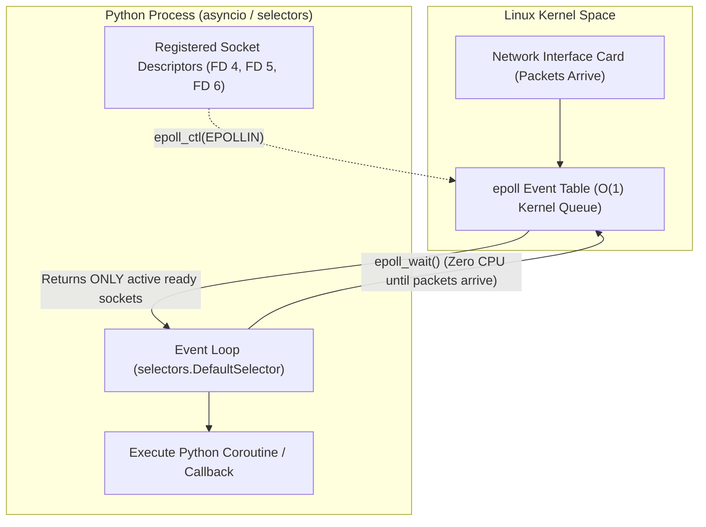
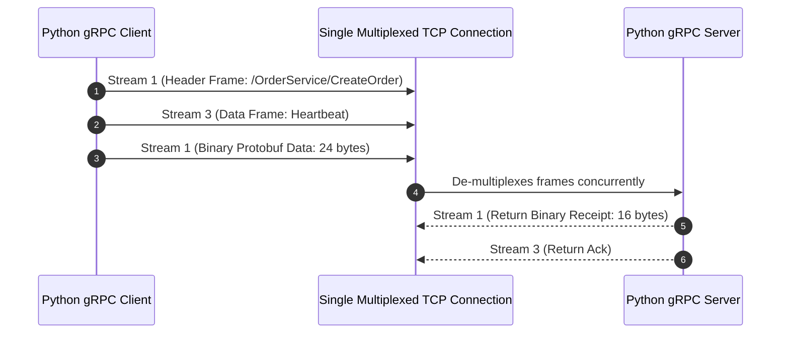
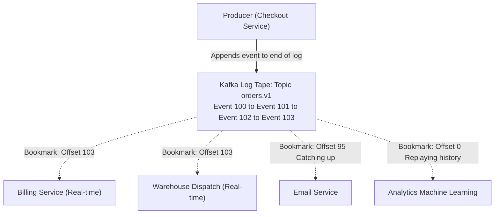
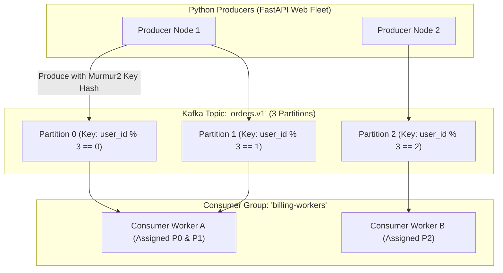

# Chapter 16: Event-Driven Python, Apache Kafka, gRPC, & Networking Internals

> **Beyond REST and HTTP/1.1**
> In high-scale distributed architectures and agentic AI platforms, simple JSON-over-HTTP/1.1 REST endpoints are often too slow, un-typed, and inefficient. Inter-service microservice communication demands ultra-fast, binary-serialized **gRPC over HTTP/2**, non-blocking **low-level OS sockets**, and decoupled, event-driven streaming with **Apache Kafka**.
> 
> This chapter covers low-level network I/O, Protocol Buffers wire mechanics, production gRPC services with streaming, and enterprise Apache Kafka pipelines in Python.

---

## 1. Network Sockets & Non-Blocking I/O (`selectors` & `epoll`)

Every web framework (`FastAPI`, `Uvicorn`, `Node.js`, `Go net/http`) is fundamentally an abstraction over the operating system's **BSD Socket API** and **I/O Multiplexing**.



### The Non-Blocking Event Loop from Scratch

Here is how Python's `asyncio` works under the hood using `selectors.DefaultSelector` (which automatically selects `epoll` on Linux, `kqueue` on macOS, and `select` on Windows):

```python
# raw_event_loop.py
import socket
import selectors

# Automatically binds to epoll on Linux, kqueue on macOS
selector = selectors.DefaultSelector()

def accept_connection(server_sock: socket.socket):
    client_sock, client_addr = server_sock.accept()
    print(f"[TCP] New incoming connection from {client_addr}")
    client_sock.setblocking(False) # Non-blocking socket!
    
    # Register client socket for READ events
    selector.register(client_sock, selectors.EVENT_READ, read_client_data)

def read_client_data(client_sock: socket.socket):
    data = client_sock.recv(4096)
    if data:
        print(f"[RECV {client_sock.getpeername()}] {data.decode().strip()}")
        # Echo data back
        client_sock.sendall(b"HTTP/1.1 200 OK\r\nContent-Length: 13\r\n\r\nHello Socket!")
    # Close connection
    selector.unregister(client_sock)
    client_sock.close()

def run_low_level_server(port: int = 9000):
    server_sock = socket.socket(socket.AF_INET, socket.SOCK_STREAM)
    server_sock.setsockopt(socket.SOL_SOCKET, socket.SO_REUSEADDR, 1)
    server_sock.bind(("0.0.0.0", port))
    server_sock.listen(128)
    server_sock.setblocking(False)

    selector.register(server_sock, selectors.EVENT_READ, accept_connection)
    print(f"High-concurrency non-blocking socket server listening on port {port}...")

    while True:
        # Blocks in kernel space with 0% CPU until socket events occur!
        events = selector.select(timeout=None)
        for key, mask in events:
            callback = key.data
            sock = key.fileobj
            callback(sock)

if __name__ == "__main__":
    run_low_level_server()
```

---

## 2. High-Performance RPC with gRPC and Protocol Buffers

REST over HTTP/1.1 transfers human-readable JSON strings. For high-throughput services, JSON is catastrophic:
1. **Inefficient Wire Size:** Field names (`"transaction_id"`, `"timestamp"`) are repeated in every single packet.
2. **Serialization Overhead:** CPU spends huge cycles parsing strings into floats and numbers.
3. **HTTP/1.1 Head-of-Line Blocking:** A single slow HTTP request blocks the TCP connection.

### The gRPC & HTTP/2 Advantage
* **Protocol Buffers:** Data is serialized into compact, strongly-typed binary wire formats using **Varints** and **Field Tags** (saving up to 80% bandwidth).
* **HTTP/2 Multiplexing:** Multiple bidirectional RPC calls share a **single persistent TCP connection** without blocking each other.



### 1. The Protocol Buffer Contract (`order_service.proto`)

```protobuf
syntax = "proto3";

package enterprise.order;

message OrderItem {
  string sku = 1;
  double price = 2;
  int32 quantity = 3;
}

message OrderRequest {
  string user_id = 1;
  repeated OrderItem items = 2;
  int64 timestamp_epoch_ms = 3;
}

message OrderResponse {
  string order_id = 1;
  enum Status {
    PENDING = 0;
    SUCCESS = 1;
    FAILED = 2;
  }
  Status status = 2;
  double total_amount = 3;
}

service OrderService {
  // Unary RPC
  rpc CreateOrder (OrderRequest) returns (OrderResponse);
  
  // Server-Streaming RPC (Live Order Tracking Telemetry)
  rpc TrackOrderStream (OrderResponse) returns (stream OrderStatusUpdate);
}

message OrderStatusUpdate {
  string order_id = 1;
  string step = 2;
  int64 updated_at = 3;
}
```

### 2. High-Throughput Python gRPC Server Implementation

```python
# grpc_server.py
import grpc
from concurrent import futures
import time
import structlog

# Generated protobuf classes:
# python -m grpc_tools.protoc -I. --python_out=. --grpc_python_out=. order_service.proto
import order_service_pb2 as pb2
import order_service_pb2_grpc as pb2_grpc

logger = structlog.get_logger()

class OrderServiceImpl(pb2_grpc.OrderServiceServicer):
    def CreateOrder(self, request: pb2.OrderRequest, context: grpc.ServicerContext) -> pb2.OrderResponse:
        logger.info("grpc_order_received", user_id=request.user_id, item_count=len(request.items))
        
        # Metadata / Auth check from headers
        metadata = dict(context.invocation_metadata())
        auth_token = metadata.get("authorization")
        if not auth_token:
            context.abort(grpc.StatusCode.UNAUTHENTICATED, "Missing bearer authentication token")

        # Fast business logic calculation
        total = sum(item.price * item.quantity for item in request.items)
        order_id = f"ord_{int(time.time() * 1000)}"

        return pb2.OrderResponse(
            order_id=order_id,
            status=pb2.OrderResponse.Status.SUCCESS,
            total_amount=total
        )

    def TrackOrderStream(self, request: pb2.OrderResponse, context: grpc.ServicerContext):
        """Server-side streaming RPC: push updates over open HTTP/2 stream."""
        stages = ["PAYMENT_VERIFIED", "INVENTORY_ALLOCATED", "DISPATCHED_TO_COURIER", "DELIVERED"]
        for stage in stages:
            time.sleep(1.0) # Simulate asynchronous background progress
            yield pb2.OrderStatusUpdate(
                order_id=request.order_id,
                step=stage,
                updated_at=int(time.time())
            )

def serve():
    # Thread pool for servicing concurrent gRPC calls
    server = grpc.server(
        futures.ThreadPoolExecutor(max_workers=50),
        options=[
            ("grpc.max_send_message_length", 16 * 1024 * 1024),
            ("grpc.max_receive_message_length", 16 * 1024 * 1024),
            ("grpc.http2.min_ping_interval_without_data_ms", 5000),
        ]
    )
    pb2_grpc.add_OrderServiceServicer_to_server(OrderServiceImpl(), server)
    server.add_insecure_port("[::]:50051")
    server.start()
    print("Production gRPC Server listening on port 50051...")
    server.wait_for_termination()

if __name__ == "__main__":
    serve()
```

---

## 3. Event-Driven Python with Apache Kafka

### 0. Zero-Prerequisite Foundations: Why Do We Need Kafka?

> **The "Airport Flight Status Board & Endless Tape Recorder" Metaphor**
> Why did LinkedIn and the open-source community create Apache Kafka instead of using traditional queues or REST APIs?
> 
> Imagine an order is placed on an e-commerce platform (`Order #992 Placed for $50`):
> 
> * **The Failure of Direct REST APIs:**
>   The Checkout server must synchronously call the Payment Service, then the Warehouse Service, then the Fraud Service, then the Email Service, then the Analytics Database. If the Warehouse server is rebooting, Checkout fails! If Fraud takes 3 seconds, the user's browser hangs.
> 
> * **The Failure of Traditional Queues (RabbitMQ / Redis Lists):**
>   In a standard queue (like a line of people waiting for a bank teller), once a message is pulled, **it is popped and deleted forever**. Only one single worker gets to see it. How do all 5 departments get the event? You would have to duplicate the message into 5 separate queues!
> 
> * **The Kafka Superpower (The Endless Tape Recorder):**
>   Kafka is not a destructive queue. Kafka is an **immutable, append-only disk log** (like an endless cassette tape recorder):
>   1. The Checkout service writes an event to the end of the tape: `[Offset 42: Order #992 placed by User 10]`. It takes **1 millisecond**, and Checkout is done!
>   2. The event **stays on disk** for 7 days (or years). It is never deleted when read!
>   3. **Payment** reads the tape at its own speed, keeping track of its own bookmark (**Offset 42**).
>   4. **Warehouse** reads the tape with its own bookmark.
>   5. **Analytics** can read the entire tape from the beginning of the month.
>   6. If the **Email Service** crashes for 4 hours, it restarts, checks its bookmark, and resumes reading right where it left off with **zero lost events**!



### Core Kafka Concepts Demystified:
* **Event (Record):** A simple statement of historical fact with a timestamp, key, and value (e.g. `{"order_id": 992, "amount": 50}`).
* **Topic:** A named category or feed of events (like a table in SQL or a channel in Slack, e.g. `orders.v1`).
* **Partition:** To handle millions of events per second across multiple hard drives, Kafka slices a topic into parallel sub-logs called **Partitions** (e.g. Partition 0, 1, 2). Events with the same key (e.g. `user_id=42`) always route to the **same partition**, guaranteeing strict chronological order per user.
* **Offset:** A monotonically increasing integer (0, 1, 2, 3...) assigned to each event in a partition. It is simply the line number in the notebook.
* **Consumer Group:** A coordinated cluster of workers that divide partitions among themselves so a high-volume topic is consumed in parallel without duplicate processing.

---

### The Architecture of a Partitioned Topic

Apache Kafka provides strict ordering guarantees per partition, horizontal scalability across clusters, and disk durability via sequential zero-copy disk I/O.



### 1. High-Throughput Production Kafka Producer

In Python, always use `confluent-kafka` (which wraps high-performance native C `librdkafka`), rather than pure-Python libraries:

```python
# kafka_producer.py
from confluent_kafka import Producer
import json
import socket
import structlog

logger = structlog.get_logger()

def delivery_report(err, msg):
    """Callback invoked by librdkafka when message is acknowledged by cluster."""
    if err is not None:
        logger.error("kafka_message_delivery_failed", error=str(err))
    else:
        logger.info(
            "kafka_message_delivered",
            topic=msg.topic(),
            partition=msg.partition(),
            offset=msg.offset()
        )

class ProductionKafkaProducer:
    def __init__(self, bootstrap_servers: str = "localhost:9092"):
        conf = {
            "bootstrap.servers": bootstrap_servers,
            "client.id": socket.gethostname(),
            
            # CRITICAL RELIABILITY TUNING
            "acks": "all",                 # Wait for full in-sync replica (ISR) quorum
            "enable.idempotence": True,    # Prevents duplicate messages on network retries
            "retries": 1000000,
            
            # HIGH THROUGHPUT BATCHING
            "compression.type": "zstd",    # High compression ratio with low CPU cost
            "batch.size": 65536,           # 64 KB batch buffer
            "linger.ms": 20,               # Wait up to 20ms to aggregate batches
        }
        self.producer = Producer(conf)

    def publish_event(self, topic: str, partition_key: str, payload: dict):
        value_bytes = json.dumps(payload).encode("utf-8")
        key_bytes = partition_key.encode("utf-8")
        
        # Partition key guarantees that all events for the SAME user arrive
        # on the SAME partition in strict chronological order!
        self.producer.produce(
            topic=topic,
            key=key_bytes,
            value=value_bytes,
            on_delivery=delivery_report
        )
        # Serve delivery callbacks from previous batches without blocking
        self.producer.poll(0)

    def flush_and_close(self):
        # Flush all internal buffers before process shutdown
        self.producer.flush(timeout=10)
```

### 2. Resilient Consumer with Manual Offset Commit

Never use automatic offset commits (`enable.auto.commit = True`) for mission-critical events. If your consumer crashes while processing a message, automatic commits cause **silent data loss**!

```python
# kafka_consumer.py
from confluent_kafka import Consumer, KafkaError, KafkaException
import json
import sys

def run_resilient_consumer(topic: str = "orders.v1"):
    conf = {
        "bootstrap.servers": "localhost:9092",
        "group.id": "order-processing-service-group",
        "auto.offset.reset": "earliest",
        
        # CRITICAL RELIABILITY: Disable auto-commit!
        "enable.auto.commit": False,
        "max.poll.interval.ms": 300000, # 5 minutes before broker considers consumer dead
    }

    consumer = Consumer(conf)
    consumer.subscribe([topic])
    print(f"Subscribed to topic: {topic}. Listening for events...")

    try:
        while True:
            msg = consumer.poll(timeout=1.0)
            if msg is None:
                continue
            if msg.error():
                if msg.error().code() == KafkaError._PARTITION_EOF:
                    continue
                else:
                    raise KafkaException(msg.error())

            # Decode payload
            event_data = json.loads(msg.value().decode("utf-8"))
            key = msg.key().decode("utf-8") if msg.key() else None

            try:
                # Execute business logic (e.g. charge ledger)
                process_order_event(key, event_data)

                # COMMIT OFFSET ONLY AFTER SUCCESSFUL PROCESSING!
                # Asynchronous commit prevents blocking the polling loop
                consumer.commit(message=msg, asynchronous=False)
            except Exception as e:
                print(f"[ERROR] Failed to process message at offset {msg.offset()}: {e}")
                # Route to Dead Letter Queue (DLQ) topic or alert on-call
                route_to_dlq(msg)
                consumer.commit(message=msg, asynchronous=False)

    except KeyboardInterrupt:
        pass
    finally:
        # Leave consumer group cleanly to trigger fast rebalance
        consumer.close()

def process_order_event(key, data):
    print(f"[CONSUMER SUCCESS] Processed event for key: {key}")

def route_to_dlq(msg):
    print(f"[DLQ] Routed poisoned message {msg.offset()} to DLQ topic")

if __name__ == "__main__":
    run_resilient_consumer()
```

---

## 4. Architecture Selection Guide: When to Use What

| Communication Layer | Protocol | Latency Profile | Best Use Case | Anti-Pattern |
| :--- | :--- | :--- | :--- | :--- |
| **REST / JSON** | HTTP/1.1 or HTTP/2 | 15ms – 50ms | Public customer APIs, frontend web/mobile clients | High-volume internal microservice RPC |
| **gRPC / Protobuf** | HTTP/2 Multiplexed | 1ms – 5ms | Low-latency internal microservice communication, AI model serving | Direct browser clients without gRPC-Web proxy |
| **Redis Tasks (Celery)** | Redis In-Memory | < 5ms dispatch | Fast background task dispatch, delayed jobs, scheduled cron | Long-term event replay, multi-consumer broadcast |
| **Apache Kafka** | TCP Commit Log | 5ms – 20ms | Event-driven choreography, real-time analytics, event sourcing, multi-consumer data streaming | Synchronous request-response queries |
