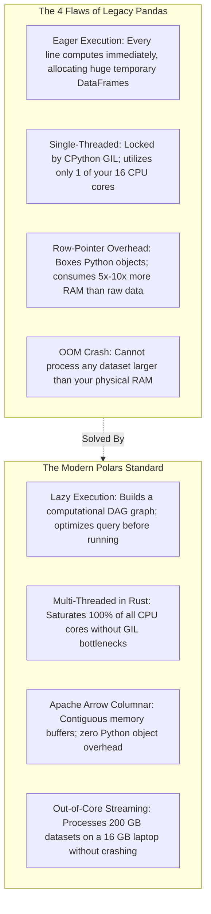
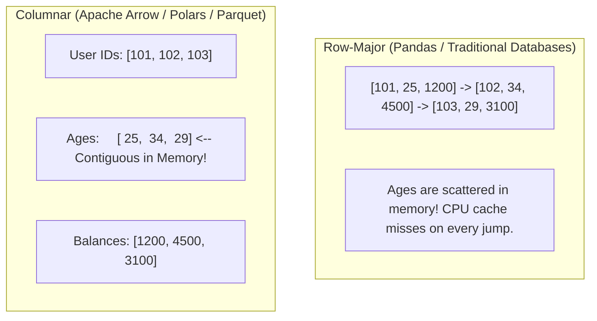
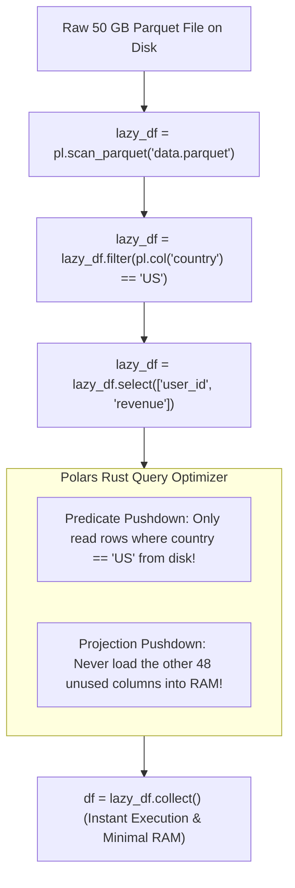
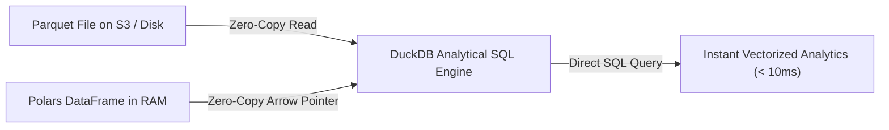

# Chapter 17: Next-Gen Columnar Data Engineering (Polars & DuckDB)

> **Zero-Prerequisite Intuition: The "Index Card Box vs The Microfiche Spool"**
> How do computers process large spreadsheets and tables?
> 
> Imagine a library that contains information on **10 million books**.
> 
> * **The Legacy Pandas Way (Row-Oriented Index Cards):**
>   Each book has its own paper index card: Title, Author, Publish Year, ISBN, Page Count, Price. All 10 million cards sit in boxes.
>   Suppose you ask a simple question: *"What is the average price of all books published after 2020?"*
>   In Pandas, a worker must pick up Card #1, read the title, author, year, find the price, put it down; pick up Card #2, read the title, author, year...
>   To inspect just the price, the worker was forced to drag **10 million entire cards** out of storage into their hands! If the cards weigh 500 pounds (**5x to 10x RAM explosion**), the worker collapses from exhaustion (**Kernel Out-Of-Memory Crash**).
> 
> * **The Modern Polars & Arrow Way (Columnar Microfiche Spools):**
>   Instead of cards, data is organized in **columns**. All 10 million titles are stored together on Tape #1. All 10 million prices are stored together in a single contiguous strip of memory on Tape #2.
>   When you ask for the average price, the system **never touches** the titles, authors, or ISBNs! It grabs Tape #2, streams the numbers directly into the CPU's cache line, and uses hardware **SIMD (Single Instruction, Multiple Data)** to sum 8 numbers simultaneously in a single clock tick!
> 
> In 2026, data engineering in Python has shifted from single-threaded, row-heavy Pandas to **Polars** (written in Rust on Apache Arrow) and **DuckDB** (the "SQLite for Analytical OLAP").

---

## 1. Why Pandas Is Obsolete for Large-Scale Data in 2026

For 15 years, **Pandas** was the king of Python data analysis. But Pandas was designed in 2008 for small financial datasets that fit comfortably in memory. On modern large-scale workloads, Pandas suffers from four architectural flaws:



---

## 2. The Apache Arrow Columnar Standard (Spoon-Fed Foundations)

To understand why Polars and DuckDB are 20x to 100x faster than Pandas, we must look at how bytes are arranged in physical RAM.

### Row-Major vs Columnar Memory Layout
Suppose we have a table of users:

| User ID | Age | Balance |
| :---: | :---: | :---: |
| 101 | 25 | \$1,200 |
| 102 | 34 | \$4,500 |
| 103 | 29 | \$3,100 |



### Why Columnar Layout Speeds Up Compute:
1. **CPU Cache Line Saturation:** Modern CPUs do not read single bytes from RAM; they read **64-byte Cache Lines**. In a columnar layout, a single cache line fetches 16 consecutive 32-bit integers at once!
2. **SIMD Vectorization:** Modern CPU cores have vector registers (AVX-512, ARM NEON). With columnar data, the CPU can execute:
   $$\vec{C} = \vec{A} + \vec{B}$$
   adding eight 64-bit numbers in **one single clock cycle**.
3. **Null Bitmasks:** In Arrow, missing (`null`) values do not take up space with special "NaN" float values. Instead, a compact bitmask (1 bit per row) tracks whether a value exists or is null.

---

## 3. Polars: Eager vs Lazy Execution Engine

Polars provides two APIs:
* **Eager API (`pl.DataFrame`):** Executes commands immediately, just like Pandas.
* **Lazy API (`pl.LazyFrame`):** Does **NOT** run your code when you write it! Instead, it builds a mathematical **Query Execution Plan (DAG)**. When you finally call `.collect()`, the Rust query optimizer inspects your entire script, optimizes it, and runs the fastest possible compiled pipeline.



### The Power of Query Optimizations:
1. **Projection Pushdown:** If your dataset has 100 columns, but your query only uses `user_id` and `revenue`, Polars tells the Parquet reader to physically ignore the other 98 columns on disk. Your disk I/O drops by **$98\%$**!
2. **Predicate Pushdown:** If you filter `filter(pl.col("age") > 65)`, Polars pushes that filter directly into the file reader. It skips entire chunks of rows without ever decompressing them into RAM.

### Production Polars Blueprint

```python
# polars_mastery.py
import polars as pl
from datetime import datetime

# -------------------------------------------------------------
# 1. Creating a LazyFrame: Zero Work Done Yet!
# -------------------------------------------------------------
# scan_parquet reads ONLY the file metadata, not the actual data!
lazy_transactions = pl.LazyFrame({
    "transaction_id": [f"tx_{i}" for i in range(1, 6)],
    "user_id": [101, 102, 101, 103, 102],
    "category": ["GROCERY", "ELECTRONICS", "GROCERY", "TRAVEL", "ELECTRONICS"],
    "amount_cents": [4500, 120000, 3200, 85000, 45000],
    "is_flagged": [False, False, False, True, False],
    "created_at": [
        datetime(2026, 1, 1), 
        datetime(2026, 1, 2), 
        datetime(2026, 1, 3), 
        datetime(2026, 1, 4), 
        datetime(2026, 1, 5)
    ]
})

# -------------------------------------------------------------
# 2. Composing Complex Analytical Queries with Expressions
# -------------------------------------------------------------
# Notice: No square bracket indexing (df['col'])! We use pl.col() expressions.
query = (
    lazy_transactions
    # Filter: Keep only unflagged transactions
    .filter(pl.col("is_flagged") == False)
    
    # Group By & Aggregation: Multi-threaded in Rust without Python GIL!
    .group_by("user_id")
    .agg([
        pl.col("amount_cents").sum().alias("total_spend_cents"),
        pl.col("amount_cents").mean().alias("avg_spend_cents"),
        pl.col("transaction_id").count().alias("transaction_count"),
        
        # Powerful expression: conditional aggregation in a single pass!
        pl.col("amount_cents")
          .filter(pl.col("category") == "GROCERY")
          .sum()
          .alias("grocery_spend_cents")
    ])
    # Filter aggregated results
    .filter(pl.col("total_spend_cents") > 5000)
    .sort("total_spend_cents", descending=True)
)

# -------------------------------------------------------------
# 3. Inspecting the Optimized Physical Execution Plan
# -------------------------------------------------------------
print("=== OPTIMIZED PHYSICAL EXECUTION PLAN ===")
print(query.explain())

# -------------------------------------------------------------
# 4. Materialization: Execute with collect()
# -------------------------------------------------------------
result_df = query.collect()
print("\n=== FINAL AGGREGATED DATAFRAME ===")
print(result_df)
```

---

## 4. Out-of-Core Streaming: Processing 100 GB on a 16 GB Laptop

What happens when your dataset is larger than your physical computer's RAM?
* In **Pandas**: The Python process attempts to allocate memory beyond hardware limits, thrashing swap memory until the operating system freezes and terminates the process with `Out of Memory: Killed process`.
* In **Polars**: You pass **`streaming=True`** to `.collect()`.

### The Streaming Engine Mechanics
Polars breaks the dataset into small batches (e.g., 50,000 rows at a time). It streams Batch #1 through the query pipeline, computes running aggregates, discards the raw batch from RAM, and streams Batch #2.

Memory consumption stays **flat and constant**, regardless of whether you are processing 1 Gigabyte or 1 Terabyte!

```python
# streaming_pipeline.py
import polars as pl

# Out-of-core streaming: Processes arbitrarily large Parquet files without OOM crashes!
def process_massive_dataset(input_parquet_path: str, output_parquet_path: str):
    lazy_plan = (
        pl.scan_parquet(input_parquet_path)
        .filter(pl.col("status") == "COMPLETED")
        .group_by(["region", "product_category"])
        .agg([
            pl.col("revenue_usd").sum().alias("total_revenue"),
            pl.col("customer_id").n_unique().alias("unique_customers")
        ])
    )
    
    # collect(streaming=True) executes in chunked stream mode:
    # Memory footprint remains strictly bounded at < 500 MB RAM!
    result = lazy_plan.collect(streaming=True)
    result.write_parquet(output_parquet_path)
    print(f"Successfully processed massive dataset in streaming mode to {output_parquet_path}")
```

---

## 5. In-Process Analytical SQL with DuckDB

If **SQLite** is the world's most deployed operational database, **DuckDB** is the "SQLite for Analytics" (OLAP).

### What Makes DuckDB Unique?
1. **Serverless & In-Process:** Runs directly inside your Python process. No server daemon to install, configure, or maintain.
2. **Vectorized Columnar Engine:** Processes data in 2,048-value vectors directly through CPU cache.
3. **Zero-Copy Interoperability:** DuckDB can directly query **Polars DataFrames**, **Pandas DataFrames**, **Parquet files on disk**, and **remote S3 buckets** with zero memory copying!



### Complete DuckDB + Polars SQL Integration

```python
# duckdb_analytics.py
import duckdb
import polars as pl

# 1. Create a Polars DataFrame in memory
polars_sales = pl.DataFrame({
    "order_id": [1, 2, 3, 4, 5],
    "country": ["US", "DE", "US", "FR", "US"],
    "amount": [250.0, 180.0, 420.0, 95.0, 310.0]
})

# 2. Query the Polars DataFrame directly using standard PostgreSQL-compatible SQL!
# DuckDB seamlessly discovers 'polars_sales' in the Python local scope!
sql_query = """
    SELECT 
        country,
        COUNT(order_id) AS total_orders,
        SUM(amount) AS total_revenue,
        ROUND(AVG(amount), 2) AS avg_order_value,
        PERCENTILE_CONT(0.5) WITHIN GROUP (ORDER BY amount) AS median_revenue
    FROM polars_sales
    WHERE amount > 100.0
    GROUP BY country
    ORDER BY total_revenue DESC;
"""

# DuckDB executes the SQL query directly on Polars memory with ZERO copies!
result_arrow = duckdb.query(sql_query).pl()

print("=== DUCKDB SQL DIRECT QUERY RESULT ===")
print(result_arrow)
```

---

## 6. Staff Interview Traps & Optimization Pitfalls

### Trap 1: The Accidental Eager Materialization Loop
* **The Scenario:** A candidate writes:
  ```python
  lazy_df = pl.scan_parquet("huge_dataset.parquet")
  for country in ["US", "UK", "DE", "FR"]:
      # FATAL MISTAKE: Calling .collect() inside a loop!
      subset = lazy_df.filter(pl.col("country") == country).collect()
      process(subset)
  ```
* **The Failure:** Calling `.collect()` 4 times forces Polars to scan, parse, and optimize the 50 GB Parquet file **four separate times** from scratch!
* **The Staff Fix:** Never call `.collect()` inside a loop. Either compute the group-by or partition in a single lazy pass, or use Polars' built-in `partition_by()`:
  ```python
  # Single pass: scans the dataset once and partitions efficiently
  all_partitions = (
      pl.scan_parquet("huge_dataset.parquet")
      .filter(pl.col("country").is_in(["US", "UK", "DE", "FR"]))
      .collect()
      .partition_by("country", as_dict=True)
  )
  ```

### Trap 2: String Cardinality & The `StringCache` Trap
* **The Scenario:** You join two large Polars DataFrames on a string column (e.g., `user_id` or `uuid`) categorized as categorical types (`pl.Categorical`).
* **The Bug:** Polars throws `ComputeError: categorical types are not from the same StringCache`.
* **Why it happens:** To maximize speed, Polars converts strings to integer IDs internally. If DataFrame A and DataFrame B were constructed separately, "user_1" might be ID 0 in table A, but ID 5 in table B.
* **The Staff Fix:** Use Polars' global string cache context manager:
  ```python
  with pl.StringCache():
      # All categorical strings share identical global integer mappings
      df1 = pl.read_parquet("file1.parquet")
      df2 = pl.read_parquet("file2.parquet")
      merged = df1.join(df2, on="category")
  ```

---

## Master Checklist for Chapter 21

| Concept | Entry-Level Mental Model | Senior / Staff Production Rule |
| :--- | :--- | :--- |
| **Columnar Storage** | Microfiche spools instead of index cards | Reads only requested columns; CPU cache line saturation and SIMD acceleration |
| **Apache Arrow** | Universal language of tabular memory | In-memory zero-copy interchange; null bitmasks track missing values |
| **Lazy Evaluation** | Blueprints before building the house | Build DAGs with `pl.scan_parquet()`; optimizer applies projection & predicate pushdowns |
| **Streaming Mode** | Drinking water in sips instead of the entire bucket | `collect(streaming=True)` processes datasets larger than RAM with flat memory |
| **DuckDB Engine** | SQLite for analytical aggregation | Embed inside Python; execute SQL directly on Parquet and Polars with zero copy |
| **Loop Materialization** | Never rebuild the house 4 times | Never call `.collect()` in loops; compute in one unified execution graph |


## Further Reading

- [Polars user guide](https://docs.pola.rs/)
- [DuckDB documentation](https://duckdb.org/docs/stable/)
- [Apache Parquet documentation](https://parquet.apache.org/docs/)


---

## Check Yourself

Answer in your head or on paper first, then open each answer.

<details>
<summary><strong>1.</strong> Why is a Polars `LazyFrame` often faster than eager execution?</summary>

It builds a query plan the optimiser can rewrite (predicate/projection pushdown, parallel execution) before running.

</details>

<details>
<summary><strong>2.</strong> Why is Parquet better than CSV for analytics?</summary>

Columnar layout with compression and statistics lets engines read only needed columns/row groups.

</details>

<details>
<summary><strong>3.</strong> When pick DuckDB?</summary>

For in-process analytical SQL over local files/dataframes without running a server.

</details>

<details>
<summary><strong>4.</strong> What is predicate pushdown?</summary>

Applying filters as early as possible, ideally inside the file scan, to avoid reading irrelevant data.

</details>
