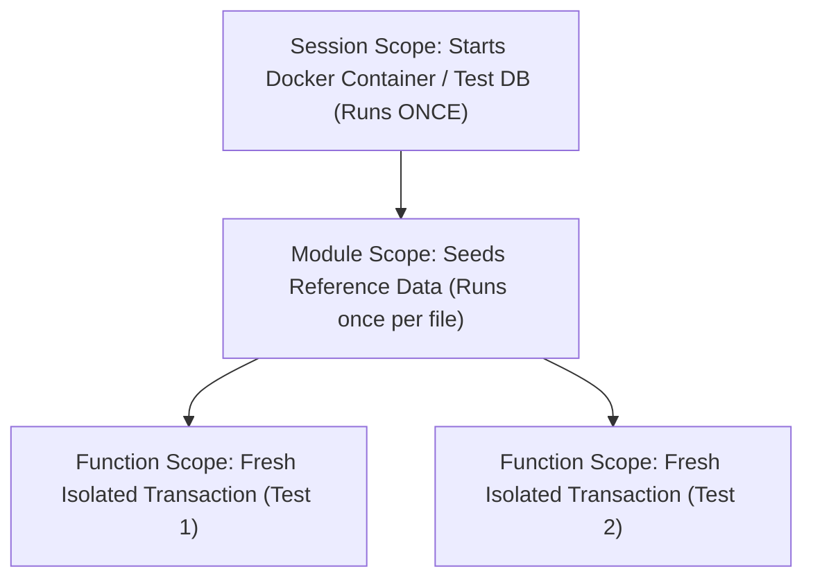
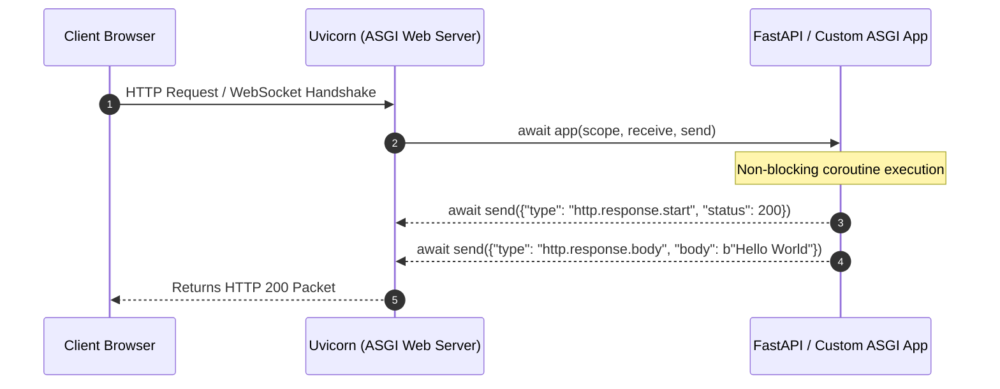

# Chapter 17: Enterprise Testing, Async Mocking Traps, & ASGI Internals

> **Zero-Prerequisite Intuition: The "Movie Stunt Double" Metaphor**
> What is automated testing, and why do we "mock"?
> Imagine you are filming an action movie where the main actor jumps out of an exploding helicopter into an ocean. You wouldn't throw your real \$20-million actor into a live explosion on every single rehearsal take! If the helicopter engine fails, your actor dies and the entire movie studio goes bankrupt.
> 
> Instead, you hire a **Stunt Double**—someone who looks and moves like the actor, but follows safe, scripted choreography.
> 
> In software engineering, your third-party payment gateway (Stripe), email service (SendGrid), and production databases are the "exploding helicopter." If you execute your test suite 500 times a day and each test actually charges a live credit card or sends 500 emails to real customers, you cause massive financial disasters. 
> 
> **Mocking** is creating an identical "stunt double" object in Python that mimics the external system, returns predetermined responses, and allows you to test catastrophic failure conditions safely in memory.

---

## 1. The Pytest Framework & Fixture Scopes

Standard `unittest` (inherited from Java's JUnit in 1999) forces verbose object-oriented boilerplate. Modern enterprise Python exclusively uses **`pytest`**.



### Pytest Fixture Lifecycle & Dependency Injection

A fixture is an explicit dependency provider using Python generators (`yield`):

```python
# test_enterprise_fixtures.py
import pytest
import sqlite3

# Session scope: runs once for the entire 20-minute CI/CD test run
@pytest.fixture(scope="session")
def global_database_engine():
    print("\n[SETUP] Spinning up test database...")
    conn = sqlite3.connect(":memory:")
    yield conn
    print("\n[TEARDOWN] Tearing down test database...")
    conn.close()

# Function scope (default): runs before and after EVERY single test function
@pytest.fixture(scope="function")
def db_transaction(global_database_engine):
    cursor = global_database_engine.cursor()
    cursor.execute("CREATE TABLE accounts (id INT PRIMARY KEY, balance INT)")
    cursor.execute("INSERT INTO accounts VALUES (1, 1000)")
    global_database_engine.commit()
    
    yield cursor # Test executes here!
    
    # Teardown: Clean up state so Test B never sees Test A's mutations!
    cursor.execute("DROP TABLE accounts")
    global_database_engine.commit()

def test_debit_account(db_transaction):
    db_transaction.execute("UPDATE accounts SET balance = balance - 200 WHERE id = 1")
    db_transaction.execute("SELECT balance FROM accounts WHERE id = 1")
    assert db_transaction.fetchone()[0] == 800

def test_fresh_balance_guaranteed(db_transaction):
    # Proves isolation: balance is 1000 again, NOT 800!
    db_transaction.execute("SELECT balance FROM accounts WHERE id = 1")
    assert db_transaction.fetchone()[0] == 1000
```

---

## 2. The #1 Senior Python Interview Trap: Where to Patch?

In interviews, senior candidates frequently fail at mocking because of Python's import namespace mechanics.

### The Golden Rule of `unittest.mock.patch`
> **"Patch where the object is LOOKED UP, not where it is DEFINED."**

Suppose you have an external payment module and a checkout service:

```python
# payment_gateway.py
class StripeClient:
    def charge(self, amount: int) -> str:
        # In real life, hits https://api.stripe.com
        return "real_stripe_charge_id"
```

```python
# checkout_service.py
from payment_gateway import StripeClient  # <-- LOOKUP HAPPENS HERE!

def process_order(amount: int) -> str:
    client = StripeClient()
    return client.charge(amount)
```

#### The Fatal Mistake:
```python
# INCORRECT TEST:
from unittest.mock import patch

# FATAL ERROR: You patched payment_gateway.StripeClient, but checkout_service
# already imported its own local reference to StripeClient at module load time!
# The real Stripe API will STILL be called!
@patch("payment_gateway.StripeClient") 
def test_checkout(mock_stripe):
    process_order(100) # FAILS! Calls real Stripe!
```

#### The Senior Solution:
```python
# CORRECT TEST:
# Patch checkout_service.StripeClient because that is where process_order LOOKS IT UP!
@patch("checkout_service.StripeClient")
def test_checkout_properly_mocked(mock_stripe_cls):
    mock_instance = mock_stripe_cls.return_value
    mock_instance.charge.return_value = "mock_tx_999"
    
    result = process_order(100)
    assert result == "mock_tx_999"
    mock_instance.charge.assert_called_once_with(100)
```

---

## 3. Async Mocking (`AsyncMock`) & Network Failure Testing

When testing modern `asyncio` code, a standard `MagicMock` will crash with: `TypeError: object MagicMock can't be used in 'await' expression`. 

Python 3.8+ introduced `unittest.mock.AsyncMock`.

```python
import pytest
import asyncio
from unittest.mock import AsyncMock

class ThirdPartyRatesClient:
    async def fetch_exchange_rate(self, currency: str) -> float:
        await asyncio.sleep(2.0) # Real network call
        return 1.35

async def convert_currency(client: ThirdPartyRatesClient, amount: float) -> float:
    rate = await client.fetch_exchange_rate("EUR")
    return amount * rate

@pytest.mark.asyncio
async def test_convert_currency_instant():
    # Stunt double for an async network client
    mock_client = AsyncMock(spec=ThirdPartyRatesClient)
    mock_client.fetch_exchange_rate.return_value = 1.50 # Instantaneous response

    result = await convert_currency(mock_client, 100.0)
    
    assert result == 150.0
    mock_client.fetch_exchange_rate.assert_awaited_once_with("EUR")

@pytest.mark.asyncio
async def test_currency_network_timeout():
    mock_client = AsyncMock(spec=ThirdPartyRatesClient)
    # Simulate network timeout exception
    mock_client.fetch_exchange_rate.side_effect = asyncio.TimeoutError("Gateway timeout")

    with pytest.raises(asyncio.TimeoutError):
        await convert_currency(mock_client, 100.0)
```

---

## 4. Web Server Internals: Demystifying WSGI vs. ASGI

Every Python web framework belongs to one of two architectural eras:
1. **WSGI (Web Server Gateway Interface - PEP 3333):** Designed in 2003 for synchronous Python (Flask, Django). It is strictly synchronous and blocking: `response = application(environ, start_response)`. One request per thread.
2. **ASGI (Asynchronous Server Gateway Interface):** Designed for modern asynchronous Python (FastAPI, Starlette, Quart). It handles WebSockets, HTTP/2, Server-Sent Events, and long-lived coroutines concurrently.



### The Raw ASGI Protocol Specification

You do not need FastAPI to write an asynchronous web application. The entire ASGI protocol is just a single asynchronous function accepting three arguments:
1. **`scope`:** A dictionary containing connection metadata (HTTP method, headers, URL path, query string).
2. **`receive`:** An async callable to read incoming request body bytes.
3. **`send`:** An async callable to stream response headers and body bytes back to the server.

#### Building a Complete ASGI Framework From First Principles

```python
# raw_asgi_app.py
import json

async def barebones_asgi_app(scope, receive, send):
    """
    This is what FastAPI and Starlette are doing under the hood!
    """
    assert scope["type"] in ("http", "websocket")

    if scope["type"] == "http":
        method = scope["method"]
        path = scope["path"]

        # Routing
        if path == "/api/v1/health" and method == "GET":
            response_payload = json.dumps({"status": "UP", "tier": "production"}).encode("utf-8")
            
            # Step 1: Send HTTP Response Headers
            await send({
                "type": "http.response.start",
                "status": 200,
                "headers": [
                    [b"content-type", b"application/json"],
                    [b"content-length", str(len(response_payload)).encode("utf-8")]
                ]
            })

            # Step 2: Stream Response Body Bytes
            await send({
                "type": "http.response.body",
                "body": response_payload,
                "more_body": False
            })
        else:
            # 404 Not Found
            await send({
                "type": "http.response.start",
                "status": 404,
                "headers": [[b"content-type", b"text/plain"]]
            })
            await send({
                "type": "http.response.body",
                "body": b"404 Route Not Found",
                "more_body": False
            })

# You can run this directly with: uvicorn raw_asgi_app:barebones_asgi_app --port 8000
```

### ASGI Middleware Chains Under the Hood

When you add middleware in FastAPI (`app.add_middleware(CORSMiddleware)`), it wraps your ASGI application inside a nested onion architecture:

```python
class TimingMiddleware:
    def __init__(self, inner_app):
        self.inner_app = inner_app

    async def __call__(self, scope, receive, send):
        if scope["type"] != "http":
            await self.inner_app(scope, receive, send)
            return

        import time
        start_time = time.perf_counter()

        async def send_wrapper(message):
            if message["type"] == "http.response.start":
                duration_ms = (time.perf_counter() - start_time) * 1000
                # Inject custom timing header
                headers = list(message.get("headers", []))
                headers.append([b"x-process-time-ms", f"{duration_ms:.2f}".encode("utf-8")])
                message["headers"] = headers
            await send(message)

        await self.inner_app(scope, receive, send_wrapper)
```

Understanding this raw ASGI foundation allows you to write custom authentication gateways, rate limiters, and telemetry proxies with zero third-party dependencies!
