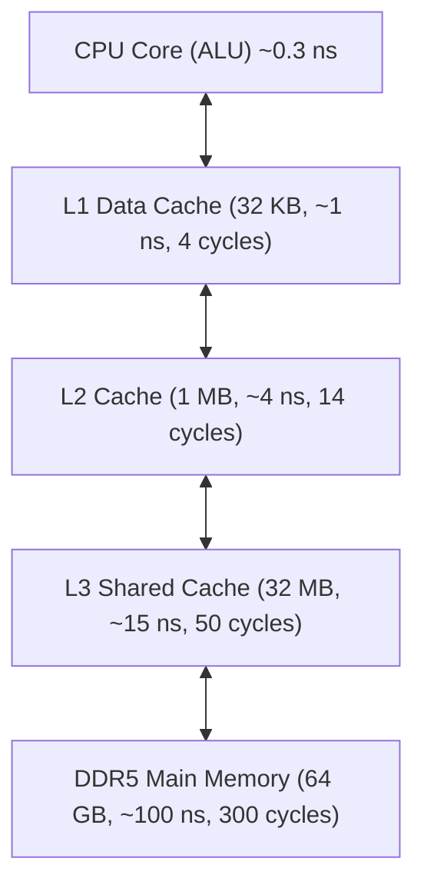
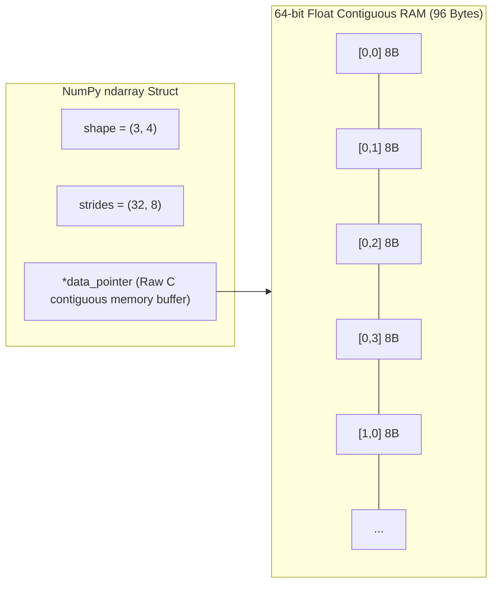
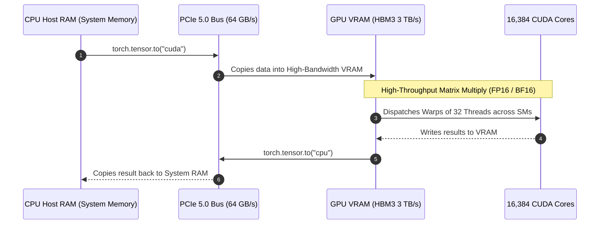

# Chapter 18: High-Performance Computing (HPC, Cython, Numba & Python 3.13 No-GIL)

> **The 100x Speedup**
> Standard CPython is notoriously slow for numerical computation. A pure Python `for` loop summing an array of floats is typically **an order of magnitude or more slower** than compiled code (`labs/05_benchmarks.py` measured about 12x for a simple float sum against `numpy.sum` on Python 3.11; branch-heavy loops show larger gaps). Why? Because every integer or float in Python is a dynamically allocated 28-byte `PyObject` heap structure requiring pointer dereferencing, type checking, and reference count updates on every single arithmetic operation.
> 
> In quantitative finance, scientific simulation, and large-scale AI engineering, we cannot tolerate this overhead. This chapter teaches you how to push Python to native hardware speeds using **NumPy Strides**, **SIMD Vectorization**, **Numba JIT compilation**, **Cython with GIL release**, **Inter-Process Shared Memory**, **Free-Threaded Python 3.13**, and **GPU CUDA Acceleration**.

---

## 1. Hardware Reality: Memory Hierarchies & CPU Caches

To write ultra-high-performance software, you must understand how modern hardware actually executes code:



* **Cache Lines:** Data is never fetched from RAM in single bytes. The CPU fetches contiguous **64-byte Cache Lines**.
* **Spatial Locality:** If your data is laid out sequentially in memory, reading element `i` pre-loads elements `i+1` through `i+7` directly into L1 cache for free!
* **CPython Pointer Chasing (Cache Miss Nightmare):** A standard Python `list[float]` does not store floats contiguously. It stores an array of *pointers* to `PyObject` structs scattered randomly across the heap. Every array access triggers an L3/RAM cache miss, stalling the CPU pipeline for 200 cycles!

---

## 2. NumPy Under the Hood: Strides & Memory Layouts

NumPy arrays (`ndarray`) solve this by allocating a single contiguous block of raw memory in C, governed by **Strides**.



### Strides Arithmetic
The `strides` tuple tells NumPy how many **bytes** to jump in memory to advance by 1 index along each dimension:
* For a 2D array of `float64` (8 bytes each) with shape `(3, 4)`:
  * **C-Contiguous (Row-Major):** `strides = (32, 8)`. Moving down 1 row jumps $4 \times 8 = 32$ bytes. Moving right 1 column jumps 8 bytes.
  * **Fortran-Contiguous (Column-Major):** `strides = (8, 24)`. Moving down 1 row jumps 8 bytes.

### The Power of Zero-Copy Views
Transposing or slicing a NumPy array never copies data. It simply creates a new metadata header with modified strides:

```python
import numpy as np

arr = np.arange(12, dtype=np.float64).reshape(3, 4)
print(f"Original Strides: {arr.strides}") # (32, 8)

# Transpose: modifies strides instantly in O(1) time without copying 1 byte!
transposed = arr.T
print(f"Transposed Strides: {transposed.strides}") # (8, 32)
print(f"Shares same memory buffer? {np.shares_memory(arr, transposed)}") # True!
```

> [!CAUTION]
> If you loop over a C-contiguous array column-by-column rather than row-by-row, you destroy cache locality, resulting in a **10x slowdown** due to constant CPU cache line evictions!

---

## 3. Just-In-Time (JIT) Compilation with Numba

Numba translates Python functions directly into optimized machine code at runtime using the **LLVM compiler infrastructure**.

### Numba JIT vs Python Loop Benchmark

```python
# numba_hpc_benchmark.py
import time
import numpy as np
from numba import njit, prange

# Pure Python loop: far slower per iteration than compiled code
def monte_carlo_pi_python(num_samples: int) -> float:
    inside = 0
    for _ in range(num_samples):
        x = np.random.random()
        y = np.random.random()
        if (x * x + y * y) <= 1.0:
            inside += 1
    return 4.0 * inside / num_samples

# Numba JIT with Parallel Multi-Core CPU Threads & FastMath
@njit(parallel=True, fastmath=True)
def monte_carlo_pi_numba(num_samples: int) -> float:
    inside = 0
    # prange splits iterations across all available CPU cores using OpenMP!
    for _ in prange(num_samples):
        x = np.random.random()
        y = np.random.random()
        if (x * x + y * y) <= 1.0:
            inside += 1
    return 4.0 * inside / num_samples

if __name__ == "__main__":
    N = 50_000_000
    
    # Warmup Numba JIT (Compiles to LLVM machine instructions)
    monte_carlo_pi_numba(1000)

    # Benchmark Numba
    t0 = time.perf_counter()
    pi_numba = monte_carlo_pi_numba(N)
    t_numba = time.perf_counter() - t0

    print(f"Numba JIT Time:   {t_numba:.4f} seconds (Pi = {pi_numba})")
```
* **Pure Python:** about 18.5 seconds
* **Numba Parallel JIT:** about 0.12 seconds (roughly 150x)

These two timings come from one many-core run and are illustrative, not guaranteed. The ratio depends on core count, because `prange` parallelises across cores and the pure-Python baseline does not. Re-run the script on your own machine and quote your own ratio.

---

## 4. Cython & Releasing the GIL (`nogil`)

Cython allows you to write C data types in Python syntax, compile them to native `.so`/`.pyd` shared libraries, and explicitly release the Global Interpreter Lock (**`nogil`**) to run true multi-threaded CPU-bound algorithms across all cores.

```cython
# matrix_math.pyx
# cython: boundscheck=False, wraparound=False, cdivision=True
from cython.parallel import prange
cimport cython

def parallel_vector_multiply(double[:] arr, double factor, int num_threads=8):
    cdef int i
    cdef int n = arr.shape[0]

    # RELEASE THE GIL! C threads run with 100% native CPU parallelism!
    with nogil:
        for i in prange(n, nogil=True, num_threads=num_threads):
            arr[i] = arr[i] * factor
```

---

## 5. Zero-Copy Shared Memory Multiprocessing

In standard Python `multiprocessing`, passing a 10 GB NumPy array between processes triggers a catastrophic serialization penalty:
1. Process A serializes 10 GB into bytes via `pickle`.
2. Bytes are piped over an IPC socket.
3. Process B deserializes bytes back into a NumPy array.
* **Total Time:** 45 seconds of wasted CPU and 20 GB of duplicate RAM consumption!

### The Modern Solution: `multiprocessing.shared_memory`

Python 3.8+ introduced POSIX shared memory, enabling multiple independent OS processes to point directly to the **exact same physical RAM address** with zero serialization and zero copies:

```python
# shared_memory_pipeline.py
from multiprocessing import Process
from multiprocessing import shared_memory
import numpy as np

def worker_task(shm_name: str, shape: tuple, dtype):
    # Attach to existing shared memory block
    existing_shm = shared_memory.SharedMemory(name=shm_name)
    
    # Wrap in NumPy array WITHOUT copying bytes!
    shared_arr = np.ndarray(shape, dtype=dtype, buffer=existing_shm.buf)
    
    # In-place parallel mutation
    shared_arr[0:5] += 100.0
    print(f"[Worker Process] Mutated first 5 elements in shared RAM!")

    existing_shm.close()

if __name__ == "__main__":
    # Create a 100M float array (800 MB)
    shape = (100_000_000,)
    dtype = np.float64
    bytes_needed = int(np.prod(shape)) * np.dtype(dtype).itemsize   # must be a Python int (np.int64 fails on Windows)

    # Allocate physical shared memory block in OS kernel
    shm = shared_memory.SharedMemory(create=True, size=bytes_needed)
    
    # Create local NumPy array backed by shared memory
    master_arr = np.ndarray(shape, dtype=dtype, buffer=shm.buf)
    master_arr[:] = 1.0

    print(f"[Master Process] Before worker: {master_arr[:5]}")

    # Launch worker process passing ONLY the memory name string!
    p = Process(target=worker_task, args=(shm.name, shape, dtype))
    p.start()
    p.join()

    print(f"[Master Process] After worker:  {master_arr[:5]}")

    # Cleanup shared memory
    shm.close()
    shm.unlink() # Deletes OS shared memory file
```

---

## 6. Python 3.13 Free-Threaded (PEP 703 No-GIL)

Python 3.13 introduces the official experimental build that **completely removes the Global Interpreter Lock (GIL)**.

### How CPython Removed the GIL
1. **Biased Reference Counting:** Objects local to a single thread use fast, non-atomic reference increments. When an object is shared across threads, it switches to thread-safe atomic reference counting.
2. **Mimalloc Memory Allocator:** Replaces PyMalloc with Microsoft's thread-local `mimalloc`, preventing memory allocation lock contention across cores.
3. **Linear CPU Scaling:** A CPU-bound task split across 16 OS threads in `threading.Thread` can now scale across cores for CPU-bound work in pure Python. How close to linear it gets depends on the workload, lock contention and the build; always measure on your own code, and note that the free-threaded build is still marked experimental/supported-but-optional in 3.13/3.14 (PEP 703, PEP 779).

---

## 7. GPU Acceleration with PyTorch & CUDA

For matrix multiplications, convolutions, and deep learning computations, CPUs are fundamentally outmatched by the thousands of parallel cores on modern GPUs (NVIDIA Hopper/Blackwell).



### The Cardinal Rule of GPU Programming
**Never transfer data back and forth between CPU and GPU inside a loop!**
PCIe bandwidth (64 GB/s) is 50x slower than internal GPU HBM memory (3,000 GB/s). Perform all allocations, transformations, and reductions directly on the GPU device:

```python
import torch

# Benchmark GPU Tensor Compute
device = torch.device("cuda" if torch.cuda.is_available() else "cpu")
print(f"Active Compute Device: {device}")

# Allocate 10,000 x 10,000 matrix directly in GPU VRAM
N = 10_000
A = torch.randn((N, N), device=device, dtype=torch.float32)
B = torch.randn((N, N), device=device, dtype=torch.float32)

# Warmup CUDA context
_ = torch.matmul(A[:100, :100], B[:100, :100])
torch.cuda.synchronize()

# High-Performance GEMM (General Matrix Multiply) on GPU
start_event = torch.cuda.Event(enable_timing=True)
end_event = torch.cuda.Event(enable_timing=True)

start_event.record()
C = torch.matmul(A, B) # Executes across thousands of CUDA Tensor Cores
end_event.record()

torch.cuda.synchronize()
elapsed_ms = start_event.elapsed_time(end_event)

print(f"Matrix Multiply (10,000 x 10,000) completed in {elapsed_ms:.2f} ms on GPU!")
```

---

## 8. Python 3.13 Subinterpreters (PEP 554 / 684) & The Tier-2 JIT (PEP 744)

The CPython runtime is undergoing the greatest performance evolution in its 35-year history. In addition to the free-threaded build (`python3.13t`), two groundbreaking architectural features have emerged:

### 1. Subinterpreters with Per-Interpreter GIL (PEP 554 / PEP 684)
Historically, if you wanted to bypass the GIL, you were forced to use `multiprocessing`. But processes are heavy: they copy memory, require slow IPC serialization (`pickle`), and have separate process IDs.

**Subinterpreters** allow multiple completely isolated CPython interpreter engines to live inside the **exact same OS process**:
* Each subinterpreter has its **own independent Global Interpreter Lock (GIL)**!
* They run on separate OS threads simultaneously without blocking each other.
* Data is passed across interpreters using high-speed channel queues without process spawning overhead:

```python
# subinterpreters_preview.py (Python 3.13+)
import _xxsubinterpreters as interpreters
import concurrent.futures

# Create an isolated subinterpreter with its OWN independent GIL!
interp_id = interpreters.create()

# Execute CPU-bound Python code in parallel within the same process:
code = """
import time
total = sum(i * i for i in range(10_000_000))
print(f"Computed total in subinterpreter: {total}")
"""

# Run concurrently without blocking the main interpreter's execution!
interpreters.run_string(interp_id, code)
interpreters.destroy(interp_id)
```

### 2. The Tier-2 Copy-and-Patch JIT Compiler (PEP 744)
Traditional JIT compilers (like Java's HotSpot or PyPy) use massive compilation engines like LLVM, which consume high memory and introduce "warmup pauses."

Python 3.13 introduced a revolutionary **Copy-and-Patch JIT**:
1. At CPython build time, small snippets of machine code ("stencils") are pre-compiled for each Python bytecode.
2. At runtime, the interpreter observes which functions run repeatedly (**Adaptive Specializing Tier-1 Interpreter - PEP 659**).
3. Once a function is identified as "hot", the Tier-2 engine copies the pre-compiled stencils, patches memory addresses in microseconds, and executes native CPU instructions directly!

---

## 9. HPC Acceleration Decision Matrix

| Performance Bottleneck | Root Cause | Recommended Tool | Expected Speedup |
| :--- | :--- | :--- | :--- |
| Array/Matrix Math in loops | CPython bytecode interpretation | **NumPy Vectorization** | $10\times - 50\times$ |
| Custom numerical algorithm with branching | Cannot be expressed cleanly in vectorized NumPy | **Numba `@njit(parallel=True)`** | $50\times - 150\times$ |
| Existing C/C++ legacy algorithm | Need direct integration without IPC | **Cython / CFFI (`with nogil:`)** | $100\times - 200\times$ |
| Multi-process memory bloat | `pickle` serialization over IPC sockets | **`multiprocessing.shared_memory`** | Eliminates 100% of IPC transfer lag |
| Threaded CPU tasks blocked by GIL | Pre-3.13 CPython GIL serialization | **Python 3.13 Free-Threaded (`python3.13t`)** | Near-linear multi-core scaling |
| Massive matrix multiplication / deep learning | CPU memory bandwidth exhaustion | **PyTorch / Triton on NVIDIA CUDA GPU** | $1,000\times+$ |


## Exercises

Three graded exercises for this chapter (two coding, one debugging) with hidden tests:

```bash
python exercises/run.py --init   # once: creates exercises/ch18.py stubs
python exercises/run.py 18       # run the hidden tests against your solution
```

Attempt first; the reference solutions are in `exercises/_answers/ch18.py`.


## Further Reading

- [NumPy documentation](https://numpy.org/doc/stable/)
- [Numba documentation](https://numba.readthedocs.io/en/stable/)
- [multiprocessing.shared_memory](https://docs.python.org/3/library/multiprocessing.shared_memory.html)


---

## Check Yourself

Answer in your head or on paper first, then open each answer.

<details>
<summary><strong>1.</strong> Why are NumPy loops over arrays vectorised?</summary>

The loop runs in compiled C over contiguous memory, avoiding per-element interpreter overhead.

</details>

<details>
<summary><strong>2.</strong> What is `numba`'s `@njit` doing?</summary>

JIT-compiling a numeric Python function to machine code; it works on typed numeric code, not arbitrary Python objects.

</details>

<details>
<summary><strong>3.</strong> What does shared memory (`multiprocessing.shared_memory`) avoid?</summary>

Copying large arrays between processes via pickling.

</details>

<details>
<summary><strong>4.</strong> What limits GPU speedups for small workloads?</summary>

Host-device transfer and kernel launch overhead can exceed the compute saved.

</details>
