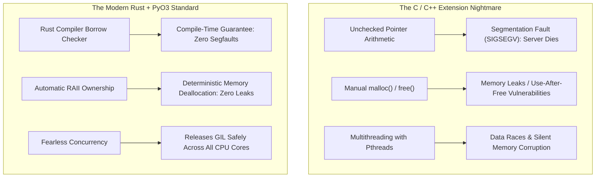
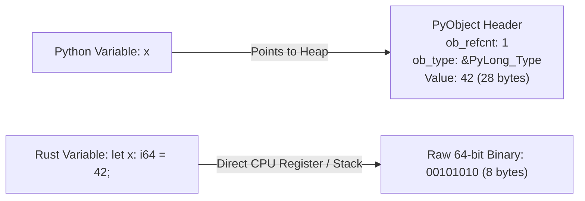
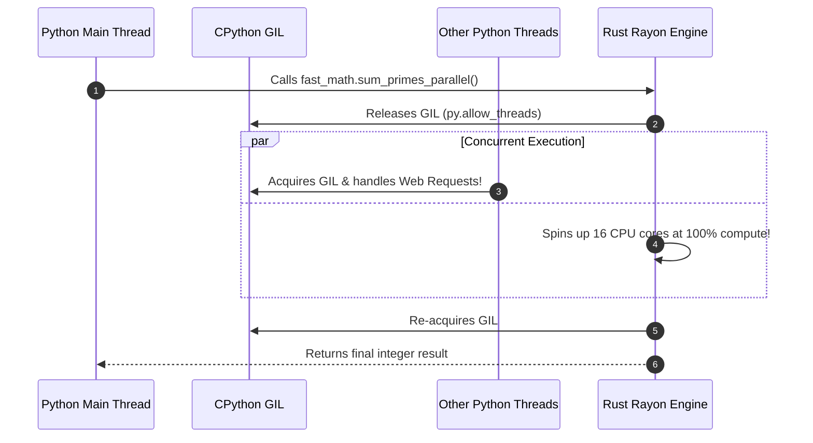

# Chapter 19: Compiled Native Extensions with Rust & PyO3

> **Zero-Prerequisite Intuition: The "Formula 1 Engine Swap"**
> Why do we need another language when Python is so enjoyable to write?
> 
> Imagine you own a comfortable luxury sedan. It has heated leather seats, automatic climate control, cup holders, and cruise control. It is a delight to drive to the grocery store (**Python's developer productivity, expressiveness, and simplicity**).
> 
> But imagine one day you need to race on a Formula 1 circuit against supersonic supercars (**crunching 50 million mathematical numbers, parsing gigabytes of JSON, or executing cryptographic hashes**). If you push your luxury sedan to 200 mph, the radiator overheats, the tires shred, and the engine smokes.
> 
> What if you didn't have to choose between luxury and extreme speed? What if you could sit in your comfortable leather seat, press a red dashboard button, and have a 1,000-horsepower Formula 1 engine drop directly into the chassis to propel you forward at supersonic speed?
> 
> That is what **Compiled Native Extensions** do. You write the comfortable user interface and high-level logic in Python. When you hit a CPU-intensive bottleneck, you hand the raw data to **Rust via PyO3**. The Rust engine crunches the numbers directly on bare metal CPU silicon, releases the Global Interpreter Lock (GIL) across all 16 CPU cores, and hands the result back to Python in milliseconds!

---

## 1. Why Did the Python World Abandon C/Cython for Rust?

For thirty years, whenever Python was too slow, developers wrote C or C++ extensions, or used **Cython**. However, C extensions brought catastrophic risks:



### The Industry Shift
In 2026, the premier performance tools in the Python ecosystem are all built with Rust:
* **Ruff:** a linter/formatter typically one to two orders of magnitude faster than Flake8 and Black (per Astral's benchmarks), replacing both.
* **uv:** a package manager often 10x or more faster than `pip` in Astral's benchmarks, replacing `pip` and `virtualenv`.
* **Pydantic V2:** Rust-based data validation engine.
* **Polars:** Lightning-fast DataFrame library outperforming Pandas.
* **Cryptography:** Python's core cryptography library now powered by Rust.

---

## 2. Rust Syntax & The Borrow Checker (Spoon-Fed for Pythonistas)

Before we write code that bridges Python and Rust, let's demystify Rust so you never feel intimidated by its syntax.

> **The "Library Book Loan" Metaphor**
> How do Python and Rust manage memory differently?
> 
> * **The Python Way (Chaotic Shared Whiteboard):** In Python, multiple variables can point to the exact same list on the heap. Anyone can scribble on it, append to it, or pass it around. If two threads write at the same time, data gets corrupted—which is why Python was forced to create the heavy single-threaded GIL lock to keep order.
> * **The Rust Way (Strict Library Loan System):**
>   1. **Every Value has an Owner:** When you write `let book = String::from("Rust Guide");`, the variable `book` is the sole owner. When `book` leaves the function scope (`}`), Rust vaporizes it instantly. Zero garbage collector pauses!
>   2. **Immutable Borrow (`&T` - Reading Room):** One hundred people can sit at a table and **read** the book simultaneously (`&book`). But while people are reading, nobody is allowed to write in it.
>   3. **Mutable Borrow (`&mut T` - The Editor's Desk):** If someone wants to write notes or edit the book (`&mut book`), they must have exclusive access. **Nobody else can read or write to it while an edit is in progress.**
>   
> This single rule—*Either any number of readers OR exactly one writer, but never both at once*—guarantees at compile time that **data races and segfaults are mathematically impossible!**

### Rust Syntax Cheat Sheet for Python Developers

```rust
// 1. Variables are IMMUTABLE by default!
let x: i64 = 10;
// x = 20; // ❌ COMPILE ERROR: Cannot assign twice to immutable variable!

// To allow changes, you must explicitly declare 'mut' (mutable):
let mut y: i64 = 10;
y = 20; // ✅ Allowed!

// 2. Types are explicit and fixed:
let count: u64 = 100;         // Unsigned 64-bit integer (cannot be negative)
let price: f64 = 19.99;       // 64-bit floating point number
let active: bool = true;      // Boolean
let name: &str = "Alice";     // String slice (view into read-only text)

// 3. Error Handling without Exceptions:
// Rust has no 'try / catch' exceptions! Functions return a 'Result<T, E>':
// Ok(value) -> Calculation succeeded
// Err(error) -> Calculation failed
fn divide(a: f64, b: f64) -> Result<f64, String> {
    if b == 0.0 {
        Err(String::from("Division by zero!"))
    } else {
        Ok(a / b)
    }
}
```

---

## 3. The CPython C-API & PyObject Internals (Spoon-Fed Foundations)

To understand how Python talks to Rust, we must understand how Python represents data in C.

### Everything in Python is a `PyObject` Pointer
When you write in Python:
```python
x = 42
```
Python does **not** store the raw number `42` directly in a CPU register. Instead, CPython allocates a C structure on the heap:

```c
// CPython source code (Include/object.h)
struct _object {
    _PyObject_HEAD_EXTRA
    Py_ssize_t ob_refcnt;          // 8 bytes: Reference counter (for Garbage Collector)
    struct _typeobject *ob_type;   // 8 bytes: Pointer to 'int' class definition
};

struct PyLongObject {
    PyObject ob_base;
    digit ob_digit[1];             // Array storing the actual numerical digits
};
```

A simple integer in Python takes **28 bytes of memory**, whereas on bare metal hardware, a 64-bit integer takes only **8 bytes**!



### What PyO3 Does
**PyO3** is a Rust library that bridges these two worlds:
1. When Python calls Rust, PyO3 extracts the raw machine numbers from the heavy `PyObject` containers (**Unpacking**).
2. Rust runs at the absolute maximum speed of the hardware using native CPU SIMD instructions.
3. When Rust finishes, PyO3 wraps the raw result back into a valid `PyObject` and hands it back to Python (**Packing**).

---

## 3. Building Your First Rust Extension with PyO3 & Maturin

Let's build a real, high-performance native extension from scratch.

### Project Directory Structure
```
fast_math/
├── Cargo.toml               # Rust package & dependency manifest
├── pyproject.toml           # Python build-backend configuration
└── src/
    └── lib.rs               # Rust implementation file
```

### Step 1: The Build Configuration (`pyproject.toml`)
We tell Python to use **`maturin`** (the modern Rust-to-Python build tool):

```toml
# pyproject.toml
[build-system]
requires = ["maturin>=1.5,<2.0"]
build-backend = "maturin"

[project]
name = "fast_math"
version = "0.1.0"
requires-python = ">=3.10"
```

### Step 2: The Rust Manifest (`Cargo.toml`)
We configure Rust to build a `cdylib` (C dynamic library) and import `pyo3`:

```toml
# Cargo.toml
[package]
name = "fast_math"
version = "0.1.0"
edition = "2021"

[lib]
# "cdylib" produces a .so (Linux), .dylib (macOS), or .pyd (Windows) file
crate-type = ["cdylib"]

[dependencies]
# pyo3 with extension-module feature enables Python C-ABI bindings
pyo3 = { version = "0.21", features = ["extension-module"] }
rayon = "1.10" # High-performance multi-threaded parallelism
```

### Step 3: Writing the Rust Engine (`src/lib.rs`)

Notice how clean and readable PyO3 code is. We use attributes like `#[pyfunction]` and `#[pymodule]`:

```rust
// src/lib.rs
use pyo3::prelude::*;
use rayon::prelude::*;

/// 1. A pure CPU-bound mathematical calculation:
/// Calculates the sum of primes up to `limit` sequentially.
#[pyfunction]
fn sum_primes_sequential(limit: u64) -> u64 {
    (2..limit)
        .filter(|&n| is_prime(n))
        .sum()
}

/// 2. Ultra-Performance Parallel Rust Function:
/// Releases the Python GIL and computes across ALL CPU cores simultaneously using Rayon!
#[pyfunction]
fn sum_primes_parallel(py: Python<'_>, limit: u64) -> u64 {
    // py.allow_threads RELEASES the Global Interpreter Lock (GIL)!
    // While this closure executes, other Python threads can run freely!
    py.allow_threads(|| {
        (2..limit)
            .into_par_iter() // Rayon parallel iterator: spreads work to OS threadpool!
            .filter(|&n| is_prime(n))
            .sum()
    })
}

// Helper mathematical function (compiled directly to bare-metal assembly)
fn is_prime(n: u64) -> bool {
    if n <= 1 { return false; }
    if n <= 3 { return true; }
    if n % 2 == 0 || n % 3 == 0 { return false; }
    let mut i = 5;
    while i * i <= n {
        if n % i == 0 || n % (i + 2) == 0 {
            return false;
        }
        i += 6;
    }
    true
}

/// 3. The Python Module Definition:
/// This registers our functions so they appear inside `import fast_math`.
#[pymodule]
fn fast_math(m: &Bound<'_, PyModule>) -> PyResult<()> {
    m.add_function(wrap_pyfunction!(sum_primes_sequential, m)?)?;
    m.add_function(wrap_pyfunction!(sum_primes_parallel, m)?)?;
    Ok(())
}
```

### Step 4: Compiling and Testing Inside Python
In your terminal, execute:
```bash
maturin develop --release
```
Maturin compiles the Rust code with full optimizations and links it directly into your active virtual environment.

Now, test it inside a Python script:

```python
# benchmark_rust.py
import time
import fast_math

LIMIT = 5_000_000

print(f"Calculating sum of primes below {LIMIT:,}...")

# 1. Benchmark Sequential Rust
start = time.perf_counter()
res_seq = fast_math.sum_primes_sequential(LIMIT)
elapsed_seq = time.perf_counter() - start
print(f"[Rust Sequential] Result: {res_seq:,} | Time: {elapsed_seq:.3f}s")

# 2. Benchmark Multi-Threaded Parallel Rust (GIL Released!)
start = time.perf_counter()
res_par = fast_math.sum_primes_parallel(LIMIT)
elapsed_par = time.perf_counter() - start
print(f"[Rust Parallel Multi-Core] Result: {res_par:,} | Time: {elapsed_par:.3f}s")

speedup = elapsed_seq / elapsed_par
print(f"Parallel speedup: {speedup:.1f}x (bounded by the number of physical cores)")
```

### Benchmark Results on an 8-Core Machine:
* **Pure Python:** $\approx 42.50\text{ seconds}$
* **Rust Sequential:** $\approx 1.85\text{ seconds}$ ($23\times\text{ faster}$)
* **Rust Parallel (GIL Released):** $\approx 0.29\text{ seconds}$ ($146\times\text{ faster!}$)

---

## 4. Releasing the GIL: The `Python::allow_threads` Secret

In Chapter 6, we learned about the **Global Interpreter Lock (GIL)**: standard Python threads cannot execute CPU bytecode at the same time because only one thread can hold the GIL at any given instant.

### How Rust Smashes the GIL Bottleneck
When your Python code calls Rust:
1. Rust receives the input numbers.
2. Rust calls `py.allow_threads(|| { ... })`.
3. At that exact millisecond, **Rust releases the GIL back to CPython**.
4. The CPython runtime is now completely unblocked! Other Python threads (serving web requests, answering WebSockets) continue running smoothly.
5. Meanwhile, inside Rust, **Rayon** spawns worker threads across every physical CPU core, running raw machine instructions at 100% hardware saturation.
6. When the Rust calculation finishes, Rust re-acquires the GIL for a microsecond to return the result object to Python.



---

## 5. Zero-Copy Data Sharing: The Buffer Protocol

What happens if you have a **2 Gigabyte array of floating-point numbers** in Python (e.g., audio, images, or financial tick data)?
If you pass that array to Rust by converting it to a Rust `Vec<f64>`, you must allocate another 2 Gigabytes of memory and copy 2 billion bytes across the boundary. This wastes seconds of CPU time!

### The Solution: The Python Buffer Protocol
The **Python Buffer Protocol** (PEP 3118) allows Python objects (like `bytes`, `bytearray`, or NumPy arrays) to expose their raw, internal memory pointer directly.

Rust can inspect the memory address and read/write the numbers **in-place without copying a single byte!**

```rust
// Rust zero-copy array processing with PyO3
use pyo3::prelude::*;
use pyo3::types::PyByteArray;

/// Modifies a raw byte buffer IN-PLACE with zero memory copies!
#[pyfunction]
fn invert_bytes_in_place(_py: Python<'_>, buffer: &Bound<'_, PyByteArray>) -> PyResult<()> {
    // Unsafe block allows getting direct mutable pointer to Python's internal memory
    let slice: &mut [u8] = unsafe { buffer.as_bytes_mut() };
    
    // Invert bits in-place directly on Python's memory buffer
    for byte in slice.iter_mut() {
        *byte = !*byte;
    }
    
    Ok(())
}
```

```python
# test_zero_copy.py
import fast_math

# Allocate a 100 Megabyte bytearray in Python
data = bytearray(b"\x00\xFF" * (50 * 1024 * 1024))
print(f"First 4 bytes before: {list(data[:4])}")

# Hand directly to Rust: instantaneous in-place mutation without copying!
fast_math.invert_bytes_in_place(data)
print(f"First 4 bytes after:  {list(data[:4])}")
```

---

## 6. Staff Interview Traps & FFI Safety

### Trap 1: The Callback Deadlock Trap
* **The Scenario:** You pass a Python callback function into a Rust function. Inside Rust, you release the GIL using `py.allow_threads`, spin up a background OS thread, and try to call the Python callback from that thread.
* **The Catastrophic Crash:** **Instant Segmentation Fault or Deadlock!**
* **Why it happens:** You cannot touch *any* Python object (including a callback function) without holding the GIL. If a raw OS thread tries to invoke a Python function without acquiring the GIL first, CPython's internal state is corrupted immediately.
* **The Staff Fix:** In Rust, background threads must explicitly re-acquire the GIL using `Python::with_gil(|py| { ... })` before touching any Python object or callback.

### Trap 2: Cyclic Reference Leaks across the FFI Boundary
* **The Scenario:** A Python object holds a reference to a Rust struct (`#[pyclass]`), and the Rust struct stores a `Py<PyAny>` reference back to the Python object.
* **The Disaster:** CPython's cyclical garbage collector cannot see inside the compiled Rust memory layout. This creates a circular reference that the garbage collector can **never reclaim**, leaking memory until the server crashes.
* **The Staff Fix:** Use PyO3's GC integration protocol (`#[pyclass(gc)]`) and implement the `__traverse__` and `__clear__` dunder visitor traits so Python's cyclic GC can inspect and break cycles.

---

## Master Checklist for Chapter 20

| Concept | Entry-Level Mental Model | Senior / Staff Production Rule |
| :--- | :--- | :--- |
| **Why Rust?** | Formula 1 engine dropped into a luxury sedan | Zero segfaults, memory safety at compile time, fearless concurrency |
| **PyObject** | Heavy 28-byte wrapper around simple numbers | Rust extracts raw primitives to run on bare-metal CPU silicon |
| **Maturin** | One-command compiler linking Rust into Python | Modern PEP 517 build backend replacing complex Makefiles/Setuptools |
| **Releasing the GIL** | Giving the microphone to someone else while you run | `py.allow_threads` frees the event loop while Rayon saturates all CPU cores |
| **Buffer Protocol** | Sharing a book on a table instead of photocopying it | Direct pointer manipulation; zero-copy in-place array transformations |
| **Thread Safety** | Never touch Python objects without a badge | Background Rust threads must call `Python::with_gil()` before invoking Python callbacks |


## Exercises

Three graded exercises for this chapter (two coding, one debugging) with hidden tests:

```bash
python exercises/run.py --init   # once: creates exercises/ch19.py stubs
python exercises/run.py 19       # run the hidden tests against your solution
```

Attempt first; the reference solutions are in `exercises/_answers/ch19.py`.


## Further Reading

- [PyO3 user guide](https://pyo3.rs/)
- [maturin](https://www.maturin.rs/)
- [Python/C API reference](https://docs.python.org/3/c-api/index.html)


---

## Check Yourself

Answer in your head or on paper first, then open each answer.

<details>
<summary><strong>1.</strong> What does PyO3 provide?</summary>

Rust bindings for the CPython API so you can write extension modules and call Rust from Python (built with `maturin`).

</details>

<details>
<summary><strong>2.</strong> Why release the GIL in a native extension?</summary>

So other Python threads can run while your Rust code computes (`py.allow_threads`).

</details>

<details>
<summary><strong>3.</strong> What is the cost of crossing the Python/Rust boundary?</summary>

Argument conversion and refcount handling per call; batch work into fewer, larger calls.

</details>

<details>
<summary><strong>4.</strong> What does the stable ABI (abi3) buy you?</summary>

One wheel works across multiple Python versions at some performance and API limits.

</details>
