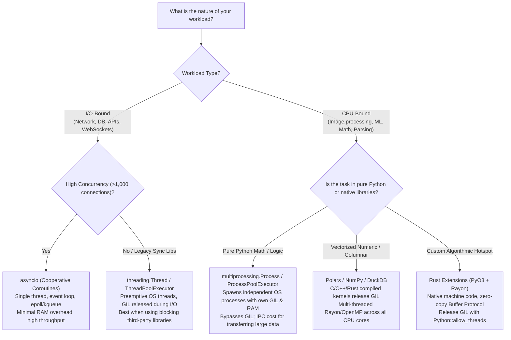

# Chapter 22: Track 1 Recap — The Python Engineering Mastery Playbook

> **Core Learning Objective:** Consolidate everything you have mastered across Track 1 into a permanent, interconnected mental model. This chapter provides a high-yield, quick-reference synthesis of CPython internals, memory mechanics (Stack vs Heap, PyObject, GC), concurrency choices (Threads vs Asyncio vs Multiprocessing), production backend architectures (FastAPI, PostgreSQL, Celery, Kafka), and high-performance computing (Polars, HPC, Rust PyO3).

---

## 1. The Grand Architectural Mental Map

Throughout Track 1, you traveled from the lowest silicon-level CPU instructions all the way to high-concurrency event-driven distributed systems. Here is how every chapter connects into a unified engineering machine:

```mermaid
flowchart TD
    subgraph S1 ["1. The Execution Engine (Silicon to Bytecode)"]
        Ch1["01: Lexer & AST<br/>ceval.c & Stack Machine"] --> Ch2["02: Data Structures<br/>Compact Dicts & Lists"]
        Ch2 --> Ch3["03: Scopes & Closures<br/>LEGB & PyCellObject"]
        Ch3 --> Ch4["04: OOP & Dunders<br/>MRO, C3 & Descriptors"]
    end

    subgraph S2 ["2. Memory & Hardware Limits"]
        Ch4 --> Ch5["05: Memory & GC<br/>PyMalloc, RefCount & GIL"]
        Ch5 --> Ch6["06: Concurrency Models<br/>OS Threads vs Coroutines"]
        Ch6 --> Ch7["07: Type System<br/>Protocols & Mypy"]
    end

    subgraph S3 ["3. Enterprise Engineering & Quality"]
        Ch7 --> Ch8["08: Packaging & uv<br/>sys.path & ABI Wheels"]
        Ch8 --> Ch9["09: Testing & Mocking<br/>Pytest Fixtures & AsyncMock"]
        Ch9 --> Ch10["10: Profiling & Leaks<br/>tracemalloc & cProfile"]
        Ch10 --> Ch11["11: Brownfield Refactoring<br/>Pinning Tests & Clean Architecture"]
    end

    subgraph S4 ["4. Production Backend & Distributed Data"]
        Ch11 --> Ch12["12: SQL & PostgreSQL MVCC<br/>Indexes, CTEs & Locks"]
        Ch12 --> Ch13["13: FastAPI & ASGI<br/>Pydantic V2 & Lifespans"]
        Ch13 --> Ch14["14: Security & Cryptography<br/>Argon2id, JWT & RBAC"]
        Ch14 --> Ch15["15: Distributed Tasks<br/>Celery, Redis & Idempotency"]
        Ch15 --> Ch16["16: Event-Driven Streaming<br/>Kafka, gRPC & BSD Sockets"]
    end

    subgraph S5 ["5. Extreme Performance & Native Systems"]
        Ch16 --> Ch17["17: Columnar Data<br/>Polars, Arrow & DuckDB"]
        Ch17 --> Ch18["18: High-Performance Computing<br/>SIMD, Numba, Cython & No-GIL"]
        Ch18 --> Ch19["19: Rust PyO3 Extensions<br/>CPython C-API & Buffer Protocol"]
    end

    S1 --> S2 --> S3 --> S4 --> S5
```

---

## 2. Plain-English Jargon Demystifier (Track 1 Edition)

Whenever you encounter technical terminology in senior interviews or production post-mortems, refer to this translation table:

| Term | The Formal Definition | Plain-English Real-World Metaphor | Why It Matters in Production |
| :--- | :--- | :--- | :--- |
| **CPython** | The reference implementation of Python written in C. | **The Master Chef** who reads your recipe (Python) and cooks it on physical CPU hardware. | Explains why Python has specific memory behaviors, GIL constraints, and C-API bindings. |
| **The Stack** | LIFO memory structure for execution frames and local pointers. | **Your Desk**: small, lightning-fast (<1 ns), cleaned off the instant a function finishes. | Function arguments and local pointers live here. Stack overflow happens when recursion is too deep. |
| **The Heap** | Dynamic memory pool managed by an allocator (`PyMalloc`). | **The Cavernous Warehouse Floor**: vast, flexible storage for any size object, requiring pointers to find. | All Python objects (`int`, `str`, `list`, `dict`) live here. Excessive allocations cause memory bloat. |
| **`PyObject`** | The 16-to-24 byte C struct header at the start of every Python object. | **The Identification Collar** around every pet in the shelter: records who it is (type) and how many owners love it (refcount). | An integer `1` is not 8 bytes; it is 28 bytes in Python due to this overhead. |
| **Descriptor** | An object attribute with binding behavior defined by `__get__`, `__set__`, or `__delete__`. | **A Security Guard at a Room Door**: intercepting anyone trying to read or modify a variable. | Powers `@property`, `@classmethod`, `@staticmethod`, and ORMs like SQLAlchemy and Django models. |
| **MRO (Method Resolution Order)** | The linearized order in which Python searches base classes for methods (C3 algorithm). | **The Family Tree Chain-of-Command**: deciding whether mom's rule or dad's rule takes precedence without infinite loops. | Prevents ambiguity in multiple inheritance (the Diamond Problem). |
| **GIL (Global Interpreter Lock)** | A mutual exclusion lock preventing multiple OS threads from executing CPython bytecode simultaneously. | **A Single Microphone in a Debate Room**: only one speaker can talk at any given instant. | Multi-threading will **never** speed up CPU-bound math in standard CPython; it only speeds up I/O-bound wait times. |
| **`PyCellObject`** | A heap-allocated wrapper holding a reference to a variable captured by a closure. | **A Glass Display Box** on the warehouse floor: preserving a variable so an inner function can read it long after the outer function died. | Powers decorators and functional factories. |
| **ASGI** | Asynchronous Server Gateway Interface: non-blocking interface between async web servers and applications. | **A Fast-Food Order Ticket Machine**: accepting orders continuously without waiting for burgers to flip. | Powers FastAPI and Starlette, allowing 50,000 concurrent WebSocket/HTTP connections on a single worker. |
| **SIMD** | Single Instruction, Multiple Data: CPU instruction set processing vectors of numbers simultaneously. | **A Cookie Cutter**: stamping out 8 cookies in one press instead of cutting one cookie at a time. | Powers NumPy, Polars, and DuckDB to achieve 100x analytical query speedups. |

---

## 3. The Concurrency & Parallelism Decision Matrix

One of the most frequent Staff Engineer interview questions is: *"Which concurrency tool should I choose for this problem?"* Use this definitive decision rubric:

| Concurrency Model | Best For | GIL Impact | Memory Overhead | Communication Mechanism |
| :--- | :--- | :--- | :--- | :--- |
| **`asyncio`** | Web APIs, scrapers, chat servers, microservice orchestrators | Runs under 1 GIL on 1 core | **Ultra-Low** (~1 KB per task) | Shared memory within single thread |
| **`threading`** | I/O with blocking sync SDKs (boto3, older DB drivers) | Releases GIL during socket/disk I/O | **Medium** (~8 MB OS thread stack) | Shared heap memory (requires Locks) |
| **`multiprocessing`**| Heavy CPU calculations in pure Python | Bypasses GIL (separate interpreters) | **High** (full copy of Python process) | `Queue`, `Pipe`, Shared Memory |
| **`Polars / DuckDB`**| Massive tabular data transforms & filtering | Bypasses GIL in native Rust/C++ | **Optimal** (Arrow columnar vectors) | In-process zero-copy memory buffers |
| **`PyO3 (Rust)`** | Algorithmic bottlenecks, custom parsers, crypto | Can manually release GIL | **Lowest native** | Python Buffer Protocol (`&[u8]`) |

---

## 4. The Junior vs. Senior Antipattern Graveyard

Avoid these 7 classic traps that immediately flag an inexperienced engineer during technical interviews and production code reviews:

| # | The Junior Antipattern | What Goes Wrong in Production | The Senior / Staff Solution |
| :---: | :--- | :--- | :--- |
| **1** | `def add_item(item, basket=[]):` | The list is allocated **once at module load time**. All subsequent calls share the exact same list, causing cross-request data leaks! | Use `basket: list | None = None` and initialize `if basket is None: basket = []` inside the function body. |
| **2** | Calling `time.sleep()` or sync `requests.get()` inside an `async def` function. | **Event loop starvation**: the single OS thread freezes. Thousands of pending client coroutines stop dead in their tracks. | Use `asyncio.sleep()`, `httpx.AsyncClient`, or delegate blocking sync calls to `asyncio.to_thread()`. |
| **3** | Spawning 100 `threading.Thread` instances to crunch numbers faster. | Because of the **GIL**, the threads serialize on a single core. Thread-context-switching overhead actually makes the job **slower** than single-threaded code! | Use `ProcessPoolExecutor`, `Polars`, `Numba`, or compiled Rust extensions. |
| **4** | Creating millions of small class instances with standard `__dict__`. | Each dictionary consumes 100+ bytes of heap overhead, causing out-of-memory (OOM) crashes on large datasets. | Define `__slots__ = ('x', 'y')` or use `@dataclass(slots=True)` to reduce memory footprint by $>68\%$. |
| **5** | Building strings with `s += chunk` inside a large loop. | Strings are **immutable**. Each `+=` allocates a new string and copies all previous characters, degrading to $O(N^2)$ time. | Collect chunks in a list `chunks.append(...)` and join once via `"".join(chunks)` in $O(N)$ time. |
| **6** | `except Exception: pass` without logging or re-raising. | Silently swallows `KeyboardInterrupt`, memory errors, and syntax bugs, turning system outages into untraceable ghosts. | Catch specific exceptions (`except (ValueError, KeyError):`), log stack traces with `logger.exception()`, or use Python 3.11 `ExceptionGroup`. |
| **7** | Executing SQL queries inside a loop (`for user in users: db.query(...)`). | **The N+1 Query Trap**: 1,000 users cause 1,001 round-trips to the database, ballooning response latency from 5ms to 8 seconds. | Use SQL `JOIN`, `IN (...)`, or SQLAlchemy `joinedload` / `selectinload` to fetch all relational data in a single batch query. |

---

## 5. High-Yield 10-Minute Pre-Interview Memory Anchors

Commit these high-frequency technical facts to memory before any Senior/Staff Python interview:

1. **Variables are Sticky Nametags, Not Lockers:** `a = [1, 2]` creates a heap object and sticks label `a` on it. `b = a` slaps label `b` onto the exact same heap object. Mutating `b` mutates `a`.
2. **CPython Integer Singleton Cache:** Integers from `-5` through `256` are pre-allocated at startup. `a = 100; b = 100; a is b` is `True`. Outside that range, `is` can evaluate to `False`. Always use `==` for value comparison.
3. **Reference Counting + Generational GC:** Every object has `ob_refcnt`. When it hits 0, memory is freed immediately. Generational GC (Gen 0, Gen 1, Gen 2) only exists to hunt and destroy circular reference loops (`obj_a.ref = obj_b; obj_b.ref = obj_a`).
4. **Protocols (Structural Subtyping):** Python 3.8+ Protocols allow static type checking with runtime duck typing. If an object has a `.read()` method, it matches `Readable` protocol without needing explicit inheritance!
5. **FastAPI `async def` vs `def` Traps:** In FastAPI, declaring an endpoint as `def endpoint():` runs it inside a background threadpool (safe for blocking code). Declaring it as `async def endpoint():` runs it directly on the main event loop (blocking calls freeze the entire server).
6. **Polars vs Pandas:** Pandas stores data as row-oriented Python pointers requiring GIL locking. Polars uses columnar Apache Arrow memory format, enabling SIMD vectorization and lock-free multi-core query execution across all CPU cores.
7. **Python 3.13 Free-Threaded Build:** Python 3.13 introduced `python3.13t` (experimental build with the GIL completely disabled), utilizing mimalloc thread-local heaps and biased reference counting to achieve true multi-core parallel scaling in pure Python.

---

## 6. Track 1 Graduation Milestone Check

Before you proceed to **Track 2: Low-Level Design (LLD)**, verify that you can comfortably answer these 4 mastery questions:
- [x] *Can you trace the exact journey of code from source characters to AST, bytecode, and `ceval.c` evaluation stack?*
- [x] *Can you diagnose a memory leak in a production service using `tracemalloc` and spot cyclical reference traps?*
- [x] *Can you defend your choice between `asyncio`, `threading`, and `multiprocessing` for any arbitrary production workload?*
- [x] *Can you architect a high-throughput, secure backend using FastAPI, Pydantic V2, PostgreSQL MVCC, and Celery/Kafka?*

> [!TIP]
> **Next Stop: Track 2 (Low-Level Design)!**
> Now that you possess world-class mastery over the Python language engine, memory, and concurrency, it is time to build modular, maintainable, and battle-tested object-oriented architectures. Proceed to [Track 2: Low-Level Design](../02-Low-Level-Design/00-The-Intuitive-LLD-Mental-Model-And-Interview-Blueprint.md)!
