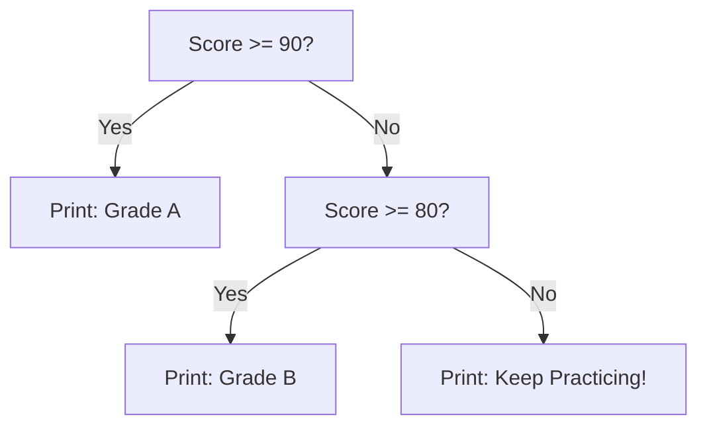

# 🐣 The Interactive Foundations Absolute Beginner Python Crash Course

> *"If you can read plain English and use a keyboard, you can learn to write Python."*

Welcome! If terms like *polymorphism*, *decorators*, or *asynchronous event loops* sound like alien languages, **you are in the right place**. 

This guide is modeled directly on the **Interactive Foundations philosophy**:
1. **Tiny examples** you can read in 10 seconds.
2. **Line-by-line explanations** of what every word, colon, and symbol actually means.
3. **Interactive drills** with instant answers you can reveal with a single click.
4. **Zero jargon** — only everyday real-world analogies.

---

## 📑 Table of Contents
1. [Part 1: Your Very First Program (`print`)](#part-1-your-very-first-program-print)
2. [Part 2: Variables — Giving Names to Data](#part-2-variables--giving-names-to-data)
3. [Part 3: The 4 Core Data Types](#part-3-the-4-core-data-types)
4. [Part 4: Basic Math & String Magic](#part-4-basic-math--string-magic)
5. [Part 5: Making Decisions (`if`, `elif`, `else`)](#part-5-making-decisions-if-elif-else)
6. [Part 6: Repeating Actions (`for` and `while` loops)](#part-6-repeating-actions-for-and-while-loops)
7. [Part 7: Lists & Dictionaries — Storing Groups of Things](#part-7-lists--dictionaries--storing-groups-of-things)
8. [Part 8: Functions — Reusable Recipes](#part-8-functions--reusable-recipes)
9. [Part 9: The Beginner Error Decoder](#part-9-the-beginner-error-decoder)
10. [Part 10: 25 Interactive Foundations Interactive Drills](#part-10-25-Interactive Foundations-interactive-drills)

---

## Part 1: Your Very First Program (`print`)

In Python, telling the computer to say something on your screen is as simple as writing `print(...)`.

### Example
```python
print("Hello, World!")
```

### Output
```text
Hello, World!
```

### Line-by-Line Breakdown:
* `print`: This is a built-in Python command that means *"show this text on the terminal screen"*.
* `(` and `)`: The parentheses hold the message you want to print.
* `"Hello, World!"`: The quotation marks tell Python: *"Treat this as literal human text, not as computer code."* You can use double quotes (`"..."`) or single quotes (`'...'`).

> [!TIP]
> **Try this:** What happens if you forget the quotes and write `print(Hello)`?  
> Python will panic with a `NameError: name 'Hello' is not defined` because it thinks `Hello` is a variable name, not text!

---

## Part 2: Variables — Giving Names to Data

A **variable** is just a **name tag** you stick onto a piece of information so you can use it later.

### Example
```python
user_name = "Alex"
user_age = 24

print("User Name:")
print(user_name)
print("User Age:")
print(user_age)
```

### Output
```text
User Name:
Alex
User Age:
24
```

### Line-by-Line Breakdown:
* `user_name = "Alex"`: 
  - `user_name` is the name tag you chose.
  - `=` means **assign** (put the tag on the item to the right). It does *not* mean "equals in math".
  - `"Alex"` is the text data being labeled.
* Notice that when printing `user_name`, we **do not** put quotes around it! Quotes print the literal word `"user_name"`; without quotes, Python looks up the value inside the variable tag!

---

## Part 3: The 4 Core Data Types

Everything in Python has a **Type**. Think of types like categories in your kitchen: liquids, solids, spices.

| Type Name | What It Is | Examples | Everyday Analogy |
| :--- | :--- | :--- | :--- |
| **`int`** (Integer) | Whole numbers (positive, negative, zero) | `10`, `0`, `-45`, `1000` | Counting whole coins |
| **`float`** (Floating point) | Numbers with decimal points | `3.14`, `0.5`, `-99.99` | Measuring liters or dollars & cents |
| **`str`** (String) | Text wrapped in quotes | `"apple"`, `'Python 3'`, `"123"` | Words written on a sticky note |
| **`bool`** (Boolean) | True or False (only two choices!) | `True`, `False` | A light switch (ON or OFF) |

### Checking Types with `type()`
```python
price = 19.99
is_in_stock = True

print(type(price))        # Output: <class 'float'>
print(type(is_in_stock))  # Output: <class 'bool'>
```

---

## Part 4: Basic Math & String Magic

### 1. Math Operators
Python is a super-calculator:

```python
a = 10
b = 3

print(a + b)   # Addition:       13
print(a - b)   # Subtraction:    7
print(a * b)   # Multiplication: 30
print(a / b)   # Float Division: 3.3333333333333335
print(a // b)  # Floor Division: 3 (chops off the decimal!)
print(a % b)   # Modulo:         1 (the remainder: 10 divided by 3 is 3 with 1 left over)
print(a ** b)  # Power:          1000 (10 to the power of 3: 10 * 10 * 10)
```

### 2. f-Strings: The Easiest Way to Combine Text & Numbers
Instead of clunky string additions, use an **f-string** (format string). Put an `f` right before the opening quote, and put variables inside `{curly braces}`:

```python
name = "Jordan"
score = 95

# The modern Pythonic way:
message = f"Congratulations {name}, your score is {score}/100!"
print(message)
# Output: Congratulations Jordan, your score is 95/100!
```

---

## Part 5: Making Decisions (`if`, `elif`, `else`)

Computers make decisions based on whether a statement is `True` or `False`.



### Example
```python
score = 85

if score >= 90:
    print("Grade: A - Outstanding!")
elif score >= 80:
    print("Grade: B - Great job!")
elif score >= 70:
    print("Grade: C - Good effort!")
else:
    print("Grade: F - Please review the material.")
```

### Crucial Python Rule: Indentation!
Notice how the lines below `if`, `elif`, and `else` are indented by **4 spaces**?
In Python, **indentation is mandatory**. It tells Python: *"These indented lines belong inside this decision block."*

---

## Part 6: Repeating Actions (`for` and `while` loops)

Instead of copying and pasting code 100 times, we use loops.

### 1. The `for` Loop with `range()`
Use a `for` loop when you know how many times to repeat something:

```python
# range(5) produces numbers: 0, 1, 2, 3, 4 (stops BEFORE 5!)
for i in range(5):
    print(f"Step number: {i}")
```

### 2. The `while` Loop
Use a `while` loop when you want to repeat something **until a condition changes**:

```python
countdown = 3

while countdown > 0:
    print(f"Rocket launching in {countdown}...")
    countdown = countdown - 1  # Decrement countdown so it doesn't run forever!

print("Blast off! 🚀")
```

---

## Part 7: Lists & Dictionaries — Storing Groups of Things

### 1. Lists: Ordered Shopping Bags (`[ ... ]`)
A list stores items in a specific order:

```python
fruits = ["apple", "banana", "cherry"]

# Access items by their position (called an index). Counting starts at ZERO!
print(fruits[0])  # Output: apple
print(fruits[1])  # Output: banana
print(fruits[2])  # Output: cherry

# Add an item to the end:
fruits.append("orange")
print(fruits)     # Output: ['apple', 'banana', 'cherry', 'orange']

# Loop through every fruit:
for fruit in fruits:
    print(f"I love {fruit}!")
```

### 2. Dictionaries: Real-World Phone Books (`{ ... }`)
A dictionary stores data as **Key : Value** pairs:

```python
user_profile = {
    "username": "coder123",
    "email": "coder@example.com",
    "is_active": True,
    "login_count": 5
}

# Look up values by their key name:
print(user_profile["username"])  # Output: coder123
print(user_profile["email"])     # Output: coder@example.com

# Change a value:
user_profile["login_count"] = 6
print(user_profile["login_count"])  # Output: 6
```

---

## Part 8: Functions — Reusable Recipes

A **function** is a block of code with a name that you can run anytime you need it.

### Example
```python
def make_coffee(coffee_type, sugar_spoons=1):
    """Prepares a customized coffee order."""
    cup = f"Hot {coffee_type} with {sugar_spoons} spoon(s) of sugar."
    return cup

# Now call the function as many times as you like:
order1 = make_coffee("Latte", sugar_spoons=2)
order2 = make_coffee("Espresso", sugar_spoons=0)

print(order1)  # Output: Hot Latte with 2 spoon(s) of sugar.
print(order2)  # Output: Hot Espresso with 0 spoon(s) of sugar.
```

### Key Keywords:
* `def`: Tells Python: *"I am defining a new function."*
* `make_coffee(...)`: The name of the function, followed by its input variables (parameters).
* `return`: Hands back the final result to whoever called the function.

---

## Part 9: The Beginner Error Decoder

When Python stops with red text, **do not panic**. Errors are helpful clues:

| Error Name | What Happened | Real Example | Plain English Fix |
| :--- | :--- | :--- | :--- |
| **`SyntaxError`** | You wrote invalid grammar | `print "hello"` (missing parens) | Check colons, parentheses, and quote pairs. |
| **`IndentationError`** | Bad spacing | Line indented 3 spaces instead of 4 | Press Backspace and indent with exactly 4 spaces (or Tab). |
| **`NameError`** | Python doesn't recognize the word | `print(score)` before setting `score = 10` | Check spelling or define the variable higher up. |
| **`TypeError`** | Operation on incompatible types | `"Age: " + 25` | Convert explicitly: `"Age: " + str(25)` or use an f-string! |
| **`IndexError`** | Looking past the end of a list | `my_list = [1, 2]; print(my_list[5])` | List only has 2 items (indices 0 and 1); index 5 doesn't exist. |
| **`KeyError`** | Dictionary key doesn't exist | `user["phone"]` when no `"phone"` key exists | Use `user.get("phone", "N/A")` instead of square brackets! |

---

## Part 10: 25 Interactive Foundations Interactive Drills

Work each drill by filling in the blank `___`, then click to verify your answer!

---

### Drill 1: Printing Text
Fill in the missing command to print `"Welcome to Python!"`:
```python
___("Welcome to Python!")
```
<details><summary><b>Show Answer</b></summary>

```python
print("Welcome to Python!")
```
</details>

---

### Drill 2: Variable Assignment
Create a variable named `car_brand` and assign it the string `"Toyota"`:
```python
___ = "Toyota"
```
<details><summary><b>Show Answer</b></summary>

```python
car_brand = "Toyota"
```
</details>

---

### Drill 3: Integer Division
Use floor division to calculate how many whole times `4` fits into `19`:
```python
result = 19 ___ 4
```
<details><summary><b>Show Answer</b></summary>

```python
result = 19 // 4  # Evaluates to 4
```
</details>

---

### Drill 4: Remainder Math (Modulo)
Find the remainder when `17` is divided by `5`:
```python
remainder = 17 ___ 5
```
<details><summary><b>Show Answer</b></summary>

```python
remainder = 17 % 5  # Evaluates to 2
```
</details>

---

### Drill 5: Basic String Length
Which built-in function counts the number of characters in `"Elephant"`?
```python
count = ___("Elephant")
```
<details><summary><b>Show Answer</b></summary>

```python
count = len("Elephant")  # Evaluates to 8
```
</details>

---

### Drill 6: Modern f-String
Insert the prefix letter that turns this into an f-string:
```python
name = "Sam"
msg = ___"Hello {name}"
```
<details><summary><b>Show Answer</b></summary>

```python
msg = f"Hello {name}"
```
</details>

---

### Drill 7: Type Casting (String to Integer)
Convert the text `"42"` into a real integer number:
```python
num = ___("42")
```
<details><summary><b>Show Answer</b></summary>

```python
num = int("42")
```
</details>

---

### Drill 8: Simple If Statement
Complete the `if` statement to check if `temp` is greater than `30`:
```python
temp = 32
if temp ___ 30:
    print("It's hot outside!")
```
<details><summary><b>Show Answer</b></summary>

```python
if temp > 30:
    print("It's hot outside!")
```
</details>

---

### Drill 9: Equality Check
What symbol checks if two values are equal in Python?
```python
password = "admin"
if password ___ "admin":
    print("Access granted")
```
<details><summary><b>Show Answer</b></summary>

```python
if password == "admin":  # == checks equality, single = assigns!
    print("Access granted")
```
</details>

---

### Drill 10: Logical AND
Check that `age` is at least 18 AND `has_id` is True:
```python
if age >= 18 ___ has_id == True:
    print("Entry permitted")
```
<details><summary><b>Show Answer</b></summary>

```python
if age >= 18 and has_id == True:
    print("Entry permitted")
```
</details>

---

### Drill 11: Adding to a List
Add `"kiwi"` to the end of the `fruits` list:
```python
fruits = ["apple", "banana"]
fruits.___("kiwi")
```
<details><summary><b>Show Answer</b></summary>

```python
fruits.append("kiwi")
```
</details>

---

### Drill 12: List Indexing
Print the **first** element of `colors`:
```python
colors = ["red", "green", "blue"]
print(colors[___])
```
<details><summary><b>Show Answer</b></summary>

```python
print(colors[0])  # Counting always starts at 0!
```
</details>

---

### Drill 13: List Slicing
Extract the first two items (`"a"` and `"b"`) using slicing:
```python
letters = ["a", "b", "c", "d"]
first_two = letters[0:___]
```
<details><summary><b>Show Answer</b></summary>

```python
first_two = letters[0:2]  # Slice [0:2] takes index 0 and 1, stops before 2
```
</details>

---

### Drill 14: Loop over a List
Complete the `for` loop to print each city:
```python
cities = ["Tokyo", "Paris", "New York"]
___ city in cities:
    print(city)
```
<details><summary><b>Show Answer</b></summary>

```python
for city in cities:
    print(city)
```
</details>

---

### Drill 15: Looping 10 Times
Generate a loop that runs 10 times (from 0 to 9):
```python
for i in ___(10):
    print(i)
```
<details><summary><b>Show Answer</b></summary>

```python
for i in range(10):
    print(i)
```
</details>

---

### Drill 16: While Loop Condition
Complete the loop to run while `counter` is less than 5:
```python
counter = 0
___ counter < 5:
    counter += 1
```
<details><summary><b>Show Answer</b></summary>

```python
while counter < 5:
    counter += 1
```
</details>

---

### Drill 17: Exiting a Loop Early
Which keyword immediately stops and exits a loop?
```python
for num in range(100):
    if num == 3:
        ___
```
<details><summary><b>Show Answer</b></summary>

```python
        break
```
</details>

---

### Drill 18: Skipping an Iteration
Which keyword skips the rest of the current loop step and jumps to the next item?
```python
for num in range(5):
    if num == 2:
        ___
    print(num)
```
<details><summary><b>Show Answer</b></summary>

```python
        continue
```
</details>

---

### Drill 19: Defining a Function
Which keyword defines a new function named `greet`?
```python
___ greet(name):
    return f"Hello {name}"
```
<details><summary><b>Show Answer</b></summary>

```python
def greet(name):
    return f"Hello {name}"
```
</details>

---

### Drill 20: Returning a Value
Make this function return the sum of two numbers:
```python
def add(x, y):
    ___ x + y
```
<details><summary><b>Show Answer</b></summary>

```python
def add(x, y):
    return x + y
```
</details>

---

### Drill 21: Dictionary Key Access
Retrieve the age of the student:
```python
student = {"name": "Emma", "age": 20}
print(student[___])
```
<details><summary><b>Show Answer</b></summary>

```python
print(student["age"])
```
</details>

---

### Drill 22: Safe Dictionary Lookup
Which dictionary method avoids crashing with a `KeyError` if the key doesn't exist?
```python
email = user.__("email", "no-email-provided")
```
<details><summary><b>Show Answer</b></summary>

```python
email = user.get("email", "no-email-provided")
```
</details>

---

### Drill 23: Catching Errors (`try-except`)
Fill in the keyword that catches errors:
```python
try:
    result = 10 / 0
___ ZeroDivisionError:
    print("Cannot divide by zero!")
```
<details><summary><b>Show Answer</b></summary>

```python
except ZeroDivisionError:
    print("Cannot divide by zero!")
```
</details>

---

### Drill 24: Checking List Membership
Check if `"milk"` is present in the `groceries` list:
```python
groceries = ["bread", "eggs", "milk"]
if "milk" ___ groceries:
    print("Milk is on the list!")
```
<details><summary><b>Show Answer</b></summary>

```python
if "milk" in groceries:
    print("Milk is on the list!")
```
</details>

---

### Drill 25: String Uppercase Method
Convert `"python"` to all uppercase letters:
```python
text = "python".___()
```
<details><summary><b>Show Answer</b></summary>

```python
text = "python".upper()  # Evaluates to "PYTHON"
```
</details>

---

## 🚀 Where to Go Next
Now that you have the basic syntax under your fingers:
1. Open **[Module 00: Environment, Tooling & Modern Workflow](Module_00_Environment_Tooling_Workflow/01_README.md)** to configure your editor and terminal.
2. Jump to **[Module 01: Python Fundamentals](Module_01_Python_Fundamentals/01_README.md)** and test the interactive playground in **[Module 01 W3 Playground](Module_01_Python_Fundamentals/02_FOUNDATIONS_PLAYGROUND.md)**!
