# 🎓 The Definitive Python & Modern Systems Mastery Syllabus
### From Absolute Zero to Polyglot Systems Architect

Welcome to the definitive, production-grade Python engineering curriculum. This master syllabus provides a fully indexed, interactive map of all **27 specialized modules** organized across **7 progressive phases**.

Every module is rigorously engineered with a standardized **10-step pedagogical formula**: theory with physical mental models, first-principles derivations, interactive notebooks (13+ cells), standalone executable demos, common edge-case troubleshooting guides, 10-question self-assessment quizzes, hands-on 3-tier project guides, deliberate debug labs, and production-tested reference solutions backed by a test suite of **503 automated `pytest` tests**.

---

## 🧭 Master Quicklinks & Orientation

- 👶 **New to programming or setup?** Start with the **[Beginner's Zero-to-One Guide](START_HERE_BEGINNER_GUIDE.md)** (One-command install & starter loop).
- ⏱️ **Need a study schedule?** Check out the **[Study Plans & Pacing Guide](STUDY_PLANS_AND_PACING_GUIDE.md)** (4-Week, 8-Week, and 16-Week tracks).
- 🐛 **Stuck on an error or traceback?** Consult the **[Global Debugging Playbook](GLOBAL_DEBUGGING_PLAYBOOK.md)**.
- 🧪 **Test Suite Verification:** Run `pytest -q` from the root directory to verify all **503 unit and integration tests** across every project.

---

## 🗺️ Visual Curriculum Roadmap

```mermaid
flowchart TD
    subgraph Phase1["Phase 1: Environment & Core Foundations"]
        M00["Module 00: Environment, Tooling & uv/ruff"] --> M01["Module 01: Python Fundamentals & Syntax"]
        M01 --> M02["Module 02: Functions, Scopes & Closures"]
        M02 --> M03["Module 03: Data Structures & Collections"]
    end

    subgraph Phase2["Phase 2: OOP, Reliability & QA"]
        M03 --> M04["Module 04: Deep Object-Oriented Programming"]
        M04 --> M05["Module 05: Decorators, Generators & Context Mgrs"]
        M05 --> M06["Module 06: Enterprise Error Handling & Logging"]
        M06 --> M07["Module 07: Files, Data Formats & Serialization"]
        M07 --> M08["Module 08: Modern Testing & QA (Pytest & Hypothesis)"]
    end

    subgraph Phase3["Phase 3: Systems, Concurrency & Backend Architecture"]
        M08 --> M09["Module 09: Concurrency (Threading & Multiprocessing)"]
        M09 --> M10["Module 10: Concurrency (Modern Asyncio)"]
        M10 --> M11["Module 11: Networking, Raw Sockets & HTTP"]
        M11 --> M12["Module 12: CPython Bytecode, AST & Memory"]
    end

    subgraph Phase4["Phase 4: Production Web APIs & Data Pipelines"]
        M10 & M11 --> M13["Module 13: FastAPI & ASGI Architecture"]
        M13 --> M14["Module 14: Pydantic V2 Deep Dive & Validation"]
        M14 --> M15["Module 15: Async SQLAlchemy 2.0 & Alembic"]
        M15 --> M16["Module 16: Authentication, Security & RBAC"]
        M16 --> M17["Module 17: Advanced FastAPI, WebSockets & DI"]
    end

    subgraph Phase5["Phase 5: Distributed Systems & Cloud-Native Engineering"]
        M17 --> M18["Module 18: Distributed Systems, Task Queues & Redis Streams"]
        M18 --> M19["Module 19: Containerization, CI/CD & Observability"]
    end

    subgraph Phase6["Phase 6: Language Mastery & Native Extensions"]
        M19 --> M20["Module 20: Performance Profiling & Redis Caching"]
        M20 --> M21["Module 21: Metaprogramming & Descriptors"]
        M21 & M12 --> M22["Module 22: CPython Internals & Rust PyO3 Extensions"]
        M22 --> M23["Module 23: Strict Static Typing & PyPI Packaging"]
    end

    subgraph Phase7["Phase 7: Capstone & Enterprise Architectures"]
        M23 --> M24["Module 24: Data Eng (Polars, DuckDB) & Web Harvester"]
        M24 --> M25["Module 25: AI Engineering, Vector Embeddings & RAG"]
        M25 --> M26["Module 26: Final Capstone Enterprise Platform"]
    end
```



---

## 📚 Complete Module Directory & Navigation Index

| Module | Phase & Focus | Level | Audited Time | Direct Materials & Practice Links | Project Deliverable |
| :--- | :--- | :---: | :---: | :--- | :--- |
| **[Module 00](Module_00_Environment_Tooling_Workflow)** | Phase 1: Tooling | ★☆☆☆☆ | 3 hrs | [Guide](Module_00_Environment_Tooling_Workflow/01_README.md) · [Starter](Module_00_Environment_Tooling_Workflow/starter/) · [Debug Lab](Module_00_Environment_Tooling_Workflow/debug_lab/) · [3-Tier Project](Module_00_Environment_Tooling_Workflow/12_PROJECT_GUIDE.md) | Modern `src-layout` with `uv`, `ruff`, & CI |
| **[Module 01](Module_01_Python_Fundamentals)** | Phase 1: Fundamentals | ★★☆☆☆ | 8 hrs | [Guide](Module_01_Python_Fundamentals/01_README.md) · [Starter](Module_01_Python_Fundamentals/starter/) · [Debug Lab](Module_01_Python_Fundamentals/debug_lab/) · [3-Tier Project](Module_01_Python_Fundamentals/09_PROJECT_GUIDE.md) | Financial Compound Interest & Amortizer |
| **[Module 02](Module_02_Functions_Scopes_Closures)** | Phase 1: Functions & Scope | ★★☆☆☆ | 6 hrs | [Guide](Module_02_Functions_Scopes_Closures/01_README.md) · [Starter](Module_02_Functions_Scopes_Closures/starter/) · [Debug Lab](Module_02_Functions_Scopes_Closures/debug_lab/) · [3-Tier Project](Module_02_Functions_Scopes_Closures/11_PROJECT_GUIDE.md) | Modular RPG Combat Engine with Closures |
| **[Module 03](Module_03_Data_Structures_Collections)** | Phase 1: Data Structures | ★★★☆☆ | 6 hrs | [Guide](Module_03_Data_Structures_Collections/01_README.md) · [Starter](Module_03_Data_Structures_Collections/starter/) · [Debug Lab](Module_03_Data_Structures_Collections/debug_lab/) · [3-Tier Project](Module_03_Data_Structures_Collections/11_PROJECT_GUIDE.md) | In-Memory Order Matching Engine |
| **GATE 1** | **[Phase 1 Checkpoint](Phase_Checkpoints/PHASE_1_CHECKPOINT.md)** | **Core Mastery** | **100 pts** | **Phase 1 Rubric, Diagnostic Questions & Capstone Audit** | **Phase 1 Certification Gate** |
| **[Module 04](Module_04_Deep_OOP)** | Phase 2: Deep OOP | ★★★☆☆ | 6 hrs | [Guide](Module_04_Deep_OOP/01_README.md) · [Starter](Module_04_Deep_OOP/starter/) · [Debug Lab](Module_04_Deep_OOP/debug_lab/) · [3-Tier Project](Module_04_Deep_OOP/11_PROJECT_GUIDE.md) | Multi-Tier Banking & Ledger System |
| **[Module 05](Module_05_Decorators_Generators_Context_Managers)** | Phase 2: Functional Python | ★★★☆☆ | 6 hrs | [Guide](Module_05_Decorators_Generators_Context_Managers/01_README.md) · [Starter](Module_05_Decorators_Generators_Context_Managers/starter/) · [Debug Lab](Module_05_Decorators_Generators_Context_Managers/debug_lab/) · [3-Tier Project](Module_05_Decorators_Generators_Context_Managers/11_PROJECT_GUIDE.md) | Streaming Log Analyzer Pipeline |
| **[Module 06](Module_06_Error_Handling_Logging)** | Phase 2: Errors & Logging | ★★★☆☆ | 5 hrs | [Guide](Module_06_Error_Handling_Logging/01_README.md) · [Starter](Module_06_Error_Handling_Logging/starter/) · [Debug Lab](Module_06_Error_Handling_Logging/debug_lab/) · [3-Tier Project](Module_06_Error_Handling_Logging/09_PROJECT_GUIDE.md) | Resilient Checkout & Audit Logger |
| **[Module 07](Module_07_Files_Data_Formats_Serialization)** | Phase 2: Serialization | ★★★☆☆ | 5 hrs | [Guide](Module_07_Files_Data_Formats_Serialization/01_README.md) · [Starter](Module_07_Files_Data_Formats_Serialization/starter/) · [Debug Lab](Module_07_Files_Data_Formats_Serialization/debug_lab/) · [3-Tier Project](Module_07_Files_Data_Formats_Serialization/09_PROJECT_GUIDE.md) | Atomic Configuration Migrator CLI |
| **[Module 08](Module_08_Testing_Quality_Assurance)** | Phase 2: Testing & QA | ★★★☆☆ | 6 hrs | [Guide](Module_08_Testing_Quality_Assurance/01_README.md) · [Starter](Module_08_Testing_Quality_Assurance/starter/) · [Debug Lab](Module_08_Testing_Quality_Assurance/debug_lab/) · [3-Tier Project](Module_08_Testing_Quality_Assurance/10_PROJECT_GUIDE.md) | Ledger QA Suite with Autospec Mocks |
| **GATE 2** | **[Phase 2 Checkpoint](Phase_Checkpoints/PHASE_2_CHECKPOINT.md)** | **Architecture** | **100 pts** | **Phase 2 Rubric, Diagnostic Questions & Capstone Audit** | **Phase 2 Certification Gate** |
| **[Module 09](Module_09_Concurrency_Threading_Multiprocessing)** | Phase 3: Threads & Processes | ★★★★☆ | 7 hrs | [Guide](Module_09_Concurrency_Threading_Multiprocessing/01_README.md) · [Starter](Module_09_Concurrency_Threading_Multiprocessing/starter/) · [Debug Lab](Module_09_Concurrency_Threading_Multiprocessing/debug_lab/) · [3-Tier Project](Module_09_Concurrency_Threading_Multiprocessing/10_PROJECT_GUIDE.md) | Parallel Thumbnail Pipeline & Queues |
| **[Module 10](Module_10_Concurrency_Asyncio)** | Phase 3: Modern Asyncio | ★★★★☆ | 7 hrs | [Guide](Module_10_Concurrency_Asyncio/01_README.md) · [Starter](Module_10_Concurrency_Asyncio/starter/) · [Debug Lab](Module_10_Concurrency_Asyncio/debug_lab/) · [3-Tier Project](Module_10_Concurrency_Asyncio/11_PROJECT_GUIDE.md) | Async Health Scraper with TaskGroups |
| **[Module 11](Module_11_Networking_Sockets_HTTP)** | Phase 3: Sockets & HTTP | ★★★★☆ | 6 hrs | [Guide](Module_11_Networking_Sockets_HTTP/01_README.md) · [Starter](Module_11_Networking_Sockets_HTTP/starter/) · [Debug Lab](Module_11_Networking_Sockets_HTTP/debug_lab/) · [3-Tier Project](Module_11_Networking_Sockets_HTTP/09_PROJECT_GUIDE.md) | Low-Level TCP Chat Server & HTTP Parser |
| **[Module 12](Module_12_Python_Internals_Bytecode_Memory)** | Phase 3: Bytecode & Memory | ★★★★★ | 7 hrs | [Guide](Module_12_Python_Internals_Bytecode_Memory/01_README.md) · [Starter](Module_12_Python_Internals_Bytecode_Memory/starter/) · [Debug Lab](Module_12_Python_Internals_Bytecode_Memory/debug_lab/) · [3-Tier Project](Module_12_Python_Internals_Bytecode_Memory/11_PROJECT_GUIDE.md) | CPython Bytecode & AST Security Linter |
| **GATE 3** | **[Phase 3 Checkpoint](Phase_Checkpoints/PHASE_3_CHECKPOINT.md)** | **Systems Core** | **100 pts** | **Phase 3 Rubric, Diagnostic Questions & Capstone Audit** | **Phase 3 Certification Gate** |
| **[Module 13](Module_13_FastAPI_ASGI_Architecture)** | Phase 4: FastAPI & ASGI | ★★★★☆ | 6 hrs | [Guide](Module_13_FastAPI_ASGI_Architecture/01_README.md) · [Starter](Module_13_FastAPI_ASGI_Architecture/starter/) · [Debug Lab](Module_13_FastAPI_ASGI_Architecture/debug_lab/) · [3-Tier Project](Module_13_FastAPI_ASGI_Architecture/09_PROJECT_GUIDE.md) | Product Catalog Microservice API |
| **[Module 14](Module_14_Pydantic_V2_Validation_Routing)** | Phase 4: Pydantic V2 | ★★★★☆ | 6 hrs | [Guide](Module_14_Pydantic_V2_Validation_Routing/01_README.md) · [Starter](Module_14_Pydantic_V2_Validation_Routing/starter/) · [Debug Lab](Module_14_Pydantic_V2_Validation_Routing/debug_lab/) · [3-Tier Project](Module_14_Pydantic_V2_Validation_Routing/09_PROJECT_GUIDE.md) | Healthcare Patient Intake API |
| **[Module 15](Module_15_SQLAlchemy_Alembic_Database)** | Phase 4: Async ORM | ★★★★☆ | 7 hrs | [Guide](Module_15_SQLAlchemy_Alembic_Database/01_README.md) · [Starter](Module_15_SQLAlchemy_Alembic_Database/starter/) · [Debug Lab](Module_15_SQLAlchemy_Alembic_Database/debug_lab/) · [3-Tier Project](Module_15_SQLAlchemy_Alembic_Database/09_PROJECT_GUIDE.md) | Async Inventory DB with `selectinload` |
| **[Module 16](Module_16_Authentication_Authorization_Security)** | Phase 4: Security & Auth | ★★★★☆ | 6 hrs | [Guide](Module_16_Authentication_Authorization_Security/01_README.md) · [Starter](Module_16_Authentication_Authorization_Security/starter/) · [Debug Lab](Module_16_Authentication_Authorization_Security/debug_lab/) · [3-Tier Project](Module_16_Authentication_Authorization_Security/09_PROJECT_GUIDE.md) | Multi-Tenant RBAC Security Guard |
| **[Module 17](Module_17_Advanced_FastAPI_WebSockets_DI)** | Phase 4: Real-time & DI | ★★★★☆ | 7 hrs | [Guide](Module_17_Advanced_FastAPI_WebSockets_DI/01_README.md) · [Starter](Module_17_Advanced_FastAPI_WebSockets_DI/starter/) · [Debug Lab](Module_17_Advanced_FastAPI_WebSockets_DI/debug_lab/) · [3-Tier Project](Module_17_Advanced_FastAPI_WebSockets_DI/09_PROJECT_GUIDE.md) | Financial Ticker & WebSocket Broadcast |
| **GATE 4** | **[Phase 4 Checkpoint](Phase_Checkpoints/PHASE_4_CHECKPOINT.md)** | **Web & Persistence**| **100 pts** | **Phase 4 Rubric, Diagnostic Questions & Capstone Audit** | **Phase 4 Certification Gate** |
| **[Module 18](Module_18_Distributed_Systems_Task_Queues_Streaming)** | Phase 5: Distributed Queues | ★★★★★ | 7 hrs | [Guide](Module_18_Distributed_Systems_Task_Queues_Streaming/01_README.md) · [Starter](Module_18_Distributed_Systems_Task_Queues_Streaming/starter/) · [Debug Lab](Module_18_Distributed_Systems_Task_Queues_Streaming/debug_lab/) · [3-Tier Project](Module_18_Distributed_Systems_Task_Queues_Streaming/09_PROJECT_GUIDE.md) | Redis Streams Worker Fleet & DLQ |
| **[Module 19](Module_19_Containerization_CICD_Deployment)** | Phase 5: Docker & CI/CD | ★★★★☆ | 6 hrs | [Guide](Module_19_Containerization_CICD_Deployment/01_README.md) · [Starter](Module_19_Containerization_CICD_Deployment/starter/) · [Debug Lab](Module_19_Containerization_CICD_Deployment/debug_lab/) · [3-Tier Project](Module_19_Containerization_CICD_Deployment/09_PROJECT_GUIDE.md) | Multi-Stage Container & Prometheus APM |
| **GATE 5** | **[Phase 5 Checkpoint](Phase_Checkpoints/PHASE_5_CHECKPOINT.md)** | **Cloud-Native** | **100 pts** | **Phase 5 Rubric, Diagnostic Questions & Capstone Audit** | **Phase 5 Certification Gate** |
| **[Module 20](Module_20_Performance_Optimization_Profiling_Caching)** | Phase 6: Profiling & Caching | ★★★★★ | 7 hrs | [Guide](Module_20_Performance_Optimization_Profiling_Caching/01_README.md) · [Starter](Module_20_Performance_Optimization_Profiling_Caching/starter/) · [Debug Lab](Module_20_Performance_Optimization_Profiling_Caching/debug_lab/) · [3-Tier Project](Module_20_Performance_Optimization_Profiling_Caching/09_PROJECT_GUIDE.md) | Two-Tier Cache & Single-Flight Shield |
| **[Module 21](Module_21_Metaprogramming_Descriptors_Memory)** | Phase 6: Metaprogramming | ★★★★★ | 7 hrs | [Guide](Module_21_Metaprogramming_Descriptors_Memory/01_README.md) · [Starter](Module_21_Metaprogramming_Descriptors_Memory/starter/) · [Debug Lab](Module_21_Metaprogramming_Descriptors_Memory/debug_lab/) · [3-Tier Project](Module_21_Metaprogramming_Descriptors_Memory/09_PROJECT_GUIDE.md) | Zero-Copy Descriptors & Mini-ORM DSL |
| **[Module 22](Module_22_CPython_Internals_Rust_PyO3_Extensions)** | Phase 6: Rust & PyO3 | ★★★★★ | 7 hrs | [Guide](Module_22_CPython_Internals_Rust_PyO3_Extensions/01_README.md) · [Starter](Module_22_CPython_Internals_Rust_PyO3_Extensions/starter/) · [Debug Lab](Module_22_CPython_Internals_Rust_PyO3_Extensions/debug_lab/) · [3-Tier Project](Module_22_CPython_Internals_Rust_PyO3_Extensions/11_PROJECT_GUIDE.md) | Native Rust Accelerator & GIL Release |
| **[Module 23](Module_23_Strict_Typing_Packaging_Publishing)** | Phase 6: Strict Typing | ★★★★☆ | 6 hrs | [Guide](Module_23_Strict_Typing_Packaging_Publishing/01_README.md) · [Starter](Module_23_Strict_Typing_Packaging_Publishing/starter/) · [Debug Lab](Module_23_Strict_Typing_Packaging_Publishing/debug_lab/) · [3-Tier Project](Module_23_Strict_Typing_Packaging_Publishing/09_PROJECT_GUIDE.md) | Strict SDK with Protocols & Wheels |
| **GATE 6** | **[Phase 6 Checkpoint](Phase_Checkpoints/PHASE_6_CHECKPOINT.md)** | **Language Mastery**| **100 pts** | **Phase 6 Rubric, Diagnostic Questions & Capstone Audit** | **Phase 6 Certification Gate** |
| **[Module 24](Module_24_Data_Engineering_Polars_Playwright)** | Phase 7: Polars & Playwright| ★★★★★ | 7 hrs | [Guide](Module_24_Data_Engineering_Polars_Playwright/01_README.md) · [Starter](Module_24_Data_Engineering_Polars_Playwright/starter/) · [Debug Lab](Module_24_Data_Engineering_Polars_Playwright/debug_lab/) · [3-Tier Project](Module_24_Data_Engineering_Polars_Playwright/09_PROJECT_GUIDE.md) | Columnar OLAP Analytics Engine |
| **[Module 25](Module_25_AI_Engineering_LLM_Integration)** | Phase 7: AI & RAG Engine | ★★★★★ | 7 hrs | [Guide](Module_25_AI_Engineering_LLM_Integration/01_README.md) · [Starter](Module_25_AI_Engineering_LLM_Integration/starter/) · [Debug Lab](Module_25_AI_Engineering_LLM_Integration/debug_lab/) · [3-Tier Project](Module_25_AI_Engineering_LLM_Integration/09_PROJECT_GUIDE.md) | Multi-Tool RAG Agent & Vector Index |
| **[Module 26](Module_26_Final_Capstone_Project)** | Phase 7: Final Capstone | ★★★★★ | 15 hrs | [Guide](Module_26_Final_Capstone_Project/01_README.md) · [Specs](Module_26_Final_Capstone_Project/05_ARCHITECTURE_AND_SPECS.md) · [Starter](Module_26_Final_Capstone_Project/starter/) · [Debug Lab](Module_26_Final_Capstone_Project/debug_lab/) · [3-Tier Project](Module_26_Final_Capstone_Project/08_PROJECT_GUIDE.md) | Enterprise Real-Time Analytics Platform |
| **GATE 7** | **[Phase 7 Checkpoint](Phase_Checkpoints/PHASE_7_CHECKPOINT.md)** | **Architect Diploma**| **100 pts** | **Phase 7 Rubric, SLA Verification & Production Deployment** | **Distinguished Architect Certification**|

---

## 🧪 Comprehensive Verification

Verify all test suites and repository invariants at any time:

```bash
# Run the entire 503-test suite:
pytest -q

# Run internal link integrity verification (zero broken links, zero absolute paths):
python tools/check_links.py

# Verify all third-party dependencies are declared in pyproject.toml:
python tools/check_deps.py

# Run static linting and style conformance:
ruff check .
```
