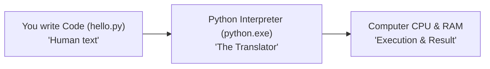

# Module 00: The Absolute Beginner's Guide to Python Environment & Modern Tooling

Welcome! If you are completely new to programming or modern developer tooling, **this guide is designed for you**. We will not assume you already know technical jargon. Everything is explained step-by-step using plain English, clear real-world analogies, and hands-on demonstrations.

> [!TIP]
> 🔰 **Total beginner with zero coding or terminal experience?**  
> Before installing professional developer tools, start with our **[Beginner Zero-to-One On-Ramp](04_BEGINNER_ZERO_TO_ONE.md)** to write and run your first Python script in 3 minutes!

---

## 🗺️ Recommended Step-by-Step Learning Path

Follow this exact sequence to achieve complete mastery of Module 00:

| Step | File to Open | What You Will Do |
| :---: | :--- | :--- |
| **1** | **[01_README.md](01_README.md)** | Read conceptual overview, architectural foundations, and mental models. |
| **2** | **[02_FOUNDATIONS_PLAYGROUND.md](02_FOUNDATIONS_PLAYGROUND.md)** | Practice beginner spoonfed micro-drills and line-by-line syntax breakdowns. |
| **3** | **[03_try_it_yourself.py](03_try_it_yourself.py)** | Run in terminal (`python 03_try_it_yourself.py`) for an interactive zero-dependency sandbox. |
| **4** | **[04_BEGINNER_ZERO_TO_ONE.md](04_BEGINNER_ZERO_TO_ONE.md)** | Read the beginner conceptual bridge guide before diving into advanced mechanics. |
| **5** | **[05_setup_and_verify.ps1](05_setup_and_verify.ps1)** | Run verification and environment bootstrap script. |
| **6** | **[06_interactive_walkthrough.ipynb](06_interactive_walkthrough.ipynb)** | Open in VS Code/Jupyter to run interactive visual experiments. |
| **7** | **[07_environment_diagnostics.py](07_environment_diagnostics.py)** | Run in terminal (`python 07_environment_diagnostics.py`) to explore Environment Diagnostics.Py code patterns. |
| **8** | **[08_ruff_demo_broken.py](08_ruff_demo_broken.py)** | Run in terminal (`python 08_ruff_demo_broken.py`) to explore Ruff Demo Broken.Py code patterns. |
| **9** | **[09_ruff_demo_clean.py](09_ruff_demo_clean.py)** | Run in terminal (`python 09_ruff_demo_clean.py`) to explore Ruff Demo Clean.Py code patterns. |
| **10** | **[10_TROUBLESHOOTING_AND_EDGE_CASES.md](10_TROUBLESHOOTING_AND_EDGE_CASES.md)** | Study forensic runbooks, edge cases, and real-world failure post-mortems. |
| **11** | **[11_SELF_ASSESSMENT_AND_CHALLENGES.md](11_SELF_ASSESSMENT_AND_CHALLENGES.md)** | Test your knowledge with self-assessment quizzes, challenges, and diagnostic scenarios. |
| **12** | **[12_PROJECT_GUIDE.md](12_PROJECT_GUIDE.md)** | Follow the 3-tier guided project implementation for starter/ and project_solution/. |

---

## 0. The Absolute Basics: What is All This Stuff?

Before we look at commands and files, let's understand the core concepts.



### 1. What is Python?
* **Python Code (`.py` files):** Simple plain-text files containing instructions written in English-like syntax that humans can easily read.
* **The Python Interpreter (`python.exe`):** A software program installed on your computer that reads your `.py` text files line-by-line and translates them into machine instructions that your computer's CPU can understand and execute.

---

### 2. What is the Terminal / Command Prompt?
Instead of clicking icons with a mouse, the **Terminal** (or **PowerShell** on Windows) lets you talk directly to your operating system by typing text commands.
* Running `python my_script.py` tells the computer: *"Hey, launch the Python program and ask it to read and run my_script.py."*

---

### 3. What is a Library / Package? (The LEGO Analogy)
Imagine you want to build a website or fetch weather data. You don't need to write millions of lines of network code from scratch.
* Other developers have already built reusable code blocks called **Packages** (or **Libraries**).
* Examples: `requests` (for downloading web pages), `fastapi` (for building web servers), `rich` (for making colorful terminal tables).
* **Package Managers** (like `pip` or modern **`uv`**) are tools that automatically download these packages from the internet (from a central repository called **PyPI** - Python Package Index) onto your computer.

---

### 4. What is a Virtual Environment? (The Separate Toolbox Analogy)
Imagine you are a contractor working on two houses:
* **House A** was built 5 years ago and requires **1/2-inch bolts** (`package-x version 1.0`).
* **House B** is modern and requires **3/4-inch bolts** (`package-x version 2.0`).

If you throw all your tools and bolts into one giant shared garage (your computer's global system Python), installing the new 3/4-inch bolts will overwrite the old ones and break House A!

```
❌ Global System Install (Messy):
System Python ──> Holds all packages for all projects ──> Inevitable version clashes & broken projects!

✅ Virtual Environments (Clean & Isolated):
Project A ──> Isolated Folder (.venv) with its own exact tools
Project B ──> Isolated Folder (.venv) with its own exact tools
```

A **Virtual Environment** is simply a dedicated folder (usually named `.venv`) created inside your project that contains its own copy of Python and only the specific packages that project needs.

---

### 5. What is a Linter and Formatter? (The Grammarly Analogy)
* **Code Formatter (like `ruff format`):** Like an automatic document organizer. If you have messy indentation or inconsistent quotation marks, the formatter instantly cleans it up to look professional and standard.
* **Linter (like `ruff check`):** Like a smart spell-checker / grammar checker for code. It reads your code *before* you run it and flags potential bugs (e.g., *"You imported math, but never used it"* or *"You made a typo in a variable name"*).

---

### 6. What is Git & GitHub? (The Time Machine & Cloud Backup)
* **Git:** A local program on your computer that acts like a **Time Machine** for your project files. Every time you make progress, you can create a "checkpoint" (called a **commit**). If something breaks later, you can travel back in time to any previous checkpoint.
* **GitHub:** A website that stores a copy of your Git checkpoints in the cloud so you never lose your work and can collaborate with other developers.

---

## 1. The Modern Python Toolchain: `uv` and `ruff`

In the past, developers had to install 5 or 6 different slow tools (`pip`, `virtualenv`, `black`, `flake8`, `isort`). 

Today, the modern standard is to use two super-fast tools written in **Rust**:
1. **`uv`:** Handles Python installations, virtual environments, package downloads, and project dependencies.
2. **`ruff`:** Handles all code formatting and linting checks in milliseconds.

---

## 2. Step-by-Step Guide: How to Work with `uv`

### Step 1: Create a Project and Virtual Environment

Open your terminal, navigate to your desired folder, and run:

```powershell
# 1. Create a new folder for your project
mkdir my_first_app
cd my_first_app

# 2. Initialize a modern project with a pyproject.toml configuration file
uv init

# 3. Create an isolated virtual environment (.venv folder)
uv venv
```

### Step 2: Adding Packages to Your Project
Instead of manually typing package names in text files, use `uv add`:

```powershell
# Add a package (e.g., 'rich' for colorful terminal output)
uv add rich

# Add a package needed only for testing / development (e.g., 'pytest')
uv add --dev pytest
```
When you run this:
* `uv` downloads the package into `.venv/`.
* `uv` records the package name in `pyproject.toml`.
* `uv` creates a `uv.lock` file that locks the exact version downloaded so anyone else who runs your code gets the exact same setup.

### Step 3: Running Your Code
You don't even need to manually activate the virtual environment! `uv run` handles it automatically:

```powershell
# Run a Python script inside your isolated environment
uv run python hello.py

# Run tests
uv run pytest
```

---

## 3. How to Clean & Check Your Code with `ruff`

Whenever you write Python code, you can check it with `ruff`:

```powershell
# Check your code for errors or bad habits
ruff check .

# Automatically fix fixable errors (like removing unused imports)
ruff check --fix .

# Auto-format your code nicely (indentation, spacing, quotes)
ruff format .
```

---

## 4. Understanding `pyproject.toml` (The Project Blueprint)

`pyproject.toml` is the central configuration file for your project. Think of it as the project's **identity card and ingredient list**:

```toml
[project]
name = "my-first-app"
version = "0.1.0"
description = "A simple beginner application"
requires-python = ">=3.11"

# The packages this project needs to run
dependencies = [
    "rich>=13.7.0",
]

# The packages you only need while writing code / testing
[project.optional-dependencies]
dev = [
    "pytest>=8.0.0",
    "ruff>=0.5.0",
]

[build-system]
requires = ["hatchling"]
build-backend = "hatchling.build"
```

---

## 5. Summary Cheatsheet for Beginners

| Goal | Command | What It Does in Plain English |
| :--- | :--- | :--- |
| **Start a new project** | `uv init` | Sets up a fresh project with `pyproject.toml` |
| **Create sandbox** | `uv venv` | Creates an isolated `.venv` toolbox folder |
| **Install a package** | `uv add <name>` | Downloads package & saves it to your project config |
| **Run your script** | `uv run python script.py` | Runs your code inside the sandbox |
| **Check code errors** | `uv run ruff check .` | Scans all files for mistakes or unused code |
| **Format code** | `uv run ruff format .` | Cleans up indentation and spacing automatically |
| **Run tests** | `uv run pytest` | Runs all test files inside `tests/` |

---

## 6. How to Practice in this Module

1. **Open the interactive notebook:** Open `06_interactive_walkthrough.ipynb` in VS Code and click **"Run All"** to see Python inspect itself.
2. **Run the diagnostics:** Open PowerShell in this directory and type `python 07_environment_diagnostics.py`.
3. **Practice fixing code:** Run `ruff check 02_ruff_demo_broken.py` to see what errors the linter finds, then run `ruff check --fix 02_ruff_demo_broken.py` to watch it fix them!
4. **Explore the sample project:** Open `modern_project_template/` and follow `12_PROJECT_GUIDE.md` to see a full real-world app.
