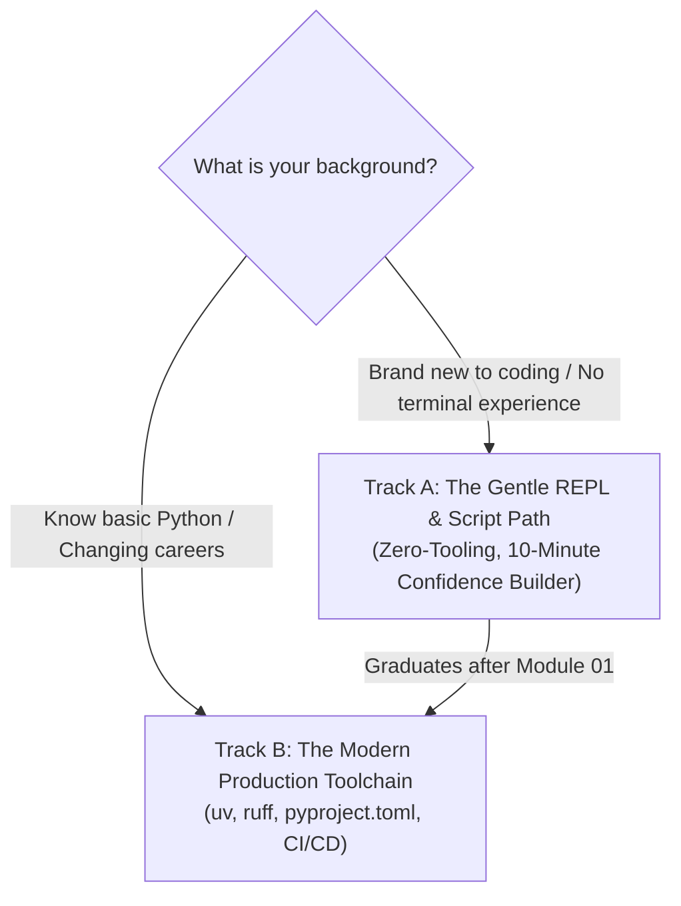

# 🔰 Module 00: Beginner Zero-to-One On-Ramp

Welcome to **Module 00**! If you are feeling overwhelmed by all the tools mentioned in modern developer guides (`uv`, `ruff`, `pre-commit`, `virtualenv`, `git`), **take a deep breath**.

You do NOT need to learn all of them in your first 10 minutes. This document gives you an ultra-gentle, friction-free ramp.

---

## 🛤️ Choose Your Starting Track



- **Track A (Total Novice):** Follow Steps 1 and 2 below. You'll write and run your first Python script using nothing but your terminal and a text editor. You can learn `uv` and `ruff` after you feel comfortable with basic Python syntax.
- **Track B (Professional Foundation):** Read Step 3 and proceed to the main [Module 00 README](01_README.md) to set up modern Rust-backed tooling.

---

## 📝 Track A, Step 1: Your Very First Python Script (`hello.py`)

Let's create and run a standalone `.py` file on your computer:

### 1. Open Your Terminal
- On Windows: Press `Win + R`, type `powershell`, press `Enter`.
- On macOS: Open `Terminal`.

### 2. Create a Working Folder
Type these commands into your terminal:
```bash
mkdir my_first_python
cd my_first_python
```

### 3. Create a Code File
You can create a file using VS Code or notepad:
- On Windows: `notepad hello.py` (Click "Yes" to create the file).
- In the file, write exactly this line:
  ```python
  print("Python mastery starts today!")
  ```
- Save the file (`Ctrl + S`) and close the window.

### 4. Run Your File
In your terminal, type:
```bash
python hello.py
```
**Boom!** You just executed your very first Python program from a script file.

---

## 🧭 Track A, Step 2: The 5 Essential Terminal Tricks

You will use the terminal throughout your engineering career. Here are the 5 life-saving habits:

1. **The Up-Arrow Key ($\uparrow$):** Pressing the up-arrow on your keyboard instantly brings back the last command you typed. You never have to re-type long commands!
2. **The Tab Key:** Always press `Tab` after typing the first 2 letters of a file or folder name to let the terminal complete it for you.
3. **Clearing the Screen:** Type `clear` (on Mac/Linux) or `cls` (on Windows) to clean up your terminal view whenever it looks cluttered.
4. **Current Folder Inspection:** Type `dir` (Windows) or `ls` (Mac/Linux) to see what files exist in the current folder.
5. **Emergency Stop (`Ctrl + C`):** If a program gets stuck or runs forever, hold `Ctrl` and press `C` to immediately cancel it.

---

## 🛠️ Track B, Step 3: Why Do We Need `uv` and `ruff`?

Once you write programs that depend on outside packages (like downloading web pages with `httpx` or building APIs with `fastapi`), you run into two massive problems:
1. **Dependency Hell:** Project A needs version 1.0 of a library, while Project B needs version 2.0. Installing them globally will break one of your projects!
2. **Speed & Consistency:** In the past, installing packages with `pip` and checking code with `flake8` was painfully slow and required 5 different configuration files.

Modern Python solves this using two Rust-backed tools:
- **`uv`:** Downloads packages in milliseconds and keeps every project inside its own isolated toolbox (virtual environment).
- **`ruff`:** Reads your code instantly, corrects messy indentation, and flags errors before you even run your program.

---

## 🚀 Next Steps

- If you chose **Track A**: You are ready to dive straight into **[Module 01: Python Fundamentals](../Module_01_Python_Fundamentals/01_README.md)**!
- If you chose **Track B**: Open the main **[Module 00 README](01_README.md)** and follow the 8-step journey to build your first modern `src-layout` project.
