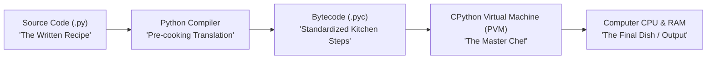

# Module 01: Python Fundamentals – Syntax, Types, and Control Flow

Welcome to **Module 01**! This guide is written from **first principles** for absolute beginners. We will explain how Python programs run, how Python stores information in computer memory, how decisions are made, and how to repeat actions using loops.

---

## 🗺️ Recommended Step-by-Step Learning Path

Follow this exact sequence to achieve complete mastery of Module 01:

| Step | File to Open | What You Will Do |
| :---: | :--- | :--- |
| **1** | **[01_README.md](01_README.md)** | Read conceptual overview, architectural foundations, and mental models. |
| **2** | **[02_FOUNDATIONS_PLAYGROUND.md](02_FOUNDATIONS_PLAYGROUND.md)** | Practice beginner spoonfed micro-drills and line-by-line syntax breakdowns. |
| **3** | **[03_try_it_yourself.py](03_try_it_yourself.py)** | Run in terminal (`python 03_try_it_yourself.py`) for an interactive zero-dependency sandbox. |
| **4** | **[04_interactive_fundamentals.ipynb](04_interactive_fundamentals.ipynb)** | Open in VS Code/Jupyter to run interactive visual experiments. |
| **5** | **[05_syntax_and_types_demo.py](05_syntax_and_types_demo.py)** | Run in terminal (`python 05_syntax_and_types_demo.py`) to explore Syntax And Types code patterns. |
| **6** | **[06_control_flow_and_loops_demo.py](06_control_flow_and_loops_demo.py)** | Run in terminal (`python 06_control_flow_and_loops_demo.py`) to explore Control Flow And Loops code patterns. |
| **7** | **[07_TROUBLESHOOTING_AND_EDGE_CASES.md](07_TROUBLESHOOTING_AND_EDGE_CASES.md)** | Study forensic runbooks, edge cases, and real-world failure post-mortems. |
| **8** | **[08_SELF_ASSESSMENT_AND_CHALLENGES.md](08_SELF_ASSESSMENT_AND_CHALLENGES.md)** | Test your knowledge with self-assessment quizzes, challenges, and diagnostic scenarios. |
| **9** | **[09_PROJECT_GUIDE.md](09_PROJECT_GUIDE.md)** | Follow the 3-tier guided project implementation for starter/ and project_solution/. |

---

## 1. How Python Runs: The Chef & Recipe Analogy

When you write a Python program, how does your computer actually execute it?



### The 3 Steps of Execution:
1. **Source Code (`.py` file):** You write readable text instructions in Python (like a recipe in English).
2. **Bytecode (`.pyc` file):** When you run `python script.py`, Python first automatically compiles your text into a simplified, compact intermediate format called **Bytecode**. Bytecode is faster for a computer to process than raw text.
3. **CPython Virtual Machine (PVM):** The "virtual machine" is the core engine of Python. It reads the bytecode instructions one-by-one and commands your computer's actual hardware (CPU and RAM) to perform the actions.

---

## 2. Variables & Memory: The "Name Tag" Model

In some languages (like C or Java), a variable is like a fixed metal box where you can only put one specific type of item.

In **Python**, a variable is like a **Sticky Name Tag** tied with a string to an object sitting in your computer's memory (RAM):

```
Variable Name (Sticky Tag) ──────> [ Object in Memory ] (e.g., Number 42, Text "Alice")
```

### Dynamic Typing vs. Strong Typing
Python is **Dynamically Typed** and **Strongly Typed**:

* **Dynamically Typed:** You don't have to declare whether a variable holds a number or text ahead of time. You can move the sticky tag to a different object anytime:
  ```python
  age = 25        # 'age' tag now points to integer 25
  age = "Twenty"  # 'age' tag moved to text "Twenty" (Totally legal!)
  ```
* **Strongly Typed:** Python will **never** silently convert incompatible types behind your back. If you try to add a word to a number:
  ```python
  score = 10 + "5"  # ❌ TypeError: unsupported operand type(s) for +: 'int' and 'str'
  ```
  Python protects you from accidental bugs by demanding that you explicitly convert types: `10 + int("5")`.

---

## 3. Core Primitive Data Types

Python comes with built-in primitive types to represent all basic data:

| Type | Name in Python | Real-World Meaning | Example |
| :--- | :--- | :--- | :--- |
| **Integer** | `int` | Whole numbers (positive, zero, negative). Python integers have **arbitrary precision** (they never overflow, can be millions of digits long!). | `count = 42`<br>`big = 10**100` |
| **Floating Point** | `float` | Decimal / Fractional numbers (stored using IEEE 754 standard). | `price = 19.99`<br>`temp = -3.5` |
| **Boolean** | `bool` | Binary truth values (like a light switch: `True` or `False`). | `is_active = True`<br>`logged_in = False` |
| **String** | `str` | Text (sequence of Unicode characters enclosed in quotes). | `name = "Alice"`<br>`city = 'Tokyo'` |
| **NoneType** | `None` | Represents the absence of a value or an "empty box". | `result = None` |

---

### The Floating-Point Trap (Why $0.1 + 0.2 \neq 0.3$)

Try this in Python:
```python
print(0.1 + 0.2 == 0.3)  # Prints False!
print(0.1 + 0.2)         # Prints 0.30000000000000004
```

**Why does this happen?**
Computers work in binary (base-2: 0s and 1s). Just like the fraction $1/3$ cannot be represented cleanly in decimal ($0.333333...$), the fraction $1/10$ ($0.1$) cannot be represented cleanly in binary without a repeating fraction.

> [!TIP]
> When comparing floats for near-equality, use `math.isclose(a, b)`:
> ```python
> import math
> print(math.isclose(0.1 + 0.2, 0.3))  # True!
> ```
> For financial calculations where exact decimals matter, use the built-in `decimal.Decimal` module.

---

## 4. Python Operators Explained

### 1. Arithmetic Operators

```python
a = 10
b = 3

print(a + b)   # 13  (Addition)
print(a - b)   # 7   (Subtraction)
print(a * b)   # 30  (Multiplication)
print(a / b)   # 3.3333333333333335 (True Division - always returns a float)
print(a // b)  # 3   (Floor Division - divides and chops off the decimal)
print(a % b)   # 1   (Modulo - gives the remainder of division: 10 = 3*3 + 1)
print(a ** b)  # 1000 (Exponentiation / Power: 10 to the power of 3)
```

---

### 2. Comparison Operators
Always return `True` or `False`:

```python
x = 5
y = 10

print(x == y)  # False (Equal to)
print(x != y)  # True  (Not equal to)
print(x < y)   # True  (Less than)
print(x > y)   # False (Greater than)
print(x <= 5)  # True  (Less than or equal to)
print(y >= 10) # True  (Greater than or equal to)
```

---

### 3. Identity vs. Equality: The "Identical Twins" Analogy

This is one of the most critical concepts in Python:

* **`==` (Equality):** Checks if two objects have the **same value / content** (e.g., two identical twins wearing the exact same clothes).
* **`is` (Identity):** Checks if two variables point to the **exact same spot in computer memory** (e.g., are they literally the same human person?).

```python
list1 = [1, 2, 3]
list2 = [1, 2, 3]

print(list1 == list2)  # True  (They contain the same numbers)
print(list1 is list2)  # False (They are two separate list boxes in memory!)

list3 = list1
print(list1 is list3)  # True  (Both names point to the exact same list in RAM)
```

> [!IMPORTANT]
> Always use `==` when comparing numbers, strings, and data values.
> Only use `is` when comparing against singletons like `None` (`if val is None:`).

---

### 4. Logical Operators & Short-Circuiting

* **`and`:** Returns `True` only if **both** sides are `True`.
* **`or`:** Returns `True` if **at least one** side is `True`.
* **`not`:** Reverses the boolean value (`not True` becomes `False`).

**What is Short-Circuiting?**
Python is lazy (efficient). It stops evaluating as soon as the final outcome is guaranteed:
* In `False and expensive_function()`, Python sees `False` on the left and never calls `expensive_function()` because `and` can never be true!
* In `True or expensive_function()`, Python sees `True` on the left and skips the right side immediately.

---

## 5. Strings: Indexing, Slicing & Modern Formatting

A string is an ordered sequence of characters.

### Indexing (0-Based and Negative)

```
Text:     P   y   t   h   o   n
Index:    0   1   2   3   4   5
Negative:-6  -5  -4  -3  -2  -1
```

```python
s = "Python"
print(s[0])   # 'P' (First character)
print(s[-1])  # 'n' (Last character)
```

---

### Slicing: `[start:stop:step]`
Slicing extracts a substring. **Rule:** `stop` is **exclusive** (it stops *before* that index!).

```python
word = "MasteringPython"

print(word[0:9])    # 'Mastering' (from index 0 up to 8)
print(word[9:])     # 'Python'    (from index 9 to the end)
print(word[:])      # 'MasteringPython' (entire string copy)
print(word[::2])    # 'Mseiayt'   (every 2nd character)
print(word[::-1])   # 'nohtyPgniretsaM' (reversed string!)
```

---

### Modern f-Strings (Formatted Strings)

Introduced in Python 3.6+, f-strings allow inserting expressions and formatting numbers directly inside text:

```python
name = "Alice"
account_balance = 1250000.758
tax_rate = 0.0825

# 1. Basic embedding
print(f"Hello, {name}!")

# 2. Number formatting with comma separators and decimal rounding (:.2f)
print(f"Balance: ${account_balance:,.2f}")
# Output: Balance: $1,250,000.76

# 3. Percentage formatting (:.1%)
print(f"Tax Rate: {tax_rate:.1%}")
# Output: Tax Rate: 8.2%

# 4. Alignment and padding
print(f"{'Item':<15} | {'Price':>10}")
print(f"{'Laptop':<15} | {'$999.99':>10}")
```

---

## 6. Control Flow: Making Decisions

Programs need to make decisions based on conditions.

### 1. `if`, `elif`, `else`

Python uses **indentation** (4 spaces) to define code blocks:

```python
temperature = 28

if temperature > 30:
    print("It's a hot sunny day!")
elif temperature > 20:
    print("The weather is lovely and warm.")
elif temperature > 10:
    print("A bit chilly, bring a jacket.")
else:
    print("It's freezing cold!")
```

---

### 2. Modern Pattern Matching (`match - case`) (Python 3.10+)

Instead of writing 10 `elif` chains, modern Python provides structural pattern matching:

```python
command = "status"

match command:
    case "start":
        print("Starting engine...")
    case "stop":
        print("Stopping engine...")
    case "status" | "info":  # Matches either 'status' or 'info'
        print("System is running normally.")
    case _:  # The wildcard default (like 'else')
        print(f"Unknown command: {command}")
```

#### Pattern Guards (`if`) and Capture Variables
> [!IMPORTANT]
> You cannot write direct comparison expressions like `case number > 10:` inside `case`.
> Instead, Python uses **Capture Patterns** and **`if` Guards**:
> 
> ```python
> number = 100
> 
> match number:
>     case n if n > 10:    # 'n' captures the value (n = 100), 'if' tests the condition
>         print(f"Value {n} is greater than 10")
>     case n if n < 90:
>         print(f"Value {n} is less than 90")
>     case _:
>         print("Default wildcard match")
> ```
> 1. `n` captures the value from `number`.
> 2. `if n > 10` is evaluated as the guard condition.
> 3. If `True`, the branch executes!


---

## 7. Loops: Repeating Actions

### 1. The `for` Loop and `range()`
Use `for` loops when you know what sequence you want to iterate over.

```python
# range(start, stop, step) - stop is exclusive!
for i in range(1, 6):
    print(f"Step #{i}")
# Output: Step #1, Step #2, Step #3, Step #4, Step #5
```

---

### 2. The `while` Loop
Use `while` loops when you want to repeat until a condition becomes `False`.

```python
countdown = 3
while countdown > 0:
    print(countdown)
    countdown -= 1  # Equivalent to: countdown = countdown - 1
print("Blast off!")
```

---

### 3. Loop Control: `break`, `continue`, and `else`

* **`break`:** Exits the loop immediately.
* **`continue`:** Skips the rest of the current iteration and jumps to the next cycle.
* **Loop `else` clause:** Executes **only if the loop completed naturally without hitting a `break`**!

```python
# Finding a prime number search example:
target = 7

for n in range(2, target):
    if target % n == 0:
        print(f"{target} is not prime, divisible by {n}")
        break
else:
    # This runs ONLY if no break was triggered!
    print(f"{target} is a PRIME number!")
```

---

## 8. User Input & Safe Type Conversion

The `input()` function prompts the user for text. **Important:** `input()` *always* returns a `str` (string).

```python
raw_age = input("Enter your age: ")

# Convert text to integer safely:
try:
    age = int(raw_age)
    print(f"In 5 years, you will be {age + 5} years old.")
except ValueError:
    print("Error: Please enter a valid whole number!")
```

---

## 9. Next Steps in this Module

1. **Interactive Notebook:** Open `04_interactive_fundamentals.ipynb` and run the experiments cell-by-cell.
2. **Run Demonstrations:** Execute `python 05_syntax_and_types_demo.py` and `python 06_control_flow_and_loops_demo.py`.
3. **Review Traps:** Read `07_TROUBLESHOOTING_AND_EDGE_CASES.md`.
4. **Build the Mini Project:** Follow `09_PROJECT_GUIDE.md` to build the **CLI Financial Compound Interest & Amortization Calculator**!
