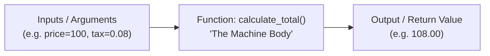
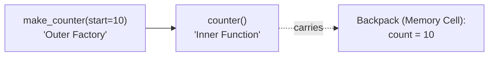

# Module 02: Functions, Scopes, Closures & Standard Library Essentials

Welcome to **Module 02**! In this module, we will explore the core building blocks of reusable software: **Functions**, **Variable Scope (LEGB)**, **Closures**, and the **Python Standard Library**.

---

## 1. What is a Function? The Vending Machine Analogy

Imagine a vending machine:
1. You insert money and press a code (the **Inputs / Arguments**).
2. Inside, the machine executes a hidden sequence of steps (the **Function Body**).
3. It dispenses a cold drink (the **Output / Return Value**).



### Why do we use functions?
* **DRY (Don't Repeat Yourself):** Write logic once, use it 1,000 times.
* **Modularity:** Break a complex 500-line script into small 10-line reusable tools.
* **Testability:** You can easily write unit tests for a small function.

---

## 2. Defining Functions & The `return` Keyword

```python
# 'name' is a Parameter (the placeholder variable)
def greet(name: str) -> str:
    message = f"Hello, {name}!"
    return message  # Sends the result back to the caller

# 'Alice' is an Argument (the real value passed in)
result = greet("Alice")
print(result)  # Output: Hello, Alice!
```

> [!IMPORTANT]
> **`return` vs `print()`:**
> - `print()` merely displays text on your computer screen for human eyes. It produces no usable data for the rest of your program.
> - `return` passes a real data value back to your program so other functions can store, calculate, and transform it.
> - If a function finishes without an explicit `return` statement, Python automatically returns `None`.

---

### Returning Multiple Values (Tuple Packing & Unpacking)
Python functions can return multiple values simultaneously by packing them into a tuple:

```python
def get_user_coordinates() -> tuple[float, float]:
    latitude = 37.7749
    longitude = -122.4194
    return latitude, longitude  # Automatically packed into a tuple

# Unpack directly into two variables:
lat, lon = get_user_coordinates()
print(f"Latitude: {lat}, Longitude: {lon}")
```

---

## 3. The 5 Parameter Types in Python

Python gives you fine-grained control over how arguments are passed into functions:

```
def func(pos_only, /, standard, *args, kw_only, **kwargs):
             │              │       │        │        │
             │              │       │        │        └─ Keyword Dictionary Bag
             │              │       │        └────────── Must be passed as name=val
             │              │       └─────────────────── Extra Positional Bag (Tuple)
             │              └─────────────────────────── Can be passed by position OR name
             └────────────────────────────────────────── MUST be passed by position only
```

### 1. Positional-Only Parameters (`/`)
Parameters before the `/` slash **must** be passed by order/position, never by name:
```python
def calculate_area(length, width, /):
    return length * width

calculate_area(10, 5)          # ✅ Correct
# calculate_area(length=10, width=5) # ❌ TypeError: positional-only arguments passed as keyword arguments
```

### 2. Keyword-Only Parameters (`*`)
Parameters after the `*` asterisk **must** be passed by explicit name:
```python
def send_email(recipient: str, *, subject: str, urgent: bool = False):
    print(f"Sending to {recipient}: [{subject}] Urgent={urgent}")

send_email("alice@example.com", subject="Meeting", urgent=True) # ✅ Correct
# send_email("alice@example.com", "Meeting", True)              # ❌ TypeError!
```

### 3. Variable Positional Arguments (`*args` - The List Bag)
When you don't know ahead of time how many numbers or items the caller will send, use `*args`:
```python
def sum_all(*args: float) -> float:
    # 'args' arrives as a tuple of all positional values passed
    total = 0.0
    for num in args:
        total += num
    return total

print(sum_all(1, 2))             # 3.0
print(sum_all(10, 20, 30, 40))   # 100.0
```

### 4. Variable Keyword Arguments (`**kwargs` - The Dictionary Bag)
When you want to accept arbitrary named settings:
```python
def build_profile(username: str, **kwargs: str) -> dict:
    # 'kwargs' arrives as a dictionary of key-value pairs
    profile = {"username": username}
    profile.update(kwargs)
    return profile

user = build_profile("karthik", role="Admin", city="Austin", tier="Pro")
print(user)  # {'username': 'karthik', 'role': 'Admin', 'city': 'Austin', 'tier': 'Pro'}
```

### 5. Argument Unpacking with `*` and `**`
You can unpack existing lists/tuples or dictionaries directly into function calls:
```python
numbers = [10, 20, 30]
print(sum_all(*numbers))  # Unpacks list into: sum_all(10, 20, 30)

config = {"subject": "Alert", "urgent": True}
send_email("boss@example.com", **config)  # Unpacks dict into keyword args
```

---

## 4. Variable Scope: The LEGB Rule

Scope determines **where** a variable can be seen and accessed in your code.

### The Concentric Circles Analogy: LEGB Rule
When Python sees a variable name, it searches outwards in 4 concentric circles:

```
  ┌────────────────────────────────────────────────────────┐
  │ 4. Built-in (B): Python built-ins (print, len, range)   │
  │   ┌──────────────────────────────────────────────────┐ │
  │   │ 3. Global (G): Module-level variables            │ │
  │   │   ┌────────────────────────────────────────────┐ │ │
  │   │   │ 2. Enclosing (E): Outer function variables │ │ │
  │   │   │   ┌──────────────────────────────────────┐ │ │ │
  │   │   │   │ 1. Local (L): Inside current function│ │ │ │
  │   │   │   └──────────────────────────────────────┘ │ │ │
  │   │   └────────────────────────────────────────────┘ │ │
  │   └──────────────────────────────────────────────────┘ │
  └────────────────────────────────────────────────────────┘
```

1. **Local (L):** Names defined inside the currently running function.
2. **Enclosing (E):** Names in any enclosing functions (nested functions).
3. **Global (G):** Names defined at the top level of the `.py` file/module.
4. **Built-in (B):** Built-in functions and names provided by Python (`len`, `range`, `int`).

---

### Modifying Outer Variables: `global` and `nonlocal`

By default, functions can *read* outer variables, but assigning to a variable creates a brand new **Local** variable instead of changing the outer one.

* **`global`:** Tells Python you want to reassign a variable at the top-level module scope.
* **`nonlocal`:** Tells Python you want to reassign a variable in the enclosing outer function.

```python
def outer():
    count = 0  # Enclosing variable

    def inner():
        nonlocal count  # Targets the 'count' in outer()
        count += 1
        return count

    return inner
```

---

## 5. Closures: The "Function with a Backpack" Analogy

### What is a Closure?
When an inner function remembers and retains access to variables from its outer enclosing scope, **even after the outer function has finished executing**, it is called a **Closure**.

Think of a closure as a function carrying a **Backpack of Memory**:



```python
def make_bank_account(initial_balance: float):
    # 'balance' is a private variable inside the factory
    balance = initial_balance

    def deposit(amount: float) -> float:
        nonlocal balance
        balance += amount
        return balance

    return deposit  # Returns the inner function carrying 'balance'

# Create two independent bank accounts with their own private balance backpacks!
alice_account = make_bank_account(100.0)
bob_account = make_bank_account(500.0)

print(alice_account(50.0))  # 150.0 (Alice's backpack updated)
print(bob_account(20.0))   # 520.0 (Bob's backpack is completely independent!)
```

### Inspecting a Closure
You can inspect the memory backpack using `__closure__`:
```python
print(alice_account.__closure__[0].cell_contents)  # Prints 150.0
```

---

## 6. First-Class Functions & Lambdas

In Python, **functions are first-class citizens**. This means a function is just an object:
1. You can assign a function to a variable.
2. You can pass a function as an argument to another function.
3. You can return a function from a function.

### Passing Functions as Arguments
```python
def apply_operation(x: float, y: float, operation_func) -> float:
    return operation_func(x, y)

def add(a, b): return a + b
def multiply(a, b): return a * b

print(apply_operation(5, 3, add))       # 8
print(apply_operation(5, 3, multiply))  # 15
```

---

### Anonymous Functions (`lambda`)
A `lambda` is a tiny, one-line function without a name:
```python
# Syntax: lambda arg1, arg2: expression
square = lambda x: x ** 2
print(square(6))  # 36

# Common real-world usage: Sorting lists by custom criteria
students = [("Alice", 88), ("Bob", 95), ("Charlie", 78)]
students.sort(key=lambda item: item[1], reverse=True)
print(students)  # [('Bob', 95), ('Alice', 88), ('Charlie', 78)]
```

---

## 7. Modular Code Architecture & Imports

### What is a Module vs. a Package?
* **Module:** A single `.py` file containing Python code (e.g., `combat.py`).
* **Package:** A folder containing multiple modules, identified by an `__init__.py` file.

### The `if __name__ == "__main__":` Guard
When Python runs a `.py` file directly, it sets a secret variable `__name__ = "__main__"`.
When that same file is imported by another script, `__name__` is set to the module's file name (e.g., `"combat"`).

```python
def calculate_damage(attack: int, defense: int) -> int:
    return max(1, attack - defense)

# This block runs ONLY when you run this file directly from the terminal.
# It does NOT run when another file imports calculate_damage!
if __name__ == "__main__":
    print("Testing combat calculations:")
    print("Test damage:", calculate_damage(20, 5))
```

---

## 8. Essential Standard Library Overview

Python is famous for its **"batteries-included"** philosophy. You don't need third-party packages for core tasks:

| Module | What It Provides | Example Usage |
| :--- | :--- | :--- |
| **`math`** | Mathematical functions & constants | `math.sqrt(16)`, `math.ceil(4.2)`, `math.pi` |
| **`random`** | Random number generation, dice rolls, choices | `random.randint(1, 6)`, `random.choice(items)` |
| **`datetime`** | Date and time manipulation | `datetime.now(timezone.utc)`, formatting `%Y-%m-%d` |
| **`zoneinfo`** | Modern IANA timezone support (Python 3.9+) | `ZoneInfo("America/New_York")`, `ZoneInfo("UTC")` |
| **`pathlib`** | Object-oriented filesystem path manipulation | `Path("data") / "logs.txt"`, `path.exists()` |
| **`sys`** | System-specific parameters and exit commands | `sys.argv` (CLI flags), `sys.exit(0)` |

---

## 9. Hands-On Practice in this Module

1. **Interactive Experiments:** Open `05_interactive_functions_and_scopes.ipynb` to inspect closures, unpack arguments, and test lambda sorting.
2. **Run Demonstrations:** Execute `python 06_function_parameters_demo.py`, `python 07_scopes_and_closures_demo.py`, and `python 08_standard_library_core_demo.py`.
3. **Review Traps:** Read `09_TROUBLESHOOTING_AND_EDGE_CASES.md` (learn about `UnboundLocalError` and the closure loop trap).
4. **Self-Assessment:** Complete the quiz in `10_SELF_ASSESSMENT_AND_CHALLENGES.md`.
5. **Build the Mini-Project:** Follow `11_PROJECT_GUIDE.md` to explore the **Modular Text-Based RPG Game Engine** in `project_solution/`!
