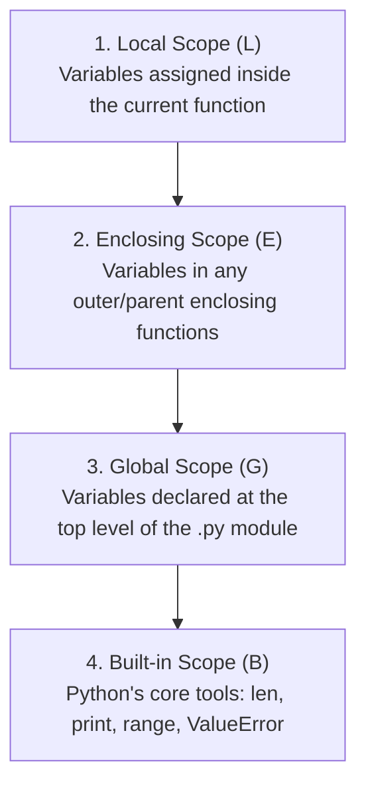
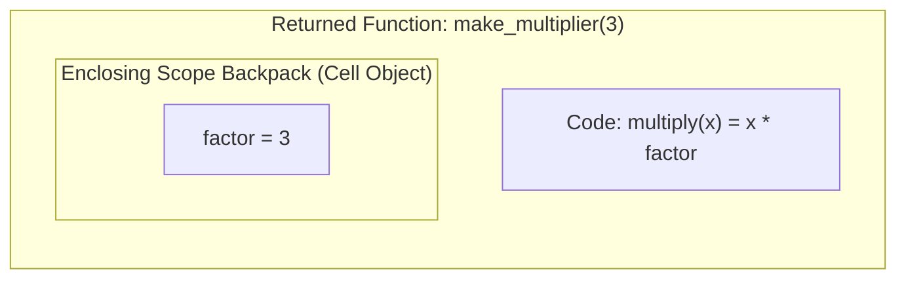

# 🔰 Beginner-to-Closures Guide: Functions, Scopes & Lexical Magic

Welcome to **Module 02**! In Module 01, you learned how to write simple functions with parameters and return values.

In Module 02, you will encounter more advanced functional concepts: **first-class functions**, **nested functions**, **variable scopes (LEGB rule)**, and **closures**.

If these sound abstract or confusing, this guide breaks them down step-by-step with clear mental models.

---

## 1. Functions Are First-Class Citizens: Functions Are Just Values!

In many languages (like C or Java 7), functions are special structural blocks. In Python, **functions are ordinary objects**, just like integers, strings, or lists!

You can:
- Assign a function to a variable.
- Store functions inside lists or dictionaries.
- Pass a function as an argument to another function.
- Return a function from another function.

```python
def greet(name: str) -> str:
    return f"Hello, {name}!"

# 1. Assign to a variable (notice: NO parentheses!)
my_func = greet
print(my_func("Alice"))  # "Hello, Alice!"

# 2. Store in a dictionary (command dispatching)
operations = {
    "say_hi": greet,
    "lowercase": str.lower,
}
fn = operations["say_hi"]
print(fn("Bob"))  # "Hello, Bob!"
```

---

## 2. The LEGB Scope Rule: How Python Finds Variables

When you reference a variable name inside a function, Python searches in a strict four-layer hierarchy known as **LEGB**:



```python
# G: Global scope
TAX_RATE = 0.08

def calculate_invoice(subtotal: float) -> float:
    # L: Local scope (subtotal, total live only during this function call)
    total = subtotal * (1.0 + TAX_RATE)
    return total

print(calculate_invoice(100.0))  # 108.0
```

---

## 3. The `nonlocal` Keyword Demystified

Normally, an inner function can *read* variables from an outer function. But if you try to *assign* (`=`) to that variable, Python assumes you want to create a brand-new **Local** variable with the same name!

To tell Python: *"I want to modify the outer function's variable"*, we use `nonlocal`:

```python
def make_counter():
    count = 0  # Enclosing scope

    def increment():
        nonlocal count  # Tells Python to modify 'count' in the outer function!
        count += 1
        return count

    return increment

counter_a = make_counter()
print(counter_a())  # 1
print(counter_a())  # 2
```

---

## 4. What Is a Closure? (The Backpack Metaphor)

Think of a function as a hiker. Normally, when a function finishes executing, all its local variables are erased from memory.

A **Closure** occurs when an inner function "packs" variables from its outer enclosing scope into a private "backpack" (technically called a `cell` object) and carries them with it forever, even after the outer function has finished executing!



```python
def make_multiplier(factor: int):
    def multiply(number: int) -> int:
        return number * factor  # 'factor' is stored in the closure backpack!
    return multiply

times3 = make_multiplier(3)
times10 = make_multiplier(10)

# Even though make_multiplier finished executing, the inner functions remember their factor:
print(times3(5))   # 15
print(times10(5))  # 50

# You can even inspect the backpack directly:
print(times3.__closure__[0].cell_contents)  # 3
```

---

## 5. Practical Uses of Closures
1. **State Isolation without Classes:** Lightweight state preservation without the boilerplate of a class with `__init__`.
2. **Function Factories:** Generating customized mathematical, formatting, or validation functions on the fly.
3. **The Foundation of Decorators:** Decorators in Module 05 are simply closures that wrap existing functions!

You are now fully prepared to tackle the advanced parameters, `*args`, `**kwargs`, and modular architectures in the [Module 02 README](01_README.md)!
