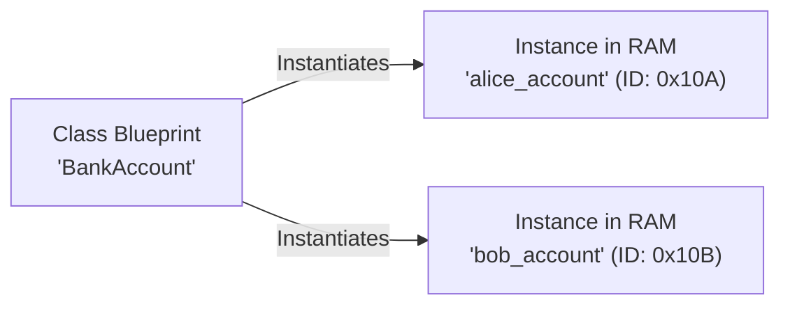

# Module 04: Deep Object-Oriented Programming (OOP)

Welcome to **Module 04**! Object-Oriented Programming (OOP) is the standard paradigm for architecting large, maintainable, and extensible software systems. In this module, we will explore classes, memory lifecycle (`__new__` vs `__init__`), encapsulation, properties, Method Resolution Order (MRO), dunder/magic methods, and Abstract Base Classes (ABCs).

---

## 1. The Blueprint & House Analogy

* **Class (The Architectural Blueprint):** The abstract design describing what data and actions an entity should have (e.g. `BankAccount` has a `balance` and a `deposit()` action).
* **Object / Instance (The Physical House):** The real entity built in computer memory from that blueprint (e.g. `alice_account = BankAccount(100.0)`).



---

## 2. Object Lifecycle: `__new__` vs `__init__`

When you create an object with `account = BankAccount(100)`, Python performs a 2-step ceremony:

1. **`__new__(cls, ...)` (The Builder):** Allocates the raw memory chunk in RAM and returns the brand-new, empty object instance. (Rarely overridden unless creating singletons or immutable subclasses).
2. **`__init__(self, ...)` (The Decorator / Painter):** Takes that newly created `self` object and initializes its attributes (like `self.balance = 100`).

---

## 3. Instance Variables vs. Class Variables

* **Instance Variable (`self.name`):** Belongs to that *one specific object*.
* **Class Variable (`bank_name = "Apex Bank"`):** Shared across *all instances* of the class.

> [!CAUTION]
> **The Mutable Class Variable Trap:**
> If you put a mutable list/dict as a class variable, all instances will share and mutate the same list!
> ```python
> # ❌ BUGGY: All dogs share the same tricks list!
> class Dog:
>     tricks = []  # Class variable
>
> # ✅ CORRECT: Each dog has its own separate tricks list!
> class Dog:
>     def __init__(self):
>         self.tricks = []  # Instance variable
> ```

---

## 4. The 3 Types of Methods

```python
class Employee:
    company_name = "TechCorp"

    def __init__(self, name: str, salary: float) -> None:
        self.name = name
        self.salary = salary

    # 1. Instance Method: Receives 'self' (the specific employee instance)
    def give_raise(self, percentage: float) -> None:
        self.salary *= (1 + percentage)

    # 2. Class Method: Receives 'cls' (used for alternate constructors / factory methods)
    @classmethod
    def from_csv_string(cls, data_row: str) -> Employee:
        name, salary_str = data_row.split(",")
        return cls(name=name.strip(), salary=float(salary_str))

    # 3. Static Method: Receives neither 'self' nor 'cls' (pure utility function)
    @staticmethod
    def is_valid_salary(amount: float) -> bool:
        return amount >= 30000.0
```

---

## 5. Encapsulation & Properties (`@property`)

Instead of writing verbose Java-style `get_balance()` and `set_balance()` methods, Python uses **Properties** for seamless, validated attribute access:

```python
class BankAccount:
    def __init__(self, initial_balance: float) -> None:
        self._balance = initial_balance  # Convention: _ indicates protected

    @property
    def balance(self) -> float:
        """Getter: Read balance naturally via account.balance"""
        return self._balance

    @balance.setter
    def balance(self, value: float) -> None:
        """Setter: Enforce strict constraints on account.balance = 500"""
        if value < 0:
            raise ValueError("Account balance cannot be negative!")
        self._balance = value
```

---

## 6. Inheritance, `super()`, & Method Resolution Order (MRO)

### The Diamond Problem & C3 Linearization
When class `D` inherits from both `B` and `C`, and both inherit from `A`:
In what order does Python search for methods?

```
      A
     / \
    B   C
     \ /
      D
```

Python uses the **C3 Linearization Algorithm** to produce a deterministic, conflict-free lookup chain called the **MRO (Method Resolution Order)**:
```python
print(D.__mro__)
# Output: (D, B, C, A, object)
```

`super()` automatically walks this chain in order without hardcoding parent names!

---

## 7. Dunder (Magic) Methods: The Special Abilities Protocol

Dunder (Double Underscore) methods allow your custom classes to integrate with Python's built-in syntax:

| Syntax | Magic Method | Purpose |
| :--- | :--- | :--- |
| `str(obj)` / `print(obj)` | `__str__(self)` | User-friendly string display |
| `repr(obj)` / Debugger | `__repr__(self)` | Unambiguous developer/code representation |
| `a == b` | `__eq__(self, other)` | Equality comparison |
| `a < b` | `__lt__(self, other)` | Enables automatic sorting with `sorted()` |
| `a + b` | `__add__(self, other)` | Custom addition |
| `len(obj)` | `__len__(self)` | Enables `len()` function |
| `obj[key]` | `__getitem__(self, key)` | Enables square-bracket indexing |
| `hash(obj)` | `__hash__(self)` | Enables storing in `dict` keys and `set` |

---

## 8. Abstract Base Classes (ABCs): Enforcing Contracts

An Abstract Base Class (`abc.ABC`) defines a strict contract that all child subclasses **must** implement:

```python
from abc import ABC, abstractmethod

class PaymentGateway(ABC):
    """Abstract interface contract for all payment processors."""

    @abstractmethod
    def process_payment(self, amount: float) -> bool:
        """Subclasses MUST implement this method or Python will refuse instantiation!"""
        pass

class StripeGateway(PaymentGateway):
    def process_payment(self, amount: float) -> bool:
        print(f"Charging ${amount:.2f} via Stripe API...")
        return True
```

---

## 9. Next Steps in this Module

1. **Interactive Experiments:** Open `05_interactive_deep_oop.ipynb` to run live dunder and MRO code.
2. **Run Demonstrations:** Execute `06_classes_lifecycle_and_properties_demo.py`, `07_inheritance_mro_and_abcs_demo.py`, and `08_dunder_magic_methods_demo.py`.
3. **Review Traps:** Check `09_TROUBLESHOOTING_AND_EDGE_CASES.md`.
4. **Self-Assessment:** Complete the quiz in `10_SELF_ASSESSMENT_AND_CHALLENGES.md`.
5. **Build the Mini-Project:** Follow `11_PROJECT_GUIDE.md` to explore the **Multi-Tier Banking & Investment System** in `project_solution/`!
