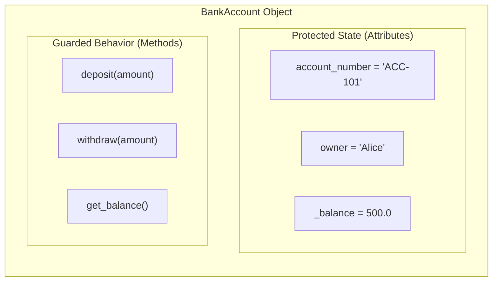
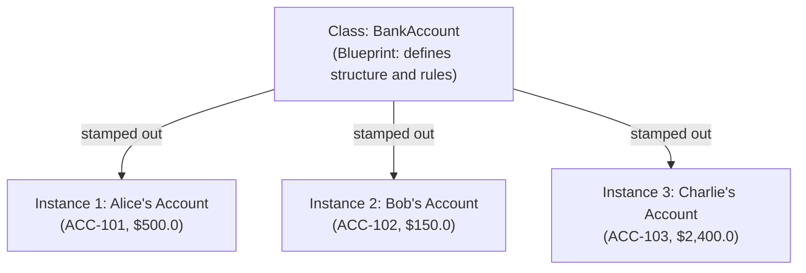
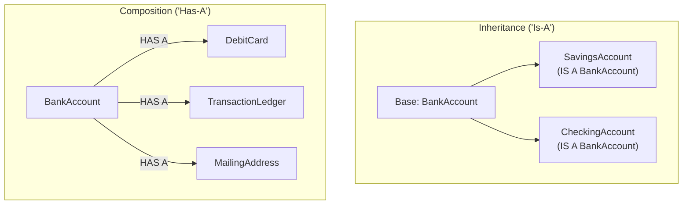

# 🔰 Beginner-to-OOP Bridge: The Mental Model & Mechanics

Welcome to **Module 04**! In Modules 01 through 03, you mastered Python's foundational building blocks: variables, loops, functions, lists, dictionaries, sets, and tuples.

Now you are stepping into **Object-Oriented Programming (OOP)**. Many learners find this leap jarring because textbooks suddenly bombard them with jargon: *classes, instances, `self`, inheritance, polymorphism, encapsulation, and method resolution order (MRO)*.

This guide gives you an intuitive, step-by-step bridge from procedural programming to object-oriented architecture.

---

## 1. Why Do We Need OOP at All?

Imagine you are building a banking application without classes, using only dictionaries:

```python
# Procedural approach with dictionaries
account_1 = {"account_number": "ACC-101", "owner": "Alice", "balance": 500.0}
account_2 = {"account_number": "ACC-102", "owner": "Bob", "balance": 150.0}

def deposit(account: dict, amount: float) -> None:
    if amount <= 0:
        raise ValueError("Deposit must be positive")
    account["balance"] += amount

def withdraw(account: dict, amount: float) -> None:
    if amount > account["balance"]:
        raise ValueError("Insufficient funds")
    account["balance"] -= amount
```

### The Three Nightmares of the Dictionary Approach:
1. **No Data Invariant Protection:** Anyone can write `account_1["balance"] = -999999` directly, bypassing your `withdraw()` validation.
2. **Key Typos Cause Silent Bugs:** If one developer writes `account["owner"]` and another writes `account["owner_name"]`, code crashes at runtime in production.
3. **Scattered Logic:** Data and the functions that manipulate that data live in separate places. As your codebase grows to 50 functions and 20 data shapes, tracking which function is allowed to modify which dictionary becomes chaos.

### The OOP Solution: Bundling State and Behavior
A **Class** solves this by bundling the **data (attributes)** and the **operations on that data (methods)** together into an encapsulated, self-protecting unit:



---

## 2. Classes vs Instances: The Cookie Cutter and the Cookie

A **Class** is the blueprint or cookie cutter. It defines what fields and capabilities every instance will possess.
An **Instance** is the concrete physical object stamped out from that blueprint:



```python
class BankAccount:
    """The blueprint for a bank account."""
    
    def __init__(self, account_number: str, owner: str, initial_balance: float = 0.0) -> None:
        self.account_number = account_number
        self.owner = owner
        self._balance = initial_balance  # Leading underscore means: private implementation detail

# Creating instances:
alice_acc = BankAccount("ACC-101", "Alice", 500.0)
bob_acc = BankAccount("ACC-102", "Bob", 150.0)

print(alice_acc.owner)  # "Alice"
print(bob_acc.owner)    # "Bob"
```

---

## 3. The Mystery of `self` Demystified

The most common question beginners ask is: **"Why do I have to type `self` as the first argument of every single method?"**

Here is what happens under the hood. When you execute:
```python
alice_acc.deposit(100.0)
```
Python automatically rewrites and executes that call as:
```python
BankAccount.deposit(alice_acc, 100.0)
```
Notice that `alice_acc` is passed as the first argument! In languages like Java or C++, this pointer is passed implicitly as `this`. In Python, **explicit is better than implicit** (The Zen of Python), so the reference to the specific instance is explicitly received as `self`.

```python
class BankAccount:
    def deposit(self, amount: float) -> None:
        # self is whichever account called this method!
        if amount <= 0:
            raise ValueError("Amount must be positive")
        self._balance += amount
```

---

## 4. Instance Attributes vs Class Attributes

There are two distinct scopes where variables live on a class:

| Attribute Type | Where It's Defined | Who Owns It | How It's Accessed | Best Used For |
| :--- | :--- | :--- | :--- | :--- |
| **Instance Attribute** | Inside `__init__` via `self.x` | The specific object | `self.x` or `obj.x` | Unique data (account number, balance, name) |
| **Class Attribute** | Directly inside the class body | The Class itself (shared by all) | `ClassName.x` | Global configuration, default rates, constants |

```python
class BankAccount:
    # CLASS ATTRIBUTE (shared across ALL bank accounts in this institution)
    ROUTING_NUMBER: str = "021000021"
    ANNUAL_INTEREST_RATE: float = 0.045  # 4.5%

    def __init__(self, owner: str, balance: float) -> None:
        # INSTANCE ATTRIBUTES (unique to THIS specific person's account)
        self.owner = owner
        self._balance = balance

acc1 = BankAccount("Alice", 1000.0)
acc2 = BankAccount("Bob", 2000.0)

# Both share the same routing number:
print(acc1.ROUTING_NUMBER)  # "021000021"
print(acc2.ROUTING_NUMBER)  # "021000021"

# If the central bank changes the interest rate:
BankAccount.ANNUAL_INTEREST_RATE = 0.050
print(acc1.ANNUAL_INTEREST_RATE)  # Automatically reflects 0.050 for all accounts!
```

> [!CAUTION]
> **The Mutable Class Attribute Trap:**
> Never declare a mutable collection (e.g., `transactions = []` or `cache = {}`) as a class attribute unless you intend *every single instance* to share that exact same list! Always initialize lists and dictionaries inside `__init__`:
> ```python
> # ❌ BUG: Every customer will see everyone else's transactions!
> class BrokenAccount:
>     transactions = [] 
>
> # ✅ CORRECT: Each customer receives their own private list
> class SafeAccount:
>     def __init__(self):
>         self.transactions = []
> ```

---

## 5. Encapsulation & Pythonic Data Protection: `@property`

In languages like Java, developers write tedious getters and setters:
```java
public double getBalance() { return this.balance; }
public void setBalance(double balance) { ... }
```
In Python, we use the `@property` decorator to make a method look and feel like an attribute while still retaining validation control:

```python
class BankAccount:
    def __init__(self, owner: str, initial_balance: float) -> None:
        self.owner = owner
        self._balance = initial_balance

    @property
    def balance(self) -> float:
        """Read-only property to inspect the current balance."""
        return self._balance

    @property
    def owner(self) -> str:
        return self._owner

    @owner.setter
    def owner(self, new_owner: str) -> None:
        """Setter with validation."""
        if not new_owner or not new_owner.strip():
            raise ValueError("Owner name cannot be empty")
        self._owner = new_owner.strip()
```

Now you can write clean code:
```python
acc = BankAccount("Alice", 500.0)
print(acc.balance)      # 500.0 (accessed like a field, but guarded by a function)
acc.owner = "Alice Smith"  # Validated by the setter!
acc.owner = ""          # Raises ValueError: Owner name cannot be empty!
```

---

## 6. Inheritance vs Composition: "Is-A" vs "Has-A"

When you need to extend functionality, you have two design choices:



### Rule of Thumb:
- Use **Inheritance** when a class is genuinely a specialized variant of a parent class and can be used anywhere the parent is accepted (*Liskov Substitution Principle*).
- Prefer **Composition** when assembling multiple independent responsibilities. *"Favor composition over inheritance"* prevents brittle, deeply nested hierarchy trees.

---

## 7. Stepping Stone to Advanced Topics in Module 04

Now that you have this mental model firmly in place, you are ready to tackle the advanced engineering concepts in the main [Module 04 README](01_README.md):

1. **Object Allocation & Lifecycle:** How `__new__` allocates memory before `__init__` populates it.
2. **Dunder (Magic) Methods:** Giving custom classes operator behavior (`+`, `-`, `==`, `<`, `str()`, `repr()`).
3. **Abstract Base Classes (ABCs):** Using `abc.ABC` and `@abstractmethod` to enforce interface contracts.
4. **Multiple Inheritance & C3 Linearization:** How Python deterministically traverses class hierarchies (MRO) in diamond inheritance patterns without ambiguity.

You are now equipped to master the advanced architectural patterns ahead!
