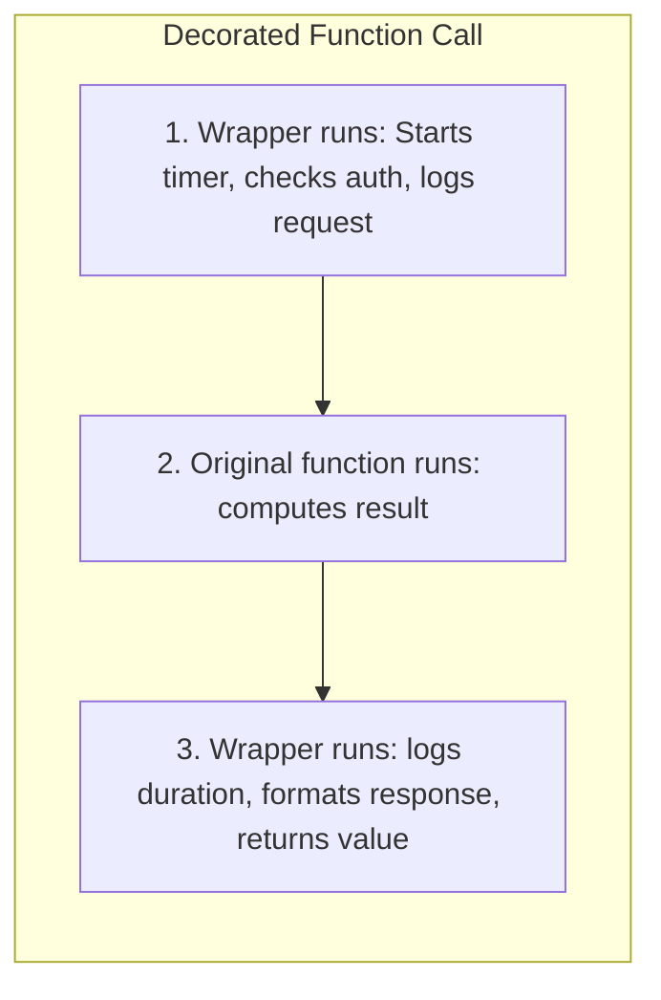

# 🔰 Beginner-to-Advanced Features Guide: Decorators, Generators & Context Managers

Welcome to **Module 05**! This module covers the trio of features that separate junior Python scriptwriters from senior Python engineers:
1. **Decorators** (`@my_decorator`)
2. **Generators** (`yield`)
3. **Context Managers** (`with open(...)`)

If you've ever felt confused by syntax like `@functools.wraps` or wondered why anyone would use `yield` instead of `return`, this guide demystifies them once and for all.

---

## 1. Demystifying Decorators: The Gift Wrap Analogy

Imagine you have a plain gift box (your original function). A **Decorator** is like wrapping the box in festive wrapping paper with a ribbon. The gift inside is untouched, but anyone interacting with it sees and experiences the wrapper first!



### The 3-Step Mental Progression:
How does `@my_decorator` work under the hood?

```python
# Step 1: A function that takes a function and returns a wrapper function
def my_decorator(original_func):
    def wrapper():
        print("Before the function runs!")
        original_func()
        print("After the function runs!")
    return wrapper

# Step 2: The manual way
def say_hello():
    print("Hello, world!")

say_hello = my_decorator(say_hello)
say_hello()

# Step 3: Python's syntactic sugar: The '@' symbol
# The '@' is just shorthand for: say_hello = my_decorator(say_hello)
@my_decorator
def say_hi():
    print("Hi!")

say_hi()
```

### The Magic of `*args` and `**kwargs`
To make your decorator work on *any* function regardless of what arguments it accepts:
```python
def universal_decorator(func):
    def wrapper(*args, **kwargs):
        print(f"Calling {func.__name__} with args: {args}, kwargs: {kwargs}")
        return func(*args, **kwargs)
    return wrapper
```

---

## 2. Demystifying Generators: The Streaming Faucet vs The Water Bucket

Imagine you need water.
- **The List Approach (Bucket):** You fill a giant 500-gallon bucket with all the water you will ever need, carry it up three flights of stairs, and set it down. It consumes massive physical space (RAM).
- **The Generator Approach (Faucet):** You turn on the faucet. One drop of water comes out when you ask for it (`yield`). When you are done with that drop, the next drop comes out. You never store more than one drop at a time!

```python
# ❌ BUCKET (List): Allocates ~40 MB of RAM immediately!
def get_numbers_list(n: int):
    results = []
    for i in range(n):
        results.append(i)
    return results

# ✅ FAUCET (Generator): Allocates ~120 bytes of RAM forever!
def get_numbers_generator(n: int):
    for i in range(n):
        yield i  # Freezes execution here and returns 'i' until next() is called!

# Comparing memory:
import sys
list_obj = get_numbers_list(1_000_000)
gen_obj = get_numbers_generator(1_000_000)

print("List memory:", sys.getsizeof(list_obj), "bytes")       # ~8,448,728 bytes
print("Generator memory:", sys.getsizeof(gen_obj), "bytes")   # ~112 bytes (99.999% smaller!)
```

---

## 3. Demystifying Context Managers: The Clean-Up Guarantee

Beginners often write file code like this:
```python
f = open("data.txt", "w")
f.write("Hello")
# If an error happens here, f.close() NEVER RUNS! The file is locked in memory!
f.close()
```

A **Context Manager** (`with` statement) guarantees that cleanup code always runs, even if your code crashes with an unexpected error!

```python
# The 'with' statement is just a beautiful shorthand for try...finally:
with open("data.txt", "w") as f:
    f.write("Hello")
# When execution leaves this block, Python AUTOMATICALLY calls f.close()!
```

### The Quick Way to Build Your Own: `@contextmanager`
```python
from contextlib import contextmanager

@contextmanager
def temporary_database_connection():
    print("1. Opening DB Connection...")
    yield "DB_HANDLE"  # Handed to the 'as' variable
    print("2. Closing DB Connection (Guaranteed cleanup!)...")

with temporary_database_connection() as db:
    print("   Running query using:", db)
```

You are now ready to tackle the production decorators, streaming pipelines, and custom resource managers in the [Module 05 README](01_README.md)!
