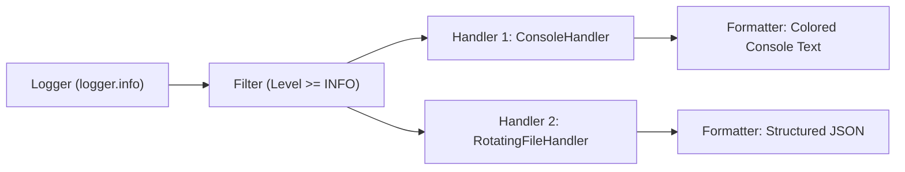

# Module 06: Enterprise Error Handling & Logging

Welcome to **Module 06**! In production engineering, software crashes cost money and damage user trust. In this module, we will explore **Robust Error Handling**, **Custom Exception Hierarchies**, **Exception Chaining**, Python 3.11+ **Exception Groups (`except*`)**, and **Enterprise Structured Logging** with rotating file handlers and JSON payloads.

---

## 🗺️ Recommended Step-by-Step Learning Path

Follow this exact order to achieve 100% mastery of Module 06:

| Step | File to Open | What You Will Do |
| :---: | :--- | :--- |
| **1** | **[01_README.md](01_README.md)** | Read conceptual overview, architectural foundations, and mental models. |
| **2** | **[02_FOUNDATIONS_PLAYGROUND.md](02_FOUNDATIONS_PLAYGROUND.md)** | Practice beginner spoonfed micro-drills and line-by-line syntax breakdowns. |
| **3** | **[03_try_it_yourself.py](03_try_it_yourself.py)** | Run in terminal (`python 03_try_it_yourself.py`) for an interactive zero-dependency sandbox. |
| **4** | **[04_interactive_error_handling.ipynb](04_interactive_error_handling.ipynb)** | Open in VS Code/Jupyter to run interactive visual experiments. |
| **5** | **[05_exceptions_deep_dive_demo.py](05_exceptions_deep_dive_demo.py)** | Run in terminal (`python 05_exceptions_deep_dive_demo.py`) to explore Exceptions Deep Dive code patterns. |
| **6** | **[06_structured_logging_demo.py](06_structured_logging_demo.py)** | Run in terminal (`python 06_structured_logging_demo.py`) to explore Structured Logging code patterns. |
| **7** | **[07_TROUBLESHOOTING_AND_EDGE_CASES.md](07_TROUBLESHOOTING_AND_EDGE_CASES.md)** | Study forensic runbooks, edge cases, and real-world failure post-mortems. |
| **8** | **[08_SELF_ASSESSMENT_AND_CHALLENGES.md](08_SELF_ASSESSMENT_AND_CHALLENGES.md)** | Test your knowledge with self-assessment quizzes, challenges, and diagnostic scenarios. |
| **9** | **[09_PROJECT_GUIDE.md](09_PROJECT_GUIDE.md)** | Follow the 3-tier guided project implementation for starter/ and project_solution/. |

---

## 1. Error Handling: The Circuit Breaker Analogy

In a building, electrical circuit breakers protect appliances. If a sudden power surge occurs, the circuit breaker trips safely, preventing the entire house from catching fire.

In Python:
* **`try` Block:** The normal operation area ("Attempt to run this code").
* **`except` Block:** The Circuit Breaker ("If a specific surge/error occurs, catch it safely and handle it").
* **`else` Block:** "Only run if NO errors occurred in the `try` block."
* **`finally` Block:** The Emergency Exit ("ALWAYS run no matter what happens, even if the code crashed").

```python
try:
    file = open("data.txt", "r")
    content = file.read()
except FileNotFoundError as e:
    print(f"Handled gracefully: {e}")
else:
    print(f"File read successfully! Characters: {len(content)}")
finally:
    print("Cleanup step: Closing connections...")
```

---

## 2. The Python Exception Tree

All Python errors inherit from a root class:

```
                  BaseException
                  /     |     \
    KeyboardInterrupt  SystemExit  Exception  <-- ALWAYS catch from here!
                                  /    |    \
                          TypeError ValueError OSError
```

> [!CAUTION]
> **Never use bare `except:` or `except BaseException:`!**
> Catching `BaseException` intercepts `KeyboardInterrupt` (Ctrl+C) and `SystemExit`, making your program impossible for users or operating systems to shut down! Always catch `except Exception:` or specific subclasses.

---

## 3. Custom Domain Exceptions & Exception Chaining

In professional engineering, create custom exception classes representing business domain errors:

```python
class AppBaseError(Exception):
    """Base exception for all application errors."""
    pass

class PaymentProcessingError(AppBaseError):
    """Raised when a credit card payment fails."""
    pass

# Exception Chaining with 'from':
try:
    raw_api_call()
except ConnectionResetError as original_error:
    # 'raise ... from' preserves the root cause in the traceback
    raise PaymentProcessingError("Stripe gateway unreachable.") from original_error
```

---

## 4. Exception Groups (Python 3.11+)

When running concurrent tasks (like multiple async API requests), multiple errors can happen at the exact same time. Python 3.11 introduced `ExceptionGroup` and the `except*` syntax:

```python
eg = ExceptionGroup("Multiple Task Failures", [
    ValueError("Invalid user ID"),
    ConnectionError("Database offline"),
])

try:
    raise eg
except* ValueError as e:
    print(f"Handled ValueErrors: {e.exceptions}")
except* ConnectionError as e:
    print(f"Handled ConnectionErrors: {e.exceptions}")
```

---

## 5. Logging: The Crime Scene Investigation Log

`print()` statements are ephemeral and disappear. Production servers need **structured logs** with timestamps, severity levels, and file outputs for forensic analysis.



### The 5 Standard Log Levels

| Level | Numeric Value | When to Use |
| :--- | :---: | :--- |
| **`DEBUG`** | 10 | Detailed diagnostic information for developers during debugging. |
| **`INFO`** | 20 | Normal operational events (e.g. "User logged in", "Server started"). |
| **`WARNING`** | 30 | Unexpected condition that is not fatal (e.g. "Disk 85% full", "Deprecated API"). |
| **`ERROR`** | 40 | A serious issue that prevented a specific operation from completing. |
| **`CRITICAL`** | 50 | A catastrophic failure that may halt the entire system (e.g. "Database connection dead"). |

---

## 6. Rotating File Handlers & Structured JSON Logging

```python
import json
import logging
from logging.handlers import RotatingFileHandler

# Custom JSON Formatter for Cloud Observability (Datadog, AWS, ELK)
class JSONFormatter(logging.Formatter):
    def format(self, record: logging.LogRecord) -> str:
        log_obj = {
            "timestamp": self.formatTime(record),
            "level": record.levelname,
            "logger": record.name,
            "message": record.getMessage(),
        }
        return json.dumps(log_obj)

logger = logging.getLogger("payment_service")
logger.setLevel(logging.INFO)

# Automatically rotates log files when they reach 5 MB, keeping 3 backups:
file_handler = RotatingFileHandler("app.log", maxBytes=5 * 1024 * 1024, backupCount=3)
file_handler.setFormatter(JSONFormatter())
logger.addHandler(file_handler)
```

---

## 7. Next Steps in this Module

1. **Interactive Notebook:** Open `04_interactive_error_handling.ipynb` to run live exception and logging experiments.
2. **Run Demonstrations:** Execute `05_exceptions_deep_dive_demo.py` and `06_structured_logging_demo.py`.
3. **Review Traps:** Check `07_TROUBLESHOOTING_AND_EDGE_CASES.md`.
4. **Self-Assessment:** Complete the quiz in `08_SELF_ASSESSMENT_AND_CHALLENGES.md`.
5. **Build the Mini-Project:** Follow `09_PROJECT_GUIDE.md` to explore the **E-Commerce Checkout & Audit Logging Engine** in `project_solution/`!
