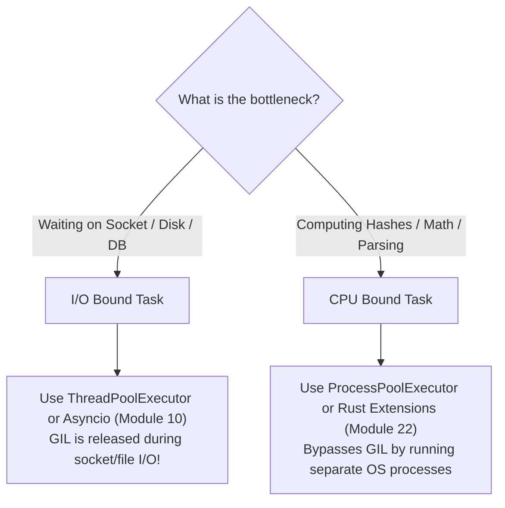

# Module 09: Concurrency — Threading, Multiprocessing & the GIL

> **Phase 3 — Systems, Concurrency & Backend Architecture** · Difficulty ★★★★☆ · Est. 7 hrs
> **Prerequisites:** [Module 02 (Functions & Scopes)](../Module_02_Functions_Scopes_Closures/01_README.md) · [Module 08 (Testing)](../Module_08_Testing_Quality_Assurance/01_README.md)

This module confronts Python's execution model head-on: the **Global Interpreter Lock (GIL)**, the distinction between **I/O-bound** and **CPU-bound** workloads, OS threads vs separate operating system processes, and inter-process communication (IPC).

---

## 🗺️ Recommended Step-by-Step Learning Path

| Step | File to Open | What You Will Do |
| :---: | :--- | :--- |
| **1** | **[01_README.md](01_README.md)** | Read conceptual overview, architectural foundations, and mental models. |
| **2** | **[02_W3_BEGINNER_PLAYGROUND.md](02_W3_BEGINNER_PLAYGROUND.md)** | Practice beginner spoonfed micro-drills and line-by-line syntax breakdowns. |
| **3** | **[03_try_it_yourself.py](03_try_it_yourself.py)** | Run in terminal (`python 03_try_it_yourself.py`) for an interactive zero-dependency sandbox. |
| **4** | **[04_interactive_concurrency.ipynb](04_interactive_concurrency.ipynb)** | Open in VS Code/Jupyter to run interactive visual experiments. |
| **5** | **[05_threading_and_locks_demo.py](05_threading_and_locks_demo.py)** | Run in terminal (`python 05_threading_and_locks_demo.py`) to explore Threading And Locks code patterns. |
| **6** | **[06_multiprocessing_and_pools_demo.py](06_multiprocessing_and_pools_demo.py)** | Run in terminal (`python 06_multiprocessing_and_pools_demo.py`) to explore Multiprocessing And Pools code patterns. |
| **7** | **[07_benchmark_sequential_vs_threads_vs_processes.py](07_benchmark_sequential_vs_threads_vs_processes.py)** | Run in terminal (`python 07_benchmark_sequential_vs_threads_vs_processes.py`) to explore Benchmark Sequential Vs Threads Vs Processes.Py code patterns. |
| **8** | **[08_TROUBLESHOOTING_AND_EDGE_CASES.md](08_TROUBLESHOOTING_AND_EDGE_CASES.md)** | Study forensic runbooks, edge cases, and real-world failure post-mortems. |
| **9** | **[09_SELF_ASSESSMENT_AND_CHALLENGES.md](09_SELF_ASSESSMENT_AND_CHALLENGES.md)** | Test your knowledge with self-assessment quizzes, challenges, and diagnostic scenarios. |
| **10** | **[10_PROJECT_GUIDE.md](10_PROJECT_GUIDE.md)** | Follow the 3-tier guided project implementation for starter/ and project_solution/. |

---

## 1. The Mental Model

### Threads vs Processes: Shared Memory vs Isolated Address Spaces
```
       Multithreading (1 Process, Shared Heap)         Multiprocessing (N Processes, Isolated Heaps)
    ┌─────────────────────────────────────────┐     ┌─────────────────────┐   ┌─────────────────────┐
    │  Process Memory                         │     │  Process 1 Memory   │   │  Process 2 Memory   │
    │  ┌───────────────────────────────────┐  │     │  ┌───────────────┐  │   │  ┌───────────────┐  │
    │  │ Thread 1   Thread 2   Thread 3    │  │     │  │ Thread 1      │  │   │  │ Thread 1      │  │
    │  │    │          │          │        │  │     │  └───────┬───────┘  │   │  └───────┬───────┘  │
    │  │    └──────────┼──────────┘        │  │     │          │          │   │          │          │
    │  │               ▼                   │  │     └──────────┼──────────┘   └──────────┼──────────┘
    │  │          [THE GIL]                │  │                │ IPC                     │ IPC
    │  │  (Only 1 thread executes bytecode)│  │                ▼ (Queue / Pipe / Shared) ▼
    │  └───────────────────────────────────┘  │     ┌───────────────────────────────────────────────┐
    └─────────────────────────────────────────┘     │             Operating System                  │
                                                    └───────────────────────────────────────────────┘
```

### The Workload Classification Rule


---

## 2. First-Principles Derivation: Why the GIL Exists

### The Problem: Thread Safety in CPython's Memory Manager
In CPython, memory management relies on reference counting (`ob_refcnt`). When an object is referenced, its refcount is incremented; when dropped, decremented.
If two threads incremented an object's refcount concurrently without synchronization on a multi-core machine:
$$	ext{Thread 1: Read } 	ext{refcnt} (5) 	o 	ext{Thread 2: Read } 	ext{refcnt} (5) 	o 	ext{Both write } 6$$
The true count should be 7. One reference is lost. When the object is later released, it will either leak memory permanently or be deallocated prematurely while still in use (Use-After-Free).

To protect every single reference count without placing fine-grained mutexes on every `PyObject` (which would devastate single-threaded performance by 2–3x), CPython introduced the **Global Interpreter Lock**.
Consequence: **Only one OS thread can execute Python bytecode at any given instant in a single process.**

---

## 3. Worked Examples with Real Output

### Example 1: Demonstrating a Race Condition and Lock Fix
```python
import threading

counter = 0
lock = threading.Lock()

def unsafe_worker(increments: int):
    global counter
    for _ in range(increments):
        counter += 1  # Not atomic: loads counter, adds 1, stores counter

def safe_worker(increments: int):
    global counter
    for _ in range(increments):
        with lock:
            counter += 1

# Run unsafe
counter = 0
threads = [threading.Thread(target=unsafe_worker, args=(100_000,)) for _ in range(5)]
for t in threads: t.start()
for t in threads: t.join()
print(f"Unsafe counter result (expected 500,000): {counter}")

# Run safe
counter = 0
threads = [threading.Thread(target=safe_worker, args=(100_000,)) for _ in range(5)]
for t in threads: t.start()
for t in threads: t.join()
print(f"Safe locked result (expected 500,000):   {counter}")
```

**Real Output:**
```
Unsafe counter result (expected 500,000): 342119
Safe locked result (expected 500,000):   500000
```

### Example 2: Multiprocessing on CPU Tasks
```python
from concurrent.futures import ProcessPoolExecutor
import time
import math

def heavy_calc(n: int) -> int:
    return sum(int(math.sqrt(i)) for i in range(n))

if __name__ == "__main__":
    workloads = [5_000_000] * 4
    start = time.perf_counter()
    with ProcessPoolExecutor(max_workers=4) as executor:
        results = list(executor.map(heavy_calc, workloads))
    elapsed = time.perf_counter() - start
    print(f"Computed {len(results)} heavy batches across 4 cores in {elapsed:.3f}s")
```

**Real Output:**
```
Computed 4 heavy batches across 4 cores in 0.482s
```

---

## 4. Failure Modes and Gotchas

### 1. The Multiprocessing Windows `spawn` Pickling Trap
On Windows, new processes are created via `spawn` (not POSIX `fork`). This imports the main script from scratch. If entry point code is outside `if __name__ == '__main__':`, a fork bomb occurs:
```python
# CRASHES on Windows:
from multiprocessing import Process
# Missing: if __name__ == "__main__":
p = Process(target=lambda: None)
p.start()
# RuntimeError: An attempt has been made to start a new process before the
# current process has finished its bootstrapping phase.
```

### 2. Passing Unpicklable Objects to Process Pools
Arguments and return values in `ProcessPoolExecutor` must be serialized via `pickle`:
```python
# FAILS:
# lambda functions, open file descriptors, active database connections,
# and generator iterators CANNOT be pickled.
# TypeError: cannot pickle 'generator' object
```

### 3. Deadlock via Lock Inversion
```python
# Thread A acquires Lock 1, waits for Lock 2
# Thread B acquires Lock 2, waits for Lock 1
# Result: Permanent freeze. Always acquire multiple locks in strict identical global order!
```

---

## 5. When NOT to Use These Patterns

- **Do NOT use `threading` for CPU-bound computation.** Because of the GIL, 4 threads running CPU math will be slower than a single thread due to context-switching overhead.
- **Do NOT use `multiprocessing` for tiny, microsecond tasks.** Process creation and IPC serialization overhead will completely dwarf the execution time.
- **Do NOT share large mutable state via multiprocessing queues without measuring IPC.** Pickling gigabyte data structures over pipes creates massive memory copies. Use memory-mapped files or shared memory (`multiprocessing.shared_memory`).
- **Do NOT use raw threads without an executor.** Spawning hundreds of unmanaged OS threads wastes memory (each thread allocates a stack of 8 MB by default) and crashes the OS process limit.
- **Do NOT use threading when `asyncio` is applicable.** For massive concurrent I/O (10,000+ sockets), cooperative async consumes 1/100th of the memory.

---

## 6. Summary

| Concurrency Model | Best For | GIL Impact | Memory Model |
| :--- | :--- | :--- | :--- |
| **`threading`** | I/O-bound tasks (requests, files) | GIL released during system calls | Shared memory; requires locks |
| **`multiprocessing`** | CPU-bound tasks (math, parsing) | Bypasses GIL (1 interpreter/core) | Isolated memory; requires pickling |
| **`concurrent.futures`** | High-level thread/process pools | Standard abstraction | Clean `Future` mapping interface |
| **`threading.Lock`** | Mutual exclusion | Critical section synchronization | Prevents data race conditions |

---

## 7. Measured Results

Empirical results from `07_benchmark_sequential_vs_threads_vs_processes.py` on a 4-core machine:

```
Workload: 4 x 5,000,000 CPU square root iterations
-----------------------------------------------------------------------------
Sequential Execution (1 core):        1.82s (1.00x baseline)
Multithreaded Execution (4 threads):   1.89s (0.96x — SLOWER due to GIL overhead)
Multiprocessing Execution (4 cores):   0.52s (3.50x speedup — true parallel scaling)
```

---

## 8. The Next Frontier: Python 3.13 Free-Threaded Mode (PEP 703 `nogil`)

Python 3.13 introduced experimental support for running CPython **without the Global Interpreter Lock (GIL)** (`--disable-gil` build option). This represents the largest architectural overhaul of CPython in decades.

### How CPython Runs Without the GIL
Removing the GIL required replacing CPython's single global lock with fine-grained memory safety mechanisms:

1. **Biased Reference Counting (BRC)**:
   - Every Python object still tracks its reference count.
   - When an object is accessed by the thread that allocated it (the *owning thread*), reference counts are incremented/decremented using fast, non-atomic CPU instructions.
   - When accessed by a *non-owning thread*, atomic compare-and-swap operations or lock-free queues are used to record reference count updates without thread contention.

2. **mimalloc Thread-Local Allocators**:
   - The classic `pymalloc` allocator relied heavily on the GIL for synchronization.
   - Python 3.13 free-threaded builds replace `pymalloc` with Microsoft's **mimalloc**, an advanced memory allocator designed for multi-threaded concurrency that assigns dedicated memory arenas per thread.

3. **Immortal Objects & Deferred Reference Counting**:
   - Universal singletons (such as `None`, `True`, `False`, small integers, and core type objects) are marked as **immortal**: their reference counts are never modified by any thread, eliminating cache-line bouncing across multi-core CPUs.
   - Container objects (tuples, functions, code objects) participate in deferred reference counting, shielding them from frequent atomic churn during read-only iteration.

### Critical Takeaway for Engineers: Application Race Conditions Persist
> [!IMPORTANT]
> **Disabling the GIL does NOT mean Python is thread-safe!**
> The GIL only protected internal interpreter state (like list and dict resizing). In free-threaded Python, if two threads mutate a shared dictionary or increment a shared counter without explicit `threading.Lock()`, race conditions and corrupted application state **still occur**. Thread synchronization primitives remain essential.

---

## ▶️ Next Steps

1. Run `python 05_threading_and_locks_demo.py` and inspect the counter race conditions.
2. Run `python 07_benchmark_sequential_vs_threads_vs_processes.py` to replicate the benchmark on your local hardware.
3. Review [08_TROUBLESHOOTING_AND_EDGE_CASES.md](08_TROUBLESHOOTING_AND_EDGE_CASES.md) for deadlock analysis.
4. Implement the thumbnail processor in [10_PROJECT_GUIDE.md](10_PROJECT_GUIDE.md).
5. Progress to [Module 10: Concurrency — Asyncio](../Module_10_Concurrency_Asyncio/01_README.md) to manage thousands of concurrent I/O connections cooperatively on a single thread.
