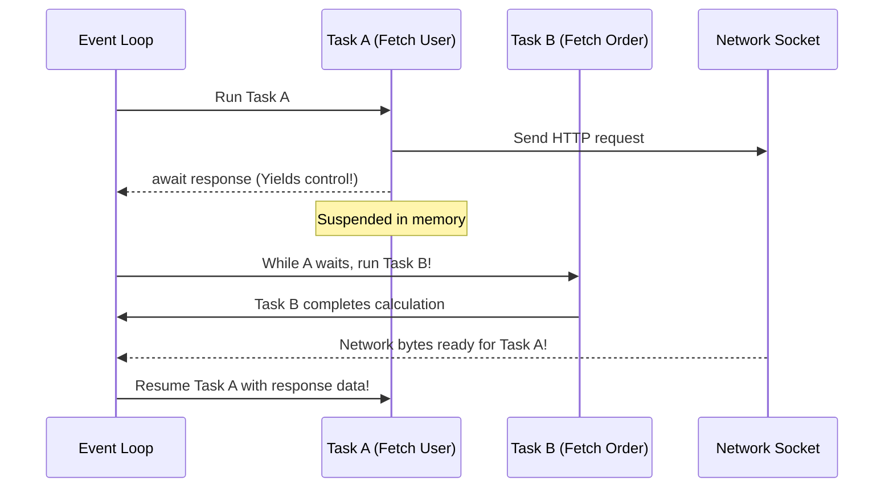

# 🚀 Zero-to-Hero Bridge Guide: Concurrency & Asyncio Demystified

Welcome to Module 10! If you have ever felt confused by words like **coroutines**, **event loops**, **non-blocking I/O**, and `async`/`await`, you are not alone. Concurrency is often taught with heavy academic jargon.

This guide gives you an intuitive, visual mental model so you feel 100% confident before touching a single line of production code.

---

## 1. The Real-World Mental Model: The Chef and the Waiter

Imagine a busy Italian restaurant with a single chef and one waiter.

```
Synchronous Blocking (The Inefficient Waiter):
  Customer 1 orders pasta.
  Waiter walks to kitchen and STARE AT WATER BOILING for 10 minutes.
  Customer 2, 3, and 4 are starving and waiting at the door.
  Waiter brings pasta to Customer 1, then finally greets Customer 2.
  Total time: 40 minutes for 4 customers.

Multithreading (Hiring 4 Waiters):
  Hire 4 waiters for 4 customers.
  Everyone gets served faster, but:
  - Waiters bump into each other in the kitchen (Race conditions / Locks).
  - You have to pay 4 salaries and manage 4 uniforms (Memory overhead: 8MB stack per thread).
  - Python's Global Interpreter Lock (GIL) means only one waiter can enter the kitchen at a time anyway!

Asyncio (The Master Waiter - Cooperative Multitasking):
  Customer 1 orders pasta.
  Waiter places order in kitchen, sets a timer on the counter.
  WITHOUT WAITING for the water to boil, waiter immediately walks to Customer 2 and takes their order.
  When the timer dings (pasta ready), the waiter picks it up and delivers it.
  Total time: 12 minutes for 4 customers using only ONE waiter!
```

### Why Asyncio is King for Web & Network I/O
Web servers, database queries, and microservices spend **99% of their time waiting** for network packets to travel across optical cables or disks to spin. They are not doing CPU math; they are just waiting.
- **Asyncio** lets a single thread effortlessly handle 20,000 idle connections using a tiny fraction of the memory that 20,000 OS threads would require.

---

## 2. The #1 Beginner Mistake: Calling a Coroutine Does NOT Run It!

In standard Python:
```python
def make_coffee():
    return "Espresso"

cup = make_coffee()  # Runs immediately, cup == "Espresso"
```

In async Python, adding `async def` completely changes how Python treats the function:
```python
async def make_coffee():
    return "Espresso"

cup = make_coffee()
print(cup)
# Output: <coroutine object make_coffee at 0x7fa2810>
# Warning: RuntimeWarning: coroutine 'make_coffee' was never awaited!
```

### What happened?
When you call an `async def` function, Python does **not** execute the function body. Instead, it creates a **coroutine object**—a packaged recipe ready to be executed by an event loop.

To actually run it, you must either:
1. `await` it inside another coroutine:
   ```python
   async def morning_routine():
       cup = await make_coffee()  # <--- Suspends here until make_coffee finishes!
       print(cup)
   ```
2. Or kick off the event loop from the top level:
   ```python
   import asyncio
   asyncio.run(morning_routine())
   ```

---

## 3. What Does `await` Actually Do?

Think of `await` as a polite sign that says:
> *"I am now waiting for a network socket or timer. Dear Event Loop, please pause me and go do work for other users until my result arrives."*



---

## 4. The Three Core Objects: Coroutines vs Tasks vs Futures

| Term | What It Is | Real-World Analogy |
| :--- | :--- | :--- |
| **Coroutine** | A function defined with `async def`. It is inert until awaited or scheduled. | A recipe written on paper. |
| **Task** | A coroutine wrapped and actively scheduled on the event loop (`asyncio.create_task()` or `tg.create_task()`). | The dish actively cooking on burner #2. |
| **Future** | A low-level object representing an eventual result that hasn't happened yet. | A claim ticket for your coat at the cloakroom. |

---

## 5. The Cardinal Sin: The Blocking Trap

Because `asyncio` runs on **a single thread**, if any code blocks that thread, **ALL OTHER TASKS ARE FROZEN**.

### The Bug That Freezes Production:
```python
import asyncio
import time  # <--- DANGER!

async def handle_user_request():
    time.sleep(5)  # ❌ FREEZES THE ENTIRE SERVER FOR 5 SECONDS!
    return "Done"
```

### The Fix:
Always use async-native non-blocking calls:
```python
async def handle_user_request():
    await asyncio.sleep(5)  #  Yields control so other users can browse!
    return "Done"
```

### What if you MUST call a legacy sync library (like `requests` or `boto3`)?
Use `asyncio.to_thread()` to safely push the blocking call onto an OS background thread pool without blocking the main event loop:
```python
import asyncio
import requests

def legacy_download(url: str) -> str:
    return requests.get(url).text  # Sync blocking call

async def async_friendly_download(url: str) -> str:
    # Runs in a separate worker thread; event loop stays 100% responsive!
    return await asyncio.to_thread(legacy_download, url)
```

---

## 6. Modern Python 3.11+: Structured Concurrency with `TaskGroup`

In older Python, developers used `asyncio.gather()`. If one task crashed, other tasks were left running in the background ("orphaned tasks").

Python 3.11 introduced `asyncio.TaskGroup`, guaranteeing that either **all tasks succeed, or if one fails, all siblings are cleanly cancelled**:

```python
import asyncio

async def fetch(id: int):
    await asyncio.sleep(0.1)
    return f"Data {id}"

async def main():
    async with asyncio.TaskGroup() as tg:
        task1 = tg.create_task(fetch(1))
        task2 = tg.create_task(fetch(2))
    
    # Both tasks are guaranteed to be finished once we exit the context block!
    print(task1.result(), task2.result())

asyncio.run(main())
```

---

## 7. Quick Diagnostic Self-Check

Before you move to the interactive notebook and lab, test your intuition:

1. **Question:** What happens if you execute `res = my_async_func()` without `await`?
   - *Answer:* It does NOT run the code; it returns a `<coroutine object>` that sits idle.
2. **Question:** Can `asyncio` speed up a heavy CPU-bound loop calculating primes on 1 core?
   - *Answer:* No! Asyncio is designed for **I/O-bound** waiting (network, disk, databases). For CPU-bound number crunching, use `multiprocessing` or Rust PyO3 extensions (Module 09 / 22).
3. **Question:** How do you run two independent network requests in parallel using asyncio?
   - *Answer:* Schedule them in an `async with asyncio.TaskGroup() as tg:` block using `tg.create_task()`.

---

**You are now ready! Proceed to [05_interactive_asyncio.ipynb](05_interactive_asyncio.ipynb) to experiment with live async code in your browser.**
