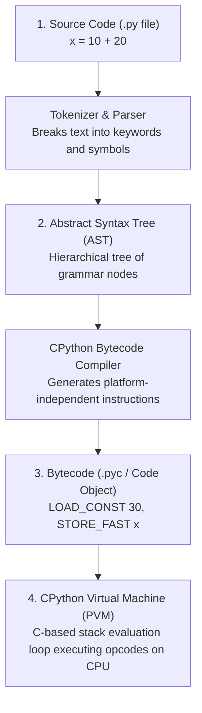

# 🔰 Beginner-to-Internals Guide: Demystifying CPython

Welcome to **Module 12**! When most people write Python, they treat it like magic: you type text, press "Run", and your program works.

In this module, you pull back the curtain and look at the physical engine under the hood: **CPython** (the reference implementation of Python written in C).

You do NOT need to know C to understand this guide. We will break down what happens to your code at every layer.

---

## 1. What Happens When You Run a Python File?

The journey from your text editor to the CPU happens in four distinct stages:



---

## 2. Reading Bytecode: It's Just Simple Stack Instructions!

The CPython Virtual Machine is a **Stack Machine**. Think of the stack as a spring-loaded plate dispenser in a cafeteria:
- `PUSH` (or `LOAD`): Puts a plate on top of the dispenser.
- `POP` (or `BINARY_OP`): Takes the top two plates, performs an action, and pushes the result back.

Let's disassemble a simple function using the built-in `dis` module:

```python
import dis

def calculate(a, b):
    return a + b

dis.dis(calculate)
```

The output looks like this:
```text
  1           0 LOAD_FAST                0 (a)      # Push variable 'a' onto the stack
              2 LOAD_FAST                1 (b)      # Push variable 'b' onto the stack
              4 BINARY_OP                0 (+)      # Pop 'a' and 'b', add them, push sum
              8 RETURN_VALUE                        # Pop sum and return to caller!
```

---

## 3. How Python Manages Memory: Reference Counting & Garbage Collection

In languages like C or C++, you have to manually allocate and free memory:
```c
int* p = malloc(sizeof(int));  // Allocating memory
free(p);                       // If you forget this, you get a memory leak!
```

In Python, memory is managed **automatically** through two cooperative systems:

### System A: Immediate Reference Counting (`ob_refcnt`)
Every single object created in Python has a hidden header called `PyObject_HEAD`. Inside this header is an integer counter called `ob_refcnt`:
- Every time a variable points to the object, `ob_refcnt` increases by 1 (`+1`).
- Every time a variable is deleted or goes out of scope, `ob_refcnt` decreases by 1 (`-1`).
- **The Golden Rule:** The very instant `ob_refcnt == 0`, Python deallocates the memory immediately!

```python
import sys

x = [1, 2, 3]
print(sys.getrefcount(x))  # Typically 2 (x + getrefcount's temporary parameter)

y = x  # Refcount increases!
print(sys.getrefcount(x))  # 3

del y  # Refcount decreases!
print(sys.getrefcount(x))  # 2
```

### System B: Generational Garbage Collector (Cycle Detector)
What happens if two objects point to each other in a circle?
```python
a = []
b = []
a.append(b)  # a points to b
b.append(a)  # b points to a

del a
del b
```
Even though you deleted `a` and `b`, they still point to each other! Their reference count never drops to 0!
This is where the **Cyclic Garbage Collector** (`gc` module) steps in: it periodically pauses, detects isolated islands of cyclic references, and reclaims their memory.

---

## 4. The `__slots__` Superpower

By default, every Python object stores its attributes inside a dynamic dictionary (`self.__dict__`). This makes Python flexible, but dictionaries consume ~150 to 200 bytes of overhead per instance.

If you are creating 1,000,000 objects (e.g. data points, coordinates, transactions), you can add `__slots__` to store attributes in a fixed-size C array, reducing memory by **65% to 75%**!

```python
class RegularPoint:
    def __init__(self, x, y):
        self.x = x
        self.y = y

class SlottedPoint:
    __slots__ = ('x', 'y')  # No __dict__ allocated!
    def __init__(self, x, y):
        self.x = x
        self.y = y
```

You are now equipped with the mental model to explore the full bytecode profiling, AST linters, and CPython virtual machine in the main [Module 12 README](01_README.md)!
