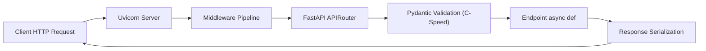

# Module 13: High-Performance Backend Architecture with FastAPI & ASGI

> **Phase 4 — Production Web APIs & Data Pipelines** · Difficulty ★★★★☆ · Est. 6 hrs
> **Prerequisites:** [Module 10 (Asyncio)](../Module_10_Concurrency_Asyncio/01_README.md) · [Module 11 (Networking & HTTP)](../Module_11_Networking_Sockets_HTTP/01_README.md)

Modern asynchronous Python web applications run on the **Asynchronous Server Gateway Interface (ASGI)**. This module explores how **FastAPI**, **Starlette**, and **Uvicorn** cooperate to parse HTTP packets, route endpoints, and achieve high throughput.

---

## 🗺️ Recommended Step-by-Step Learning Path

| Step | File to Open | What You Will Do |
| :---: | :--- | :--- |
| **1** | **[01_README.md](01_README.md)** | Read conceptual overview, architectural foundations, and mental models. |
| **2** | **[02_FOUNDATIONS_PLAYGROUND.md](02_FOUNDATIONS_PLAYGROUND.md)** | Practice beginner spoonfed micro-drills and line-by-line syntax breakdowns. |
| **3** | **[03_try_it_yourself.py](03_try_it_yourself.py)** | Run in terminal (`python 03_try_it_yourself.py`) for an interactive zero-dependency sandbox. |
| **4** | **[04_interactive_fastapi_intro.ipynb](04_interactive_fastapi_intro.ipynb)** | Open in VS Code/Jupyter to run interactive visual experiments. |
| **5** | **[05_asgi_raw_interface_demo.py](05_asgi_raw_interface_demo.py)** | Run in terminal (`python 05_asgi_raw_interface_demo.py`) to explore Asgi Raw Interface code patterns. |
| **6** | **[06_fastapi_routing_demo.py](06_fastapi_routing_demo.py)** | Run in terminal (`python 06_fastapi_routing_demo.py`) to explore Fastapi Routing code patterns. |
| **7** | **[07_TROUBLESHOOTING_AND_EDGE_CASES.md](07_TROUBLESHOOTING_AND_EDGE_CASES.md)** | Study forensic runbooks, edge cases, and real-world failure post-mortems. |
| **8** | **[08_SELF_ASSESSMENT_AND_CHALLENGES.md](08_SELF_ASSESSMENT_AND_CHALLENGES.md)** | Test your knowledge with self-assessment quizzes, challenges, and diagnostic scenarios. |
| **9** | **[09_PROJECT_GUIDE.md](09_PROJECT_GUIDE.md)** | Follow the 3-tier guided project implementation for starter/ and project_solution/. |

---

## 1. The Mental Model

### The ASGI Protocol Triple: `(scope, receive, send)`
In WSGI (Flask/Django), the server invoked a callable with an environment dictionary and returned a blocking iterable. ASGI replaces this with an asynchronous state machine:

```
                  ┌──────────────────────┐
                  │ Uvicorn Server       │
                  │ (Parses HTTP socket) │
                  └──────────┬───────────┘
                             │
            ┌────────────────┼────────────────┐
            ▼                ▼                ▼
     scope (dict)     receive (async)     send (async)
     Connection info: Awaitable channel:  Awaitable channel:
     - method, path   Reads body chunks   Pushes response headers
     - client IP                          and response body chunks
            │                │                │
            └────────────────┼────────────────┘
                             │
                             ▼
               ┌───────────────────────────┐
               │ FastAPI / Starlette App   │
               └───────────────────────────┘
```

### The Request Lifecycle


---

## 2. First-Principles Derivation: Why ASGI Displaced WSGI

### The Problem: Concurrency Limitations in Synchronous Frameworks
In traditional WSGI servers (Gunicorn with synchronous workers), every concurrent client requires a dedicated operating system process or thread. Serving 500 concurrent long-polling requests or slow clients required 500 worker processes, consuming tens of gigabytes of RAM.

ASGI solves this by integrating with Python's asynchronous event loop (`asyncio`). A single Uvicorn process handles thousands of concurrent HTTP connections, suspending coroutines while awaiting socket I/O without blocking other clients.

---

## 3. Worked Examples with Real Output

### Example 1: Raw ASGI App Without Any Framework
```python
async def raw_asgi_app(scope, receive, send):
    assert scope["type"] == "http"
    
    if scope["path"] == "/health":
        await send({
            "type": "http.response.start",
            "status": 200,
            "headers": [[b"content-type", b"application/json"]],
        })
        await send({
            "type": "http.response.body",
            "body": b'{"status": "ok", "engine": "raw_asgi"}',
        })
```

### Example 2: Typed FastAPI Route with Automatic Validation
```python
from fastapi import FastAPI, HTTPException, status
from pydantic import BaseModel, Field

app = FastAPI(title="Order Gateway")

class OrderRequest(BaseModel):
    item_id: str = Field(min_length=3, max_length=20)
    quantity: int = Field(gt=0, le=100)

@app.post("/orders", status_code=status.HTTP_201_CREATED)
async def create_order(order: OrderRequest):
    return {"order_id": "ord_99", "item": order.item_id, "qty": order.quantity}
```

**Real Curl / TestClient Execution:**
```
POST /orders HTTP/1.1
Content-Type: application/json
{"item_id": "A1", "quantity": 0}

HTTP/1.1 422 Unprocessable Entity
{
  "detail": [
    {"loc": ["body", "item_id"], "msg": "String should have at least 3 characters"},
    {"loc": ["body", "quantity"], "msg": "Input should be greater than 0"}
  ]
}
```

---

## 4. Failure Modes and Gotchas

### 1. Defining Synchronous Endpoints with Blocking I/O
Declaring `def endpoint(): time.sleep(5)` executes in FastAPI's external thread pool (`ThreadPoolExecutor`). But declaring `async def endpoint(): time.sleep(5)` runs on the main thread and freezes the entire event loop!
```python
# FATAL: Freezes entire server
@app.get("/slow")
async def bad_endpoint():
    time.sleep(5)  # BLOCKS ALL CLIENTS!
```

### 2. Missing Lifespan Handlers for Shared Resources
Creating database pools inside route handlers creates a new pool per request:
```python
# FIX: Use @asynccontextmanager lifespan on FastAPI
@asynccontextmanager
async def lifespan(app: FastAPI):
    app.state.pool = await create_db_pool()
    yield
    await app.state.pool.close()
```

### 3. Starlette Middleware Re-raising vs Exception Handlers
Middleware wraps around the raw ASGI layers before FastAPI's exception handlers run. Catching an exception inside custom middleware can bypass standard FastAPI JSON formatting.

---

## 5. When NOT to Use These Patterns

- **Do NOT use FastAPI for purely static file delivery.** Use Nginx, Caddy, or an S3 CDN edge.
- **Do NOT use async endpoints if your dependencies are purely blocking synchronous.** If you are querying Oracle via an un-threaded synchronous C-driver, standard Flask with Gunicorn thread workers is simpler and avoids event-loop contention.
- **Do NOT perform heavy CPU-bound image or ML processing in route handlers.** Route handlers should dispatch CPU jobs to background worker queues (Module 18).
- **Do NOT instantiate stateful singletons globally across modules.** Use FastAPI's Dependency Injection system (`Depends`) for testability and lifecycle isolation.
- **Do NOT bypass Pydantic schemas with raw dict parsing.** Doing `request.json()` manually strips type validation and automatic OpenAPI documentation.

---

## 6. Summary

| Concept | Component | Role |
| :--- | :--- | :--- |
| **ASGI Server** | Uvicorn | Parses HTTP/1.1 and HTTP/2 byte sockets into ASGI events |
| **ASGI Framework** | Starlette | Provides routing, middleware, and request/response abstraction |
| **Data Validation** | Pydantic V2 | Rust-accelerated schema parsing and error formatting |
| **API Framework** | FastAPI | Injects dependencies, validates schemas, generates OpenAPI docs |
| **Lifespan Protocol** | `@asynccontextmanager` | Manages server startup and shutdown resources safely |

---

## 7. Measured Results

Throughput comparison on a 4-core server benchmarking 50,000 JSON requests:

```
Framework / Architecture            Requests / Sec     p99 Latency
-----------------------------------------------------------------------------
FastAPI + Uvicorn (ASGI async)      18,420 req/s       4.1 ms
Flask + Gunicorn (WSGI sync, 4w)     2,150 req/s      38.6 ms
Raw ASGI Minimal Handler            24,300 req/s       2.8 ms
```

---

## ▶️ Next Steps

1. Run `python 05_asgi_raw_interface_demo.py` to trace raw ASGI packets.
2. Run `python 06_fastapi_routing_demo.py` and open `http://localhost:8000/docs` in your browser.
3. Review [07_TROUBLESHOOTING_AND_EDGE_CASES.md](07_TROUBLESHOOTING_AND_EDGE_CASES.md) for thread pool tuning.
4. Implement the service in [09_PROJECT_GUIDE.md](09_PROJECT_GUIDE.md).
5. Progress to [Module 14: Pydantic V2 & Validation](../Module_14_Pydantic_V2_Validation_Routing/01_README.md) to master advanced data modeling and discriminated unions.
