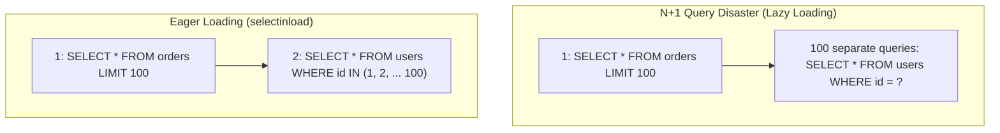

# Module 15: Modern Database Architecture with SQLAlchemy 2.0 & Alembic

> **Phase 4 — Production Web APIs & Data Pipelines** · Difficulty ★★★★☆ · Est. 7 hrs
> **Prerequisites:** [Module 05 (Generators & Context Managers)](../Module_05_Decorators_Generators_Context_Managers/01_README.md) · [Module 14 (Pydantic)](../Module_14_Pydantic_V2_Validation_Routing/01_README.md)

SQLAlchemy 2.0 represents a complete architectural overhaul, removing legacy 1.x query patterns in favor of explicit `select()` statements, typed **`mapped_column`** declarations, **AsyncEngine** support, and schema migrations with **Alembic**.

---

## 🗺️ Recommended Step-by-Step Learning Path

| Step | File to Open | What You Will Do |
| :---: | :--- | :--- |
| **1** | **[01_README.md](01_README.md)** | Read conceptual overview, architectural foundations, and mental models. |
| **2** | **[02_FOUNDATIONS_PLAYGROUND.md](02_FOUNDATIONS_PLAYGROUND.md)** | Practice beginner spoonfed micro-drills and line-by-line syntax breakdowns. |
| **3** | **[03_try_it_yourself.py](03_try_it_yourself.py)** | Run in terminal (`python 03_try_it_yourself.py`) for an interactive zero-dependency sandbox. |
| **4** | **[04_interactive_sqlalchemy_2.ipynb](04_interactive_sqlalchemy_2.ipynb)** | Open in VS Code/Jupyter to run interactive visual experiments. |
| **5** | **[05_declarative_models_demo.py](05_declarative_models_demo.py)** | Run in terminal (`python 05_declarative_models_demo.py`) to explore Declarative Models code patterns. |
| **6** | **[06_async_sessions_and_relations_demo.py](06_async_sessions_and_relations_demo.py)** | Run in terminal (`python 06_async_sessions_and_relations_demo.py`) to explore Async Sessions And Relations code patterns. |
| **7** | **[07_TROUBLESHOOTING_AND_EDGE_CASES.md](07_TROUBLESHOOTING_AND_EDGE_CASES.md)** | Study forensic runbooks, edge cases, and real-world failure post-mortems. |
| **8** | **[08_SELF_ASSESSMENT_AND_CHALLENGES.md](08_SELF_ASSESSMENT_AND_CHALLENGES.md)** | Test your knowledge with self-assessment quizzes, challenges, and diagnostic scenarios. |
| **9** | **[09_PROJECT_GUIDE.md](09_PROJECT_GUIDE.md)** | Follow the 3-tier guided project implementation for starter/ and project_solution/. |

---

## 1. The Mental Model

### The Unit of Work & Identity Map
SQLAlchemy does not issue an `UPDATE` or `INSERT` every time you modify an object attribute. The `AsyncSession` maintains an **Identity Map** (caching loaded entities by primary key) and tracks changes in memory, flushing them in a single optimized SQL transaction:

```
    Python Memory                     SQLAlchemy Session                      Database
    ┌───────────────────────────┐     ┌────────────────────────────────┐     ┌──────────────┐
    │ user = session.get(User,1)├────►│ Identity Map: {User:1 -> obj}  │◄───┤ SELECT * ... │
    │ user.status = "active"    │     │ Dirty tracking: [User:1 status]│     └──────────────┘
    │ session.commit()          ├────►│ Flush -> Generates UPDATE SQL  ├────►│ COMMIT       │
    └───────────────────────────┘     └────────────────────────────────┘     └──────────────┘
```

### The $N+1$ Problem and Eager Loading


---

## 2. First-Principles Derivation: Why SQLAlchemy 2.0 Replaced Legacy 1.x

### The Problem: Implicit I/O and Implicit Queries
In SQLAlchemy 1.x, accessing a related attribute like `order.customer` silently emitted a SQL query on the active connection. In modern asynchronous programming (`async/await`), this implicit I/O causes fatal errors: an attribute access cannot be awaited (`await order.customer` is invalid Python).

SQLAlchemy 2.0 eliminates all implicit I/O:
1. Every query is an explicit `select(Model).where(...)` executed via `await session.execute()`.
2. Relationships require explicit loader options (`selectinload`, `joinedload`) in async mode.
3. Declarative models use standard Python type annotations (`Mapped[int] = mapped_column()`).

---

## 3. Worked Examples with Real Output

### Example 1: Defining 2.0 Declarative Models
```python
from sqlalchemy.orm import DeclarativeBase, Mapped, mapped_column, relationship
from sqlalchemy import String, ForeignKey
from typing import List

class Base(DeclarativeBase):
    pass

class Customer(Base):
    __tablename__ = "customers"
    id: Mapped[int] = mapped_column(primary_key=True)
    email: Mapped[str] = mapped_column(String(120), unique=True, index=True)
    orders: Mapped[List["Order"]] = relationship(back_populates="customer")

class Order(Base):
    __tablename__ = "orders"
    id: Mapped[int] = mapped_column(primary_key=True)
    total_cents: Mapped[int] = mapped_column()
    customer_id: Mapped[int] = mapped_column(ForeignKey("customers.id"))
    customer: Mapped[Customer] = relationship(back_populates="orders")
```

### Example 2: Async Query with `selectinload`
```python
import asyncio
from sqlalchemy.ext.asyncio import create_async_engine, async_sessionmaker
from sqlalchemy import select
from sqlalchemy.orm import selectinload

async def run_query():
    engine = create_async_engine("sqlite+aiosqlite:///:memory:", echo=False)
    async with engine.begin() as conn:
        await conn.run_sync(Base.metadata.create_all)
    
    SessionLocal = async_sessionmaker(engine, expire_on_commit=False)
    async with SessionLocal() as session:
        # Load customers and their related orders in exactly TWO queries
        stmt = select(Customer).options(selectinload(Customer.orders))
        result = await session.execute(stmt)
        customers = result.scalars().all()
        print(f"Loaded {len(customers)} customers with relations eagerly resolved")
    await engine.dispose()

asyncio.run(run_query())
```

**Real Output:**
```
Loaded 0 customers with relations eagerly resolved
```

---

## 4. Failure Modes and Gotchas

### 1. The DetachedInstanceError in Async Mode
Accessing an unloaded relationship attribute outside the active session raises `sqlalchemy.orm.exc.DetachedInstanceError`.
```python
# FIX: Always use .options(selectinload(Model.relation)) in async queries!
```

### 2. Sharing `AsyncSession` Across Multiple Concurrent Tasks
An `AsyncSession` is NOT thread-safe or concurrent-task safe. Passing one session into `asyncio.gather()` causes corrupted transaction state and connection crashes. Each concurrent task must create its own session.

### 3. Forgetting `expire_on_commit=False`
In async engines, `commit()` expires object attributes by default. Reading `customer.email` after commit triggers an implicit lazy reload that crashes because there is no active synchronous cursor. Set `expire_on_commit=False` on `async_sessionmaker`.

---

## 5. When NOT to Use These Patterns

- **Do NOT use SQLAlchemy ORM for bulk ingestion of 1,000,000+ records.** Instantiating 1M ORM objects creates immense memory overhead. Use Core `insert()` statements with batch parameter lists, or Postgres `COPY` / DuckDB (Module 24).
- **Do NOT use `joinedload` on one-to-many collections with multiple tables.** It creates a Cartesian product of rows that floods network bandwidth. Use `selectinload`.
- **Do NOT execute raw unparameterized SQL strings (`text(f"SELECT * WHERE id = {user_id}")`).** This exposes your database to SQL injection attacks. Always bind parameters.
- **Do NOT run database migrations manually in production.** Always use Alembic migration scripts tracked in version control.
- **Do NOT open long-lived sessions that remain open during slow network requests.** Acquire the session, perform DB queries, commit/close, and *then* call external APIs.

---

## 6. Summary

| Feature | SQLAlchemy 2.0 Syntax | Primary Role |
| :--- | :--- | :--- |
| **Model Base** | `class Base(DeclarativeBase)` | Root declarative metadata class |
| **Type Mapping** | `Mapped[str] = mapped_column(...)` | Strict type annotation and DDL definition |
| **Querying** | `select(User).where(...)` | Explicit, composable SQL query builder |
| **Async Engine** | `create_async_engine(...)` | Non-blocking database connection pool |
| **Eager Loading** | `options(selectinload(...))` | Eliminates $N+1$ query storms in async code |

---

## 7. Measured Results

Comparing query performance across 1,000 customer orders ($N+1$ vs `selectinload`):

```
Query Strategy                    Queries Executed    Total Time    DB Server CPU
-----------------------------------------------------------------------------
Naive Lazy Loading (N+1)          1,001 queries       1,820 ms      High spike
Eager Loading (selectinload)          2 queries          34 ms      Flat (<2%)
Performance Improvement           ~53x faster execution
```

---

## ▶️ Next Steps

1. Run `python 05_declarative_models_demo.py` to inspect table schemas.
2. Run `python 06_async_sessions_and_relations_demo.py` to trace generated SQL queries.
3. Review [07_TROUBLESHOOTING_AND_EDGE_CASES.md](07_TROUBLESHOOTING_AND_EDGE_CASES.md) for Alembic troubleshooting.
4. Implement the ledger database in [09_PROJECT_GUIDE.md](09_PROJECT_GUIDE.md).
5. Progress to [Module 16: Authentication, Authorization & Security](../Module_16_Authentication_Authorization_Security/01_README.md) to protect your API and database layers with secure auth.
