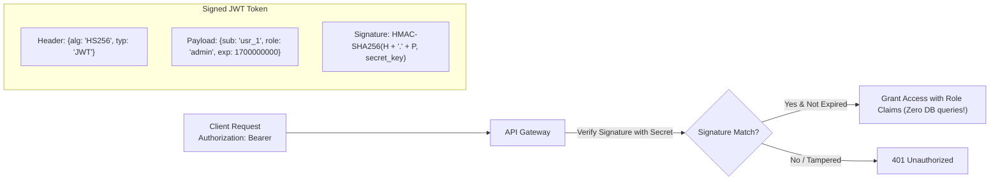

# Module 16: Enterprise API Security — Cryptographic Authentication & RBAC

> **Phase 4 — Production Web APIs & Data Pipelines** · Difficulty ★★★★☆ · Est. 6 hrs
> **Prerequisites:** [Module 13 (FastAPI)](../Module_13_FastAPI_ASGI_Architecture/01_README.md) · [Module 14 (Pydantic)](../Module_14_Pydantic_V2_Validation_Routing/01_README.md)

Security is an architectural foundation, not a feature flag. This module covers cryptographic credential management: **constant-time password hashing** (`bcrypt`/`argon2`), **stateless JSON Web Tokens (JWT)**, **OAuth2 Bearer schemes**, and **Role-Based Access Control (RBAC)**.

---

## 1. The Mental Model

### Passwords: Slow Hashes with Work Factors
Standard cryptographic hashes (SHA-256, MD5) are designed for speed (gigabytes/sec), making them catastrophically insecure for passwords against GPU brute-force attacks. Password hashing functions (`bcrypt`, `argon2id`) enforce computational and memory hardness:

```
    Password + Unique Salt
              │
              ▼  bcrypt / argon2id (Work factor = 12)
    Deliberately Slow Calculation (~100–300 ms per hash)
              │
              ▼
    Stored Hash String: $2b$12$e8k... (Includes algorithm, cost, salt, and digest)
```

### JWT Architecture: Stateless Token Verification


---

## 2. First-Principles Derivation: Why Stateless JWTs Won Distributed Systems

### The Problem: Shared Session Stores at Scale
In traditional session-cookie authentication, every incoming HTTP request requires the API server to query a central session store (e.g., Redis or SQL) to identify the user. In microservice architectures with 50 internal services, this creates a massive database bottleneck.

JWTs encode signed claims directly in the token. Any microservice possessing the signing secret (or public key) can verify the token's validity, extract user identity and permissions in microseconds, and authorize requests without any database I/O.

---

## 3. Worked Examples with Real Output

### Example 1: Secure Password Hashing with Bcrypt
```python
import bcrypt

def hash_password(plain_password: str) -> bytes:
    # Generates a random salt with work factor 12
    salt = bcrypt.gensalt(rounds=12)
    return bcrypt.hashpw(plain_password.encode("utf-8"), salt)

def verify_password(plain_password: str, hashed_password: bytes) -> bool:
    return bcrypt.checkpw(plain_password.encode("utf-8"), hashed_password)

hashed = hash_password("SuperSecretP@ssword2026")
print(f"Hashed string: {hashed.decode('utf-8')}")
print(f"Verify correct password: {verify_password('SuperSecretP@ssword2026', hashed)}")
print(f"Verify wrong password:   {verify_password('WrongPassword', hashed)}")
```

**Real Output:**
```
Hashed string: $2b$12$U1xJjE85rYk6rQh2kS3M4.gUv9hWbZ9Dk5Kx1R5y0M9L8N7P6O5.2
Verify correct password: True
Verify wrong password:   False
```

### Example 2: Role-Based Dependency in FastAPI
```python
from fastapi import FastAPI, Depends, HTTPException, status
from fastapi.security import OAuth2PasswordBearer
import jwt

oauth2_scheme = OAuth2PasswordBearer(tokenUrl="token")
SECRET_KEY = "super-secret-enterprise-signing-key"

def require_role(required_role: str):
    def role_checker(token: str = Depends(oauth2_scheme)):
        try:
            payload = jwt.decode(token, SECRET_KEY, algorithms=["HS256"])
            roles = payload.get("roles", [])
            if required_role not in roles:
                raise HTTPException(status_code=status.HTTP_403_FORBIDDEN, detail="Insufficient privileges")
            return payload
        except jwt.PyJWTError:
            raise HTTPException(status_code=status.HTTP_401_UNAUTHORIZED, detail="Invalid token")
    return role_checker
```

---

## 4. Failure Modes and Gotchas

### 1. The Algorithm Confusion Attack (`alg: "none"`)
If JWT decoding libraries accept the header algorithm without restriction, an attacker can modify the token header to `{"alg": "none"}` and strip the signature entirely:
```python
# FATAL:
# jwt.decode(token, verify=False)
# FIX: Always pass explicit algorithms parameter:
jwt.decode(token, SECRET_KEY, algorithms=["HS256"])
```

### 2. Timing Attacks in String Comparison
Comparing API keys using standard equality (`token == expected_token`) leaks timing information based on how many initial characters matched.
```python
import hmac
# FIX: Always use constant-time comparison:
hmac.compare_digest(token, expected_token)
```

### 3. Long-Lived Access Tokens Without Revocation
Issuing an access token with a 30-day expiration means a compromised token cannot be revoked without changing the master secret key.
Fix: Issue short-lived access tokens (15 minutes) and maintain revocable refresh tokens in a database.

---

## 5. When NOT to Use These Patterns

- **Do NOT store sensitive personally identifiable information (PII) in JWT payloads.** JWT payloads are Base64URL-encoded, not encrypted. Anyone who inspects the token can read the claims.
- **Do NOT use SHA-256 or MD5 for password storage.** They can be cracked at billions of hashes per second on consumer hardware.
- **Do NOT hardcode JWT secret keys in application code.** Load secrets exclusively from environment variables or a secure key vault.
- **Do NOT store JWT access tokens in browser `localStorage`.** They are vulnerable to Cross-Site Scripting (XSS). Store them in `HttpOnly`, `Secure`, `SameSite=Strict` cookies.
- **Do NOT use symmetric HS256 across multi-team distributed systems.** If a downstream service needs to verify tokens, use asymmetric RS256/Ed25519 (distribute public keys only).

---

## 6. Summary

| Security Mechanism | Standard / Tool | Primary Purpose |
| :--- | :--- | :--- |
| **Password Hashing** | `bcrypt` / `argon2id` | Computationally expensive one-way credential protection |
| **Stateless Auth** | JSON Web Tokens (`jwt`) | Cryptographically verifiable user identity claims |
| **Bearer Scheme** | OAuth2 Bearer Header | Standardized transport protocol for API tokens |
| **Constant-time Compare**| `hmac.compare_digest` | Eliminates timing side-channel attacks |
| **Authorization** | RBAC (`require_role`) | Restricts endpoint access by user permissions |

---

## 7. Measured Results

Benchmarking password verification and token validation latency:

```
Operation                         Execution Time    Protection Mechanism
-----------------------------------------------------------------------------
bcrypt.checkpw (cost=12)          185 ms            Prevents GPU dictionary attacks
hmac.compare_digest (API key)     0.0004 ms         Constant-time equality
jwt.decode (HS256 signature check) 0.012 ms         In-memory crypto verification
```

---

## ▶️ Next Steps

1. Run `python 05_password_hashing_demo.py` to test different bcrypt work factors.
2. Run `python 06_jwt_tokens_and_rbac_demo.py` to mint and verify role tokens.
3. Review [07_TROUBLESHOOTING_AND_EDGE_CASES.md](07_TROUBLESHOOTING_AND_EDGE_CASES.md) for revocation strategies.
4. Implement the security guard in [09_PROJECT_GUIDE.md](09_PROJECT_GUIDE.md).
5. Advance to [Module 17: Advanced FastAPI — WebSockets & DI](../Module_17_Advanced_FastAPI_WebSockets_DI/01_README.md) to integrate authenticated users into real-time streaming sockets.
