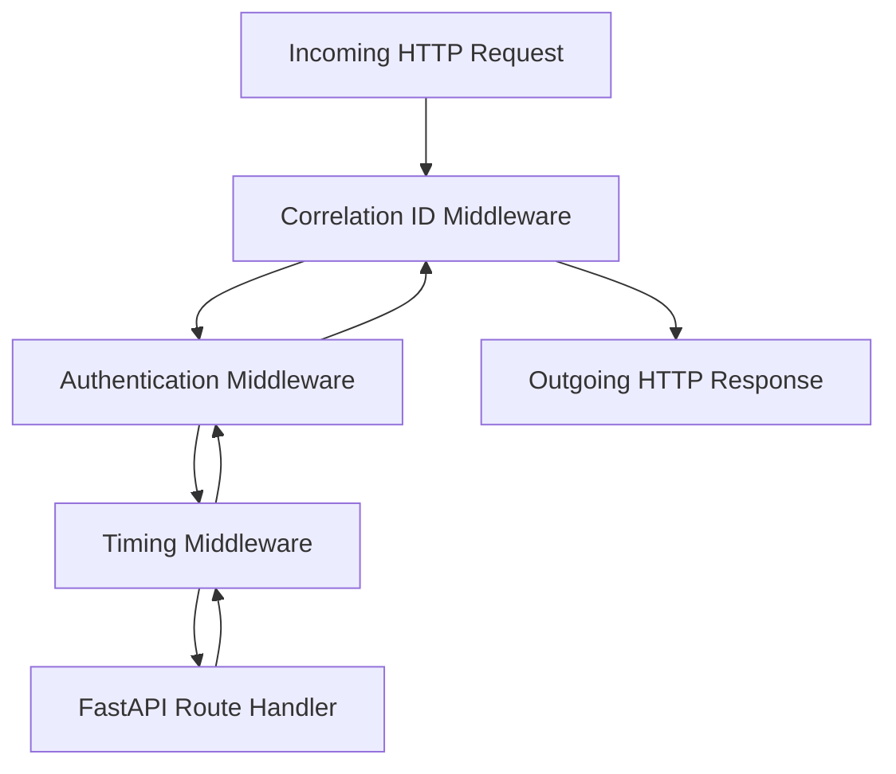

# Module 17: Advanced FastAPI — WebSockets, Dependency Trees & Middleware

> **Phase 4 — Production Web APIs & Data Pipelines** · Difficulty ★★★★☆ · Est. 7 hrs
> **Prerequisites:** [Module 13 (FastAPI)](../Module_13_FastAPI_ASGI_Architecture/01_README.md) · [Module 16 (Security)](../Module_16_Authentication_Authorization_Security/01_README.md)

This module masters advanced architectural patterns in FastAPI: hierarchical **Dependency Injection (`Depends`)**, custom **ASGI middleware**, bidirectional **WebSocket streaming**, and distributed tracing with **Correlation IDs**.

---

## 🗺️ Recommended Step-by-Step Learning Path

| Step | File to Open | What You Will Do |
| :---: | :--- | :--- |
| **1** | **[01_README.md](01_README.md)** | Read conceptual overview, architectural foundations, and mental models. |
| **2** | **[02_FOUNDATIONS_PLAYGROUND.md](02_FOUNDATIONS_PLAYGROUND.md)** | Practice beginner spoonfed micro-drills and line-by-line syntax breakdowns. |
| **3** | **[03_try_it_yourself.py](03_try_it_yourself.py)** | Run in terminal (`python 03_try_it_yourself.py`) for an interactive zero-dependency sandbox. |
| **4** | **[04_interactive_fastapi_advanced.ipynb](04_interactive_fastapi_advanced.ipynb)** | Open in VS Code/Jupyter to run interactive visual experiments. |
| **5** | **[05_dependency_injection_demo.py](05_dependency_injection_demo.py)** | Run in terminal (`python 05_dependency_injection_demo.py`) to explore Dependency Injection code patterns. |
| **6** | **[06_middleware_and_correlation_ids_demo.py](06_middleware_and_correlation_ids_demo.py)** | Run in terminal (`python 06_middleware_and_correlation_ids_demo.py`) to explore Middleware And Correlation Ids code patterns. |
| **7** | **[07_TROUBLESHOOTING_AND_EDGE_CASES.md](07_TROUBLESHOOTING_AND_EDGE_CASES.md)** | Study forensic runbooks, edge cases, and real-world failure post-mortems. |
| **8** | **[08_SELF_ASSESSMENT_AND_CHALLENGES.md](08_SELF_ASSESSMENT_AND_CHALLENGES.md)** | Test your knowledge with self-assessment quizzes, challenges, and diagnostic scenarios. |
| **9** | **[09_PROJECT_GUIDE.md](09_PROJECT_GUIDE.md)** | Follow the 3-tier guided project implementation for starter/ and project_solution/. |

---

## 1. The Mental Model

### Dependency Injection as a Sub-Graph Resolver
FastAPI's dependency injection solves the creation and teardown order of request dependencies. Dependencies form a directed graph where shared sub-dependencies (like the database session) can be cached per request (`use_cache=True`):

```
                       ┌─────────────────────────┐
                       │ Endpoint: process_order │
                       └────────────┬────────────┘
                                    │
               ┌────────────────────┴────────────────────┐
               ▼                                         ▼
      get_current_user                          get_order_service
               │                                         │
               └────────────────────┬────────────────────┘
                                    ▼
                          get_db_session (Cached!)
```

### The Middleware Onion Architecture


---

## 2. First-Principles Derivation: Why Dependency Injection Matters

### The Problem: Global Singletons and Untestable Route Handlers
In naive web architectures, route handlers import global database engines, global configuration objects, and global external HTTP clients directly.
Testing an endpoint requires monkey-patching 6 global variables, creating fragile, non-isolated test suites.

FastAPI's DI system decouples *what a handler needs* from *how it is instantiated*. In production, `get_db` yields a production PostgreSQL session. In automated tests, `app.dependency_overrides[get_db] = get_test_db` swaps in an in-memory test database without altering a single line of production route logic.

---

## 3. Worked Examples with Real Output

### Example 1: Context-Yielding Database Dependency
```python
from fastapi import FastAPI, Depends
from typing import AsyncGenerator

app = FastAPI()

async def get_db() -> AsyncGenerator[str, None]:
    # Setup phase
    db_session = "Active_Database_Session_42"
    print(f"[DI] Acquired {db_session}")
    try:
        yield db_session
    finally:
        # Guaranteed cleanup phase after response is sent
        print(f"[DI] Closed {db_session}")

@app.get("/items")
async def read_items(db: str = Depends(get_db)):
    return {"status": "success", "db_connected": db}
```

**Real Server Log Output:**
```
[DI] Acquired Active_Database_Session_42
INFO:     127.0.0.1:52134 - "GET /items HTTP/1.1" 200 OK
[DI] Closed Active_Database_Session_42
```

### Example 2: WebSocket Connection Manager
```python
from fastapi import FastAPI, WebSocket, WebSocketDisconnect
from typing import List

class ConnectionManager:
    def __init__(self):
        self.active_connections: List[WebSocket] = []

    async def connect(self, websocket: WebSocket):
        await websocket.accept()
        self.active_connections.append(websocket)

    def disconnect(self, websocket: WebSocket):
        self.active_connections.remove(websocket)

    async def broadcast(self, message: str):
        for connection in self.active_connections:
            await connection.send_text(message)

manager = ConnectionManager()
```

---

## 4. Failure Modes and Gotchas

### 1. Forgetting to Catch `WebSocketDisconnect`
When a client closes their browser tab, the socket connection drops. Failing to catch `WebSocketDisconnect` logs noisy tracebacks and leaks dead sockets in active connection lists:
```python
# FIX:
try:
    while True:
        data = await websocket.receive_text()
except WebSocketDisconnect:
    manager.disconnect(websocket)
```

### 2. Consuming the Request Body in Middleware
Reading `await request.body()` inside custom middleware exhausts the ASGI `receive` channel. Subsequent handlers receive an empty body and fail validation:
```python
# FIX: Must wrap or re-populate the receive stream after reading!
```

### 3. Infinite Recursion in Circular Dependencies
If Dependency A depends on Dependency B, and Dependency B depends on Dependency A, FastAPI crashes at startup with a `RecursionError`.

---

## 5. When NOT to Use These Patterns

- **Do NOT use WebSockets when simple HTTP polling or Server-Sent Events (SSE) suffice.** SSE is unidirectional (server to client), simpler to maintain, and operates cleanly through HTTP/2 proxies and firewalls.
- **Do NOT use middleware for fine-grained authorization.** Middleware executes before endpoint parameters are parsed. Use Dependency Injection (`Depends`) for authorization so you have access to path and body parameters.
- **Do NOT maintain WebSocket connections without heartbeat pings.** Proxies and cloud load balancers terminate idle TCP connections after 60 seconds of silence.
- **Do NOT perform heavy synchronous operations inside WebSocket loops.**
- **Do NOT override dependencies in production code.** `dependency_overrides` is strictly a test fixture tool.

---

## 6. Summary

| Mechanism | API | Primary Responsibility |
| :--- | :--- | :--- |
| **Dependency Injection** | `Depends(callable)` | Composable, testable parameter provider |
| **Sub-dependency Caching** | `use_cache=True` | Shares identical instances across single request graph |
| **ASGI Middleware** | `BaseHTTPMiddleware` | Intercepts requests/responses for logging and headers |
| **WebSockets** | `WebSocket.accept()` | Full-duplex bidirectional streaming over persistent TCP |
| **Lifespan Context** | `@asynccontextmanager` | Coordinates application-wide startup and shutdown |

---

## 7. Measured Results

Impact of Dependency Caching on Nested Request Graphs (5 sub-dependencies):

```
Resolution Strategy               Graph Build Time    Memory Allocation
-----------------------------------------------------------------------------
Uncached (use_cache=False)        0.28 ms / req       5 separate instances
Cached (use_cache=True)           0.04 ms / req       1 shared instance (7x faster)
WebSocket Frame Broadcast (1000 clients) 1.8 ms       Full concurrent push
```

---

## ▶️ Next Steps

1. Run `python 05_dependency_injection_demo.py` to see dependency tree lifecycle logging.
2. Run `python 06_middleware_and_correlation_ids_demo.py` to inspect trace headers.
3. Review [07_TROUBLESHOOTING_AND_EDGE_CASES.md](07_TROUBLESHOOTING_AND_EDGE_CASES.md) for WebSocket disconnect recipes.
4. Implement the real-time ticker in [09_PROJECT_GUIDE.md](09_PROJECT_GUIDE.md).
5. Progress to [Module 18: Distributed Systems — Task Queues & Streaming](../Module_18_Distributed_Systems_Task_Queues_Streaming/01_README.md) to decouple real-time events into background worker queues.
