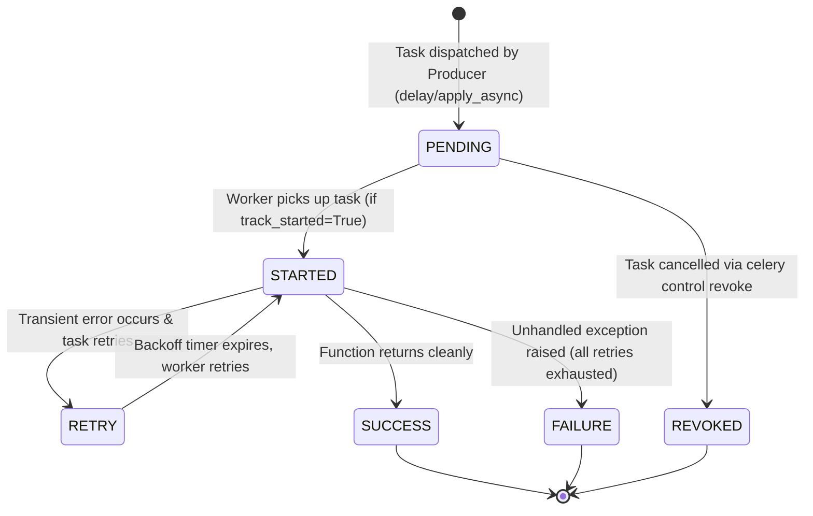

# Module 18: Distributed Systems — Task Queues, Celery & Redis Streaming Masterclass

> **Phase 5 — Distributed Systems & Cloud-Native Engineering** · Difficulty ★★★★★ · Est. 8 hrs
> **Prerequisites:** [Module 10 (Asyncio)](../Module_10_Concurrency_Asyncio/01_README.md) · [Module 17 (Advanced FastAPI)](../Module_17_Advanced_FastAPI_WebSockets_DI/01_README.md)

Monoliths fail when heavy operations stall web requests. This module is the **definitive, zero-external-reading-needed guide** to building, tuning, and debugging production-grade asynchronous backends: **Distributed Task Queues (Celery, ARQ, SAQ)**, **Redis Streams & Consumer Groups**, **Celery Canvas Workflows**, **Dead-Letter Queues (DLQ)**, **Idempotency Semantics**, and **Staff-level Worker Tuning**.

---

## 🗺️ Recommended Step-by-Step Learning Path

| Step | File to Open | What You Will Do |
| :---: | :--- | :--- |
| **1** | **[01_README.md](01_README.md)** | Master the full theoretical, architectural, and production tuning foundations. |
| **2** | **[02_W3_BEGINNER_PLAYGROUND.md](02_W3_BEGINNER_PLAYGROUND.md)** | Practice beginner spoonfed micro-drills and line-by-line syntax breakdowns. |
| **3** | **[03_try_it_yourself.py](03_try_it_yourself.py)** | Run in terminal (`python 03_try_it_yourself.py`) for an interactive zero-dependency sandbox. |
| **4** | **[04_interactive_distributed_queues.ipynb](04_interactive_distributed_queues.ipynb)** | Open in VS Code/Jupyter to run interactive visual experiments. |
| **5** | **[05_task_queue_worker_demo.py](05_task_queue_worker_demo.py)** | Run in terminal (`python 05_task_queue_worker_demo.py`) to explore Task Queue Worker code patterns. |
| **6** | **[06_event_streaming_and_dlq_demo.py](06_event_streaming_and_dlq_demo.py)** | Run in terminal (`python 06_event_streaming_and_dlq_demo.py`) to explore Event Streaming And Dlq code patterns. |
| **7** | **[07_TROUBLESHOOTING_AND_EDGE_CASES.md](07_TROUBLESHOOTING_AND_EDGE_CASES.md)** | Study forensic runbooks, edge cases, and real-world failure post-mortems. |
| **8** | **[08_SELF_ASSESSMENT_AND_CHALLENGES.md](08_SELF_ASSESSMENT_AND_CHALLENGES.md)** | Test your knowledge with self-assessment quizzes, challenges, and diagnostic scenarios. |
| **9** | **[09_PROJECT_GUIDE.md](09_PROJECT_GUIDE.md)** | Follow the 3-tier guided project implementation for starter/ and project_solution/. |

---

## 1. The Core Architecture: Why Task Queues Exist

### The HTTP Latency Trap
HTTP web servers (FastAPI, Django, Flask, Express) operate under strict latency budgets:
- Web clients expect responses in **$< 100 \text{ ms}$**.
- Cloud Load Balancers (AWS ALB, Cloudflare, NGINX) terminate idle TCP sockets after 30 to 60 seconds (HTTP 504 Gateway Timeout).
- Heavy jobs (transcoding videos, generating 500-page PDF reports, training ML embeddings, sending 50,000 marketing emails) take seconds or minutes.

If a web worker blocks waiting for a 15-second PDF to generate, its concurrency collapses. A server with 4 worker processes will completely lock up after just 4 concurrent PDF requests!

### The Broker Decoupling Pattern
To solve this, we decouple **Request Ingestion** from **Work Execution** using an asynchronous message broker:

```text
    Web Client                     FastAPI Gateway                    Message Broker (Redis)
        │                                │                                      │
        │ 1. POST /api/v1/export-report  │                                      │
        ├───────────────────────────────►│ 2. LPUSH / XADD task_queue           │
        │                                ├─────────────────────────────────────►│
        │ 3. HTTP 202 Accepted           │                                      │
        │    {"job_id": "job_8892"}      │                                      │
        │◄───────────────────────────────┤                                      │
                                                                                │
                                   ┌────────────────────────────────────────────┴──────────┐
                                   ▼                                                       ▼
                       Celery / Stream Worker A                               Celery / Stream Worker B
                       3. Pulls task from queue                               3. Pulls task from queue
                       4. Renders PDF (12s)                                   4. Renders PDF (12s)
                       5. Writes PDF to S3                                    5. Writes PDF to S3
                       6. Writes result status to Redis                       6. Writes result status to Redis
                       7. Sends ACK to broker                                 7. Sends ACK to broker
```

---

## 2. Deep Dive: Celery Architecture & Production Playbook

**Celery** is the undisputed industry standard distributed task queue for Python. To master Celery, you must understand its 4 distinct components:

```text
+---------------------------------------------------------------------------------------------------+
|                                  THE 4 PILLARS OF CELERY                                          |
+---------------------------------------------------------------------------------------------------+
| 1. The Producer      | Your web API (FastAPI) that creates tasks and pushes envelopes to Broker.  |
| 2. The Broker        | The transient buffer holding task messages (Redis or RabbitMQ).           |
| 3. The Worker Pool   | Independent OS processes running Celery worker loops to execute tasks.     |
| 4. The Result Backend| Storage where return values and task states are saved (Redis or Postgres). |
+---------------------------------------------------------------------------------------------------+
```

### The Celery Task Lifecycle (State Machine)
Every Celery task moves through a deterministic state machine:



### Creating Production Celery Tasks
A naive Celery task is dangerous in production. Here is the **Staff-Engineer Production Pattern**:

```python
from celery import Celery
import time
import logging

logger = logging.getLogger(__name__)

# Initialize Celery Application
app = Celery(
    "analytics_pipeline",
    broker="redis://localhost:6379/0",
    backend="redis://localhost:6379/1"
)

# Production Configuration
app.conf.update(
    task_serializer="json",
    accept_content=["json"],
    result_serializer="json",
    timezone="UTC",
    enable_utc=True,
    # Crucial Worker Guarantees
    task_acks_late=True,                 # Only ACK after function finishes, not when pulled!
    task_reject_on_worker_lost=True,     # Re-queue task if worker process is killed/OOMs
    worker_prefetch_multiplier=1,        # Don't hoard tasks; distribute fairly across workers
    task_track_started=True,             # Report STARTED status immediately
)

@app.task(
    bind=True,                           # Passes 'self' (task instance) as first parameter
    max_retries=3,                       # Retry up to 3 times
    default_retry_delay=5,               # Base delay in seconds
    autoretry_for=(ConnectionError,),    # Automatically retry on network timeouts
    retry_backoff=True,                  # Exponential backoff (5s, 10s, 20s...)
    retry_backoff_max=300,               # Maximum delay cap (5 minutes)
    retry_jitter=True,                   # Add random jitter to prevent thundering herds!
)
def generate_quarterly_report(self, user_id: int, quarter: str) -> dict:
    try:
        logger.info(f"Generating report for user {user_id} [{quarter}], attempt {self.request.retries}")
        # Simulated heavy computation
        time.sleep(2)
        return {"user_id": user_id, "quarter": quarter, "status": "COMPLETED", "pdf_url": "s3://..."}
    except Exception as exc:
        logger.error(f"Failed generating report: {exc}")
        # Explicit custom retry if not caught by autoretry_for
        raise self.retry(exc=exc)
```

---

## 3. Celery Canvas: Orchestrating Complex Workflows

Real enterprise applications rarely run isolated tasks. You need to pipeline, parallelize, and aggregate work. Celery provides **Canvas primitives**:

### 1. `chain` — Sequential Pipelining
The return value of Task 1 is automatically passed as the first argument to Task 2:
$$\text{Output}_1 \to \text{Input}_2 \to \text{Output}_2 \to \text{Input}_3$$

```python
from celery import chain

# download_video(url) -> extract_audio(video_path) -> transcribe_audio(audio_path)
workflow = chain(
    download_video.s("https://example.com/video.mp4"),
    extract_audio.s(),
    transcribe_audio.s()
)
result = workflow()  # Asynchronously triggers pipeline
```

### 2. `group` — Parallel Fan-Out
Runs $N$ independent tasks concurrently across all available workers in the cluster:

```python
from celery import group

# Resize an image into 4 different dimensions in parallel
image_sizes = [(800, 600), (400, 300), (200, 150), (64, 64)]
workflow = group(resize_image.s("profile.png", w, h) for w, h in image_sizes)
result = workflow()
```

### 3. `chord` — Parallel Fan-Out with Reduction (Barrier Synchronization)
Executes a `group` of tasks in parallel, and **only when ALL of them complete**, executes a single callback task with the collected list of all results:

```python
from celery import chord

# Fetch prices from 50 vendors in parallel, then find the cheapest
vendor_ids = [101, 102, 103, 104, 105]
workflow = chord(
    header=[fetch_vendor_price.s(v_id) for v_id in vendor_ids],
    body=select_cheapest_offer.s()  # Receives list of all 50 prices!
)
result = workflow()
```

### 4. `chunks` — Micro-Batching
If you have 100,000 rows to process, sending 100,000 separate Celery messages will flood Redis with network protocol overhead. `chunks` batches them:

```python
# Dispatches 100,000 items in batches of 500 tasks
process_row.chunks(iter(large_dataset), 500).apply_async()
```

---

## 4. Celery Beat: Distributed Periodic Scheduling

In a microservice cluster with 10 instances, you cannot use a simple Python `while True: time.sleep(60)` or standard Linux `crontab` because **every instance would run the cron job simultaneously**, duplicating work!

**Celery Beat** is a dedicated singleton scheduler that acts as the single clock:
1. `celery -A proj beat` runs as **exactly one process**.
2. It inspects a schedule dictionary (or database via django-celery-beat).
3. When it is time for a job, Beat does **not** execute the job; it merely pushes a task message onto the Redis broker.
4. Any free Celery worker in the cluster picks it up and runs it.

```python
from celery.schedules import crontab

app.conf.beat_schedule = {
    "sync-inventory-every-30-minutes": {
        "task": "tasks.sync_warehouse_inventory",
        "schedule": 1800.0,  # seconds
        "args": ("warehouse_us_east",),
    },
    "generate-daily-digest-at-midnight": {
        "task": "tasks.send_daily_digest",
        "schedule": crontab(hour=0, minute=0),  # Daily at 00:00 UTC
    },
}
```

---

## 5. Staff-Level Production Tuning & War Stories

Why do so many companies experience Celery production outages? Because Celery's default settings were designed for 2012 hardware. Here are the **5 critical settings every Senior Engineer must know**:

### 1. The Prefetch Starvation Bug (`worker_prefetch_multiplier`)
- **Default behavior**: Celery workers prefetch `4 * concurrency` tasks into local memory buffers. On an 8-core worker, it hoards **32 tasks**!
- **The Disaster**: Suppose Worker A grabs 32 tasks. The first task takes 20 minutes (large video). The other 31 fast 1-second tasks are **trapped behind it** in Worker A's private memory buffer! Meanwhile, Worker B sits 100% idle with an empty queue.
- **The Production Fix**:
  ```bash
  celery -A app worker --concurrency=4 --prefetch-multiplier=1 -O fair
  ```
  *(Forces worker to only take 1 task at a time and use the fair-dispatch scheduler).*

### 2. The Worker Memory Leak (`max_tasks_per_child`)
- **The Disaster**: Python libraries (especially C-extensions, pandas, PyTorch, image processing) fragment memory on the heap. A worker running for 3 weeks grows from 150 MB RAM to 6 GB RAM until the Linux kernel **OOM-Kills** it.
- **The Production Fix**:
  ```bash
  celery -A app worker --max-tasks-per-child=200 --max-memory-per-child=300000
  ```
  *(After a worker process executes 200 tasks or hits 300 MB RAM, Celery gracefully destroys it and spawns a fresh child with a clean heap!)*

### 3. Early ACK vs Late ACK (`acks_late`)
- **Default (`task_acks_late=False`)**: The worker sends `ACK` to Redis the **millisecond it pulls the task**, *before* executing a single line of code! If the worker gets OOM-killed, loses power, or segfaults mid-execution, **the task is gone forever**.
- **Production Setting (`task_acks_late=True`)**: The worker only sends `ACK` **after** the task function returns successfully. If the worker crashes mid-task, the broker automatically redelivers it to another worker.
- **⚠️ Caveat**: `acks_late=True` means your tasks **must be idempotent**!

### 4. Serialization Remote Code Execution (RCE)
- **The Trap**: Celery historically supported `pickle` serialization. If an attacker gains access to Redis, they can push a malicious pickled object that executes `os.system("rm -rf /")` the moment a worker deserializes it.
- **The Rule**: Always lock serialization strictly to JSON:
  ```python
  task_serializer = "json"
  result_serializer = "json"
  accept_content = ["json"]
  ```

### 5. Dedicated Queue Routing (No Traffic Jams)
Never run all tasks in a single default queue. A surge of 100,000 low-priority promotional emails will block a password reset email from sending!
- Create separate queues: `high_priority`, `default`, `bulk_batch`.
- Route tasks:
  ```python
  app.conf.task_routes = {
      "tasks.send_password_reset": {"queue": "high_priority"},
      "tasks.export_large_csv": {"queue": "bulk_batch"},
  }
  ```
- Run dedicated worker pools:
  ```bash
  # Worker pool for critical tasks (instant response)
  celery -A app worker -Q high_priority -c 4
  # Worker pool for bulk background batching
  celery -A app worker -Q bulk_batch -c 2
  ```

---

## 6. Redis Streams vs Celery vs Modern Alternatives

| Capability | Celery (with Redis/RabbitMQ) | Redis Streams (Native) | ARQ / SAQ | Temporal |
| :--- | :--- | :--- | :--- | :--- |
| **Primary Philosophy** | Full-featured distributed task framework | High-throughput append-only log with Consumer Groups | Lightweight Python `asyncio` native task queue | Code-first durable orchestration & state machines |
| **Language Support** | Python primary | Polyglot (any Redis client) | Python (`asyncio`) | Go, Python, Java, TypeScript |
| **Complexity** | High (many moving parts) | Low (pure Redis commands) | Minimal | High (requires Temporal cluster) |
| **Message Replay** | No (deleted upon ACK) | **Yes** (stream is persistent log) | No | **Yes** (full event history) |
| **Best Used For** | Heavy enterprise background jobs, Canvas pipelines | High-velocity event ingestion, real-time audit logs | Fast async FastAPI microservices | Multi-day complex sagas, payment workflows |

---

## 7. First-Principles Code: Resilient Worker with DLQ

Here is how a production resilient worker loop executes task claiming, exponential backoff, idempotency, and Dead-Letter Queue (DLQ) routing:

```python
import time

class TaskPipeline:
    def __init__(self, max_retries: int = 3):
        self.max_retries = max_retries
        self.dlq: list[dict] = []
        self.processed_idempotency_keys: set[str] = set()

    def execute_task(self, task_id: str, idempotency_key: str, payload: dict) -> bool:
        # 1. Idempotency Guard
        if idempotency_key in self.processed_idempotency_keys:
            print(f"[*] Task {task_id} already executed. Skipping (Idempotent Hit).")
            return True

        # 2. Execution with Exponential Backoff
        attempt = 0
        while attempt < self.max_retries:
            attempt += 1
            try:
                print(f"[Worker] Running {task_id} (Attempt {attempt})...")
                # Simulate payload trigger
                if payload.get("trigger_error") and attempt < 3:
                    raise ConnectionError("Downstream service unavailable")
                if payload.get("poison_pill"):
                    raise ValueError("Corrupt malformed payload bytes")

                # Successful computation
                self.processed_idempotency_keys.add(idempotency_key)
                print(f"[Worker] SUCCESS: Task {task_id} finished.")
                return True
            except ConnectionError as exc:
                delay = 0.1 * (2 ** (attempt - 1))
                print(f"[Worker] Transient error: {exc}. Retrying in {delay:.2f}s...")
                time.sleep(delay)
            except Exception as unrecoverable_exc:
                print(f"[Worker] Unrecoverable error: {unrecoverable_exc}.")
                break

        # 3. Quarantining to Dead-Letter Queue
        print(f"[Worker] DLQ ALERT: Task {task_id} moved to Dead-Letter Queue!")
        self.dlq.append({"task_id": task_id, "payload": payload, "attempts": attempt})
        return False

# Demonstration
pipeline = TaskPipeline(max_retries=3)
# Transient error recovers on attempt 3
pipeline.execute_task("tsk_101", "idem_key_1", {"action": "sync", "trigger_error": True})
# Duplicate execution cleanly skipped
pipeline.execute_task("tsk_101", "idem_key_1", {"action": "sync", "trigger_error": True})
# Poison pill isolated immediately to DLQ
pipeline.execute_task("tsk_102", "idem_key_2", {"action": "parse", "poison_pill": True})
```

---

## 8. Summary Table: Concepts You Have Mastered

| Concept | What It Is | Production Rule |
| :--- | :--- | :--- |
| **Broker** | Transient queue storage (Redis / RabbitMQ) | Never use worker RAM for queue storage; use dedicated broker |
| **Result Backend** | Key-value store for task returns | Set short TTLs (e.g. 1 hour) so Redis RAM doesn't fill up with results |
| **Prefetch Multiplier**| Number of tasks worker hoards in advance | Set to `1` with `-O fair` for tasks with variable execution times |
| **`acks_late=True`** | ACK sent only after function returns | Mandatory for mission-critical jobs; requires idempotent tasks |
| **Max Tasks Per Child**| Cycles worker process after $N$ executions | Set to `100–500` to cure C-level memory fragmentation |
| **Canvas (`chain/chord`)**| Pipelining and barrier synchronization | Use `chord` for map-reduce patterns; use `chain` for sequential pipelines |
| **Dead-Letter Queue** | Quarantine stream for failing tasks | Set alerts on DLQ depth; poisoned tasks must be inspected by humans |
| **Idempotency Key** | Unique token per task (`SET NX EX`) | Always check before mutating database state or charging money |

---

## ▶️ Next Steps

1. Run `python 05_task_queue_worker_demo.py` to watch task dispatching and execution.
2. Run `python 06_event_streaming_and_dlq_demo.py` to inspect consumer group acknowledgements.
3. Review [07_TROUBLESHOOTING_AND_EDGE_CASES.md](07_TROUBLESHOOTING_AND_EDGE_CASES.md) for DLQ recovery runbooks.
4. Implement the distributed pipeline in [09_PROJECT_GUIDE.md](09_PROJECT_GUIDE.md).
5. Advance to [Module 19: Containerization, CI/CD & Deployment](../Module_19_Containerization_CICD_Deployment/01_README.md) to package workers and brokers into production Docker containers.
