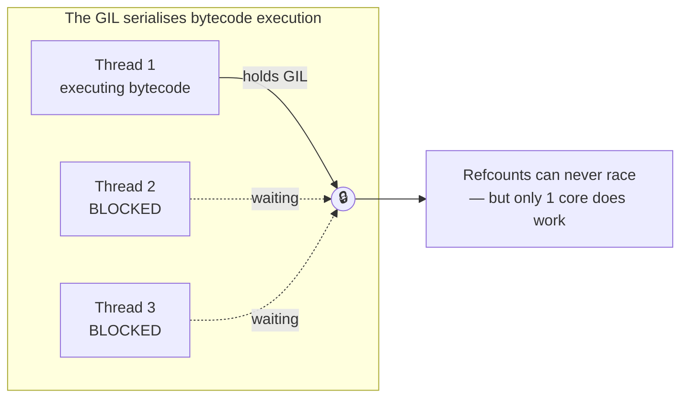
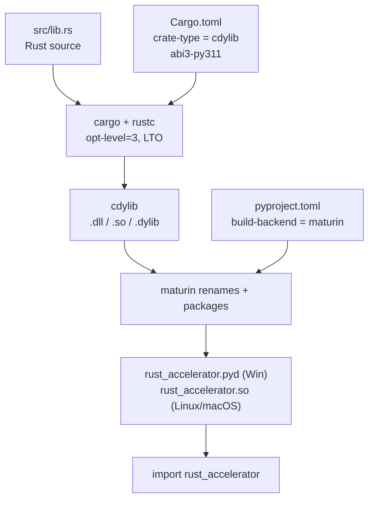

# Module 22: CPython Internals & Native Extensions with Rust + PyO3

> **Phase 6 — Language Mastery & Native Extensions** · Difficulty ★★★★★ · Est. 7 hrs
> **Prerequisites:** [Module 09 (Threading & the GIL)](../Module_09_Concurrency_Threading_Multiprocessing/01_README.md) · [Module 12 (Bytecode & Memory)](../Module_12_Python_Internals_Bytecode_Memory/01_README.md) · [Module 20 (Profiling)](../Module_20_Performance_Optimization_Profiling_Caching/01_README.md)

This module answers one question honestly: **when Python is too slow, what actually fixes it?**

You will not take that on faith. Every claim here is measured by a script you run yourself — including a measurement that proves a *plausible-looking* optimisation is a 5x **regression**.

---

## 🗺️ Recommended Step-by-Step Learning Path

| Step | File to Open | What You Will Do |
| :---: | :--- | :--- |
| **1** | **[01_README.md](01_README.md)** | Read conceptual overview, architectural foundations, and mental models. |
| **2** | **[02_FOUNDATIONS_PLAYGROUND.md](02_FOUNDATIONS_PLAYGROUND.md)** | Practice beginner spoonfed micro-drills and line-by-line syntax breakdowns. |
| **3** | **[03_try_it_yourself.py](03_try_it_yourself.py)** | Run in terminal (`python 03_try_it_yourself.py`) for an interactive zero-dependency sandbox. |
| **4** | **[04_BEGINNER_TO_RUST_EXTENSIONS_GUIDE.md](04_BEGINNER_TO_RUST_EXTENSIONS_GUIDE.md)** | Read the beginner conceptual bridge guide before diving into advanced mechanics. |
| **5** | **[05_interactive_cpython_and_native_extensions.ipynb](05_interactive_cpython_and_native_extensions.ipynb)** | Open in VS Code/Jupyter to run interactive visual experiments. |
| **6** | **[06_ctypes_honest_demo.py](06_ctypes_honest_demo.py)** | Run in terminal (`python 06_ctypes_honest_demo.py`) to explore Ctypes Honest code patterns. |
| **7** | **[07_gil_release_parallelism_demo.py](07_gil_release_parallelism_demo.py)** | Run in terminal (`python 07_gil_release_parallelism_demo.py`) to explore Gil Release Parallelism code patterns. |
| **8** | **[08_pyo3_rust_architecture_demo.md](08_pyo3_rust_architecture_demo.md)** | Run in terminal (`python 08_pyo3_rust_architecture_demo.md`) to explore Pyo3 Rust Architecture code patterns. |
| **9** | **[09_TROUBLESHOOTING_AND_EDGE_CASES.md](09_TROUBLESHOOTING_AND_EDGE_CASES.md)** | Study forensic runbooks, edge cases, and real-world failure post-mortems. |
| **10** | **[10_SELF_ASSESSMENT_AND_CHALLENGES.md](10_SELF_ASSESSMENT_AND_CHALLENGES.md)** | Test your knowledge with self-assessment quizzes, challenges, and diagnostic scenarios. |
| **11** | **[11_PROJECT_GUIDE.md](11_PROJECT_GUIDE.md)** | Follow the 3-tier guided project implementation for starter/ and project_solution/. |

---

## 1. The Mental Model: Why an Integer Costs 28 Bytes

A C `int64_t` is 8 bytes of memory and nothing else. A Python `int` is an *object*, and every object carries a header.

```
        C:  int64_t x = 7;
            ┌────────────────┐
            │ 07 00 00 00 …  │   8 bytes. That's the whole story.
            └────────────────┘

   Python:  x = 7
            ┌──────────────────────────────────────────────┐
            │ ob_refcnt   (8 bytes)  how many names point here
            │ ob_type     (8 bytes)  pointer to the `int` type object
            │ ob_size     (8 bytes)  how many 30-bit digits follow
            │ ob_digit[0] (4 bytes)  the actual value
            └──────────────────────────────────────────────┘
                        28 bytes, and one pointer dereference to read it
```

Verify it right now:

```python
>>> import sys
>>> sys.getsizeof(7)
28
>>> sys.getsizeof([7] * 1000)      # the list holds 1000 *pointers*
8056
```

**The consequence.** `a + b` in C is one CPU instruction. In CPython it is:

1. Decode the `BINARY_OP` bytecode instruction.
2. Follow `ob_type` on both operands to find `nb_add`.
3. Call it — which allocates a **brand-new** `PyObject` for the result.
4. Increment and decrement reference counts along the way.

That is roughly **50–100x** the work. Not because CPython is badly written, but because it is doing something strictly more general: dynamic dispatch on types that could be anything.

> **The core insight of this module:** you cannot make Python arithmetic fast by
> changing how you *store* the numbers. You can only make it fast by moving the
> **loop itself** out of the interpreter.

Demo 1 exists to hammer this home empirically.

---

## 2. Reference Counting and the Reason for the GIL

CPython frees an object the instant its reference count hits zero.

```python
import sys

data = [1, 2, 3]
print(sys.getrefcount(data))    # 2  -> `data`, plus the temporary arg to getrefcount

alias = data
print(sys.getrefcount(data))    # 3

del alias
print(sys.getrefcount(data))    # 2  again
```

Now imagine two OS threads doing `alias = data` at the same moment. `ob_refcnt += 1` is *not* atomic — it is load, add, store. Interleave two of those and you lose an increment. The object gets freed while still in use, and you have a use-after-free in the interpreter itself.

**The Global Interpreter Lock is the fix**: one mutex, held while executing bytecode, so refcount updates can never interleave.



This is why **`threading` never speeds up CPU-bound Python** (Module 09) — and it is the precise limitation a native extension can lift.

> **A note on the future.** PEP 703 defines a free-threaded build (`python3.13t`+)
> that removes the GIL using biased reference counting and per-object locks.
> It is real and it is opt-in, but it is not the default in 3.11 (this course's
> baseline), and native extensions must explicitly declare support for it. The
> techniques in this module remain correct either way.

---

## 3. The Four Honest Escape Hatches

When profiling (Module 20) proves a hot loop is your bottleneck, you have exactly four options. Choosing wrongly wastes weeks.

| Option | Use when | Cost | Realistic gain |
| :--- | :--- | :--- | :--- |
| **Vectorise (numpy / Polars)** | Your data is uniform arrays and the operation is array-shaped | Lowest — no build step | 10–100x |
| **`ctypes` / `cffi`** | A compiled library **already exists** and you just need to call it | Low — no compiler needed | The library's speed; **0x for your own loops** |
| **Cython** | You want to stay in Python-like syntax and add types incrementally | Medium — build step, C toolchain | 10–100x |
| **Rust + PyO3** | You need max speed, memory safety, real parallelism, and a maintainable result | Highest — new language, Rust toolchain | 20–100x **plus GIL release** |

### The trap: `ctypes` is not an accelerator

This looks native. It is not:

```python
buf = (ctypes.c_double * n)(*values)
total = 0.0
for i in range(n):
    total += buf[i] * buf[i]      # ← boxes a NEW Python float every access
```

The loop still runs in the interpreter, and you have *added* marshalling cost. [Demo 1](06_ctypes_honest_demo.py) measures it:

```
  vector length          : 200,000
  pure Python (zip+sum)  :     9.53 ms
  ctypes-wrapped loop    :    50.18 ms
  -> the 'native' version is 5.26x SLOWER than plain Python.
```

**`ctypes` is a bridge, not an engine.** Use it to call `libm`, a vendor SDK, or a `.dll` you were handed. Never to speed up code you wrote in Python.

---

## 4. What PyO3 Actually Gives You

PyO3 is a Rust crate that generates the CPython C-API glue for you. Five concepts cover almost everything, and all five appear in [`rust_accelerator/src/lib.rs`](project_solution/rust_accelerator/src/lib.rs).

### 4.1 `#[pyfunction]` — export a Rust function

```rust
#[pyfunction]
fn fnv1a_64(data: &[u8]) -> u64 {
    let mut hash: u64 = 0xcbf2_9ce4_8422_2325;
    for &byte in data {
        hash ^= byte as u64;
        hash = hash.wrapping_mul(0x0000_0100_0000_01b3);
    }
    hash
}
```

`&[u8]` **borrows** the Python `bytes` buffer. Zero copies, zero boxing — the loop reads raw memory. Note `wrapping_mul`: Rust panics on overflow in debug builds, so integer-hash code must say explicitly that wrapping is intended.

### 4.2 `PyResult` — Rust errors become Python exceptions

```rust
#[pyfunction]
fn dot_product(a: Vec<f64>, b: Vec<f64>) -> PyResult<f64> {
    if a.len() != b.len() {
        return Err(PyValueError::new_err(format!(
            "vectors must be equal length (got {} and {})", a.len(), b.len()
        )));
    }
    Ok(a.iter().zip(b.iter()).map(|(x, y)| x * y).sum())
}
```

In Python that `Err` is an ordinary `ValueError` — catchable, with a real message:

```python
>>> rust_accelerator.dot_product([1.0], [1.0, 2.0])
ValueError: vectors must be equal length (got 1 and 2)
```

A Rust **panic**, by contrast, becomes `pyo3_runtime.PanicException` and should be treated as a bug in your extension, never as control flow.

### 4.3 `py.allow_threads()` — the headline feature

```rust
#[pyfunction]
fn count_primes(py: Python<'_>, limit: u64) -> u64 {
    py.allow_threads(|| {          // ← GIL is DROPPED for this whole block
        (2..limit).filter(|&n| is_prime(n)).count() as u64
    })
}
```

Inside that closure this thread holds no GIL, so other Python threads run **simultaneously on other cores**. The Rust compiler enforces safety: the closure cannot capture any Python object, so there is nothing to race on.

[Demo 2](07_gil_release_parallelism_demo.py) measures the difference on the same workload:

| | 1 thread | 4 threads | Thread scaling |
| :--- | ---: | ---: | ---: |
| Pure Python | 119 ms | 473 ms | **1.00x** — GIL-bound |
| Native Rust | 3.7 ms | 4.7 ms | **3.21x** — GIL released |

Read the bottom-right number twice. Python got **zero** benefit from 4 threads; the wall-clock even rose from thread overhead. Rust got 3.21x on a 4-core box. Combined with the 32x single-thread win, that is a **101x** end-to-end speedup.

> Two wins compound here, and only one of them is "Rust is fast":
> **(1)** compiled code is faster per core, and
> **(2)** it can use *every* core at once — a capability pure Python does not have at any optimisation level.

### 4.4 `#[pyclass]` — a Rust struct as a Python class

```rust
#[pyclass]
struct RollingStats { count: u64, mean: f64, m2: f64 }

#[pymethods]
impl RollingStats {
    #[new]
    fn new() -> Self { RollingStats { count: 0, mean: 0.0, m2: 0.0 } }

    fn push(&mut self, x: f64) { /* Welford's algorithm */ }

    #[getter]
    fn mean(&self) -> f64 { self.mean }
}
```

From Python this is an ordinary class with ordinary properties. The state lives in Rust memory with no `__dict__` — which is also why it is dramatically smaller than the Python equivalent.

**Batch your FFI crossings.** Each call over the boundary costs roughly 100–200 ns. That is negligible once, and ruinous a million times:

```python
for x in million_values:        # ✗ ~1,000,000 boundary crossings
    stats.push(x)

stats.extend(million_values)    # ✓ ONE crossing; Rust loops internally
```

This is the most common real-world PyO3 performance mistake — people write a fast extension and then call it in the slowest possible way.

### 4.5 `#[pymodule]` — registration

```rust
#[pymodule]
fn rust_accelerator(m: &Bound<'_, PyModule>) -> PyResult<()> {
    m.add_function(wrap_pyfunction!(fnv1a_64, m)?)?;
    m.add_class::<RollingStats>()?;
    Ok(())
}
```

> ⚠️ The `#[pymodule]` function name **must** equal `lib.name` in `Cargo.toml`.
> CPython looks for the symbol `PyInit_<name>`. A mismatch produces
> `ImportError: dynamic module does not define module export function`, which is
> the single most common first-time PyO3 error. See
> [TROUBLESHOOTING](09_TROUBLESHOOTING_AND_EDGE_CASES.md#1-importerror-dynamic-module-does-not-define-module-export-function).

---

## 5. The Build Pipeline



Two commands matter:

```bash
# Development: compile and install into the *current* environment, in place.
maturin develop --release

# Distribution: produce a wheel for PyPI.
maturin build --release
```

> 🔴 **`--release` is not optional.** A debug build is typically **10–50x slower
> than the release build** and can be slower than pure Python. Nearly every
> "PyO3 didn't help" report is a forgotten `--release`.

### Why `abi3-py311`

```toml
pyo3 = { version = "0.23", features = ["extension-module", "abi3-py311"] }
```

| Without `abi3` | With `abi3-py311` |
| :--- | :--- |
| One wheel per Python version | **One wheel for 3.11, 3.12, 3.13, 3.14…** |
| 5 versions × 3 platforms = 15 builds | 3 builds |
| Breaks on every Python release | Forward-compatible |

The cost is that you may only use the *stable* subset of the C API. For almost all extensions that is no restriction at all. Module 23 covers shipping these wheels to PyPI.

---

## 6. When NOT to Write a Native Extension

Reaching for Rust too early is a classic senior-engineer mistake. Do **not** do this when:

- **You have not profiled.** Module 20 exists for a reason. The bottleneck is I/O far more often than CPU, and no amount of Rust fixes a slow database query.
- **numpy or Polars already covers it.** A vectorised one-liner beats a week of FFI work and ships today.
- **The hot loop is under ~1 ms total.** FFI overhead will eat the gain.
- **You are I/O-bound.** Use `asyncio` (Module 10). Rust cannot make the network faster.
- **Nobody on the team reads Rust.** A 30x speedup that only one person can maintain is a liability, not an asset.
- **You would lose the pure-Python fallback.** Always keep one, as
  [`load_backend()`](project_solution/native_accelerator.py) does — users on
  unusual platforms still get working software, just slower.

> **The professional sequence is: measure → vectorise → cache → *then* go native.**
> This module teaches the last step. It is the last step for a reason.

---

## 7. Summary

| Concept | Takeaway |
| :--- | :--- |
| `PyObject` overhead | 28 bytes and a pointer chase for one integer; ~50–100x C's arithmetic cost |
| Reference counting | Non-atomic increments are exactly why the GIL exists |
| `ctypes` | Calls existing native code; **measured 5.26x slower** for your own loops |
| `#[pyfunction]` / `&[u8]` | Zero-copy borrowing of Python buffers |
| `PyResult` | Rust `Err` → real, catchable Python exception |
| **`py.allow_threads()`** | **True multicore parallelism — the capability Python lacks** |
| `#[pyclass]` | Rust structs as Python classes; batch calls to amortise FFI cost |
| `abi3-py311` | One wheel for every future Python 3.11+ |
| `--release` | Non-negotiable; debug builds can lose to pure Python |

### Measured results from this module's own code

```
single-thread speedup (rust vs python) :   31.7x
4-thread    speedup (rust vs python) :  101.5x
python thread scaling                  :   1.00x  (GIL-bound)
rust   thread scaling                  :   3.21x  (GIL released)
ctypes anti-pattern vs plain Python    :    0.19x  (5.26x SLOWER)
```

---

## ▶️ Next Steps

1. Run [06_ctypes_honest_demo.py](06_ctypes_honest_demo.py) and confirm the regression on **your** machine.
2. Build the extension: `cd project_solution/rust_accelerator && maturin develop --release`.
3. Run [07_gil_release_parallelism_demo.py](07_gil_release_parallelism_demo.py) and compare your thread scaling to the table above.
4. Work [11_PROJECT_GUIDE.md](11_PROJECT_GUIDE.md) from [starter/](starter/) — write the Rust yourself; the tests are already there to grade you.
5. Continue to [Module 23: Strict Typing, Packaging & Publishing](../Module_23_Strict_Typing_Packaging_Publishing/01_README.md), which turns this extension into a typed, published wheel.
