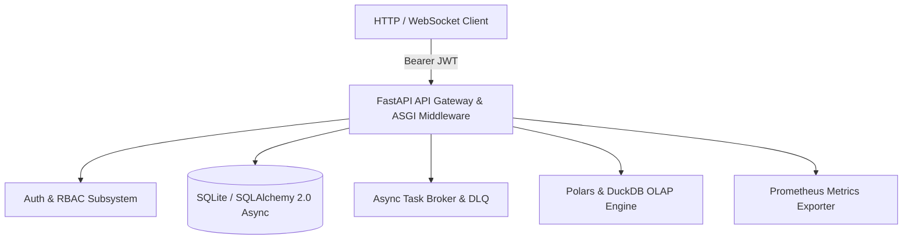
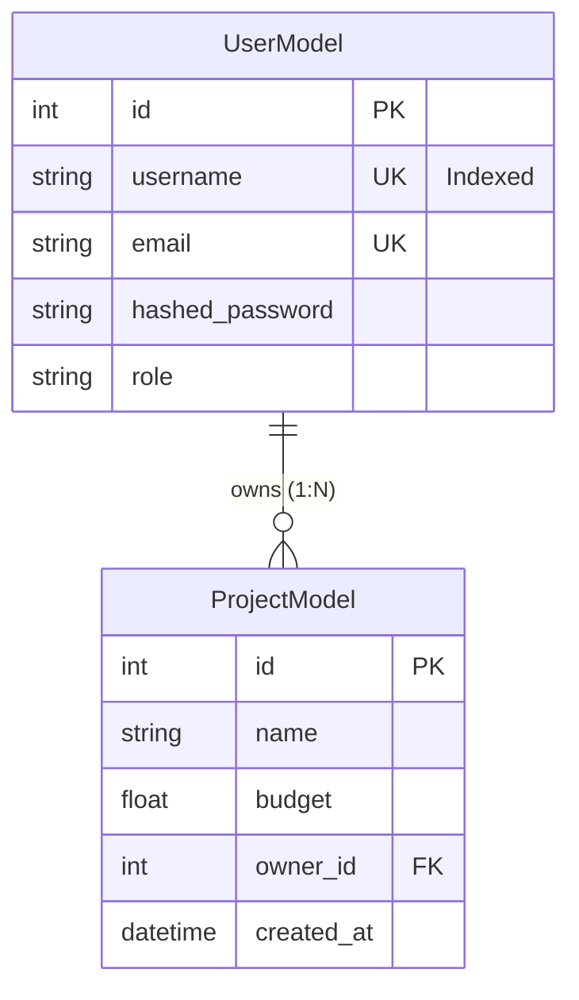

# Enterprise Microservice Platform Architecture Specification

This document defines the formal engineering specification for the unified **Enterprise Distributed Microservice Platform**, the capstone deliverable synthesizing all 27 modules of the Advanced Python Systems Architecture curriculum.

---

## 1. System Architecture Overview

The platform integrates modern asynchronous ASGI networking, strict Pydantic V2 data validation, SQLAlchemy 2.0 async persistence, JWT role-based access control, distributed asynchronous background task queuing with Dead Letter Queues (DLQ), high-performance Polars and DuckDB columnar analytics, and Prometheus observability.



### Component Technology Stack

| Component | Technology | Primary Invariant & Responsibility |
| :--- | :--- | :--- |
| **Gateway & REST** | FastAPI & Pydantic V2 | HTTP Routing, OpenAPI documentation, strict payload validation. |
| **Authentication** | Bcrypt & PyJWT | Salting, constant-time verification, cryptographic token issuance. |
| **Database** | SQLAlchemy 2.0 & aiosqlite | Relational ACID transactions, foreign keys, eager loading. |
| **Real-Time** | WebSockets | Live multi-client event broadcasting and room isolation. |
| **Task Queue** | Distributed Broker + DLQ | Asynchronous background processing with retry exhaustion protection. |
| **Analytics Engine** | Polars & DuckDB | Vectorized Arrow processing and SQL window partition ranking. |
| **Telemetry** | Custom ASGI Middleware | Correlation IDs (`X-Correlation-ID`) and Prometheus counters. |

---

## 2. Functional Requirements (Testable Statements)

1. **FR-01: User Identity & Registration**  
   The platform shall accept user registration requests with username, email, password, and role. Passwords must be at least 8 characters and hashed with salted Bcrypt. Duplicate usernames must return HTTP 409 Conflict.
2. **FR-02: Cryptographic Token Issuance**  
   The platform shall authenticate users via OAuth2 password grant and issue HS256 JWT tokens containing `sub`, `username`, `role`, and UTC `exp`.
3. **FR-03: Role-Based Access Control (RBAC)**  
   The platform shall enforce endpoint permissions. Users with `viewer` role attempting administrative routes must receive HTTP 403 Forbidden.
4. **FR-04: Asynchronous Project Management**  
   Authenticated users shall create projects with positive budgets (`budget > 0`). Projects must be persisted to the database and linked to the requesting user ID.
5. **FR-05: Distributed Task Queueing**  
   The platform shall enqueue background tasks returning an assigned `TASK-xxxxxxxx` ID and initial status `PENDING`.
6. **FR-06: Task Retries and Dead Letter Queue (DLQ)**  
   Failed background tasks must be retried up to 2 times (`retries_left=2`). Tasks that exhaust retries must transition to `status="DLQ"` and record the exception traceback.
7. **FR-07: Columnar Analytical Aggregations**  
   The platform shall aggregate project budgets grouped by owner using Polars LazyFrames, sorting owners by total expenditure descending.
8. **FR-08: Window Partition SQL Queries**  
   The platform shall rank projects by budget within owner groups using in-process DuckDB `RANK() OVER (PARTITION BY ...)` window functions.
9. **FR-09: Request Correlation & Latency Tracking**  
   Every HTTP response shall include headers `X-Correlation-ID` (preserved from request or auto-generated UUID) and `X-Process-Time-Ms`.
10. **FR-10: Prometheus Telemetry Exposition**  
    The platform shall expose `/metrics` returning `http_requests_total` counter metrics partitioned by path and HTTP status code.

---

## 3. Full API Contract

### Authentication Endpoints

#### `POST /auth/register`
- **Request Body:** `UserRegisterSchema`
  ```json
  {
    "username": "lead_architect",
    "email": "lead@platform.io",
    "password": "MasterCapstonePass123!",
    "role": "admin"
  }
  ```
- **Responses:**
  - `201 Created`: `{"id": 1, "username": "lead_architect", "role": "admin"}`
  - `409 Conflict`: `{"detail": "Username already exists"}`
  - `422 Unprocessable Entity`: Validation failure on invalid email or short password.

#### `POST /auth/login`
- **Request Form:** `application/x-www-form-urlencoded` (`username`, `password`)
- **Responses:**
  - `200 OK`: `{"access_token": "eyJhbGciOi...", "token_type": "bearer"}`
  - `401 Unauthorized`: `{"detail": "Invalid username or password"}`

---

### Project & Resource Endpoints

#### `POST /projects`
- **Headers:** `Authorization: Bearer <access_token>`
- **Request Body:**
  ```json
  {
    "name": "NextGen Distributed Platform",
    "budget": 250000.0
  }
  ```
- **Responses:**
  - `201 Created`: `{"id": 1, "name": "NextGen Distributed Platform", "budget": 250000.0, "owner_id": 1}`
  - `401 Unauthorized`: Token missing or signature invalid.
  - `422 Unprocessable Entity`: Budget <= 0 or name shorter than 2 characters.

---

### Task Queue Endpoints

#### `POST /tasks/enqueue?task_name={task_name}`
- **Headers:** `Authorization: Bearer <access_token>`
- **Query Parameter:** `task_name` (string)
- **Request Body:** JSON dictionary payload (e.g. `{"format": "parquet"}`)
- **Responses:**
  - `200 OK`: `{"task_id": "TASK-a1b2c3d4", "status": "PENDING"}`
  - `401 Unauthorized`: Unauthenticated caller.

---

### Analytics & Telemetry Endpoints

#### `GET /analytics/summary`
- **Responses:**
  - `200 OK`: JSON array of owner budget summaries:
    ```json
    [
      {"owner": "alice", "total_budget": 3500.0, "project_count": 2},
      {"owner": "bob", "total_budget": 2500.0, "project_count": 1}
    ]
    ```

#### `GET /healthz/live`
- **Responses:**
  - `200 OK`: `{"status": "LIVE", "timestamp": 1757270000.0}`

#### `GET /healthz/ready`
- **Responses:**
  - `200 OK`: `{"status": "READY", "db": "CONNECTED", "broker": "ACTIVE"}`

#### `GET /metrics`
- **Responses:**
  - `200 OK`: Content-Type `text/plain` containing Prometheus metric series:
    ```
    # TYPE http_requests_total counter
    http_requests_total{path="/healthz/live",status="200"} 12
    ```

---

## 4. Relational Data Model & Indexes



- **`users` Table:**
  - `id`: Integer, Primary Key, Auto-increment.
  - `username`: String(50), Unique, B-Tree Index.
  - `email`: String(100), Unique.
  - `hashed_password`: String(255), Stored salted Bcrypt hash.
  - `role`: String(20), Default `"viewer"`.
- **`projects` Table:**
  - `id`: Integer, Primary Key, Auto-increment.
  - `name`: String(100), Non-null.
  - `budget`: Float, Default `0.0`.
  - `owner_id`: ForeignKey (`users.id`), OnDelete `CASCADE`.
  - `created_at`: DateTime, UTC default.

---

## 5. Non-Functional Performance & Reliability Targets

| Metric | Target SLA | Verification Method |
| :--- | :--- | :--- |
| **Liveness P99 Latency** | `< 5.0 ms` | Verified via TestClient batch timing |
| **Analytics Query P99** | `< 25.0 ms` on 100k rows | Polars lazy scan filter pushdown benchmark |
| **Memory Footprint** | `< 120 MB` baseline process RAM | Verified via RSS monitoring |
| **Task Retry Exhaustion** | Exactly 3 attempts before DLQ | Verified via `test_task_broker_retries_and_dlq` |
| **Zero Memory Leakage** | Cyclic GC cleans in-flight buffers | Verified via `test_internals_profiler` |

---

## 6. Acceptance Criteria Checklist

- [ ] Every endpoint documented in Section 3 has an automated test in `test_capstone.py`.
- [ ] Pytest suite executes 100% green under `pytest -m capstone`.
- [ ] All database queries utilize SQLAlchemy 2.0 async sessions with zero sync blocking calls.
- [ ] JWT tokens strictly validate expiration timestamps (`exp`) in UTC.
- [ ] Background tasks cleanly isolate failures and transition to Dead Letter Queue without crashing the worker.
- [ ] Analytics aggregations match exact mathematical calculations within floating-point tolerance.
- [ ] Correlation IDs (`X-Correlation-ID`) are injected into all HTTP responses.
- [ ] Code is 100% clean under `ruff check .` with zero lint warnings.

---

## 7. Grading Rubric (100 Points Total)

| Subsystem Area | Weight | Evaluation Criteria |
| :--- | :--- | :--- |
| **API Architecture & Validation** | 20 pts | Clean routes, Pydantic V2 schemas, status codes, OpenAPI metadata |
| **Authentication & Security** | 20 pts | Bcrypt hashing, constant-time compare, JWT token verification, RBAC guard |
| **Async Relational Database** | 20 pts | SQLAlchemy 2.0 declarative models, eager loading, transactions |
| **Task Queue & DLQ** | 15 pts | Retries, Dead Letter Queueing, exception preservation, queue drain |
| **Polars & DuckDB Analytics** | 15 pts | Vectorized aggregation, DuckDB analytical window SQL queries |
| **Telemetry & Observability** | 10 pts | Correlation ID propagation, Prometheus counter metrics, health probes |

**Certification Standard:** 90/100 points required to achieve Master of Python Systems Architecture.
