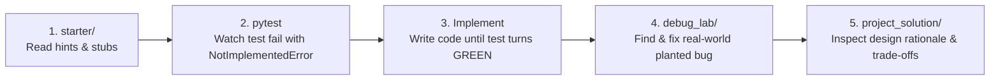

# 🚀 Start Here: The Definitive On-Ramp to Advanced Python Mastery

> *"Every master systems architect once typed their very first syntax error."*

Welcome to the definitive, production-grade Python engineering curriculum. Whether you are stepping up from basic scripting or preparing for senior backend and distributed systems engineering roles, this guide gets you operational immediately.

> [!TIP]
> 🔰 **Complete Beginner with zero programming experience?**  
> Don't worry about terminal commands, virtual environments, or Docker yet! Start with our spoonfed:  
> **👉 [The Interactive Foundations Absolute Beginner Python Crash Course](FAST_TRACK_FOUNDATIONS_CRASH_COURSE.md)**  
> It breaks down variables, math, if/else, loops, and lists with 25 interactive micro-drills and zero technical jargon!

---

## ⚡ 1. The One-Command Environment Installation

Initialize the entire development environment, all toolchains, and test runners with a single command from the course root:

```bash
# Recommended (10x-100x faster with uv):
uv sync --all-extras

# OR with standard pip inside your virtual environment:
pip install -e ".[all]"
```

### Optional Production Tooling Extras
Depending on which advanced modules you are currently working on, install the corresponding local services:

1. **Headless Browser Automation (Module 24):**
   ```bash
   playwright install chromium
   ```
2. **Distributed Redis Broker (Modules 18, 20, 26):**
   ```bash
   docker run -d -p 6379:6379 --name course-redis redis:alpine
   ```
3. **Native Rust PyO3 Toolchain (Module 22):**
   ```bash
   rustup default stable
   ```

---

## 🔄 2. The Core Pedagogical Learning Loop

Every module in this course follows a battle-tested 4-step engineering loop:



### Step 1: Work in `starter/`
Each module contains a `starter/` directory with function and class skeletons. Every stub includes:
- A `[Tier N]` marker connecting it to the module's `PROJECT_GUIDE.md`
- The algorithm stated in clear technical prose
- Concrete hints naming exact APIs
- The exact test name that grades your implementation
- Warnings about common traps

### Step 2: Grade Yourself Continuously
Each `starter/` contains an automated redirection `conftest.py`. Grade your code directly:
```bash
cd Module_01_Python_Fundamentals/starter
pytest ../project_solution/test_calculator.py -v
```
An unimplemented function fails cleanly with `NotImplementedError`. As you write code, watch the tests turn green one by one!

### Step 3: Tackle the `debug_lab/`
Real software engineering involves debugging broken code. Each module includes a `debug_lab/` with:
- `broken_<feature>.py`: A realistic implementation containing subtle production bugs.
- `SYMPTOMS.md`: The real error trace or performance bug observed in production.
- `ANSWERS.md`: Collapsible root-cause explanations and permanent fixes.

### Step 4: Review Design Rationales in `project_solution/`
Never view the reference solution until your starter passes the tests. When complete, inspect `project_solution/README.md` to review why specific architectural decisions were made and why alternative approaches were rejected.

---

## 🛑 3. Phase Checkpoints & Quality Gates

The 27 modules are grouped into **7 progressive phases**. At the end of each phase, you must complete the corresponding **Phase Checkpoint**:

- [Phase 1 Checkpoint: Core Foundations](Phase_Checkpoints/PHASE_1_CHECKPOINT.md) (Modules 00–03)
- [Phase 2 Checkpoint: Software Architecture & Reliability](Phase_Checkpoints/PHASE_2_CHECKPOINT.md) (Modules 04–08)
- [Phase 3 Checkpoint: Systems & Concurrency](Phase_Checkpoints/PHASE_3_CHECKPOINT.md) (Modules 09–12)
- [Phase 4 Checkpoint: Production Web APIs](Phase_Checkpoints/PHASE_4_CHECKPOINT.md) (Modules 13–17)
- [Phase 5 Checkpoint: Distributed Systems](Phase_Checkpoints/PHASE_5_CHECKPOINT.md) (Modules 18–19)
- [Phase 6 Checkpoint: Language Mastery & Native Extensions](Phase_Checkpoints/PHASE_6_CHECKPOINT.md) (Modules 20–23)
- [Phase 7 Checkpoint: Capstone & Enterprise Architectures](Phase_Checkpoints/PHASE_7_CHECKPOINT.md) (Modules 24–26)

Each checkpoint provides a **100-point rubric**, diagnostic self-examination questions, and an integration code audit. **A score of >= 80 points is required before proceeding to the next phase.**

---

---

## 🌉 5. Zero-to-One Cognitive Bridge Guides

Whenever you encounter a steep conceptual jump, refer to our dedicated, jargon-free zero-to-hero bridge guides:

| Core Concept | Bridge Guide | Mental Model / Core Insight |
| :--- | :--- | :--- |
| **LEGB & Closures** | [Module 02 Bridge Guide](Module_02_Functions_Scopes_Closures/04_BEGINNER_TO_CLOSURES_GUIDE.md) | The "backpack" mental model of enclosed state. |
| **Big-O & Containers** | [Module 03 Bridge Guide](Module_03_Data_Structures_Collections/04_BEGINNER_TO_DATA_STRUCTURES_GUIDE.md) | Container decision trees and hash table collisions. |
| **Deep OOP & MRO** | [Module 04 Bridge Guide](Module_04_Deep_OOP/04_BEGINNER_TO_OOP_BRIDGE.md) | Demystifying `self` desugaring, `@property`, and C3 MRO. |
| **Decorators & Generators** | [Module 05 Bridge Guide](Module_05_Decorators_Generators_Context_Managers/04_BEGINNER_TO_ADVANCED_FEATURES_GUIDE.md) | Gift-wrap decorator model and water-faucet streaming. |
| **Asyncio & Event Loops** | [Module 10 Bridge Guide](Module_10_Concurrency_Asyncio/04_BEGINNER_TO_ASYNCIO_GUIDE.md) | The Master Waiter model and non-blocking cooperative scheduling. |
| **CPython Internals** | [Module 12 Bridge Guide](Module_12_Python_Internals_Bytecode_Memory/04_BEGINNER_TO_INTERNALS_GUIDE.md) | The stack machine execution pipeline and reference counting. |
| **Rust & PyO3 FFI** | [Module 22 Bridge Guide](Module_22_CPython_Internals_Rust_PyO3_Extensions/04_BEGINNER_TO_RUST_EXTENSIONS_GUIDE.md) | Why native extensions solve bottlenecks, with pure-Python fallback. |

---

## 🧭 6. Terminal & Command Reference

Verify your active Python interpreter and tools:

```bash
# Verify Python version (must be >= 3.11):
python --version

# Run the complete test suite (539 passed, 100%):
pytest -q

# Run the repository health checks:
python tools/check_links.py
python tools/check_deps.py
ruff check .
```

Now proceed to **[Module 00: Environment, Tooling & Modern Workflow](Module_00_Environment_Tooling_Workflow/01_README.md)**!
