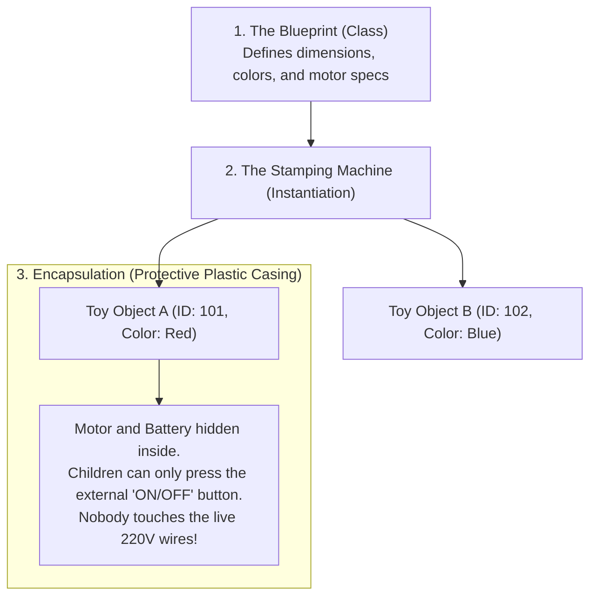
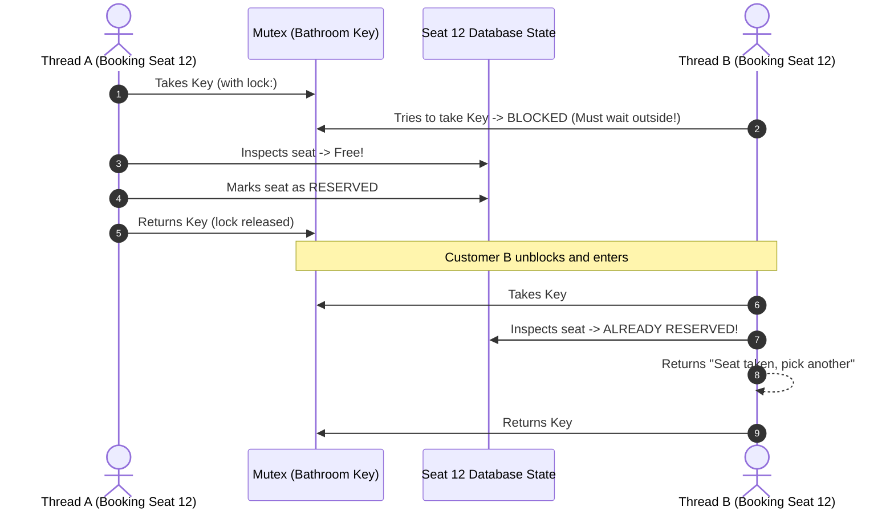
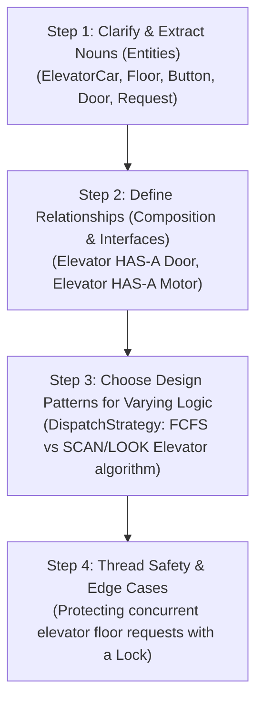

# Chapter 00-B: Zero-Prerequisite OOP & Concurrency Primer for LLD

> **The Bridge: Welcome to System Architecture!**
> In Track 1 (Python Mastery), you learned how Python works: functions, lists, loops, bytecode, and memory.
> 
> But imagine walking into a senior interview at Google, Uber, or Stripe. The interviewer doesn't ask you to reverse a string. Instead, they hand you a whiteboard marker and say:
> > *"Design a real-time Movie Ticket Booking System that handles 50,000 users booking seats without anyone double-booking the same chair."*
> 
> If you start writing a 1,000-line Python script with 50 nested `if/else` statements, you will fail the interview within ten minutes.
> 
> **Low-Level Design (LLD)** is the art of assembling software like **clean Lego bricks**. It ensures your code is modular, flexible to changing business requirements, and completely safe from multi-threaded race conditions.
> 
> By the end of this primer, you will feel 100% confident reading and building the 14 industrial systems that follow.

---

## 0. The Jargon Demystifier (Plain English Dictionary)

Before touching a single design pattern, let's eliminate every scary acronym and buzzword:

| Term | What Everyone Calls It | What It ACTUALLY Means in Plain English |
| :--- | :--- | :--- |
| **LLD** | Low-Level Design | Class-level software architecture: what classes exist, what methods they have, and how they talk to each other. |
| **OOP** | Object-Oriented Programming | Organizing code by "Things" (Objects) rather than just raw procedures. |
| **Entity** | Domain Model | An object that has a unique ID and persists over time (e.g. `User`, `Ticket`, `Vehicle`). |
| **DTO** | Data Transfer Object | A dumb data container with no business logic, used just to pass data between systems (e.g. `BookingRequestDTO`). |
| **Interface / ABC** | Abstract Base Class | A legally binding contract. It says: *"Any class claiming to be a PaymentGateway MUST have a `charge()` method!"* |
| **Composition** | "HAS-A" Relationship | Building an object by plugging smaller parts into it (e.g. A `Car` *has an* `Engine`). |
| **Inheritance** | "IS-A" Relationship | Creating a child class that copies everything from a parent (e.g. A `Dog` *is an* `Animal`). |
| **Mutex / Lock** | Mutual Exclusion | A digital bathroom key. Only ONE thread can hold the key to update a bank balance at any instant. |

---

## 1. Zero-Prerequisite Intuition: The "Toy Factory" Metaphor



### 1. Class vs Object: The Mold vs The Plastic Toy
* A **Class** is the steel blueprint mold in the factory. It doesn't do anything on its own; it just describes what toys should look like.
* An **Object (Instance)** is the physical plastic toy stamped out of that mold. You can stamp out 10,000 toys from a single blueprint.

### 2. Encapsulation: The Protective Casing
Imagine a toy robot with exposed copper wires and a bare lithium battery. If a child touches the live wires, they get burned!
In software, **Encapsulation** means putting a protective plastic shell around the data. You make the internal state private (`self._balance`), and only allow users to interact with it through safe public buttons (`account.deposit(amount)`).

### 3. The #1 Junior Mistake: Inheritance vs Composition
Every beginner falls in love with Inheritance:
> *"A Car is a Vehicle! A Truck is a Vehicle! A Helicopter is a Vehicle!"*

Then the product manager drops a curveball: *"We need a Flying Car that drives on roads AND flies through clouds."*
With inheritance, your class hierarchy explodes into an unmaintainable nightmare (`FlyingCarDrivingVehicleSubclass`).

> **The Golden Rule of Staff Engineers:**
> **"Favor Object Composition over Class Inheritance."**
> 
> Don't make a car *inherit* from wings and wheels. Give the car a list of pluggable parts!
> A `Car` **HAS-A** `DrivingEngine` and **HAS-A** `WingAttachment`. You can swap parts in and out like Lego bricks at runtime!

---

## 2. Concurrency for Beginners: The "Single Bathroom Key"

Why do software systems crash under high traffic?
Imagine a busy restaurant with **one single restroom**.



### The Plain-English Rule of Thread Safety:
* If two threads only **read** data at the same time $\rightarrow$ **100% Safe**.
* If two threads **write or modify** data at the same time without a Lock $\rightarrow$ **Catastrophic Double-Booking Bug**.
* In Python, wrapping the critical section inside `with self._lock:` guarantees that Thread B will politely wait until Thread A finishes.

---

## 3. The 4-Step Framework to Solve ANY Low-Level Design Interview

When given a vague problem like *"Design an Elevator System"*, follow these 4 steps in order:



### The Before & After Evolution:

#### The Junior Way (Spaghetti Code Anti-Pattern):
```python
# ❌ FATAL ANTI-PATTERN: Everything hardcoded in a monolithic class
class BadElevator:
    def move(self, request_type):
        if request_type == "NORMAL":
            # 50 lines of logic
            pass
        elif request_type == "FIRE_EMERGENCY":
            # 50 lines of logic copy-pasted
            pass
        elif request_type == "VIP":
            # 50 lines of logic copy-pasted
            pass
```
*Why it fails:* Every time the interviewer adds a new feature ("Now add Medical Emergency Mode"), you must modify and risk breaking the entire 300-line class (**Violating the Open-Closed Principle**).

#### The Senior Way (Pluggable Strategy Pattern):
```python
# ✅ SENIOR ARCHITECTURE: Pluggable behaviors using Interfaces (ABCs)
from abc import ABC, abstractmethod

class DispatchStrategy(ABC):
    @abstractmethod
    def select_next_floor(self, current_floor: int, requested_floors: list[int]) -> int:
        """Determines which floor to visit next."""
        pass

class NormalScanStrategy(DispatchStrategy):
    def select_next_floor(self, current_floor: int, requested_floors: list[int]) -> int:
        # Standard elevator SCAN algorithm (moves in one direction)
        return min(requested_floors, key=lambda f: abs(f - current_floor))

class EmergencyEvacuateStrategy(DispatchStrategy):
    def select_next_floor(self, current_floor: int, requested_floors: list[int]) -> int:
        # Emergency: Immediately bypass all floors and go to Ground Floor (0)!
        return 0

class ElevatorCar:
    def __init__(self, strategy: DispatchStrategy):
        self.current_floor = 0
        self.strategy = strategy # Pluggable! Can be swapped at runtime!

    def step(self, requested_floors: list[int]):
        target = self.strategy.select_next_floor(self.current_floor, requested_floors)
        self.current_floor = target
        return target
```

---

## 4. Milestone Check: What You Just Mastered!

You now understand:
1. Why classes are blueprints and objects are plastic toys.
2. Why **Composition** beats **Inheritance** in 95% of real-world designs.
3. How a **Mutex Lock** works like a bathroom key to eliminate double-booking bugs.
4. How the **Strategy Pattern** lets you swap business rules at runtime without breaking existing code.

You are now 100% prepared to study the 16 Industrial Core Systems in Track 2!
