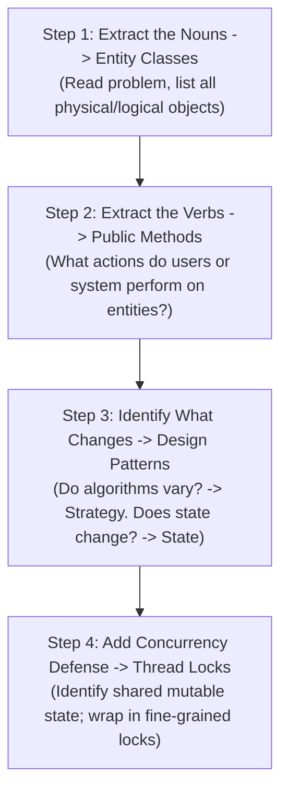
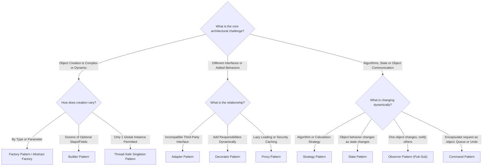

# LLD Chapter 0: The 4-Step Lego Blueprint & Pattern Decision Tree

> **Core Learning Objective:** Transform Low-Level Design from an intimidating, open-ended puzzle into a calm, mechanical, 4-step assembly process. Master the visual Pattern Decision Tree to select the perfect GoF pattern for any interview question in seconds.

---

## 1. The 4-Step "Lego" LLD Problem-Solving Blueprint

Every Low-Level Design problem (Parking Lot, Elevator, Movie Booking, Rate Limiter) is solved using the exact same 4 mechanical steps:

### Walkthrough on a Real Example: "Design a Parking Lot"
1. **Nouns:** Vehicle, ParkingSpot, Ticket, Payment, Floor. $\rightarrow$ *These are your classes!*
2. **Verbs:** Park, Unpark, IssueTicket, CalculateFee. $\rightarrow$ *These are your class methods!*
3. **What Changes:**
   * Spot allocation changes (Nearest vs Lowest Floor). $\rightarrow$ *Use Strategy Pattern!*
   * Vehicle types differ (Car, Bike, Truck). $\rightarrow$ *Use Factory Pattern!*
   * The parking lot configuration is a single physical facility. $\rightarrow$ *Use Singleton Pattern!*
4. **Concurrency:** Two cars attempting to grab the same spot simultaneously. $\rightarrow$ *Wrap `ParkingSpot.park()` in a `threading.Lock()`!*

*That's it! In under 3 minutes, your entire architecture is completely solved before typing a line of code.*

---

## 2. The Visual Pattern Decision Tree ("Which Pattern Do I Use When?")

---

## 3. The 14 Core Systems Rosetta Stone Matrix

Click on any system to jump directly into its complete, runnable Python implementation with full class hierarchies, design patterns, and thread-safety tests:

| System | Primary Pattern | Secondary Pattern | The Critical Concurrency Trap |
| :--- | :--- | :--- | :--- |
| **[1. Distributed Job Scheduler](systems/01-distributed-job-scheduler.md)** | **Command** (Jobs) | **Strategy** (FCFS / Priority) | Worker race on queue; Lock during dispatch |
| **[2. Library Management](systems/02-library-management-system.md)** | **State** (Available/Reserved) | **Observer** (Hold notification) | Race on last available physical book copy |
| **[3. Movie Ticket Booking](systems/03-movie-booking-system.md)** | **State Machine** (Held/Booked) | **Strategy** (Payment) | **Critical:** 1,000 users booking seat A1; fine-grained mutex + TTL |
| **[4. Car Rental System](systems/04-car-rental-system.md)** | **Factory** (Vehicle types) | **Strategy** (Daily / Surge fare) | Inter-branch vehicle availability sync |
| **[5. Parking Lot](systems/05-parking-lot.md)** | **Singleton** (Facility) | **Strategy** (Spot allocation) | Dual cars entering gate grabbing same spot |
| **[6. Inventory Management](systems/06-inventory-management-system.md)** | **Observer** (Low stock alerts) | **Strategy** (Fulfillment routing) | Overselling stock during concurrent orders |
| **[7. Ride Sharing (Uber)](systems/07-ride-sharing-application.md)** | **Strategy** (Matching / Surge) | **State** (Trip lifecycle) | Two drivers accepting the same ride request |
| **[8. Rate Limiter](systems/08-rate-limiter.md)** | **Strategy** (Token / Leaky bucket)| **Encapsulation** (Atomic counters)| Atomic token refill under 50,000 QPS |
| **[9. Snake and Ladders](systems/09-snake-and-ladders.md)** | **State** (Player turn queue) | **Strategy** (Dice rolling) | Edge overshoot past 100 win condition |
| **[10. Elevator System](systems/10-elevator-system.md)** | **State** (Up / Down / Idle) | **Strategy** (LOOK / SCAN algorithm)| Race on hall call registration |
| **[11. Vending Machine](systems/11-vending-machine.md)** | **State** (Idle / Coin / Dispense)| **State Transitions** | Dispensing item without sufficient coin balance |
| **[12. In-Memory File System](systems/12-in-memory-file-system.md)** | **Composite** (Files & Dirs) | **Trie** (Path traversal) | Concurrency lock on parent directory path mutations |
| **[13. High-Throughput Logger](systems/13-high-throughput-logging-framework.md)** | **Singleton** + **Observer** | **RingBuffer** (Zero-lock queue) | Producer-consumer backpressure & buffer overflow |
| **[14. Pub-Sub Message Broker](systems/14-pub-sub-message-broker.md)** | **Observer** (Subscribers) | **Strategy** (Partitioning) | Fan-out race conditions & consumer offset tracking |

## Further Reading

- [Refactoring Guru: design patterns](https://refactoring.guru/design-patterns)
- [UML diagrams reference](https://www.uml-diagrams.org/)
- [Mermaid class diagrams](https://mermaid.js.org/syntax/classDiagram.html)

---

## Check Yourself

Answer in your head or on paper first, then open each answer.

<strong>1.</strong> List the steps of a 45-minute LLD interview.

Clarify requirements, identify entities and relationships, define interfaces and responsibilities, sketch classes, walk through key flows, handle edge cases and extensibility, discuss concurrency.

<strong>2.</strong> How do you find classes from a problem statement?

Nouns become candidate entities, verbs become methods or services; keep only those with state or behaviour that matters.

<strong>3.</strong> Why ask about requirements before drawing anything?

Scope drives the design: concurrency, persistence, scale and extensibility each change the structure.

<strong>4.</strong> What is a good first diagram?

A small class diagram of core entities and their relationships, then a sequence diagram for the main flow.

