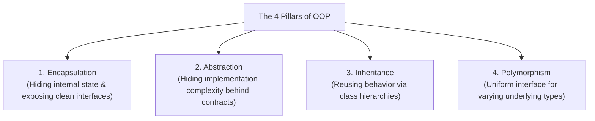
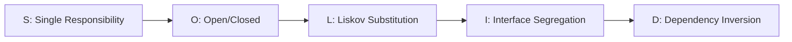
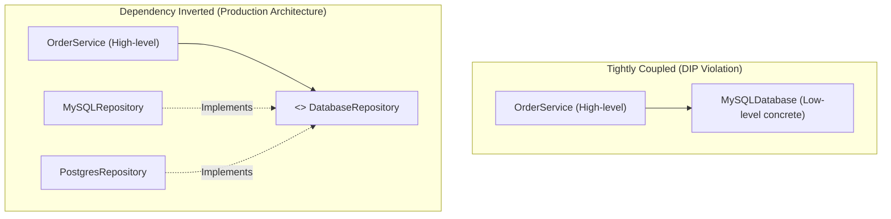

# LLD Chapter 1: OOP Fundamentals & SOLID Principles in Modern Python

> **Core Learning Objective:** Master Object-Oriented Design principles from absolute first principles up to senior enterprise architecture. Understand encapsulation, abstraction, inheritance, polymorphism, and master all 5 SOLID principles with concrete anti-patterns and production refactors in modern Python 3.12+.

---

## 1. The Four Pillars of OOP in Modern Python

Object-Oriented Programming (OOP) is a paradigm centered around objects that bundle state (data) and behavior (functions).



### 1. Encapsulation: Protecting Internal Invariants
Encapsulation prevents external code from corrupting an object's internal state. In Python, private attributes are denoted by a leading underscore `_` (convention) or double underscore `__` (name mangling):

```python
class BankAccount:
    def __init__(self, owner: str, initial_balance: float = 0.0):
        self.owner = owner
        self._balance = initial_balance # Protected attribute

    @property
    def balance(self) -> float:
        """Public read-only accessor."""
        return self._balance

    def deposit(self, amount: float) -> None:
        if amount <= 0:
            raise ValueError("Deposit amount must be positive.")
        self._balance += amount

    def withdraw(self, amount: float) -> None:
        if amount <= 0:
            raise ValueError("Withdrawal amount must be positive.")
        if amount > self._balance:
            raise ValueError("Insufficient funds.")
        self._balance -= amount
```

### 2. Abstraction: Contract over Implementation
Hide complexity behind abstract base classes (`abc.ABC`) or structural protocols (`typing.Protocol`):

```python
from abc import ABC, abstractmethod

class PaymentGateway(ABC):
    @abstractmethod
    def charge(self, amount_cents: int, token: str) -> bool:
        """Process a credit/debit transaction."""
        pass

    @abstractmethod
    def refund(self, transaction_id: str) -> bool:
        """Refund an existing transaction."""
        pass
```

### 3. Inheritance vs Composition: Favor Composition
Inheritance creates a tight coupling ("is-a" relationship). In 95% of enterprise systems, **composition ("has-a" relationship)** yields significantly more maintainable architectures:

```python
# ANTI-PATTERN (Tight Coupling via Inheritance)
class AuthenticatedLoggingDatabase(Database):
    pass # Bloated class hierarchy!

# PRODUCTION PATTERN (Composition via Dependency Injection)
class UserService:
    def __init__(self, db: DatabaseClient, auth: AuthProvider, logger: Logger):
        self.db = db
        self.auth = auth
        self.logger = logger
```

### 4. Polymorphism: Duck Typing & Dynamic Dispatch
Polymorphism allows different classes to respond to the same method call in their own specialized manner:

```python
class EmailNotification:
    def send(self, recipient: str, message: str) -> None:
        print(f"Sending Email to {recipient}: {message}")

class SMSNotification:
    def send(self, recipient: str, message: str) -> None:
        print(f"Sending SMS to {recipient}: {message}")

def notify_user(channel, user: str, msg: str):
    channel.send(user, msg) # Polymorphic dispatch
```

---

## 2. The SOLID Principles Masterclass



---

### S: Single Responsibility Principle (SRP)
> *"A class should have one, and only one, reason to change."*

#### Anti-Pattern: The God Class
```python
# VIOLATION: UserReportManager handles data querying, business logic, HTML formatting, AND emailing!
class UserReportManager:
    def get_user_data(self, user_id: int): ...
    def calculate_tax(self, income: float): ...
    def format_html_report(self, data): ...
    def send_email(self, email: str, body: str): ...
```

#### Production Refactor:
```python
class UserRepository:
    def get_user(self, user_id: int): ...

class TaxCalculator:
    def calculate(self, income: float) -> float: ...

class HtmlReportFormatter:
    def format(self, data: dict) -> str: ...

class EmailService:
    def send(self, recipient: str, body: str) -> None: ...
```

---

### O: Open/Closed Principle (OCP)
> *"Software entities should be open for extension, but closed for modification."*

#### Anti-Pattern: Conditionals on Types
```python
# VIOLATION: Adding a new discount type requires editing this existing method!
class DiscountService:
    def apply_discount(self, order_type: str, amount: float) -> float:
        if order_type == "regular":
            return amount * 0.95
        elif order_type == "vip":
            return amount * 0.80
        elif order_type == "black_friday":
            return amount * 0.50
        return amount
```

#### Production Refactor (Strategy Pattern):
```python
from abc import ABC, abstractmethod

class DiscountStrategy(ABC):
    @abstractmethod
    def calculate(self, amount: float) -> float:
        pass

class RegularDiscount(DiscountStrategy):
    def calculate(self, amount: float) -> float:
        return amount * 0.95

class VIPDiscount(DiscountStrategy):
    def calculate(self, amount: float) -> float:
        return amount * 0.80

class BlackFridayDiscount(DiscountStrategy):
    def calculate(self, amount: float) -> float:
        return amount * 0.50

# Adding a new discount (e.g. StudentDiscount) requires ZERO changes to existing code!
```

---

### L: Liskov Substitution Principle (LSP)
> *"Subtypes must be substitutable for their base types without breaking program correctness."*

#### Classic Violation: The Square-Rectangle Problem
```python
class Rectangle:
    def __init__(self, width: float, height: float):
        self.width = width
        self.height = height

    def set_width(self, w: float): self.width = w
    def set_height(self, h: float): self.height = h
    def area(self) -> float: return self.width * self.height

class Square(Rectangle):
    # VIOLATION: Overriding set_width forces height to change, breaking assumptions of Rectangle callers!
    def set_width(self, w: float):
        self.width = w
        self.height = w
    def set_height(self, h: float):
        self.width = h
        self.height = h

def verify_rectangle(rect: Rectangle):
    rect.set_width(5)
    rect.set_height(4)
    # Expected area: 5 * 4 = 20. But for Square, area becomes 4 * 4 = 16!
    assert rect.area() == 20, f"LSP Violation! Area is {rect.area()}"
```

#### Production Refactor:
Separate independent contracts or make shapes immutable value objects:
```python
class Shape(ABC):
    @abstractmethod
    def area(self) -> float: pass

class Rectangle(Shape):
    def __init__(self, width: float, height: float):
        self._w = width
        self._h = height
    def area(self) -> float: return self._w * self._h

class Square(Shape):
    def __init__(self, side: float):
        self._side = side
    def area(self) -> float: return self._side ** 2
```

---

### I: Interface Segregation Principle (ISP)
> *"Clients should not be forced to depend upon interfaces that they do not use."*

#### Anti-Pattern: Fat Interfaces
```python
class MultiFunctionPrinter(ABC):
    @abstractmethod
    def print_document(self, doc): pass
    @abstractmethod
    def scan_document(self): pass
    @abstractmethod
    def fax_document(self, doc): pass

# A simple desk printer is forced to implement scan and fax!
class SimpleDeskPrinter(MultiFunctionPrinter):
    def print_document(self, doc): print("Printing...")
    def scan_document(self): raise NotImplementedError("No scanner!")
    def fax_document(self, doc): raise NotImplementedError("No fax!")
```

#### Production Refactor (Granular Interfaces):
```python
class Printer(Protocol):
    def print_document(self, doc) -> None: ...

class Scanner(Protocol):
    def scan_document(self) -> bytes: ...

class Fax(Protocol):
    def fax_document(self, doc) -> None: ...

# Simple printer only implements Printer protocol
class BasicLaserPrinter:
    def print_document(self, doc) -> None:
        print("Printing...")
```

---

### D: Dependency Inversion Principle (DIP)
> *"High-level modules should not depend on low-level modules. Both should depend on abstractions."*



#### Production Implementation:
```python
class OrderRepository(Protocol):
    def save_order(self, order_id: str, amount: float) -> bool: ...

class OrderService:
    # Depends on abstraction (OrderRepository), not MySQL or Postgres directly
    def __init__(self, repo: OrderRepository):
        self.repo = repo

    def process_order(self, order_id: str, amount: float):
        # Business logic
        return self.repo.save_order(order_id, amount)

# Low-level MySQL implementation
class MySQLOrderRepository:
    def save_order(self, order_id: str, amount: float) -> bool:
        print(f"[MySQL] INSERT INTO orders VALUES ('{order_id}', {amount})")
        return True

# Service can be tested in isolation with a Mock repository
class MockOrderRepository:
    def __init__(self): self.saved = []
    def save_order(self, order_id: str, amount: float) -> bool:
        self.saved.append((order_id, amount))
        return True
```
