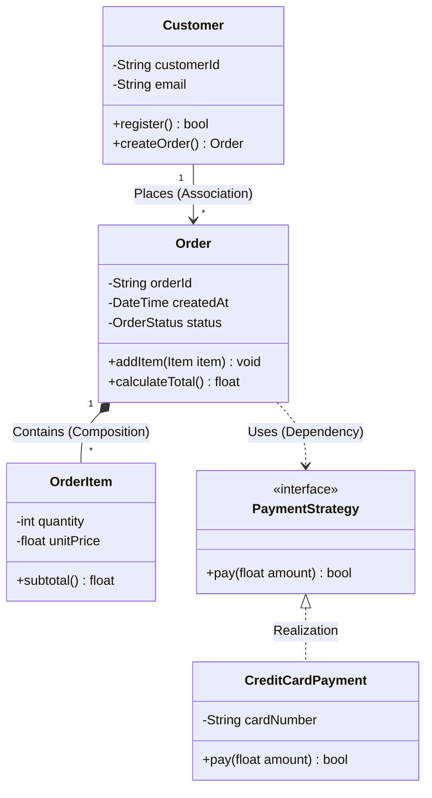
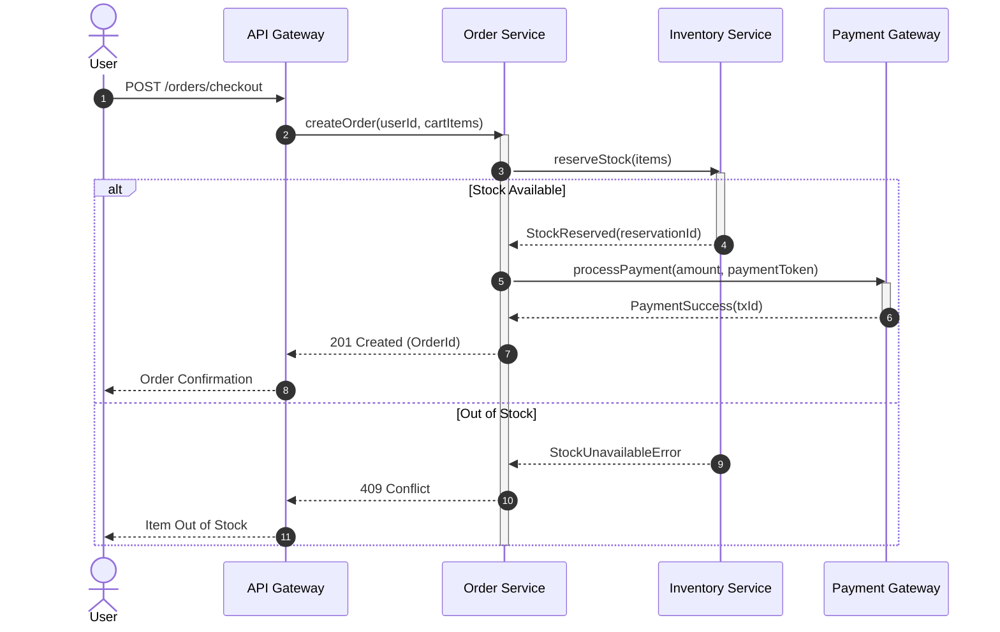
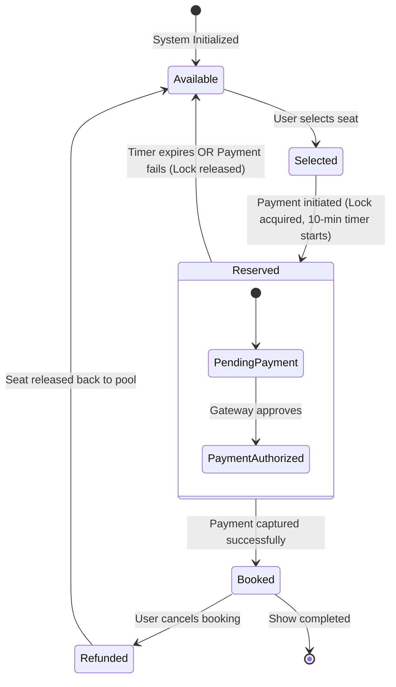
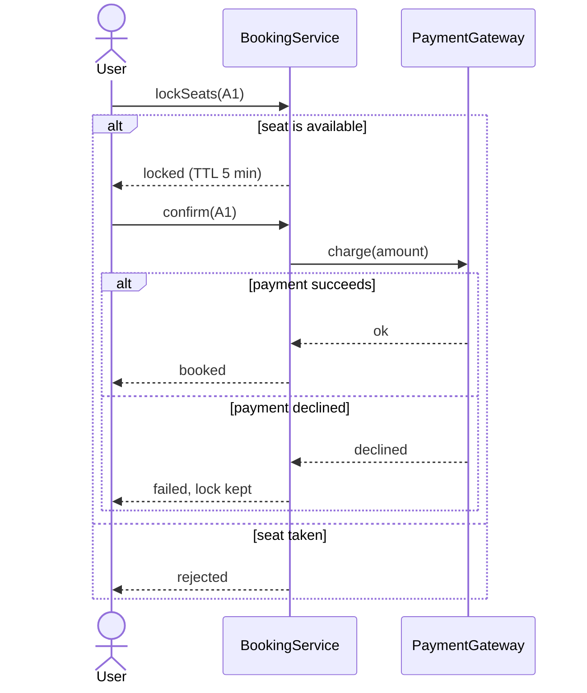

# LLD Chapter 2: UML Modeling: Class, Sequence & State Diagrams

> **Core Learning Objective:** Master the visual language of Software Engineering. Learn how to draft high-scoring Class Diagrams, Sequence Diagrams, and State Machines in under 5 minutes during a PBC Low-Level Design interview using Mermaid notation.

---

## 1. Class Diagrams: Structural Relationships

A Class Diagram models the static architecture of your system, showing classes, attributes, methods, and relationships.



### UML Relationship Taxonomy

| Relationship | Symbol | Semantic Meaning | Lifecycle Coupling |
| :--- | :--- | :--- | :--- |
| **Inheritance (Generalization)** | `--\|>` | Class $B$ inherits from Class $A$ ("is-a") | Permanent |
| **Realization (Interface)** | `..\|>` | Class implements an abstract Interface/Protocol | Permanent |
| **Composition** | `*--` | Whole-part relationship ("owns-a"). If parent dies, child dies! | Strict ownership (Child cannot exist without Parent) |
| **Aggregation** | `o--` | Whole-part relationship ("has-a"). Child can exist independently. | Loose ownership (e.g. Department has Professors) |
| **Association** | `-->` | Class $A$ holds a reference to Class $B$ | Reference holding |
| **Dependency** | `..>` | Method in Class $A$ receives Class $B$ as transient parameter | Temporary runtime coupling |

---

## 2. Sequence Diagrams: Behavioral Flow & Coordination

Sequence diagrams capture **time-ordered object interactions** across lifelines. Essential for explaining API request flows, payment checkout, and distributed locking.



---

## 3. State Machine Diagrams: Entity Lifecycle Transitions

State machines are required whenever an entity changes behavior depending on its current lifecycle phase (e.g., Vending Machine, Order status, Elevator state, Movie seat reservation).



---

## 4. The 5-Minute LLD Interview Drawing Strategy

During an interview, do not spend 20 minutes drawing exhaustive getter/setter details. Follow this **3-Pass Architecture Template**:

1. **Pass 1 (Core Entities):** Draw 3 to 5 primary noun classes with their core responsibility.
2. **Pass 2 (Relationships & Multiplicity):** Connect classes with correct lines (`*--` composition for components, `-->` association for collaborators, `1 to *` multiplicity).
3. **Pass 3 (Behavior & Patterns):** Add interfaces for Strategy, Observer, or Factory patterns where flexibility is needed.


## 5. From Diagram to Code: What Each Arrow Means in Python

Interviewers check that your arrows mean what they say. The same six relationships, with the Python each one implies:

| Relationship | Arrow (Mermaid) | Meaning | Lifetime rule | Python shape |
| :--- | :--- | :--- | :--- | :--- |
| Inheritance | `A <\|-- B` | B is an A | n/a | `class B(A)` |
| Realisation | `A <\|.. B` | B implements interface A | n/a | `class B(A)` where A is an ABC or Protocol |
| Association | `A --> B` | A holds a reference to B | independent | `self.b = b` passed in |
| Aggregation | `A o-- B` | A has B, B can exist elsewhere | B outlives A | `self.items = items` (shared list) |
| Composition | `A *-- B` | A owns B | B dies with A | `self.engine = Engine()` created inside |
| Dependency | `A ..> B` | A uses B briefly | none | `B` appears only as a parameter or local |

```python
from abc import ABC, abstractmethod

class Engine:                                    # composed: created and owned by Car
    def start(self) -> str:
        return "vroom"

class Driver:                                    # associated: exists before and after the Car
    def __init__(self, name: str):
        self.name = name

class Payment(ABC):                              # interface
    @abstractmethod
    def pay(self, cents: int) -> str: ...

class Card(Payment):                             # realisation
    def pay(self, cents: int) -> str:
        return f"card:{cents}"

class Car:
    def __init__(self, driver: Driver):
        self.engine = Engine()                   # composition: no outside code ever sees this Engine
        self.driver = driver                     # association/aggregation: supplied from outside

    def refuel(self, payment: Payment, cents: int) -> str:   # dependency: Payment only as a parameter
        return payment.pay(cents)

ana = Driver("Ana")
car = Car(ana)
assert car.engine.start() == "vroom"
assert car.driver is ana                         # the same Driver, not a copy
assert car.refuel(Card(), 4500) == "card:4500"
del car
assert ana.name == "Ana"                         # the driver survives the car; the engine did not need to
```

The test that separates composition from aggregation is **who creates the part and who can still see it after the whole is gone**.

### Multiplicity and navigability

Write multiplicities on the ends of an association (`1`, `0..1`, `*`, `1..*`). A `1..*` end means the constructor or a validation step must reject an empty collection; a `0..1` end means the attribute may be `None` and every use needs a check. Arrow direction shows who knows whom: `Order --> Customer` means an `Order` holds a customer reference but a `Customer` does not hold orders, so listing a customer's orders needs a query or a separate index.

### Sequence diagram fragments you are expected to know



Use `alt/else` for exclusive branches, `opt` for an optional step, `loop` for repetition and `par` for concurrent work. A sequence diagram should show **who calls whom and in which order**, so draw one for the single most important use case rather than for everything.

### Five mistakes that cost marks

1. Drawing every getter and setter; show only behaviour that matters to the design.
2. Using inheritance arrows for "has-a" relationships.
3. Giving two classes a bidirectional association without saying which side owns it.
4. Putting the same responsibility in several boxes; each class gets one sentence of purpose.
5. A state diagram with an unreachable state or a state with no exit and no "terminal" mark.

---

## Further Reading

- [UML diagrams reference](https://www.uml-diagrams.org/)
- [Mermaid sequence diagrams](https://mermaid.js.org/syntax/sequenceDiagram.html)
- [Mermaid state diagrams](https://mermaid.js.org/syntax/stateDiagram.html)


---

## Check Yourself

Answer in your head or on paper first, then open each answer.

<details>
<summary><strong>1.</strong> Composition versus aggregation in a class diagram?</summary>

Composition (filled diamond): the part cannot outlive the whole. Aggregation (hollow diamond): the part can exist independently.

</details>

<details>
<summary><strong>2.</strong> What does a dashed arrow with a hollow head mean?</summary>

Realization: a class implements an interface.

</details>

<details>
<summary><strong>3.</strong> When is a sequence diagram more useful than a class diagram?</summary>

When explaining time-ordered interactions: a request flow, locking, retries.

</details>

<details>
<summary><strong>4.</strong> What does a state diagram model?</summary>

States of one object and the events that move it between them, e.g. an order from NEW to PAID to SHIPPED.

</details>
