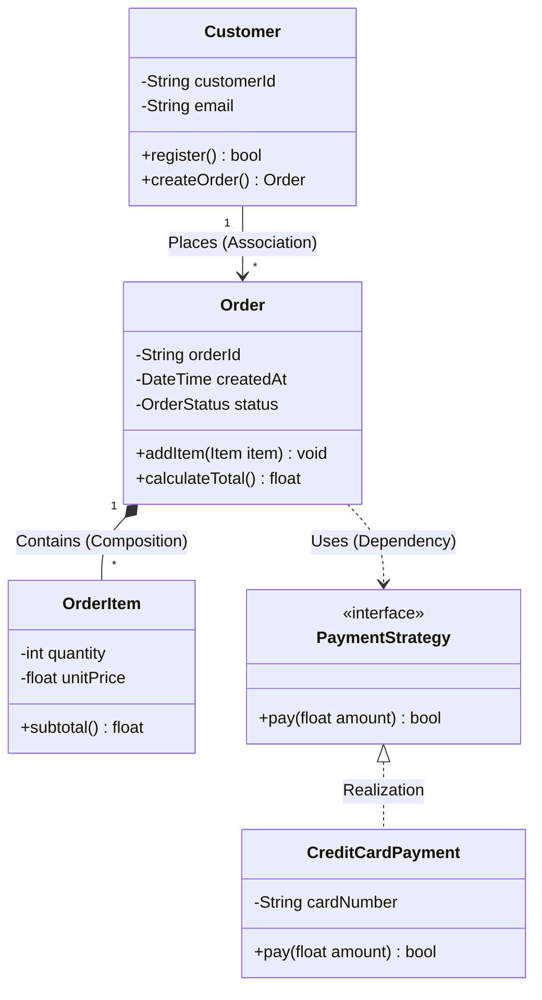
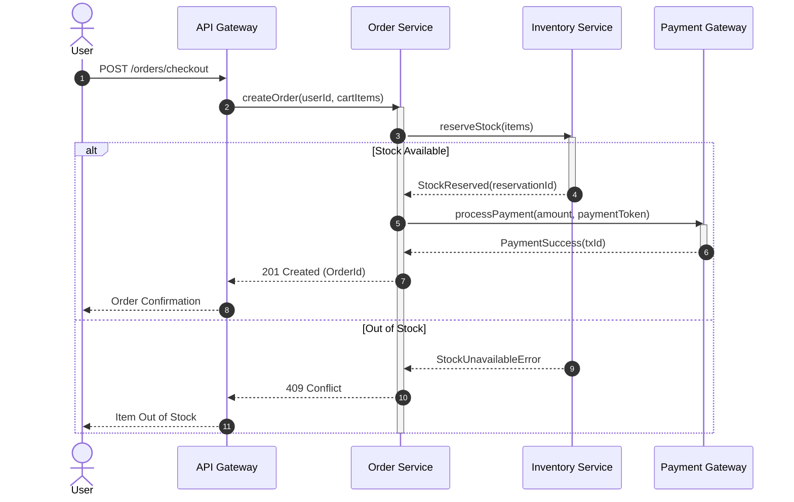
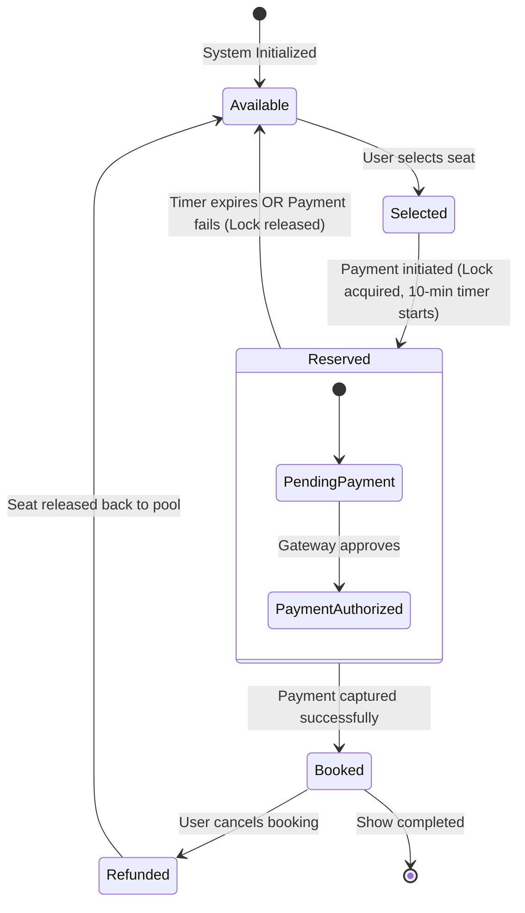

# LLD Chapter 2: UML Modeling: Class, Sequence & State Diagrams

> **Core Learning Objective:** Master the visual language of Software Engineering. Learn how to draft high-scoring Class Diagrams, Sequence Diagrams, and State Machines in under 5 minutes during a PBC Low-Level Design interview using Mermaid notation.

---

## 1. Class Diagrams: Structural Relationships

A Class Diagram models the static architecture of your system, showing classes, attributes, methods, and relationships.

### UML Relationship Taxonomy

| Relationship | Symbol | Semantic Meaning | Lifecycle Coupling |
| :--- | :--- | :--- | :--- |
| **Inheritance (Generalization)** | `--\|>` | Class $B$ inherits from Class $A$ ("is-a") | Permanent |
| **Realization (Interface)** | `..\|>` | Class implements an abstract Interface/Protocol | Permanent |
| **Composition** | `*--` | Whole-part relationship ("owns-a"). If parent dies, child dies! | Strict ownership (Child cannot exist without Parent) |
| **Aggregation** | `o--` | Whole-part relationship ("has-a"). Child can exist independently. | Loose ownership (e.g. Department has Professors) |
| **Association** | `-->` | Class $A$ holds a reference to Class $B$ | Reference holding |
| **Dependency** | `..>` | Method in Class $A$ receives Class $B$ as transient parameter | Temporary runtime coupling |

---

## 2. Sequence Diagrams: Behavioral Flow & Coordination

Sequence diagrams capture **time-ordered object interactions** across lifelines. Essential for explaining API request flows, payment checkout, and distributed locking.

---

## 3. State Machine Diagrams: Entity Lifecycle Transitions

State machines are required whenever an entity changes behavior depending on its current lifecycle phase (e.g., Vending Machine, Order status, Elevator state, Movie seat reservation).

---

## 4. The 5-Minute LLD Interview Drawing Strategy

During an interview, do not spend 20 minutes drawing exhaustive getter/setter details. Follow this **3-Pass Architecture Template**:

1. **Pass 1 (Core Entities):** Draw 3 to 5 primary noun classes with their core responsibility.
2. **Pass 2 (Relationships & Multiplicity):** Connect classes with correct lines (`*--` composition for components, `-->` association for collaborators, `1 to *` multiplicity).
3. **Pass 3 (Behavior & Patterns):** Add interfaces for Strategy, Observer, or Factory patterns where flexibility is needed.
