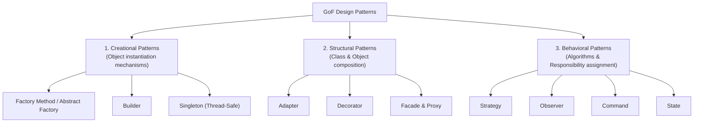

# LLD Chapter 3: The Complete Design Patterns Catalog in Modern Python

> **Core Learning Objective:** Master the Gang of Four (GoF) Design Patterns implemented with modern Python 3.12+ idioms. Understand the exact problem each pattern solves, its UML architecture, and real-world enterprise implementations.

---

## 1. Categorization Matrix of GoF Patterns



---

## 2. Creational Patterns

### 1. Factory Method & Abstract Factory
* **Problem:** Decouple object creation logic from client code so new variants can be added without modifying existing factory consumers.

```python
from abc import ABC, abstractmethod

# Abstract Product
class CloudStorage(ABC):
    @abstractmethod
    def upload(self, key: str, data: bytes) -> str: pass

class S3Storage(CloudStorage):
    def upload(self, key: str, data: bytes) -> str:
        return f"s3://bucket/{key}"

class GCSStorage(CloudStorage):
    def upload(self, key: str, data: bytes) -> str:
        return f"gs://bucket/{key}"

# Abstract Creator
class StorageFactory(ABC):
    @abstractmethod
    def create_storage(self) -> CloudStorage: pass

class AWSStorageFactory(StorageFactory):
    def create_storage(self) -> CloudStorage:
        return S3Storage()

class GCPStorageFactory(StorageFactory):
    def create_storage(self) -> CloudStorage:
        return GCSStorage()
```

### 2. Builder Pattern
* **Problem:** Constructing complex composite objects with dozens of optional configurations without constructor telescoping.

```python
from dataclasses import dataclass
from typing import Self

@dataclass
class HttpRequest:
    url: str
    method: str = "GET"
    headers: dict = None
    body: str | None = None
    timeout_s: float = 30.0

class HttpRequestBuilder:
    def __init__(self, url: str):
        self._req = HttpRequest(url=url, headers={})

    def method(self, method: str) -> Self:
        self._req.method = method
        return self

    def header(self, key: str, value: str) -> Self:
        self._req.headers[key] = value
        return self

    def body(self, body: str) -> Self:
        self._req.body = body
        return self

    def timeout(self, seconds: float) -> Self:
        self._req.timeout_s = seconds
        return self

    def build(self) -> HttpRequest:
        return self._req

# Fluent construction:
request = (
    HttpRequestBuilder("https://api.github.com/graphql")
    .method("POST")
    .header("Authorization", "Bearer token_123")
    .body('{"query": "{ viewer { login } }"}')
    .timeout(5.0)
    .build()
)
```

---

## 3. Structural Patterns

### 1. Adapter Pattern
* **Problem:** Convert the interface of an incompatible third-party or legacy class into another interface clients expect.

```python
from typing import Protocol

# Client Interface
class PaymentProcessor(Protocol):
    def pay(self, amount_in_dollars: float) -> bool: ...

# Incompatible Third-Party SDK (e.g. Stripe legacy in cents)
class ThirdPartyStripeSDK:
    def make_charge(self, cents: int) -> dict:
        print(f"[StripeSDK] Charged {cents} cents")
        return {"status": "success"}

# Adapter
class StripeAdapter:
    def __init__(self, stripe_sdk: ThirdPartyStripeSDK):
        self.sdk = stripe_sdk

    def pay(self, amount_in_dollars: float) -> bool:
        cents = int(amount_in_dollars * 100)
        res = self.sdk.make_charge(cents)
        return res.get("status") == "success"
```

### 2. Proxy Pattern
* **Problem:** Provide a surrogate or placeholder for another object to control access, perform lazy initialization, or cache results.

```python
class DatabaseQueryService:
    def query(self, sql: str) -> list[dict]:
        print(f"[DB Engine] Executing heavy query: {sql}")
        return [{"id": 1, "value": "heavy_record"}]

class CachedDatabaseQueryProxy:
    def __init__(self, real_service: DatabaseQueryService):
        self.real_service = real_service
        self._cache = {}

    def query(self, sql: str) -> list[dict]:
        if sql in self._cache:
            print(f"[Proxy Cache] Returning cached result for query: {sql}")
            return self._cache[sql]
        result = self.real_service.query(sql)
        self._cache[sql] = result
        return result
```

---

## 4. Behavioral Patterns

### 1. Strategy Pattern
* **Problem:** Define a family of interchangeable algorithms, encapsulate each one, and make them swappable at runtime.

```python
from typing import Protocol

class CompressionStrategy(Protocol):
    def compress(self, data: bytes) -> bytes: ...

class GzipCompression:
    def compress(self, data: bytes) -> bytes:
        import gzip
        return gzip.compress(data)

class ZstandardCompression:
    def compress(self, data: bytes) -> bytes:
        import zlib
        return zlib.compress(data)

class FileArchiver:
    def __init__(self, strategy: CompressionStrategy):
        self.strategy = strategy

    def archive(self, file_bytes: bytes) -> bytes:
        return self.strategy.compress(file_bytes)
```

### 2. Observer Pattern (Pub-Sub)
* **Problem:** Define a one-to-many dependency between objects so that when one object changes state, all its dependents are notified automatically.

```python
from abc import ABC, abstractmethod

class EventListener(ABC):
    @abstractmethod
    def on_event(self, event_type: str, data: dict) -> None: pass

class EventManager:
    def __init__(self):
        self._listeners: dict[str, list[EventListener]] = {}

    def subscribe(self, event_type: str, listener: EventListener) -> None:
        self._listeners.setdefault(event_type, []).append(listener)

    def notify(self, event_type: str, data: dict) -> None:
        for listener in self._listeners.get(event_type, []):
            listener.on_event(event_type, data)

class SlackNotifier(EventListener):
    def on_event(self, event_type: str, data: dict) -> None:
        print(f"[Slack] New event: {event_type} | payload: {data}")

class AuditLogWriter(EventListener):
    def on_event(self, event_type: str, data: dict) -> None:
        print(f"[Audit Log] Persisted event: {event_type}")

bus = EventManager()
bus.subscribe("ORDER_PLACED", SlackNotifier())
bus.subscribe("ORDER_PLACED", AuditLogWriter())
bus.notify("ORDER_PLACED", {"order_id": "ORD_991", "amount": 250.0})
```

### 3. Command Pattern
* **Problem:** Encapsulate a request as an object, thereby letting you parameterize clients with different requests, queue or log requests, and support undoable operations.

```python
from abc import ABC, abstractmethod

class Command(ABC):
    @abstractmethod
    def execute(self) -> None: pass
    @abstractmethod
    def undo(self) -> None: pass

class EditorDocument:
    def __init__(self):
        self.text = ""

class AppendTextCommand(Command):
    def __init__(self, doc: EditorDocument, text_to_append: str):
        self.doc = doc
        self.text = text_to_append

    def execute(self) -> None:
        self.doc.text += self.text

    def undo(self) -> None:
        self.doc.text = self.doc.text[:-len(self.text)]

class EditorInvoker:
    def __init__(self):
        self.history: list[Command] = []

    def execute_command(self, cmd: Command) -> None:
        cmd.execute()
        self.history.append(cmd)

    def undo_last(self) -> None:
        if self.history:
            cmd = self.history.pop()
            cmd.undo()
```

### 4. State Pattern
* **Problem:** Allow an object to alter its behavior when its internal state changes. The object will appear to change its class.

```python
from abc import ABC, abstractmethod

class VendingMachineContext:
    def __init__(self):
        self.state: VendingMachineState = IdleState()
        self.balance: float = 0.0

    def set_state(self, state: "VendingMachineState") -> None:
        self.state = state

    def insert_coin(self, amount: float): self.state.insert_coin(self, amount)
    def press_button(self): self.state.press_button(self)

class VendingMachineState(ABC):
    @abstractmethod
    def insert_coin(self, ctx: VendingMachineContext, amount: float) -> None: pass
    @abstractmethod
    def press_button(self, ctx: VendingMachineContext) -> None: pass

class IdleState(VendingMachineState):
    def insert_coin(self, ctx: VendingMachineContext, amount: float) -> None:
        ctx.balance += amount
        print(f"Coin accepted: ${amount:.2f}. Total: ${ctx.balance:.2f}")
        ctx.set_state(HasCoinState())

    def press_button(self, ctx: VendingMachineContext) -> None:
        print("Please insert coin first.")

class HasCoinState(VendingMachineState):
    def insert_coin(self, ctx: VendingMachineContext, amount: float) -> None:
        ctx.balance += amount
        print(f"Added coin: ${amount:.2f}. Total: ${ctx.balance:.2f}")

    def press_button(self, ctx: VendingMachineContext) -> None:
        print("Dispensing item...")
        ctx.balance = 0.0
        ctx.set_state(IdleState())
```


## Further Reading

- [Refactoring Guru: pattern catalog](https://refactoring.guru/design-patterns/catalog)
- [Wikipedia: Design Patterns](https://en.wikipedia.org/wiki/Design_Patterns)
- [Python typing.Protocol](https://docs.python.org/3/library/typing.html#typing.Protocol)


---

## Check Yourself

Answer in your head or on paper first, then open each answer.

<details>
<summary><strong>1.</strong> Strategy versus State: how do they differ although the structure looks alike?</summary>

Strategy lets the client choose an interchangeable algorithm; State lets an object change behaviour automatically as its internal state changes.

</details>

<details>
<summary><strong>2.</strong> When is Singleton a bad idea?</summary>

It hides global state, hurts testing and concurrency; prefer dependency injection of a single instance.

</details>

<details>
<summary><strong>3.</strong> What problem does Observer solve?</summary>

Notifying many dependents of changes without the subject knowing who they are (event handlers, pub/sub).

</details>

<details>
<summary><strong>4.</strong> What does Factory give you over `new`/constructors?</summary>

Centralised creation logic and the ability to return different concrete types behind one interface.

</details>
